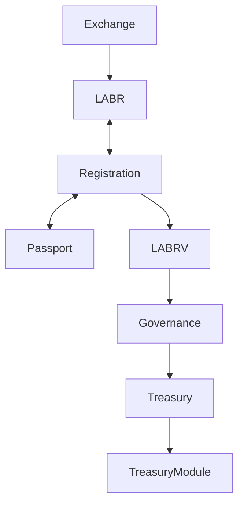

# Contract Map

## Overview

This document describes how the deployed LaborCoin contracts interact with one another and how responsibilities are distributed throughout the protocol.

The LaborCoin architecture separates economic participation, governance participation, registration, treasury management, and governance execution into distinct components.

---

# High-Level Architecture



---

# Contract Relationships

## Exchange V2

Address:

```text
0xD0692ec758bb852421B702B187b6439f74f8Bf3b
```

Responsibilities:

* Sells LABR through the bonding curve
* Buys LABR through the bonding curve
* Maintains protocol liquidity
* Enforces transaction limits
* Enforces wallet limits
* Enforces cooldown periods

Interacts With:

```text
Exchange V2
    ├── LABR Token
    └── Treasury System
```

---

## LABR Token

Address:

```text
0x460DD873A1D2a41e77410B125cD3027C5FEd2f78
```

Responsibilities:

* Economic participation
* Treasury funding through sell taxes
* Dividend funding through sell taxes
* Exchange integration

Interacts With:

```text
LABR
    ├── Exchange V2
    ├── Registration V3
    └── Treasury Funding
```

Registration requires LABR ownership.

---

## Registration V3

Address:

```text
0xa7D0C092C2391379046cACDc56BEbDe5A0CBD113
```

Responsibilities:

* Governance onboarding
* Eligibility verification
* Registration tracking
* LABRV issuance

Interacts With:

```text
Registration V3
    ├── LABR Token
    └── LABRV V6
```

Registration verifies eligibility and issues governance rights.

---

## LABRV V6

Address:

```text
0x113579220515cd59b884Ea2379b4C369025246e2
```

Responsibilities:

* Governance participation
* Vote delegation
* Voting power representation

Interacts With:

```text
LABRV V6
    ├── Registration V3
    └── Governance V12
```

LABRV is non-transferable and exists solely for governance.

---

## Governance V12

Address:

```text
0x499b32e9E5a8b9865a9D69480d590252a56FA78F
```

Responsibilities:

* Proposal management
* Voting periods
* Vote counting
* Proposal execution

Interacts With:

```text
Governance V12
    ├── LABRV V6
    └── LaborCoin DAO
```

Governance uses LABRV voting power to determine proposal outcomes.

---

## LaborCoin DAO

Address:

```text
0x0C2e5679153593b82a84eAB5CA90895BB291Cec4
```

Responsibilities:

* Governance authority
* Treasury oversight
* Proposal execution
* Administrative control

Interacts With:

```text
LaborCoin DAO
    ├── Governance V12
    └── Treasury Module
```

The DAO serves as the primary governance authority of the protocol.

---

## Treasury Module

Address:

```text
0x0B018E45E4cB71E222C345a5341BdbaeE519c623
```

Responsibilities:

* Treasury custody
* Fund accounting
* Governance-approved distributions

Interacts With:

```text
Treasury Module
    └── Approved Recipients
```

Treasury resources may only be distributed through governance-approved actions.

---

# Governance Flow

```text
Participant
    │
    ▼
Acquire LABR
    │
    ▼
Register
    │
    ▼
Receive LABRV
    │
    ▼
Create / Vote on Proposal
    │
    ▼
Governance V12
    │
    ▼
LaborCoin DAO
    │
    ▼
Treasury Module
    │
    ▼
Approved Distribution
```

---

# Treasury Flow

```text
LABR Sell Transaction
        │
        ▼
Treasury Tax (5%)
        │
        ▼
Protocol Treasury
        │
        ▼
DAO Governance
        │
        ▼
Treasury Module
        │
        ▼
Approved Recipient
```

---

# Voting Flow

```text
Eligible Participant
        │
        ▼
Registration V3
        │
        ▼
Receive LABRV
        │
        ▼
Vote on Proposal
        │
        ▼
Governance V12
        │
        ▼
Proposal Outcome
```

---

# Design Principles

The contract architecture is designed around several core principles:

* Separation of governance and economic ownership
* Equal voting power for eligible registered participants
* Transparent treasury management
* Publicly auditable operations
* Deterministic protocol behavior
* Minimal reliance on trusted intermediaries

Each contract has a narrowly defined role within the broader ecosystem, helping reduce complexity while improving transparency and maintainability.
