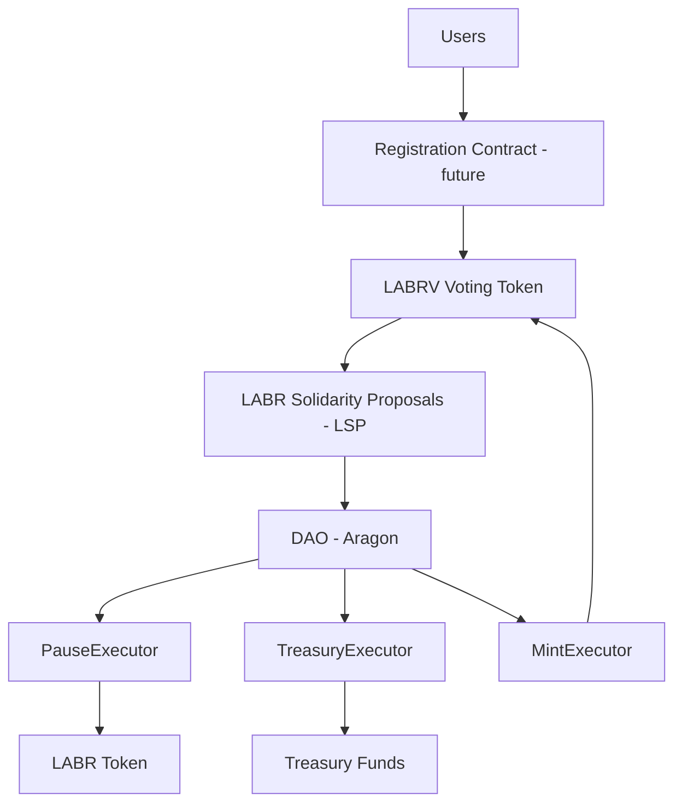
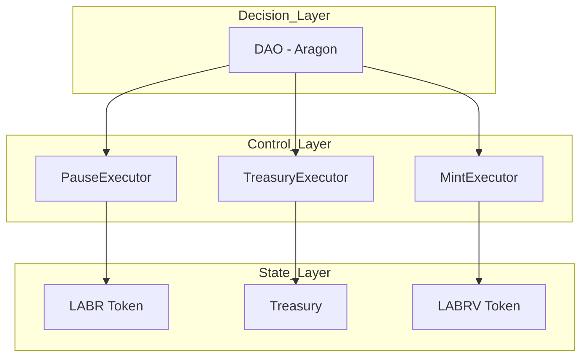

System Diagram

```mermaid
flowchart TD

    A[Users] --> B["Registration Contract - future"]

    B --> C[LABRV Voting Token]

    C --> D["LABR Solidarity Proposals - LSP"]

    D --> E["DAO - Aragon"]

    E --> F1[PauseExecutor]
    E --> F2[TreasuryExecutor]
    E --> F3[MintExecutor]

    F1 --> G1[LABR Token]
    F2 --> G2[Treasury Funds]
    F3 --> C
```
Layered View

```mermaid
flowchart TD

    subgraph Decision_Layer
        DAO["DAO - Aragon"]
    end

    subgraph Control_Layer
        Pause[PauseExecutor]
        Treasury[TreasuryExecutor]
        Mint[MintExecutor]
    end

    subgraph State_Layer
        LABR[LABR Token]
        Funds[Treasury]
        LABRV[LABRV Token]
    end

    DAO --> Pause --> LABR
    DAO --> Treasury --> Funds
    DAO --> Mint --> LABRV
```
