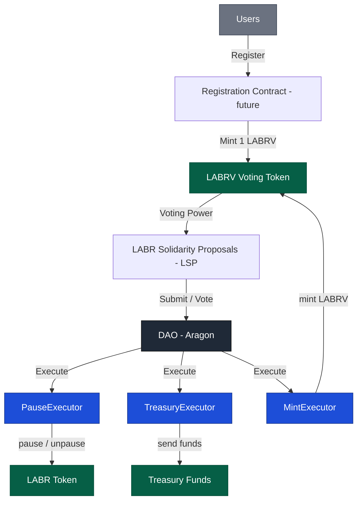
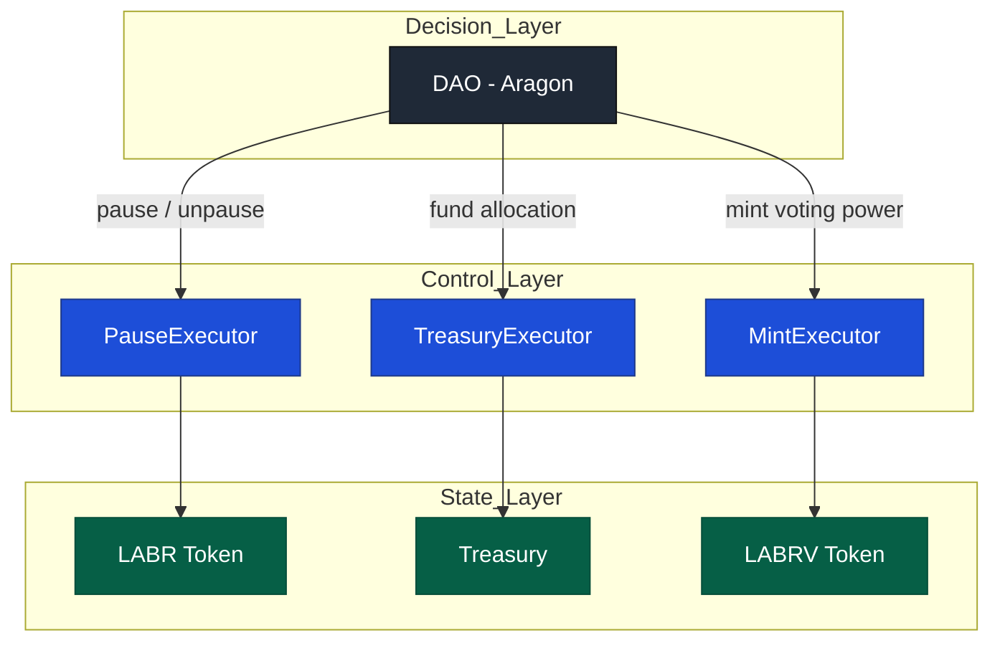

System Diagram

```mermaid
flowchart TD

    %% Nodes
    A[Users] -->|Register| B["Registration Contract - future"]

    B -->|Mint 1 LABRV| C[LABRV Voting Token]

    C -->|Voting Power| D["LABR Solidarity Proposals - LSP"]

    D -->|Submit / Vote| E["DAO - Aragon"]

    E -->|Execute| F1[PauseExecutor]
    E -->|Execute| F2[TreasuryExecutor]
    E -->|Execute| F3[MintExecutor]

    F1 -->|pause / unpause| G1[LABR Token]
    F2 -->|send funds| G2[Treasury Funds]
    F3 -->|mint LABRV| C

    %% Styling
    classDef decision fill:#1f2937,color:#fff,stroke:#111;
    classDef control fill:#1d4ed8,color:#fff,stroke:#1e3a8a;
    classDef state fill:#065f46,color:#fff,stroke:#064e3b;
    classDef user fill:#6b7280,color:#fff,stroke:#374151;

    class E decision;
    class F1,F2,F3 control;
    class G1,G2,C state;
    class A user;
```
Layered Diagram

```mermaid
flowchart TD

    %% Layers
    subgraph Decision_Layer
        DAO["DAO - Aragon"]
    end

    subgraph Control_Layer
        Pause[PauseExecutor]
        Treasury[TreasuryExecutor]
        Mint[MintExecutor]
    end

    subgraph State_Layer
        LABR[LABR Token]
        Funds[Treasury]
        LABRV[LABRV Token]
    end

    %% Flows
    DAO -->|pause / unpause| Pause --> LABR
    DAO -->|fund allocation| Treasury --> Funds
    DAO -->|mint voting power| Mint --> LABRV

    %% Styling
    classDef decision fill:#1f2937,color:#fff,stroke:#111;
    classDef control fill:#1d4ed8,color:#fff,stroke:#1e3a8a;
    classDef state fill:#065f46,color:#fff,stroke:#064e3b;

    class DAO decision;
    class Pause,Treasury,Mint control;
    class LABR,Funds,LABRV state;
```
