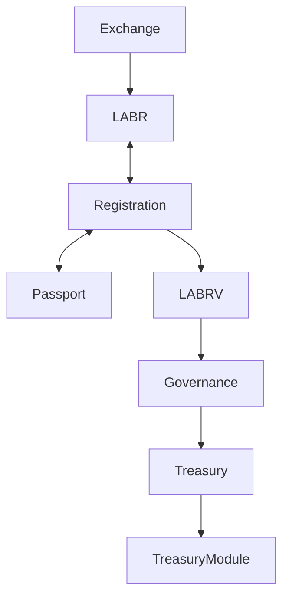

The protocol intentionally separates economic participation from governance participation.

Ownership of LABR alone does not confer governance authority.

Governance rights require successful registration and issuance of LABRV.
