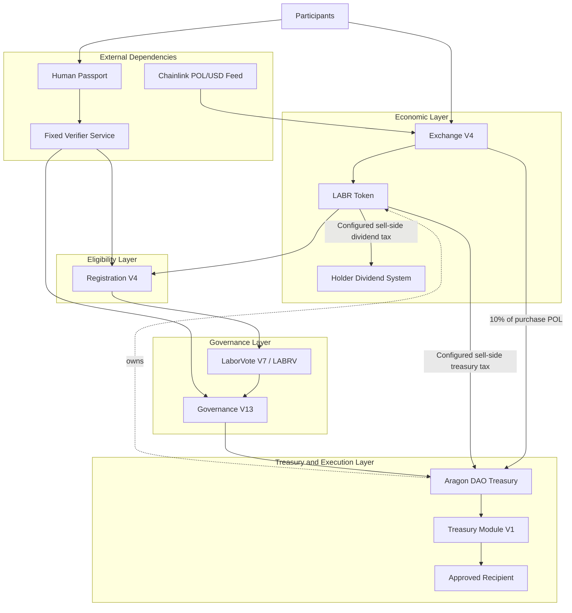
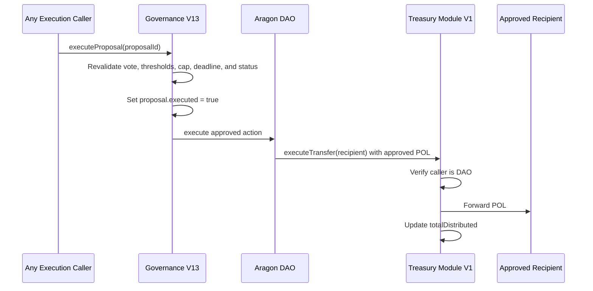
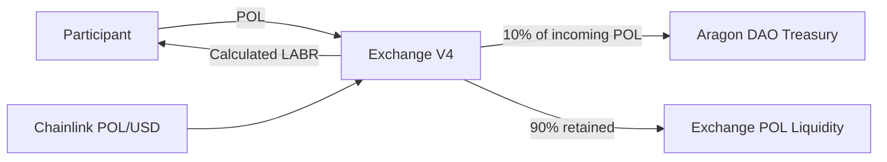
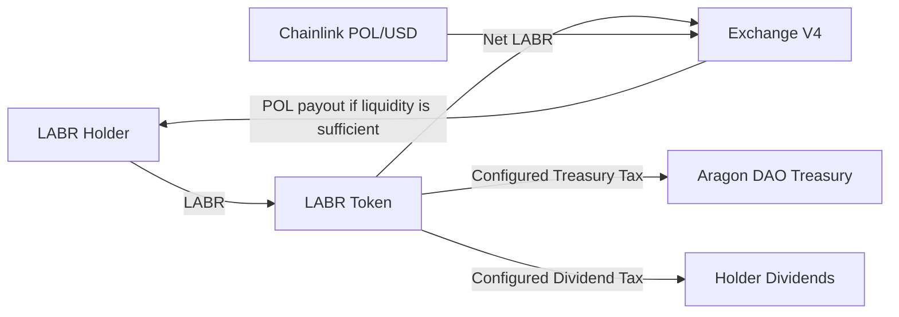
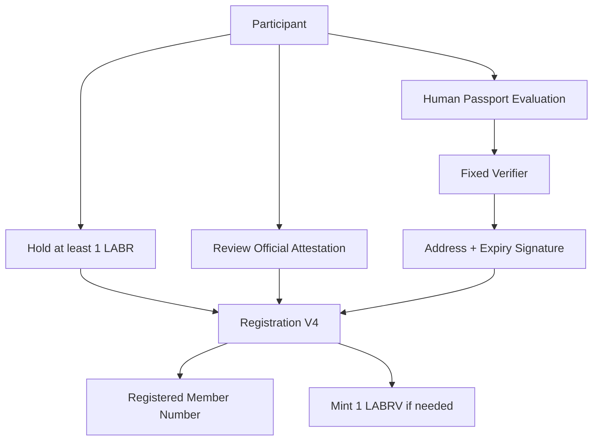
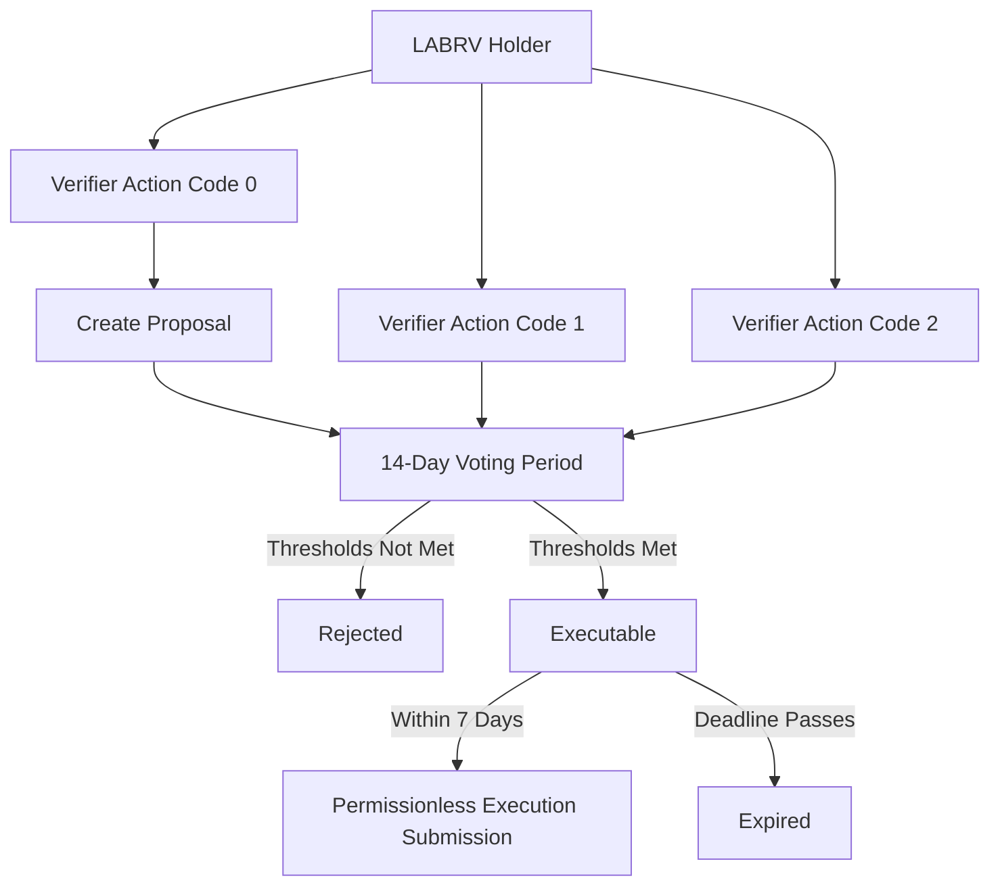
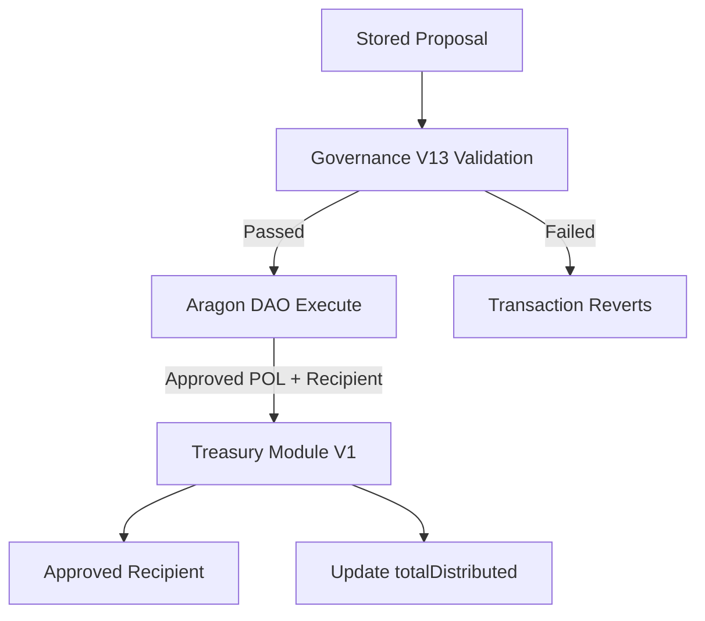
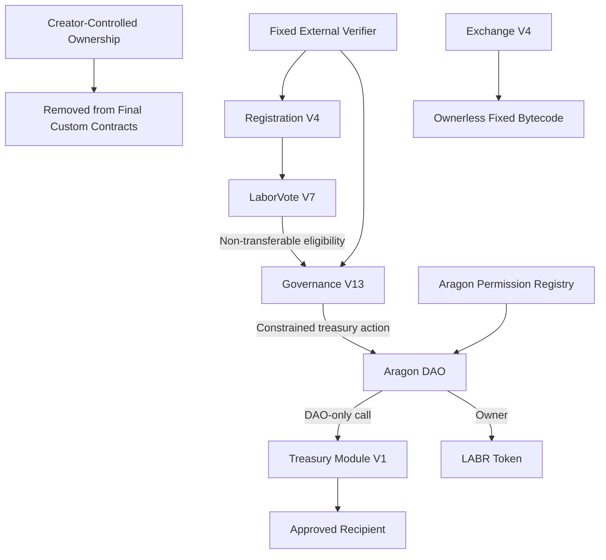

[architecture (1).md](https://github.com/user-attachments/files/29429486/architecture.1.md)
# LaborCoin Architecture

## Overview

LaborCoin is a governance-driven protocol on Polygon Mainnet designed to support transparent, community-directed funding for worker solidarity, collective action, and related mutual-aid initiatives.

The architecture separates economic participation, identity-assisted eligibility, governance participation, treasury custody, and treasury execution into distinct components. Each component has a narrow responsibility and a separately defined authority model.

LaborCoin consists of seven principal on-chain components:

1. LABR Token
2. LaborCoin Exchange V4
3. LaborCoin Registration V4
4. LaborVote (LABRV) V7
5. LaborCoin Governance V13
6. Aragon DAO Treasury
7. LaborCoin Treasury Module V1

The protocol also depends upon two external services:

* Human Passport and the fixed LaborCoin verifier service
* The Chainlink POL/USD price feed

**Network:** Polygon Mainnet  
**Chain ID:** 137

> **Current deployment status:** The final protocol contracts are deployed and source-verified. Exchange V4, Registration V4, Governance V13, and Treasury Module V1 contain no owner administration. LaborVote V7 has a permanently locked minter and renounced ownership. LABR remains owned by the Aragon DAO. The final claim that Governance V13 is the exclusive DAO execution path depends upon completion and publication of the final Aragon permission cleanup and provenance record.

---

## Architectural Objectives

The protocol was designed around the following objectives:

### Separation of Responsibilities

Economic activity, eligibility verification, governance, custody, and execution are handled by separate components rather than a single all-powerful contract.

### Constrained Governance

Governance V13 may coordinate treasury allocations but cannot rewrite the bonding curve, alter registration dependencies, change governance thresholds, replace the verifier, modify Treasury Module V1, or upgrade the protocol contracts.

### Participant Equality

LABR ownership does not determine voting weight. Each successfully registered wallet may hold one non-transferable LABRV, and Governance V13 counts one vote per eligible LABRV-holding participant.

### Transparent Custody and Execution

Treasury assets remain in the Aragon DAO until an approved proposal is executed. Treasury Module V1 receives and forwards only the POL supplied by the DAO for that approved transfer.

### Authority Minimization

The final custom contracts use ownerless deployment, permanently locked configuration, or narrowly fixed dependencies. Remaining authority surfaces, including DAO-owned LABR and the external verifier, are documented rather than described as universally immutable.

### Public Auditability

Contract source, addresses, proposal activity, votes, treasury balances, transfers, and protocol state are publicly inspectable on Polygon.

---

# High-Level Architecture



This architecture creates four distinct operational paths:

* **Economic path:** POL enters Exchange V4 and LABR enters circulation.
* **Eligibility path:** Human Passport evaluation and verifier authorization allow Registration V4 to register a participant.
* **Governance path:** LABRV holders create proposals and vote through Governance V13.
* **Execution path:** Governance V13 causes the Aragon DAO to call Treasury Module V1, which forwards approved POL to the stored recipient.

---

# Architectural Layers

## 1. Economic Layer

The economic layer consists primarily of LABR and Exchange V4.

Responsibilities include:

* LABR distribution
* Deterministic bonding-curve pricing
* Protocol-managed buy and sell liquidity
* Treasury funding
* Holder dividend funding through configured LABR sell taxes
* Exchange-level concentration controls

Economic participation does not confer governance rights. A participant may acquire, hold, transfer, buy, or sell LABR without receiving LABRV.

## 2. Eligibility Layer

The eligibility layer consists of:

* Human Passport
* The fixed LaborCoin verifier service
* Registration V4

Human Passport and the verifier operate off-chain. Registration V4 performs the enforceable on-chain checks.

The published verifier policy requires a Human Passport score of at least 15. That score is not stored as a numeric constant inside Registration V4. Registration V4 accepts only an unexpired signature from its fixed verifier address.

## 3. Governance Layer

The governance layer consists of:

* LaborVote V7, represented by LABRV
* Governance V13

LABRV establishes governance eligibility. Governance V13 stores proposals, records votes, evaluates thresholds, and coordinates approved treasury execution.

Governance V13 checks LABRV ownership directly. ERC20Votes delegation is not required for LaborCoin governance participation.

## 4. Treasury and Execution Layer

The treasury and execution layer consists of:

* The Aragon DAO Treasury
* Treasury Module V1

The DAO is the custody and permission boundary. Treasury Module V1 is a narrow transfer executor, not a long-term treasury custodian and not a governance engine.

---

# Component Responsibility Matrix

| Component | Primary Responsibility | Does Not Control |
|---|---|---|
| LABR Token | Transferable economic token, configured taxes, token-level controls, dividend mechanics | Governance voting weight or proposal outcomes |
| Exchange V4 | LABR distribution, curve pricing, buy/sell execution, purchase treasury routing | Governance, registration, LABR owner functions, or DAO permissions |
| Human Passport / Verifier | Eligibility evaluation and cryptographic authorization | Direct registration, LABRV minting, voting, proposal creation, or treasury transfers |
| Registration V4 | On-chain registration checks, member accounting, LABRV issuance | Passport scoring policy, governance outcomes, or treasury execution |
| LaborVote V7 | Non-transferable governance credential | Proposal logic, Passport evaluation, or treasury custody |
| Governance V13 | Proposal creation, voting, threshold evaluation, approved execution coordination | General DAO administration, protocol upgrades, tokenomics changes, or verifier replacement |
| Aragon DAO | Treasury custody, LABR ownership, permission-controlled execution | Proposal voting logic inside Governance V13 |
| Treasury Module V1 | DAO-only forwarding of approved POL and distribution accounting | Treasury policy, proposal evaluation, independent withdrawals, or general custody |
| Chainlink POL/USD Feed | External POL/USD market data | Governance, treasury policy, or LABR supply |

---

# Core Components

## 1. LABR Token

LABR is the transferable economic token of the LaborCoin ecosystem.

**Address:**

```text
0x460DD873A1D2a41e77410B125cD3027C5FEd2f78
```

### Responsibilities

* Economic participation
* Exchange settlement asset
* Minimum-balance requirement for governance registration
* Treasury and dividend contributions through configured sell taxes
* Holder dividend accounting
* Token-level wallet and transaction controls

### Supply

| Parameter | Value |
|---|---:|
| Maximum Supply | 1,000,000,000 LABR |
| Decimals | 18 |
| Additional Minting | Not available |

### Current Economic Configuration

| Activity | Treasury | Dividends | Burn |
|---|---:|---:|---:|
| Exchange purchase | 10% of incoming POL routed by Exchange V4 | 0% | 0% |
| Configured LABR sell tax | 5% | 5% | 0% |

The Exchange V4 purchase contribution and the LABR token sell tax are separate mechanisms. A protocol purchase routes 10% of incoming POL to the DAO while transferring the calculated LABR amount to the buyer. The configured LABR sell tax allocates 5% to the treasury and 5% to holder dividends.

### Token-Level Limits

| Parameter | Value |
|---|---:|
| Maximum Wallet | 1,000,000 LABR |
| Maximum Transaction | 500,000 LABR |

These token-level restrictions are separate from Exchange V4's stricter distribution limits and may be subject to addresses excluded through valid DAO-held token administration.

### Authority Model

LABR is owned by the Aragon DAO rather than an externally owned creator wallet.

LABR is therefore **DAO-controlled, not ownerless**. Its deployed implementation retains owner-only functions involving pause and unpause controls, blacklist management, token recovery, fees, tax recipients, exclusions, automated-market-maker and router settings, wallet and transaction limits, trading controls, cooldown settings, and related token configuration.

Practical use of those owner functions depends upon the Aragon DAO permission registry. Final DAO permission cleanup and publication are therefore material to the protocol's authority model.

---

## 2. LaborCoin Exchange V4

Exchange V4 is the ownerless bonding-curve exchange through which LABR enters circulation and may be sold back to the protocol.

**Address:**

```text
0x4Cf18cB39203B678f5C26f2338a10a79f9684749
```

### Responsibilities

* LABR purchases
* LABR sales
* Deterministic USD-denominated pricing
* POL conversion through the Chainlink oracle
* Progressive tranche availability
* Purchase-side treasury routing
* Exchange-level wallet, transaction, and cooldown enforcement

### Bonding Curve

The target LABR price is determined by:

$$
P(x) = 1 + 14x^2
$$

where:

$$
x = \frac{S}{1{,}000{,}000{,}000}
$$

and `S` is the amount of LABR distributed through the exchange.

| Parameter | Value |
|---|---:|
| Minimum Target Price | $1 per LABR |
| Maximum Target Price | $15 per LABR |
| Curve Type | Quadratic |
| Initial Available Tranche | 100,000,000 LABR |
| Subsequent Tranche Size | 50,000,000 LABR |

### Exchange Controls

| Parameter | Value |
|---|---:|
| Maximum Exchange Wallet | 10,000 LABR |
| Maximum Exchange Transaction | 5,000 LABR |
| Cooldown | 12 hours |
| Oracle Freshness Window | 30 minutes |
| Maximum Oracle-Protected LABR Price | 100 POL per LABR |

The exchange retains 90% of incoming purchase POL as exchange liquidity and sends 10% to the DAO Treasury. A sale succeeds only when Exchange V4 holds enough POL to cover the calculated payout.

### Authority Model

Exchange V4 was deployed without:

* An owner role
* A pause function
* An administrative withdrawal function
* An upgrade mechanism
* Mutable oracle, token, treasury, curve, tranche, or limit settings

Its LABR address, DAO address, Chainlink feed, and operating constants are fixed by the deployed bytecode and constructor state.

---

## 3. Human Passport and Verifier Infrastructure

Human Passport, formerly Gitcoin Passport, supplies probabilistic uniqueness signals used by the LaborCoin verifier service.

**Verifier Address:**

```text
0x475d519631d2406753aCA29F305f19b83E97513e
```

The verifier is an externally controlled signing address, not a smart contract.

### Published Eligibility Policy

| Parameter | Value |
|---|---:|
| Minimum Human Passport Score | 15 |

The score threshold is enforced by the verifier workflow rather than directly by Registration V4.

### Registration Authorization

A Registration V4 authorization contains:

* Participant wallet address
* Expiration timestamp

Registration V4 verifies that the recovered signer matches the fixed verifier and that the authorization has not expired.

### Governance Authorization

A Governance V13 authorization binds:

* Participant wallet address
* Action code
* Participant nonce
* Expiration timestamp
* Governance V13 contract address

Action codes are:

| Action | Code |
|---|---:|
| Create proposal | 0 |
| Vote yes | 1 |
| Vote no | 2 |

A governance authorization does not bind the proposal title, description, recipient, amount, or proposal ID. Governance V13 prevents reuse through per-participant nonces and expiration timestamps.

### Trust Boundary

The verifier cannot directly:

* Register a participant
* Mint LABRV
* Create a proposal
* Record a vote
* Execute a treasury transfer

However, verifier availability and correct policy enforcement remain material dependencies. A compromised verifier could authorize ineligible participation, while an unavailable verifier could interrupt new registrations, proposal creation, and voting.

The verifier address is fixed in Registration V4 and Governance V13. Replacing it would require migration to new contracts rather than an administrative setting change.

---

## 4. LaborCoin Registration V4

Registration V4 is the on-chain gateway between economic participation and governance participation.

**Address:**

```text
0xd1CD6C0B6f1F709A52908B40C07D3C54649e323C
```

### Responsibilities

* Enforce the minimum LABR balance
* Verify the fixed verifier's signature
* Reject expired authorizations
* Prevent repeat registration by the same address
* Assign member numbers
* Increment the total registered-member count
* Mint LABRV through LaborVote V7 when appropriate

### Registration Conditions

A successful registration requires:

1. At least 1 LABR.
2. A valid verifier signature for the participant address.
3. An unexpired authorization.
4. An address that is not already recorded as registered.

Human Passport evaluation and attestation presentation occur through the verifier and official interface. Registration V4 does not query Human Passport directly and does not store an independent attestation flag or attestation-text hash.

### Duplicate Controls

Registration V4 permanently records successful registration. A registered address cannot register again.

LaborVote V7 separately prevents minting an additional LABRV to an address that already holds one. If an otherwise eligible, previously unregistered address already holds LABRV, Registration V4 may record the registration without minting another token.

### Authority Model

Registration V4 has:

* No owner
* No administrative setter
* No verifier-replacement function
* No LABR- or LABRV-replacement function
* No upgrade mechanism

Its LABR, LABRV, and verifier dependencies are fixed.

---

## 5. LaborVote (LABRV) V7

LABRV is the non-transferable governance credential used by Governance V13.

**Address:**

```text
0x833242E933c675846D8f8982048FecA95B8e435A
```

### Properties

* One LABRV may be minted to each eligible registered wallet
* Non-transferable
* Non-tradable
* Cannot be accumulated through purchases
* Equal governance weight in Governance V13
* ERC20Votes-based, although Governance V13 checks token ownership directly

### ERC20Votes Delegation Behavior

Registration V4 mints LABRV when the registering address does not already hold the token. It does not call the inherited ERC20Votes `delegate` function, and LaborVote V7 does not automatically delegate voting power during minting.

A LABRV holder may separately call `delegate` or `delegateBySig`, which updates the ERC20Votes checkpoint system. That delegation state is not used by Governance V13. Governance V13 checks LABRV `balanceOf` directly and records one vote for each eligible LABRV-holding address.

Accordingly:

* No delegation transaction is required to create proposals or vote through Governance V13.
* Registration V4 does not perform self-delegation on behalf of the participant.
* A separate delegation transaction affects ERC20Votes checkpoints only and does not increase or activate Governance V13 voting weight.

### Minting Model

Registration V4 is the permanently locked minter:

```text
0xd1CD6C0B6f1F709A52908B40C07D3C54649e323C
```

### Authority Model

* Registration V4 is the only minter
* The minter configuration is permanently locked
* LaborVote V7 ownership has been renounced
* No owner remains capable of changing the minter

This prevents future reassignment of LABRV issuance authority.

---

## 6. LaborCoin Governance V13

Governance V13 is the proposal, voting, threshold-validation, and treasury-execution coordination contract.

**Address:**

```text
0x8238105d31F6Bb26897d8Ab270a0A521FEF03E8c
```

### Responsibilities

* Create treasury-allocation proposals
* Store proposal recipients, amounts, descriptions, and deadlines
* Validate LABRV balance eligibility
* Verify action-code-specific verifier authorizations
* Maintain per-participant authorization nonces
* Record yes and no votes
* Evaluate participation and approval thresholds
* Enforce the execution window and treasury cap
* Coordinate execution through the Aragon DAO and Treasury Module V1
* Prevent duplicate votes and double execution

### Governance Parameters

| Parameter | Value |
|---|---:|
| Voting Duration | 14 days |
| Participation Threshold | 25% |
| Approval Threshold | 67% |
| Minimum Registered Members for Execution | 50 |
| Execution Window | 7 days |
| Maximum Proposal Allocation | 5% of the DAO's native POL balance at execution |

### Participation and Approval

Participation is evaluated using the current registered-member count when proposal status is checked:

$$
Participation = \left\lfloor\frac{Yes + No}{Current\ Total\ Members} \times 100\right\rfloor
$$

Approval is calculated from votes cast:

$$
Approval = \left\lfloor\frac{Yes}{Yes + No} \times 100\right\rfloor
$$

The registered-member count is not snapshotted when the proposal is created.

### Proposal Creation and Voting

Proposal creation and voting require:

* A positive LABRV balance
* A valid verifier authorization
* The correct participant nonce
* An unexpired authorization

Governance V13 does not call Registration V4's `registered` mapping when checking an individual proposer or voter. It uses LABRV ownership as the direct eligibility check and uses `Registration V4.totalMembers()` for participation and minimum-member calculations.

The authorization identifies the action category, not the proposal contents.

### Proposal Execution

`executeProposal` is permissionless. Any address may submit an approved proposal for execution after voting ends and before the execution deadline.

The caller cannot alter the recipient, amount, description, or execution action. Governance V13 uses the proposal data already stored on-chain and revalidates:

* Voting completion
* Participation threshold
* Approval threshold
* Minimum-member activation threshold
* Five-percent DAO POL cap
* Execution deadline
* Prior-execution status

Governance V13 then directs the Aragon DAO to call Treasury Module V1 with the approved POL amount.

### Authority Model

Governance V13 has:

* No owner
* No upgrade mechanism
* No parameter setters
* No verifier-replacement function
* No general-purpose arbitrary DAO action format

Governance V13 cannot change LABR tokenomics, Exchange V4, Registration V4, LaborVote V7, Treasury Module V1, or its own constitutional parameters.

Governance V13 has a payable receive function but no withdrawal or treasury-routing function for its own balance. Protocol treasury funds should be held by the Aragon DAO rather than sent directly to Governance V13.

---

## 7. Aragon DAO Treasury

The Aragon DAO is the protocol's treasury custody and permission boundary.

**Address:**

```text
0x0C2e5679153593b82a84eAB5CA90895BB291Cec4
```

### Responsibilities

* Hold protocol treasury assets
* Receive the Exchange V4 purchase allocation
* Receive configured LABR treasury taxes
* Own the LABR token contract
* Execute actions authorized through the Aragon permission registry
* Supply approved POL to Treasury Module V1

The DAO does not implement LaborCoin proposal creation or voting. Those responsibilities belong to Governance V13.

### Permission Model

The Aragon DAO's execution permission determines which addresses or plugins may cause DAO actions.

The intended final configuration grants the required constrained execution path to Governance V13 and removes obsolete governance, module, treasury, or executor permissions.

Until the final permission cleanup is completed and published, the architecture must not claim that Governance V13 is already the only possible DAO executor solely because it is the intended path.

### LABR Ownership

Because the DAO owns LABR, any address retaining sufficient DAO execution authority could potentially exercise LABR owner-only functions. The final permission registry is therefore part of the protocol's security boundary, not merely an administrative record.

---

## 8. LaborCoin Treasury Module V1

Treasury Module V1 is the DAO-only execution boundary for approved native POL distributions.

**Address:**

```text
0x10F2798ef055950B897AF4B3A8ae90dE34f6C56C
```

### Responsibilities

* Accept execution calls only from the Aragon DAO
* Receive the approved POL value supplied by the DAO
* Forward that POL to the approved recipient
* Increment cumulative `totalDistributed` accounting
* Emit a permanent distribution record

### Execution Model



### Authority Model

Treasury Module V1 has:

* No owner
* No upgrade mechanism
* No general withdrawal function
* No proposal logic
* No independent recipient selection
* No ability to initiate a transfer by itself

Only the fixed Aragon DAO address may call its transfer function. Governance V13 marks the proposal executed before making the external DAO call. Because the operation is atomic, a failure in the DAO or module call reverts the entire transaction, including the executed-state change.

Treasury Module V1 also has a payable receive function, but `executeTransfer` forwards only the POL supplied as `msg.value` in that DAO call. Direct deposits to the module are outside the intended custody path and are not consumed by later executions. Treasury assets should remain in the Aragon DAO until an approved transfer is executed.

---

## 9. Chainlink POL/USD Oracle

Exchange V4 uses the Chainlink POL/USD feed to convert the USD-denominated bonding-curve price into POL.

**Address:**

```text
0xAB594600376Ec9fD91F8e885dADF0CE036862dE0
```

### Responsibilities

* Supply POL/USD market data
* Support USD-to-POL conversion
* Provide update timestamps used by Exchange V4 freshness checks

### Exchange Validation

Exchange V4 rejects:

* Non-positive oracle values
* Stale oracle data
* Calculated LABR prices above 100 POL per LABR

Chainlink remains an external dependency. Oracle failure or prolonged stale data may prevent exchange execution.

---

# Protocol Flows

## Economic Entry Flow



A purchase performs the following operations atomically:

1. Validate the participant, amount, cooldown, wallet limit, and transaction limit.
2. Read and validate the Chainlink POL/USD price.
3. Calculate the current curve price and LABR output.
4. Confirm sufficient unlocked LABR is available.
5. Transfer LABR to the buyer.
6. Route 10% of incoming POL to the DAO.
7. Retain 90% as exchange liquidity.
8. Update distribution and cooldown state.
9. Evaluate tranche unlocking.

## Exchange Exit Flow



A sale is limited by the exchange cooldown, transaction constraints, oracle checks, and available POL liquidity. The curve price may move downward when distributed supply is reduced by eligible sales.

## Governance Onboarding Flow



The attestation is part of the official interface and verifier workflow. The on-chain Registration V4 conditions are the LABR balance, registration state, verifier signature, expiration, and LABRV minting rules. Registration V4 does not initiate ERC20Votes delegation; no delegation is required by Governance V13 because it checks LABRV ownership directly.

## Governance Proposal and Voting Flow



Each successful proposal or vote authorization consumes the participant's current nonce. A reused or expired authorization is rejected.

## Treasury Execution Flow



Under the intended final Aragon permission configuration, no protocol treasury distribution may bypass Governance V13's fixed thresholds and Treasury Module V1's DAO-only restriction.

---

# Authority Model

LaborCoin does not use one universal ownership pattern. Authority is defined separately for each component.

| Component | Owner | Mutable Authority | Final State |
|---|---|---|---|
| Exchange V4 | None | None | Ownerless fixed deployment |
| Registration V4 | None | None | Ownerless with fixed dependencies |
| Governance V13 | None | None | Ownerless with fixed rules and dependencies |
| Treasury Module V1 | None | DAO-only transfer caller | Ownerless execution boundary |
| LaborVote V7 | None | Registration V4 may mint; minter cannot change | Locked minter and renounced ownership |
| LABR Token | Aragon DAO | Owner-only token configuration functions remain | DAO controlled |
| Aragon DAO | Permission based | Execution depends on installed permissions | Final permission registry must be published |
| Verifier | External signing key | May issue or withhold qualifying signatures | Fixed external dependency |
| Chainlink Feed | External oracle network | External feed operation | Fixed Exchange V4 dependency |

## Final Authority Diagram



This diagram distinguishes removal of creator ownership from elimination of every authority or operational dependency. DAO-held LABR ownership, DAO permissions, verifier signatures, Polygon, and Chainlink remain explicit parts of the deployed system.

---

# Protocol Invariants and Enforcement

| Rule | Value | Enforcement Layer |
|---|---:|---|
| LABR maximum supply | 1,000,000,000 LABR | Deployed LABR supply and Exchange V4 model |
| Initial exchange tranche | 100,000,000 LABR | Exchange V4 |
| Subsequent tranche size | 50,000,000 LABR | Exchange V4 |
| Bonding curve | `P(x) = 1 + 14x²` | Exchange V4 |
| Exchange cooldown | 12 hours | Exchange V4 |
| Exchange maximum wallet | 10,000 LABR | Exchange V4 |
| Exchange maximum transaction | 5,000 LABR | Exchange V4 |
| Token maximum wallet | 1,000,000 LABR | LABR token configuration |
| Token maximum transaction | 500,000 LABR | LABR token configuration |
| Minimum LABR for registration | 1 LABR | Registration V4 |
| Human Passport threshold | 15 | Published verifier policy |
| LABRV issuance | One token per eligible registered wallet | Registration V4 and LaborVote V7 |
| LABRV transferability | Disabled | LaborVote V7 |
| Governance voting duration | 14 days | Governance V13 |
| Governance participation threshold | 25% | Governance V13 |
| Governance approval threshold | 67% | Governance V13 |
| Minimum registered members for execution | 50 | Governance V13 |
| Execution window | 7 days | Governance V13 |
| Maximum proposal allocation | 5% of DAO native POL balance at execution | Governance V13 |
| Treasury Module caller | Aragon DAO only | Treasury Module V1 |

---

# Security Model

LaborCoin uses defense in depth rather than relying upon a single control.

## Economic Security

* Deterministic bonding-curve pricing
* Chainlink freshness and positive-value checks
* Maximum calculated POL price protection
* Exchange wallet and transaction limits
* Twelve-hour exchange cooldown
* Reentrancy protection
* Progressive tranche availability
* POL-balance check before sale payout

## Eligibility Security

* Minimum LABR requirement
* Human Passport uniqueness signals
* Fixed-verifier signature validation
* Expiring registration authorizations
* Permanent registration-state tracking
* Conditional single LABRV minting

## Governance Security

* Non-transferable LABRV
* One recorded vote per eligible participant per proposal
* Action-code-specific verifier authorizations
* Per-participant authorization nonces
* Authorization expiration
* Twenty-five-percent participation requirement
* Sixty-seven-percent approval requirement
* Fifty-member execution activation threshold
* Permissionless but fully revalidated execution
* Double-execution prevention

## Treasury Security

* Five-percent cap based on the DAO's native POL balance at execution
* Seven-day execution window
* Stored recipient and amount cannot be altered by the execution caller
* Governance V13 uses a constrained execution path
* Treasury Module V1 accepts calls only from the DAO
* Treasury Module V1 has no independent withdrawal or recipient-selection authority
* On-chain distribution accounting

## Administrative Security

* Ownerless Exchange V4, Registration V4, Governance V13, and Treasury Module V1
* Permanently locked LaborVote V7 minter
* Renounced LaborVote V7 ownership
* DAO-held rather than creator-held LABR ownership
* Required final audit and publication of Aragon permissions

---

# External Dependencies and Trust Assumptions

LaborCoin minimizes direct creator authority but is not independent of all external systems.

## Polygon Mainnet

Polygon provides transaction execution, consensus, state availability, and account security. Network outages, congestion, consensus failures, or future network changes may affect the protocol.

## Chainlink

Exchange V4 depends upon the fixed Chainlink POL/USD feed. Stale or invalid data causes exchange transactions to revert, while a broader oracle failure may interrupt exchange operation.

## Human Passport and the Verifier

The verifier applies the published Human Passport score policy and signs registration and governance authorizations. Verifier compromise, policy failure, censorship, or unavailability may affect eligibility and governance access.

## Aragon DAO Permissions

The DAO controls treasury custody and LABR ownership. The security of DAO-held powers depends upon the final permission registry and removal of obsolete executors.

## User Wallets and Cryptography

Participants remain responsible for wallet security. Compromised private keys may allow unauthorized use of LABR, LABRV-governed actions, or verifier authorizations associated with the affected address.

## Interface Infrastructure

The official website assists with Human Passport evaluation, attestation presentation, transaction preparation, and protocol interaction. The interface does not replace on-chain enforcement, but availability or compromise may affect accessibility and user understanding.

---

# Auditability and Observability

The architecture supports independent verification through:

* Publicly verified contract source
* Fixed deployment addresses
* Polygon transaction records
* Registration and member-number state
* LABRV balances and supply
* Proposal records
* On-chain vote totals
* Participant authorization nonces
* DAO treasury balances
* DAO permission records
* Treasury Module `totalDistributed`
* Recipient transfer events
* Exchange distribution and tranche state
* Chainlink oracle updates

The separate launch provenance and validation reports should provide transaction-level references for deployments, constructor arguments, minter configuration, ownership changes, DAO permission grants and revocations, functional tests, and frozen artifact hashes.

---

# Build Context

| Component Group | Solidity Compiler | EVM Target | Optimizer | OpenZeppelin |
|---|---|---|---:|---|
| Final custom contracts: LaborVote V7, Registration V4, Governance V13, Treasury Module V1, Exchange V4 | 0.8.30 | Prague | 200 runs | 5.6.1 where applicable |
| LABR Token | 0.8.25 | Paris | Deployment-specific verified settings | Bundled deployment sources |

The build environment and constructor arguments should be preserved in the deployment documentation alongside verified source links and artifact hashes.

---

# Deployed Contracts

| Contract Name | Contract Address | Deployment Block | Deployment Date (UTC) | Verified Source | Authority Status |
|---|---|---:|---|---|---|
| LABR Token | [0x460DD873A1D2a41e77410B125cD3027C5FEd2f78](https://polygonscan.com/address/0x460DD873A1D2a41e77410B125cD3027C5FEd2f78) | 69797383 | Apr-02-2025 07:56:25 UTC | Yes | DAO Controlled |
| LaborVote (LABRV) V7 | [0x833242E933c675846D8f8982048FecA95B8e435A](https://polygonscan.com/address/0x833242E933c675846D8f8982048FecA95B8e435A) | 88595455 | Jun-16-2026 08:22:48 UTC | Yes | Ownership Renounced / Minter Permanently Locked |
| LaborCoin Registration V4 | [0xd1CD6C0B6f1F709A52908B40C07D3C54649e323C](https://polygonscan.com/address/0xd1CD6C0B6f1F709A52908B40C07D3C54649e323C) | 88997813 | Jun-22-2026 | Yes | Ownerless / Fixed Dependencies |
| LaborCoin Treasury Module V1 | [0x10F2798ef055950B897AF4B3A8ae90dE34f6C56C](https://polygonscan.com/address/0x10F2798ef055950B897AF4B3A8ae90dE34f6C56C) | 89052358 | Jun-24-2026 | Yes | Ownerless / DAO-Only Caller |
| LaborCoin Governance V13 | [0x8238105d31F6Bb26897d8Ab270a0A521FEF03E8c](https://polygonscan.com/address/0x8238105d31F6Bb26897d8Ab270a0A521FEF03E8c) | 89084762 | Jun-24-2026 20:15:38 UTC | Yes | Ownerless / Fixed Rules |
| LaborCoin Exchange V4 | [0x4Cf18cB39203B678f5C26f2338a10a79f9684749](https://polygonscan.com/address/0x4Cf18cB39203B678f5C26f2338a10a79f9684749) | 89115657 | Jun-25-2026 09:08:01 UTC | Yes | Ownerless / Fixed Bytecode |

## Supporting Addresses

| Component | Address | Role |
|---|---|---|
| Aragon DAO Treasury | [0x0C2e5679153593b82a84eAB5CA90895BB291Cec4](https://polygonscan.com/address/0x0C2e5679153593b82a84eAB5CA90895BB291Cec4) | Treasury custody, DAO execution, and LABR ownership |
| Fixed Verifier | [0x475d519631d2406753aCA29F305f19b83E97513e](https://polygonscan.com/address/0x475d519631d2406753aCA29F305f19b83E97513e) | Registration and governance authorization signatures |
| Chainlink POL/USD Feed | [0xAB594600376Ec9fD91F8e885dADF0CE036862dE0](https://polygonscan.com/address/0xAB594600376Ec9fD91F8e885dADF0CE036862dE0) | POL/USD conversion for Exchange V4 |

---

# Deployment Sequence

1. **LABR Token** — April 2, 2025
2. **LaborVote (LABRV) V7** — June 16, 2026
3. **Registration V4** — June 22, 2026
4. **Treasury Module V1** — June 24, 2026
5. **Governance V13** — June 24, 2026
6. **Exchange V4** — June 25, 2026

Post-deployment integration included:

* Setting Registration V4 as the LaborVote V7 minter
* Permanently locking the minter
* Renouncing LaborVote V7 ownership
* Connecting Governance V13 to the DAO and Treasury Module V1
* Transferring LABR ownership to the Aragon DAO
* Configuring final LABR market and protocol relationships
* Updating the official interface to the final addresses
* Establishing and auditing Aragon DAO permissions

---

# Architectural Non-Goals and Limitations

LaborCoin does not claim that every component is ownerless, immutable, or fully decentralized.

The architecture intentionally does not provide:

* Governance-controlled protocol upgrades
* Governance-controlled curve or exchange changes
* Governance-controlled verifier replacement
* Governance-controlled registration changes
* Governance-controlled threshold changes
* General-purpose Governance V13 execution of arbitrary DAO actions
* Guaranteed proof that each registered wallet represents one unique human
* Unlimited exchange liquidity
* Guaranteed governance participation or sound treasury decisions
* Recovery mechanisms for defects in ownerless or permanently locked contracts
* A supported recovery path for POL sent directly to Governance V13 or retained as a pre-existing Treasury Module V1 balance

The protocol's custom contracts prioritize predictability and constrained authority. This creates corresponding recoverability risks if deployed logic contains defects.

LABR retains DAO-controlled owner functions, while the verifier remains an external operational dependency. These distinctions are part of the architecture rather than exceptions to be concealed.

---

# Summary

LaborCoin separates economic participation, governance eligibility, democratic decision-making, treasury custody, and treasury execution into narrowly defined components.

The principal architecture is:

```text
Economic Participation
    POL → Exchange V4 → LABR
              │
              └──────────────→ Aragon DAO Treasury

Governance Eligibility
    Human Passport → Fixed Verifier → Registration V4 → LABRV
             LABR ────────────────────────┘

Treasury Governance
    LABRV + Verifier Authorization → Governance V13
                                      │
                                      ▼
                               Aragon DAO Execute
                                      │
                                      ▼
                               Treasury Module V1
                                      │
                                      ▼
                               Approved Recipient
```

The final custom contracts remove direct creator administration through ownerless deployment, fixed dependencies, and permanently locked LABRV minting. The Aragon DAO retains custody and LABR ownership, while the verifier and Chainlink remain external dependencies.

This design seeks to provide transparent, auditable, and durable infrastructure for community-directed resource allocation without granting governance unrestricted control over the protocol itself.

---

# Related Documentation

* [Technical Whitepaper](whitepaper.md)
* [Governance](governance.md)
* [User Journey](user-journey.md)
* [Contract Map](../contracts/contract-map.md)
* [Polygon Mainnet Deployment](../deployments/polygon-mainnet.md)
