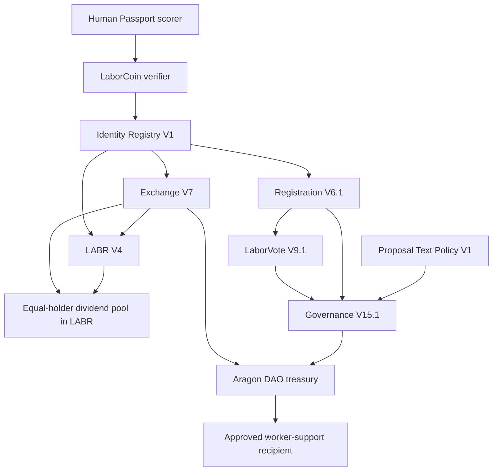
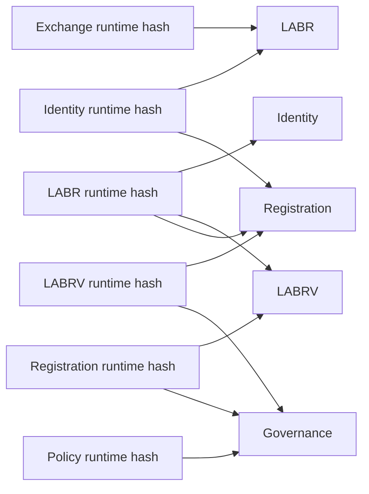

# LaborCoin Revision 7.2 Architecture

## Status

Revision 7.2 is a precompilation source candidate. No replacement contract address is final until compilation, testing, deployment, and runtime verification are complete.

## High-level architecture

```mermaid
flowchart TD
    Passport[Human Passport scorer] --> Verifier[LaborCoin verifier]
    Verifier --> Identity[Identity Registry V1]
    Identity --> LABR[LABR V4]
    Identity --> Exchange[Exchange V7]
    Identity --> Registration[Registration V6.1]
    Exchange --> LABR
    Exchange --> DAO[Aragon DAO treasury]
    Exchange --> Dividends[Equal-holder dividend pool in LABR]
    LABR --> Dividends
    Registration --> LABRV[LaborVote V9.1]
    LABRV --> Governance[Governance V15.1]
    Registration --> Governance
    Policy[Proposal Text Policy V1] --> Governance
    Governance --> DAO
    DAO --> Recipient[Approved worker-support recipient]
```

## Seven-contract separation

### Identity Registry V1

Identity Registry is the only contract that validates the verifier's EIP-712 Human Passport authorization. A successful score-15 verification permanently records the wallet. The registry cannot revoke or transfer status. It synchronizes dividend eligibility with LABR in the same transaction.

### LABR V4

LABR fixes supply, wallet and transaction limits, protocol-only Exchange settlement, trade cooldown, protocol finalization, and equal-holder dividend accounting. Every verified wallet holding at least 1 LABR has one synthetic dividend unit. Actual LABR balance above 1 does not change that unit.

### Exchange V7

Exchange holds the initial LABR inventory and accounts for the POL curve reserve. It permits buys and sells only for verified direct wallets. It applies the 5,000 LABR transaction limit, 10,000 LABR wallet rule, and 12-hour cooldown through its own checks and LABR's authoritative transfer checks.

### LaborVote V9.1

LaborVote mints one nontransferable LABRV to each successful registrant. It has no delegation, permit, checkpoints, transfer, burn, or general approval path.

### Registration V6.1

Registration reuses the permanent Identity Registry status. It requires at least 1 LABR, prevents duplicate registration, assigns a permanent member number, and asks LaborVote to mint exactly one LABRV.

### Proposal Text Policy V1

The policy is pure and immutable. It validates proposal descriptions against a fixed length, character, encoding, link, markup, and lexicon policy.

### Governance V15.1

Governance allows every LABRV member registered before an active proposal deadline to vote. Registration provides a bounded historical member-count lookup, so the final electorate is fixed at the deadline and later registrations cannot change the result. Governance applies fixed ceiling-based thresholds and can ask the existing Aragon DAO to execute exactly one native-POL transfer.

## Trust boundaries

| Boundary | Trusted before finalization | Trust after finalization |
|---|---|---|
| Passport score | Human Passport scorer and API | Historical verified status remains on-chain |
| Signature | Fixed verifier key | No setter; compromise remains a residual risk |
| Identity Registry launch | Temporary launch owner binds exact LABR | Owner becomes zero |
| LABR launch | Temporary launch owner binds exact Exchange | Owner becomes zero |
| LABRV launch | Temporary launch owner binds exact Registration | Owner becomes zero |
| Treasury | Existing Aragon DAO permissions | DAO permission registry remains an external authority surface |
| Frontend | Repository, host, domain, RPCs, browser dependencies | Operational infrastructure remains mutable even when contracts are not |

## Runtime commitment graph

```mermaid
flowchart LR
    IdentityHash[Identity runtime hash] --> LABR
    ExchangeHash[Exchange runtime hash] --> LABR
    LABRHash[LABR runtime hash] --> Identity
    LABRHash --> LABRV
    RegistrationHash[Registration runtime hash] --> LABRV
    LABRHash --> Registration
    LABRVHash[LABRV runtime hash] --> Registration
    IdentityHash --> Registration
    LABRVHash --> Governance
    RegistrationHash --> Governance
    PolicyHash[Policy runtime hash] --> Governance
```

Identity, LABR, Exchange, LABRV, Registration, and Policy use ordinary storage for constructor parameters, so their runtime templates are intended to be constructor-independent. Governance uses immutables, so its final deployed runtime hash depends on final addresses and commitment values.

## Launch cycle

Identity must know the expected LABR runtime hash. LABR must know the deployed Identity address and expected Exchange runtime hash. Exchange must know the deployed LABR and Identity addresses. The launch sequence resolves the cycle without a mutable setter:

1. Compile and freeze Identity, LABR, and Exchange runtime hashes.
2. Deploy Identity with the expected LABR hash.
3. Deploy LABR with the Identity address/hash and expected Exchange hash.
4. Call `Identity.finalizeLaborCoin(LABR)`.
5. Deploy Exchange with LABR, Identity, and Identity hash.
6. Call `LABR.finalizeLaunch(Exchange)`.
7. Verify that Identity and LABR report ready and all ownership is renounced.

No verification transaction can succeed until the cycle is finalized.
