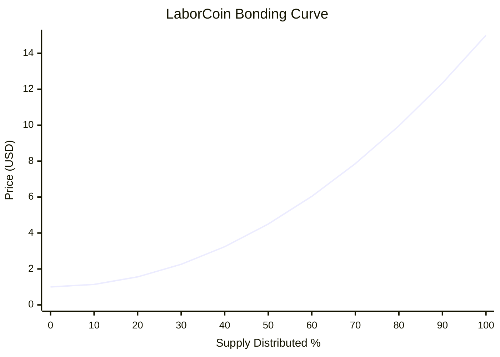

## Example Price Points

| Supply Distributed | Price (USD) |
| ------------------ | ----------: |
| 0%                 |       $1.00 |
| 10%                |       $1.14 |
| 20%                |       $1.56 |
| 30%                |       $2.26 |
| 40%                |       $3.24 |
| 50%                |       $4.50 |
| 60%                |       $6.04 |
| 70%                |       $7.86 |
| 80%                |       $9.96 |
| 90%                |      $12.34 |
| 100%               |      $15.00 |

## Bonding Curve Distribution Model.

Illustrates the deterministic LABR pricing curve implemented by the deployed Exchange V2 contract. Prices increase quadratically from $1 to $15 as distribution progresses from 0% to 100% of maximum supply.

Several observations emerge:

* Early distribution remains relatively accessible.
* Mid-distribution reflects gradual scarcity growth.
* Final distribution stages experience the strongest price acceleration.
* Scarcity emerges progressively rather than abruptly.
