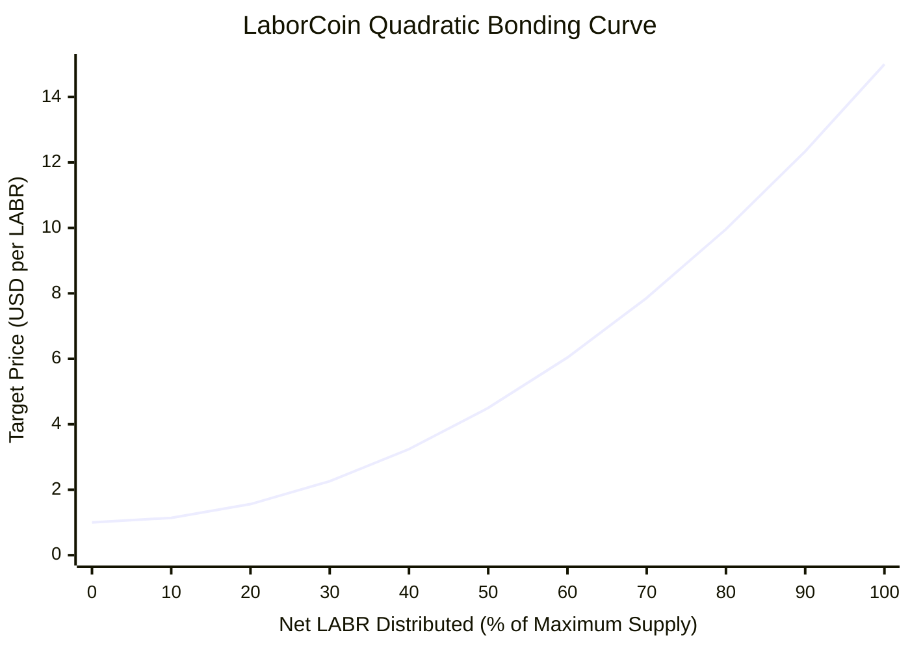
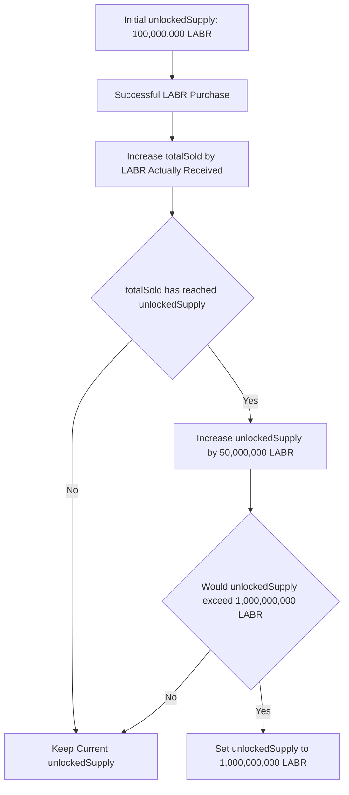

[bonding-curve.md](https://github.com/user-attachments/files/29432315/bonding-curve.md)
# LaborCoin Bonding Curve

## Overview

LaborCoin Exchange V4 distributes LABR through a deterministic quadratic bonding curve on Polygon Mainnet.

The curve defines a USD-denominated target price for LABR according to the exchange's current `totalSold` state. The contract then converts that USD target into POL using the fixed Chainlink POL/USD price feed.

The mechanism is designed to provide:

* Publicly auditable pricing
* Predictable distribution rules
* Progressive supply release
* Protocol-managed buy and sell access
* Automatic treasury funding
* No administrative price-setting authority

**Deployed Exchange V4:**

[`0x4Cf18cB39203B678f5C26f2338a10a79f9684749`](https://polygonscan.com/address/0x4Cf18cB39203B678f5C26f2338a10a79f9684749)

**Network:** Polygon Mainnet  
**Chain ID:** 137  
**Source:** [`final-launch/contracts/LaborCoinExchangeV4.sol`](../final-launch/contracts/LaborCoinExchangeV4.sol)

---

## Core Pricing Formula

Let:

* \(S\) = the Exchange V4 `totalSold` state
* \(M\) = the maximum LABR supply
* \(x\) = the fraction of maximum supply represented by `totalSold`
* \(P_{\text{USD}}(x)\) = the target LABR price in USD

The deployed constants are:

$$
M = 1{,}000{,}000{,}000\ \text{LABR}
$$

$$
P_{\min} = \$1
$$

$$
P_{\max} = \$15
$$

The normalized distribution variable is:

$$
x = \frac{S}{M}
$$

The USD-denominated curve is:

$$
P_{\text{USD}}(x)
=
P_{\min}
+
\left(P_{\max}-P_{\min}\right)x^2
$$

Therefore:

$$
P_{\text{USD}}(x)=1+14x^2
$$

For the valid range:

$$
0 \le x \le 1
$$

the theoretical USD target price ranges from:

$$
\$1 \le P_{\text{USD}}(x) \le \$15
$$

Exchange V4 clamps price calculations above the one-billion-LABR maximum to the maximum curve state.

---

## Bonding Curve Diagram

The chart below illustrates the theoretical USD-denominated curve across the full one-billion-LABR distribution range.

The chart is a static mathematical illustration. It is not a price history, reserve valuation, or forecast. The live POL-denominated execution price depends upon both current Exchange V4 state and the current Chainlink POL/USD oracle value.

---

## Example Price Points

| `totalSold` as Percentage of Maximum Supply | Normalized State \(x\) | Target Price |
|---:|---:|---:|
| 0% | 0.00 | $1.00 |
| 10% | 0.10 | $1.14 |
| 20% | 0.20 | $1.56 |
| 30% | 0.30 | $2.26 |
| 40% | 0.40 | $3.24 |
| 50% | 0.50 | $4.50 |
| 60% | 0.60 | $6.04 |
| 70% | 0.70 | $7.86 |
| 80% | 0.80 | $9.96 |
| 90% | 0.90 | $12.34 |
| 100% | 1.00 | $15.00 |

These values follow directly from \(P_{\text{USD}}(x)=1+14x^2\).

---

## Mathematical Characteristics

### Positive Slope

The first derivative is:

$$
P'_{\text{USD}}(x)=28x
$$

The curve is non-decreasing throughout its valid range and strictly increasing for \(x>0\).

### Positive Convexity

The second derivative is:

$$
P''_{\text{USD}}(x)=28
$$

Because the second derivative is positive, the curve is convex. Price growth accelerates as the state variable approaches maximum distribution.

### Live Price Can Move in Either Direction

The mathematical curve increases as \(x\) increases. However, the deployed exchange supports both purchases and eligible sales:

* Purchases increase `totalSold`.
* Sales reduce `totalSold` by the actual LABR amount received by Exchange V4.
* A lower `totalSold` state produces a lower curve price.
* A higher `totalSold` state produces a higher curve price.

The curve is therefore deterministic in relation to protocol state, but the live price is not guaranteed to rise continuously over time.

---

## Oracle Conversion

Transactions settle in POL even though the curve is defined in USD.

Let:

* \(U\) = the Chainlink-reported price of one POL in USD
* \(P_{\text{POL}}\) = the POL price of one LABR

Exchange V4 calculates:

$$
P_{\text{POL}}
=
\frac{P_{\text{USD}}}{U}
$$

### Example

If:

$$
P_{\text{USD}}=\$4.50
$$

and:

$$
U=\$0.90\ \text{per POL}
$$

then:

$$
P_{\text{POL}}
=
\frac{4.50}{0.90}
=
5\ \text{POL per LABR}
$$

### Oracle Dependency

Exchange V4 uses the fixed Polygon Chainlink POL/USD feed:

[`0xAB594600376Ec9fD91F8e885dADF0CE036862dE0`](https://polygonscan.com/address/0xAB594600376Ec9fD91F8e885dADF0CE036862dE0)

The contract rejects:

* Non-positive oracle values
* Oracle data older than 30 minutes
* A calculated LABR price above 100 POL per LABR

The 100 POL limit is an oracle-anomaly control. It is not the USD maximum of the bonding curve.

---

## Distribution State

Exchange V4 uses two separate supply-state variables.

### `totalSold`

`totalSold` represents the net LABR distribution state recognized by Exchange V4.

It:

* Increases by the actual LABR received by a buyer
* Decreases by the actual LABR received by the exchange during an eligible sale
* Determines the current position on the bonding curve
* Cannot exceed the currently unlocked supply
* Cannot exceed the one-billion-LABR maximum

`totalSold` is not cumulative lifetime sales volume. Because eligible sales reduce it, the value represents current net distribution through Exchange V4.

### `unlockedSupply`

`unlockedSupply` defines the highest `totalSold` state currently available for distribution.

It:

* Begins at 100,000,000 LABR
* Increases in 50,000,000 LABR increments
* Never exceeds 1,000,000,000 LABR
* Does not decrease when LABR is sold back to the exchange
* Has no owner-controlled unlock function

The distinction is important:

* `totalSold` can rise or fall.
* `unlockedSupply` can only rise.

---

## Progressive Supply Release

| Parameter | Deployed Value |
|---|---:|
| Maximum Supply | 1,000,000,000 LABR |
| Initial Unlocked Supply | 100,000,000 LABR |
| Additional Tranche Size | 50,000,000 LABR |
| Administrative Unlock Authority | None |

Exchange V4 evaluates tranche release after each successful purchase.

A purchase cannot distribute LABR beyond the current `unlockedSupply`. The current tranche boundary must therefore be reached before the next tranche becomes available.

The actual amount available for a purchase is also limited by the LABR balance held by Exchange V4.

---

## Purchase Execution

A successful purchase follows this sequence:

1. The participant submits POL.
2. Exchange V4 calculates the current POL-denominated LABR price using `totalSold` and the Chainlink feed.
3. The contract calculates the expected LABR output at that single current price.
4. The exchange-level transaction and wallet limits are enforced.
5. The current unlocked-supply boundary is enforced.
6. Exchange V4 transfers LABR to the buyer.
7. The contract measures the LABR actually received by the buyer.
8. The buyer's `minTokensOut` protection is enforced.
9. `totalSold` increases by the amount actually received.
10. Automatic tranche-unlock conditions are evaluated.
11. Ten percent of the incoming POL is transferred directly to the Aragon DAO treasury.
12. The remaining POL stays in Exchange V4 and is available for eligible sell-side payouts.

### Buy-Side Treasury Routing

| Destination | Share of Incoming POL |
|---|---:|
| Aragon DAO Treasury | 10% |
| Exchange V4 | 90% |

The treasury allocation is taken from incoming POL. It is not deducted from the buyer's calculated LABR output.

---

## Sale Execution

A successful sale follows this sequence:

1. The participant approves Exchange V4 to transfer LABR.
2. Exchange V4 calculates the current price from the pre-sale `totalSold` state.
3. The contract transfers the submitted LABR amount from the participant.
4. Exchange V4 measures the LABR actually received after token-level transfer mechanics.
5. The POL payout is calculated from the actual LABR received.
6. The participant's `minPOL` protection is enforced.
7. The exchange verifies that sufficient POL is available.
8. `totalSold` decreases by the LABR amount actually received.
9. The POL payout is transferred to the participant.

Under the current LABR configuration, sell-side transfer taxes are enforced by the LABR token rather than calculated inside Exchange V4:

| Sell-Side LABR Tax Destination | Current Rate |
|---|---:|
| Aragon DAO Treasury | 5% |
| Eligible LABR Holder Dividends | 5% |
| Burn | 0% |
| Total | 10% |

Exchange V4 pays POL only for the net LABR amount that it actually receives.

---

## Execution Price Model

Exchange V4 calculates one spot price from the current `totalSold` state at the beginning of each purchase or sale. That price is applied to the transaction amount.

The contract does not integrate a sequence of marginal prices across the amount of a single transaction.

User protection is provided through:

* `minTokensOut` on purchases
* `minPOL` on sales
* Exchange-level transaction limits
* Exchange-level wallet limits
* A 12-hour address cooldown

The production frontend currently applies a 5% minimum-output tolerance when constructing these protections. The smart contract enforces the submitted minimum but does not hardcode that frontend percentage.

---

## Deployed Exchange Controls

| Control | Deployed Value |
|---|---:|
| Maximum Exchange Wallet Balance | 10,000 LABR |
| Maximum Exchange Transaction | 5,000 LABR |
| Address Cooldown | 12 hours |
| Initial Unlocked Supply | 100,000,000 LABR |
| Tranche Size | 50,000,000 LABR |
| Maximum Curve Supply | 1,000,000,000 LABR |
| Minimum USD Target Price | $1 per LABR |
| Maximum USD Target Price | $15 per LABR |
| Maximum Oracle-Protected POL Price | 100 POL per LABR |
| Maximum Oracle Age | 30 minutes |
| Purchase Treasury Allocation | 10% of incoming POL |
| Owner or Administrator | None |
| Pause Function | None |
| Administrative Withdrawal Function | None |
| Upgrade Function | None |

Exchange-level controls are distinct from any independently configured LABR token-level transfer controls.

---

## Protocol-Managed Liquidity

Exchange V4 permits participants to purchase from and sell back to the protocol without requiring a matching external counterparty.

This liquidity is conditional rather than guaranteed.

A sale succeeds only when:

* The participant satisfies the contract conditions.
* The amount is within the transaction limit.
* The address satisfies the cooldown.
* The exchange receives LABR successfully.
* The calculated payout satisfies `minPOL`.
* Exchange V4 holds enough POL to pay the calculated amount.

The contract does not enforce a reserve ratio or protected minimum reserve balance.

---

## Interpretation of Curve Metrics

Several values associated with the curve must not be conflated.

| Metric | Meaning |
|---|---|
| `totalSold` | Current net LABR distribution state recognized by Exchange V4 |
| `unlockedSupply` | Maximum `totalSold` state currently available |
| Exchange LABR Balance | LABR currently held by Exchange V4 |
| Exchange POL Balance | POL currently available to Exchange V4 |
| DAO Treasury Balance | POL held separately by the Aragon DAO |
| Spot Price × `totalSold` | A notional snapshot only |

Multiplying the current spot price by `totalSold` does not produce:

* Exchange reserves
* DAO treasury value
* Realized protocol proceeds
* Guaranteed redemption value
* Market capitalization
* A future-price forecast

---

## Design Characteristics

### Deterministic

Given the same `totalSold` state and the same valid oracle value, Exchange V4 returns the same price.

### Publicly Auditable

The price formula, constants, state variables, and transactions are visible on-chain.

### USD-Denominated

The economic target is defined in USD and converted to POL at execution time.

### State-Reversible

Eligible purchases move the curve upward. Eligible sales move it downward.

### Progressively Available

Supply availability expands through fixed, automatic tranches without administrative intervention.

### Treasury-Integrated

Purchases route POL directly to the DAO treasury, while configured LABR sell taxes support both the treasury and holder dividends.

### Non-Upgradable

Exchange V4 contains no owner, governance setter, proxy-upgrade mechanism, pause authority, or administrative withdrawal function.

---

## Limitations and Dependencies

The bonding-curve system depends upon:

* Continued operation of Polygon Mainnet
* Valid Chainlink POL/USD data
* Sufficient POL liquidity inside Exchange V4 for sales
* Sufficient LABR inventory inside Exchange V4 for purchases
* Correct LABR token transfer behavior
* Participants setting appropriate minimum-output protections
* Participants satisfying wallet, transaction, cooldown, and verification requirements

The mathematical curve determines protocol pricing. It does not eliminate smart-contract risk, oracle risk, network risk, liquidity risk, token-transfer risk, or user-interface risk.

---

## Summary

LaborCoin Exchange V4 implements the quadratic USD-denominated curve:

$$
P_{\text{USD}}(x)=1+14x^2
$$

where:

$$
x=\frac{\texttt{totalSold}}{1{,}000{,}000{,}000\ \text{LABR}}
$$

The target price ranges theoretically from $1 to $15 per LABR. Exchange V4 converts that target into POL using the fixed Chainlink POL/USD feed.

The deployed mechanism combines:

* Net-distribution-based pricing
* Automatic 100-million-LABR initial availability
* Automatic 50-million-LABR tranche expansion
* Buy-side DAO treasury funding
* Protocol-managed buy and sell access
* Explicit transaction, wallet, cooldown, oracle, and liquidity constraints
* No administrative price, pause, withdrawal, or upgrade authority

The curve should be understood as a deterministic distribution and pricing mechanism, not as a promise of appreciation, liquidity, reserves, or financial return.

---

## Related Documentation

* [Architecture](architecture.md)
* [Economic Flow](economic-flow.md)
* [Governance](governance.md)
* [Security](security.md)
* [User Journey](user-journey.md)
* [Technical Whitepaper](whitepaper.md)
