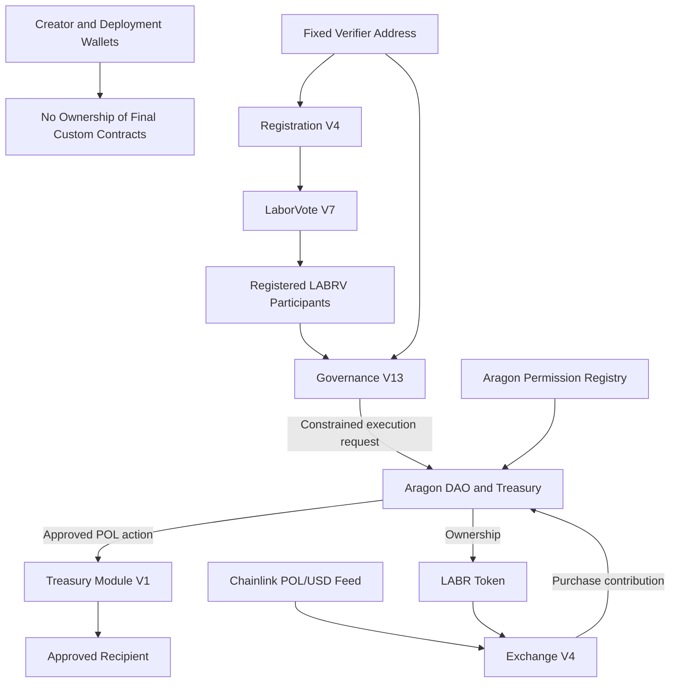

[decentralization.md](https://github.com/user-attachments/files/29432399/decentralization.md)
# LaborCoin Decentralization and Authority Model

## Overview

LaborCoin is designed to operate as durable public infrastructure with minimal dependence on creator-controlled administration.

The protocol does not treat decentralization as a single ownership-renouncement transaction. Its authority model is component-specific:

* Some contracts were deployed without owner administration.
* LaborVote V7 used temporary owner authority only to establish and permanently lock its minter.
* LABR ownership is held by the Aragon DAO.
* Governance V13 is limited to treasury-allocation proposals under fixed rules.
* The verifier, Human Passport, Chainlink, Polygon, and public interfaces remain external dependencies.
* The Aragon DAO permission registry remains a material authority boundary.

This document explains that final authority model, its limitations, and the evidence required to verify it independently.

**Network:** Polygon Mainnet  
**Chain ID:** 137

> **Current documentation status:** Exchange V4, Registration V4, Governance V13, and Treasury Module V1 are deployed without owner administration. LaborVote V7 has a permanently locked Registration V4 minter and renounced ownership. LABR ownership is held by the Aragon DAO. Final Aragon permission cleanup, executor provenance, validation evidence, and publication hashes remain separate launch-record tasks until completed and published.

---

## Document Scope

This file is the canonical conceptual reference for LaborCoin decentralization.

It explains:

* Where authority exists
* Where authority has been removed
* Which rules are fixed
* Which functions remain DAO-controlled
* What Governance V13 can and cannot do
* Which external systems remain trusted dependencies
* What evidence is required before final decentralization claims are complete

Transaction-level evidence belongs elsewhere:

* [`deployment-records/ownership-transfer.md`](../deployment-records/ownership-transfer.md) records ownership, minter, and administrative-finalization transactions.
* [`deployment-records/aragon-permissions.md`](../deployment-records/aragon-permissions.md) records final DAO permission grants and revocations.
* The launch provenance report records deployment evidence, validation evidence, executor cleanup, and final artifact hashes.

This separation keeps the conceptual authority model stable while allowing transaction records to be updated independently.

---

# Decentralization Principle

LaborCoin follows one central rule:

**Verified participants govern treasury allocation under fixed constraints. They do not possess unrestricted authority to rewrite the protocol.**

Governance V13 may coordinate treasury transfers. It cannot:

* Change the bonding curve
* Change exchange limits
* Pause Exchange V4
* Withdraw Exchange V4 liquidity administratively
* Change the Registration V4 minimum LABR requirement
* Replace the Registration V4 verifier
* Replace the Governance V13 verifier
* Change voting thresholds
* Change the proposal duration
* Change the execution window
* Change the treasury cap
* Replace LABRV
* Replace Registration V4
* Replace Treasury Module V1
* Upgrade any final custom contract
* Execute arbitrary DAO actions through its proposal format
* Modify LABR owner settings directly through Governance V13 proposals

The deployed protocol therefore separates democratic treasury decisions from general protocol administration.

---

# Authority Classification

LaborCoin uses several distinct authority classes. These terms should not be treated as interchangeable.

| Classification | Meaning |
|---|---|
| Ownerless | The contract exposes no owner role or owner-only administrative interface. |
| Permanently Locked | A configuration existed during deployment but can no longer be changed. |
| DAO-Controlled | Authority is held by the Aragon DAO and depends upon its permission registry. |
| Permission-Controlled | An action can be exercised only by addresses holding the required Aragon permission. |
| Externally Operated | A required service operates outside the immutable custom contracts. |
| Fixed by Deployed Logic | No available setter or upgrade path can change the deployed rule. |
| User-Controlled | An individual participant controls an action through their own wallet and private key. |

A source-verified contract is not automatically ownerless. A DAO-owned contract is not automatically immutable. A fixed smart contract may still depend upon an external service.

---

# High-Level Authority Model

The diagram separates four different forms of authority:

1. **Protocol rules** are enforced by deployed custom-contract logic.
2. **Treasury decisions** are made through Governance V13.
3. **DAO custody and LABR ownership** are governed by Aragon permissions.
4. **Eligibility and market data** depend upon external verifier and oracle infrastructure.

Governance V13 is the intended constrained treasury-allocation executor. Final exclusivity of that path depends upon the published Aragon permission registry and removal of obsolete executors.

---

# Component Authority Summary

| Component | Address | Authority State | Remaining Authority or Dependency |
|---|---|---|---|
| LABR Token | [`0x460DD873A1D2a41e77410B125cD3027C5FEd2f78`](https://polygonscan.com/address/0x460DD873A1D2a41e77410B125cD3027C5FEd2f78) | DAO-controlled | Owner-only token-management functions remain available to the DAO subject to Aragon permissions. |
| LaborVote V7 | [`0x833242E933c675846D8f8982048FecA95B8e435A`](https://polygonscan.com/address/0x833242E933c675846D8f8982048FecA95B8e435A) | Permanently locked and ownerless | Registration V4 is the permanent minter. |
| Registration V4 | [`0xd1CD6C0B6f1F709A52908B40C07D3C54649e323C`](https://polygonscan.com/address/0xd1CD6C0B6f1F709A52908B40C07D3C54649e323C) | Ownerless | Depends upon fixed LABR, LABRV, and verifier addresses. |
| Governance V13 | [`0x8238105d31F6Bb26897d8Ab270a0A521FEF03E8c`](https://polygonscan.com/address/0x8238105d31F6Bb26897d8Ab270a0A521FEF03E8c) | Ownerless and constrained | Depends upon fixed DAO, LABRV, Registration V4, Treasury Module V1, and verifier addresses. |
| Treasury Module V1 | [`0x10F2798ef055950B897AF4B3A8ae90dE34f6C56C`](https://polygonscan.com/address/0x10F2798ef055950B897AF4B3A8ae90dE34f6C56C) | Ownerless with fixed DAO caller | Only the Aragon DAO can invoke its payable transfer function. |
| Exchange V4 | [`0x4Cf18cB39203B678f5C26f2338a10a79f9684749`](https://polygonscan.com/address/0x4Cf18cB39203B678f5C26f2338a10a79f9684749) | Ownerless | Depends upon fixed LABR, DAO treasury, and Chainlink feed addresses. |
| Aragon DAO | [`0x0C2e5679153593b82a84eAB5CA90895BB291Cec4`](https://polygonscan.com/address/0x0C2e5679153593b82a84eAB5CA90895BB291Cec4) | Permission-controlled | Holds treasury assets and LABR ownership. |
| Verifier | `0x475d519631d2406753aCA29F305f19b83E97513e` | Externally operated fixed signer | Authorizes registration and authenticated governance actions. |
| Chainlink POL/USD Feed | [`0xAB594600376Ec9fD91F8e885dADF0CE036862dE0`](https://polygonscan.com/address/0xAB594600376Ec9fD91F8e885dADF0CE036862dE0) | External oracle | Supplies POL/USD data to Exchange V4. |

---

# Contract-Specific Authority

## 1. LABR Token

LABR is the protocol's transferable economic token.

Its ownership is held by the Aragon DAO. LABR is therefore DAO-controlled.

The deployed token retains owner-only functions involving areas such as:

* Pause and unpause controls
* Blacklist management
* Token recovery
* Fee and tax-recipient settings
* Fee and limit exclusions
* Automated-market-maker and router settings
* Wallet and transaction limits
* Trading and cooldown settings
* Related token configuration

Governance V13 cannot directly call those owner functions through its treasury-transfer proposal format. Practical access to the LABR owner surface depends upon the Aragon permission registry and any address able to cause the DAO to execute arbitrary calls.

For that reason, the final DAO permission record is part of the protocol's decentralization evidence.

### Authority Conclusion

* Creator ownership: removed
* DAO ownership: retained
* Owner functions: present
* Governance V13 access to owner functions: not provided by its proposal format
* Final risk boundary: Aragon DAO permissions

---

## 2. LaborVote V7

LaborVote V7 issues the non-transferable LABRV governance token.

Temporary ownership existed only to:

1. Assign Registration V4 as minter.
2. Lock the minter permanently.
3. Renounce ownership.

The final state is:

* `minter` points to Registration V4.
* `minterLocked` is true.
* Ownership is renounced.
* A new minter cannot be assigned.
* LABRV cannot be transferred between ordinary addresses.
* Registration V4 may mint only to addresses without an existing LABRV balance.

### Authority Conclusion

* Creator ownership: removed
* Minter authority: permanently fixed to Registration V4
* Upgrade path: none
* Transferable governance accumulation: prevented by token logic

---

## 3. Registration V4

Registration V4 has no owner, upgrade function, or administrative setter.

Its deployed dependencies are fixed in practice because no function can replace them:

* LABR
* LABRV
* Verifier address

Its on-chain registration conditions require:

* The caller is not already registered.
* The caller holds at least 1 LABR at registration time.
* The authorization has not expired.
* The signature was produced by the fixed verifier.

Successful registration permanently records the wallet as registered and conditionally mints one LABRV when the wallet does not already hold one.

Registration does not require the participant to continue holding LABR after registration. Governance V13 uses LABRV ownership for proposal and voting eligibility.

### Authority Conclusion

* Owner administration: none
* Registration revocation: none
* Dependency replacement: none
* Verifier dependence: retained
* Passport-score policy: enforced by the external verifier rather than stored as an on-chain score constant

---

## 4. Governance V13

Governance V13 has no owner, upgrade function, or administrative setter.

Its deployed dependencies and parameters cannot be replaced through an available function.

### Participant Authority

An address holding LABRV may:

* Create a treasury-transfer proposal with a valid verifier authorization
* Cast one vote per proposal with a valid verifier authorization

Governance V13 checks LABRV balance directly. ERC20Votes delegation does not determine Governance V13 eligibility or voting weight.

### Execution Authority

Any address may call `executeProposal` after the voting period. Execution succeeds only when the fixed contract conditions are satisfied.

The caller cannot change:

* The stored recipient
* The stored amount
* The recorded vote totals
* The voting thresholds
* The execution window
* The DAO action constructed by Governance V13

### Fixed Governance Rules

| Rule | Value |
|---|---:|
| Minimum Registered Members for Execution | 50 |
| Proposal Duration | 14 days |
| Minimum Participation | 25% |
| Minimum Approval | 67% |
| Maximum Proposal Transfer | 5% of DAO native POL balance at execution |
| Execution Window | 7 days |

Participation is evaluated against the current `Registration V4.totalMembers()` value when proposal status is evaluated.

### Scope Limitation

Governance V13 constructs one specific DAO action:

1. Send the approved POL amount to Treasury Module V1.
2. Call `executeTransfer(recipient)`.
3. Allow Treasury Module V1 to forward that POL to the proposal recipient.

Governance V13 does not provide arbitrary DAO-call construction.

### Authority Conclusion

* Owner administration: none
* Governance scope: treasury allocation
* General DAO administration: absent
* Protocol parameter changes: absent
* Execution caller restriction: none
* Execution outcome discretion: constrained by stored proposal data and fixed rules

---

## 5. Aragon DAO

The Aragon DAO is the custody and permission boundary.

It:

* Holds the protocol treasury
* Owns LABR
* Executes permission-authorized actions
* Supplies approved POL to Treasury Module V1

The DAO is not equivalent to Governance V13. Governance V13 is one intended constrained executor within the DAO permission model.

The DAO permission registry determines:

* Which addresses may execute DAO actions
* Which plugins or contracts hold execution-related permissions
* Whether obsolete governance or treasury components retain authority
* Whether any creator-controlled wallet retains direct administrative access

### Authority Conclusion

The DAO's decentralization status cannot be established from contract ownership labels alone. It requires a published final permission registry and transaction evidence for every material grant and revocation.

---

## 6. Treasury Module V1

Treasury Module V1 has no owner.

Its DAO address is immutable, and its transfer function is protected by an `onlyDAO` check.

The module:

* Receives POL supplied by the DAO as `msg.value`
* Forwards that exact call value to the requested recipient
* Rejects zero recipients
* Rejects zero-value transfers
* Records cumulative distributed POL

The module does not:

* Store proposal policy
* Evaluate votes
* Select recipients
* Select amounts
* Withdraw DAO assets independently
* Call itself on behalf of Governance V13
* Replace its DAO address

POL sent directly to the module outside its payable execution function is not governed by an administrative recovery function.

### Authority Conclusion

* Owner administration: none
* Authorized caller: fixed Aragon DAO
* Policy authority: none
* Independent treasury custody authority: none
* Recovery function: none

---

## 7. Exchange V4

Exchange V4 has no owner, pause function, administrative withdrawal function, or upgrade function.

Its protocol relationships are fixed in practice:

* LABR address
* DAO treasury address
* Chainlink POL/USD feed

Its core constants include:

* One-billion-LABR maximum curve supply
* $1 to $15 quadratic target-price range
* 100-million-LABR initial unlocked supply
* 50-million-LABR tranche increments
* 10,000 LABR exchange wallet limit
* 5,000 LABR exchange transaction limit
* 12-hour address cooldown
* 10% purchase POL contribution to the DAO
* 30-minute oracle freshness limit
* 100 POL per LABR oracle-anomaly ceiling

No administrator can modify those values after deployment.

### Authority Conclusion

* Owner administration: none
* Pause authority: none
* Administrative liquidity withdrawal: none
* Parameter setters: none
* Upgrade path: none
* External dependency: fixed Chainlink feed

---

# Creator Authority

The creator performed development, deployment, configuration, testing, interface work, and documentation.

The intended final state removes creator-controlled ownership of the final custom contracts.

The creator should not retain:

* Ownership of LaborVote V7
* Ownership of LABR
* Direct DAO execution permissions
* Obsolete plugin permissions
* Obsolete governance permissions
* Obsolete treasury-module permissions
* Any undocumented administrative route into DAO custody or DAO-owned LABR controls

Operation of the verifier infrastructure is a separate role. A verifier operator does not own the custom contracts, but control of the verifier key remains an important eligibility and availability dependency.

---

# Governance Authority Versus Protocol Authority

LaborCoin separates three types of decision-making.

| Decision Type | Authority |
|---|---|
| Whether to create or support a treasury proposal | Eligible LABRV participants |
| Whether an approved proposal may execute | Governance V13 fixed rules |
| How the exchange, registration, LABRV, governance thresholds, and treasury module operate | Deployed contract logic |
| Who may cause the Aragon DAO to execute actions | Aragon permission registry |
| Whether a registration or governance authorization is signed | Fixed verifier infrastructure |
| What POL/USD value Exchange V4 reads | Chainlink oracle network |

This model reduces authority concentration, while preserving specific operational dependencies.

---

# Fixed and Non-Fixed Elements

## Fixed by Deployed Custom-Contract Logic

* Exchange V4 pricing formula and exchange limits
* Exchange V4 oracle address and treasury destination
* Registration V4 dependencies and 1 LABR entry requirement
* Registration V4 permanent registration records
* LaborVote V7 minter after locking
* LaborVote V7 non-transferability
* Governance V13 thresholds, time windows, dependencies, and proposal format
* Treasury Module V1 DAO-only caller
* Treasury Module V1 distribution accounting

## DAO-Controlled

* LABR ownership
* DAO treasury custody
* Aragon permission assignments
* Any DAO action available to a valid executor under the installed permission system

## Externally Operated

* Human Passport evaluation
* Verifier policy and signature availability
* Chainlink oracle operation
* Polygon network operation
* Website hosting
* Frontend code
* RPC endpoints
* Wallet software

Frontend or service changes cannot rewrite final contract bytecode. They can affect accessibility, transaction construction, information display, and authorization availability.

---

# Remaining Trust Assumptions

## Polygon

LaborCoin relies on Polygon Mainnet for consensus, transaction ordering, execution, and data availability.

## Chainlink

Exchange V4 relies on the fixed Chainlink POL/USD feed for POL-denominated pricing.

## Human Passport and Verifier

Registration and protected governance actions rely on the fixed verifier address.

A compromised verifier could authorize ineligible actions. An unavailable verifier could interrupt new registration, proposal creation, and voting. The verifier cannot directly mint LABRV, record votes, create proposals, or transfer DAO funds without a participant submitting a transaction that also satisfies on-chain checks.

Because the verifier address is fixed, replacing the verifier would require migration to new contracts rather than an administrative update.

## Aragon Permissions

DAO custody and DAO-owned LABR authority depend upon the final permission registry.

An obsolete or unauthorized executor could bypass the intended constrained governance path if it retained a sufficiently broad DAO permission.

## Wallet and Key Security

Participants remain responsible for wallet keys and transaction review. A compromised registered wallet may exercise the governance rights attached to its LABRV.

## Public Interfaces

The official website is an interface rather than the source of protocol authority. Participants may interact with verified contracts through other compatible tools.

---

# Decentralization Tradeoffs

Authority minimization improves predictability but reduces recoverability.

Ownerless and locked contracts cannot be repaired in place if a defect is discovered.

Examples include:

* A fixed verifier address cannot be replaced administratively.
* Governance thresholds cannot be amended.
* Treasury caps cannot be amended.
* Exchange parameters cannot be tuned.
* The Treasury Module DAO address cannot be replaced.
* LABRV minter authority cannot be reassigned.
* Directly sent assets may lack a recovery path.

The protocol intentionally prioritizes fixed rules over ongoing administrative flexibility.

---

# Finalization and Evidence Status

| Finalization Item | Status | Evidence Location |
|---|---|---|
| Final custom contracts deployed | Complete | Deployment records |
| Final custom contract sources verified | Complete | Verification records and Polygonscan |
| Registration V4 assigned as LABRV minter | Complete | `ownership-transfer.md` |
| LABRV minter permanently locked | Complete | `ownership-transfer.md` |
| LaborVote V7 ownership renounced | Complete | `ownership-transfer.md` |
| LABR ownership transferred to Aragon DAO | Complete, transaction details must remain recorded | `ownership-transfer.md` |
| Exchange V4 owner finalization | Not applicable, deployed without owner | Source and deployment records |
| Registration V4 owner finalization | Not applicable, deployed without owner | Source and deployment records |
| Governance V13 owner finalization | Not applicable, deployed without owner | Source and deployment records |
| Treasury Module V1 owner finalization | Not applicable, deployed without owner | Source and deployment records |
| Final Aragon permission cleanup | Outstanding launch task | `aragon-permissions.md` |
| Removal of obsolete executors and modules | Outstanding launch task | `aragon-permissions.md` and launch provenance report |
| Final launch validation evidence | Outstanding publication task | Launch validation report |
| Final artifact SHA-256 values | Outstanding publication-freeze task | Release record |

The distinction between an outstanding protocol action and an outstanding documentation action should remain explicit.

---

# Independent Verification Procedure

A reviewer can evaluate the final authority model through the following process.

## 1. Verify Contract Source

Open each address on Polygonscan and confirm that the verified source matches the published final source.

## 2. Inspect Owner Surfaces

Confirm:

* Exchange V4 has no owner interface.
* Registration V4 has no owner interface.
* Governance V13 has no owner interface.
* Treasury Module V1 has no owner interface.
* LaborVote V7 ownership is renounced.
* LABR ownership points to the Aragon DAO.

## 3. Verify LaborVote Final State

Read:

* `minter`
* `minterLocked`
* `owner`

Confirm that:

* `minter` is Registration V4.
* `minterLocked` is true.
* `owner` is the zero address.

## 4. Verify Fixed Dependencies

Compare constructor values and public getters with the published registry for:

* LABR
* LABRV
* Registration V4
* Governance V13
* Treasury Module V1
* Aragon DAO
* Verifier
* Chainlink feed

## 5. Verify DAO Permissions

Review the final Aragon permission report and confirm that:

* Governance V13 holds only the intended execution authority.
* Obsolete governance contracts are revoked.
* Obsolete treasury modules are revoked.
* Obsolete executors are revoked.
* Creator-controlled wallets do not retain undocumented administrative permissions.
* The published permission state matches the current on-chain state.

## 6. Verify Transaction Evidence

Compare every finalization claim with:

* Transaction hash
* Block number
* Timestamp
* Sender
* Target
* Function call
* Emitted events
* Resulting post-state

Source verification proves code identity. Transaction and state evidence prove final authority configuration.

---

# Public Declaration Standard

A final decentralization declaration should be published only after the evidence set confirms:

* Final contracts are deployed and verified.
* Registration V4 is the permanently locked LABRV minter.
* LaborVote V7 ownership is renounced.
* LABR ownership is held by the Aragon DAO.
* Final Aragon permissions are published.
* Obsolete execution permissions are revoked.
* Creator-controlled administrative routes are removed.
* Launch validation evidence is published.
* Final artifacts and hashes are frozen.

The declaration should identify remaining external dependencies rather than claiming universal decentralization.

---

# Summary

LaborCoin decentralization is based on authority minimization, constrained governance, fixed contract rules, and public evidence.

The final custom-contract model consists of:

* Ownerless Exchange V4
* Ownerless Registration V4
* Ownerless Governance V13
* Ownerless Treasury Module V1
* Permanently locked and ownerless LaborVote V7
* DAO-owned LABR
* DAO-controlled treasury custody
* Fixed verifier dependencies
* A fixed Chainlink oracle dependency
* A permission registry that must be finalized and published

This structure removes creator ownership from the final custom contracts while preserving democratic authority over treasury allocation.

It does not eliminate every source of authority or trust. DAO permissions, LABR ownership, verifier operation, oracle operation, network operation, wallet security, and public interfaces remain explicit parts of the system.

LaborCoin's decentralization claim therefore rests on narrow authority, fixed rules, transparent limitations, and independently verifiable records.

---

## Related Documentation

* [Architecture](architecture.md)
* [Governance](governance.md)
* [Security](security.md)
* [Economic Flow](economic-flow.md)
* [Ownership Transfer and Finalization Records](../deployment-records/ownership-transfer.md)
* [Aragon Permission Records](../deployment-records/aragon-permissions.md)
* [Technical Whitepaper](whitepaper.md)
