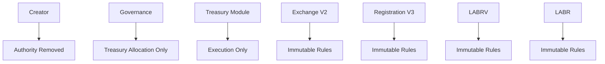

Illustrates the intended authority model following ownership renouncement. Administrative authority is removed, governance retains treasury allocation authority only, and protocol behavior is governed by immutable smart contract rules.

This represents the protocol's intended autonomous operating state.
