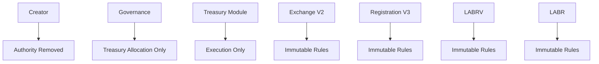

Illustrates the intended authority model following ownership renouncement. Administrative authority is removed, governance retains treasury allocation authority only, and protocol behavior is governed by immutable smart contract rules.

This represents the protocol's intended autonomous operating state.

Contract Registry

This table identifies the primary smart contracts comprising the LaborCoin protocol. Contract addresses, deployment metadata, verification status, and ownership status are provided to facilitate independent verification of protocol architecture and decentralization status.

| Contract Name | Contract Address | Deployment Block | Deployment Date (UTC) | Verified Source | Ownership Status |
|--------------|------------------|-----------------:|-----------------------|----------------|------------------|
| LABR Token | [0x460DD873A1D2a41e77410B125cD3027C5FEd2f78](https://polygonscan.com/address/0x460DD873A1D2a41e77410B125cD3027C5FEd2f78) | 69797383 | Apr-02-2025 07:56:25 AM +UTC | Yes | DAO Controlled |
| LaborVote (LABRV) V7 | [0x833242E933c675846D8f8982048FecA95B8e435A](https://polygonscan.com/address/0x833242E933c675846D8f8982048FecA95B8e435A) | 88595455 | Jun-16-2026 08:22:48 AM +UTC | Yes | Ownership Renounced / Minter Permanently Locked |
| LaborCoin Registration V4 | [0xd1CD6C0B6f1F709A52908B40C07D3C54649e323C](https://polygonscan.com/address/0xd1CD6C0B6f1F709A52908B40C07D3C54649e323C) | 88997813 | Jun-22-2026 | Yes | Autonomous |
| LaborCoin Treasury Module V1 | [0x10F2798ef055950B897AF4B3A8ae90dE34f6C56C](https://polygonscan.com/address/0x10F2798ef055950B897AF4B3A8ae90dE34f6C56C) | 89052358 | Jun-24-2026 | Yes | Autonomous (DAO Only) |
| LaborCoin Governance V13 | [0x8238105d31F6Bb26897d8Ab270a0A521FEF03E8c](https://polygonscan.com/address/0x8238105d31F6Bb26897d8Ab270a0A521FEF03E8c) | 89084762 | Jun-24-2026 08:15:38 PM +UTC | Yes | Autonomous |
| LaborCoin Exchange V4 | [0x4Cf18cB39203B678f5C26f2338a10a79f9684749](https://polygonscan.com/address/0x4Cf18cB39203B678f5C26f2338a10a79f9684749) | 89115657 | Jun-25-2026 09:08:01 AM +UTC | Yes | Autonomous |

**Ownership Status Definitions**

| Status | Description |
|---------|-------------|
| Creator Controlled | Administrative authority remains with the original deployer. |
| DAO Controlled | Administrative authority is exercised through governance mechanisms. |
| Autonomous | No privileged administrator exists following ownership renouncement. |
| Immutable | Contract contains no administrative functions or upgrade authority. |

**Verification Status**

| Status | Description |
|---------|-------------|
| Yes | Source code has been publicly verified and can be independently audited. |
| No | Source code has not yet been publicly verified. |

---

## Ownership Transfer Status

| Contract | Current Owner | Ownership Transfer |
|-----------|-----------|-----------|
| LABR | Creator | 🔄 Pending |
| Exchange | Creator | 🔄 Pending |
| Registration | Creator | 🔄 Pending |
| Governance | Creator | 🔄 Pending |
| Treasury | Immutable | ✅ Complete |

> Ownership of protocol components will be transferred to governance or otherwise finalized as part of the public launch process. Status will be updated as milestones are completed.
