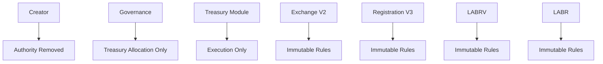

Illustrates the intended authority model following ownership renouncement. Administrative authority is removed, governance retains treasury allocation authority only, and protocol behavior is governed by immutable smart contract rules.

This represents the protocol's intended autonomous operating state.

Contract Registry

This table identifies the primary smart contracts comprising the LaborCoin protocol. Contract addresses, deployment metadata, verification status, and ownership status are provided to facilitate independent verification of protocol architecture and decentralization status.

| Contract Name | Contract Address | Deployment Block | Deployment Date (UTC) | Verified Source | Ownership Status |
|--------------|------------------|------------------|----------------------|----------------|------------------|
| LABR Token | [0x460DD873A1D2a41e77410B125cD3027C5FEd2f78](https://polygonscan.com/address/0x460DD873A1D2a41e77410B125cD3027C5FEd2f78) | 69797383 | Apr-02-2025 07:56:25 AM +UTC | Yes | DAO Controlled |
| Exchange V2 | [0xD0692ec758bb852421B702B187b6439f74f8Bf3b](https://polygonscan.com/address/0xD0692ec758bb852421B702B187b6439f74f8Bf3b) | 86058988 | Apr-26-2026 09:13:40 PM +UTC | No | DAO Controlled |
| LABRV V6 | [0x113579220515cd59b884Ea2379b4C369025246e2](https://polygonscan.com/address/0x113579220515cd59b884Ea2379b4C369025246e2) | 86338827 | May-03-2026 08:41:38 AM +UTC | No | DAO Controlled |
| Treasury Module | [0x0B018E45E4cB71E222C345a5341BdbaeE519c623](https://polygonscan.com/address/0x0B018E45E4cB71E222C345a5341BdbaeE519c623) | 88062691 | Jun-07-2026 02:23:42 AM +UTC | Yes | Autonomous |
| Registration V3 | [0xa7D0C092C2391379046cACDc56BEbDe5A0CBD113](https://polygonscan.com/address/0xa7D0C092C2391379046cACDc56BEbDe5A0CBD113) | 87377671 | May-24-2026 07:23:53 PM +UTC | No | DAO Controlled |
| Governance V12 | [0x499b32e9E5a8b9865a9D69480d590252a56FA78F](https://polygonscan.com/address/0x499b32e9E5a8b9865a9D69480d590252a56FA78F) | 88062745 | Jun-07-2026 02:25:03 AM +UTC | Yes | DAO Controlled |

**Ownership Status Definitions**

| Status | Description |
|---------|-------------|
| Creator Controlled | Administrative authority remains with the original deployer. |
| DAO Controlled | Administrative authority is exercised through governance mechanisms. |
| Autonomous | No privileged administrator exists following ownership renouncement. |
| Immutable | Contract contains no administrative functions or upgrade authority. |

**Verification Status**

| Status | Description |
|---------|-------------|
| Yes | Source code has been publicly verified and can be independently audited. |
| No | Source code has not yet been publicly verified. |

---

| Contract     | Current Owner | Ownership Transferred |
| ------------ | ------------- | --------------------- |
| LABR         | Creator       | [ - ]
| Exchange     | Creator       | [ - ]
| Registration | Creator       | [ - ]
| Governance   | Creator       | [ - ]
| Treasury     | Immutable     | [x]
