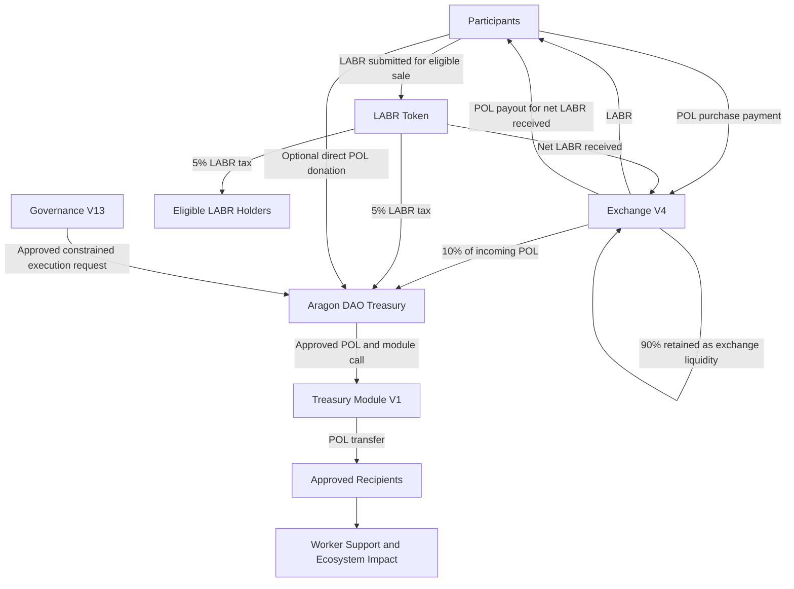
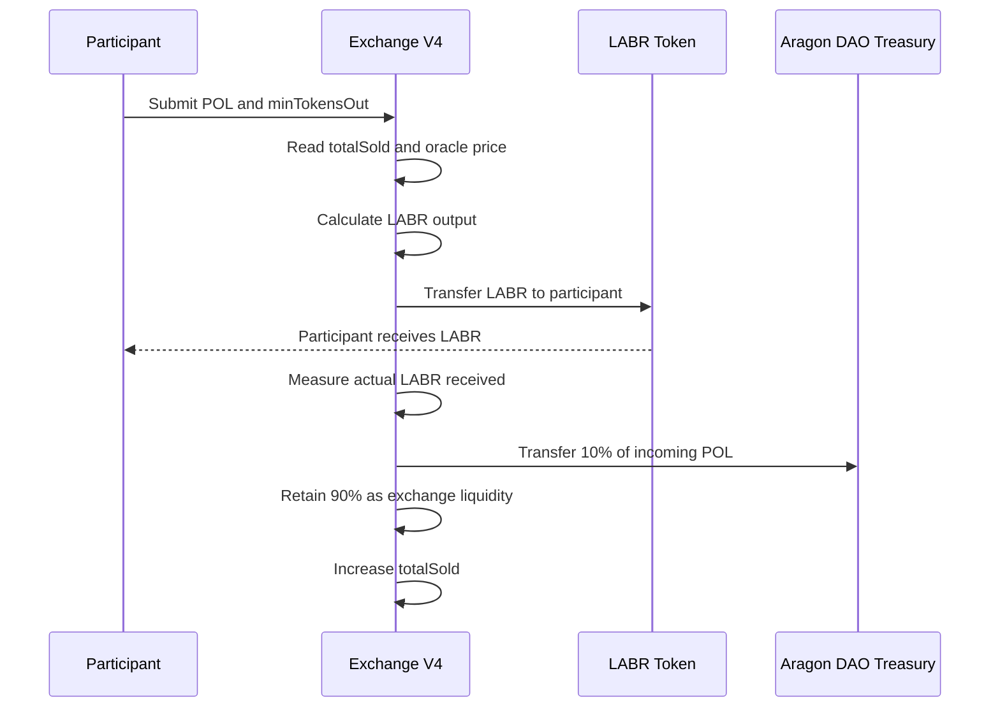
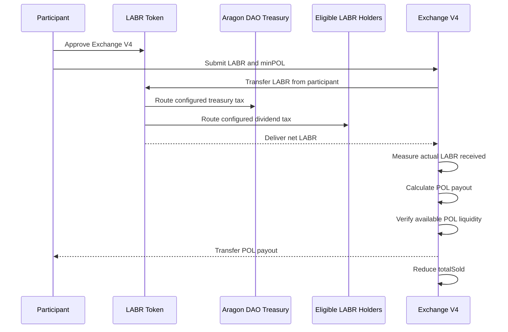
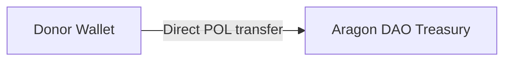
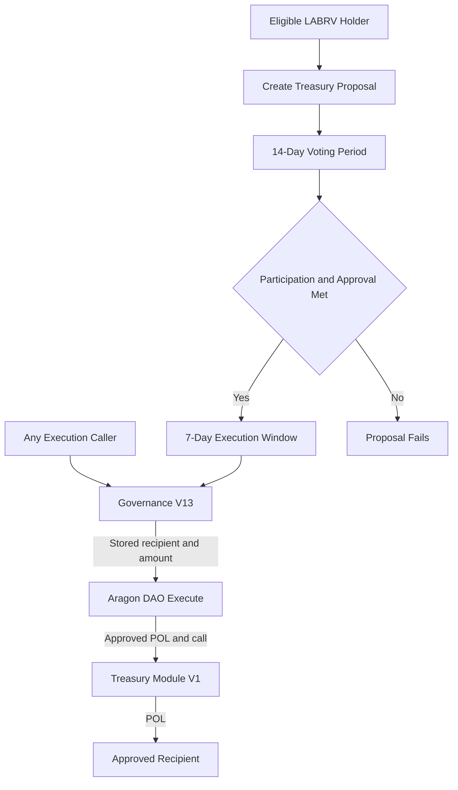
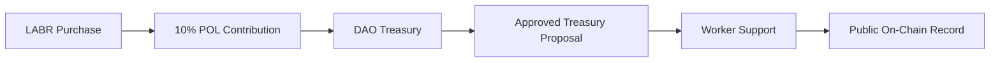
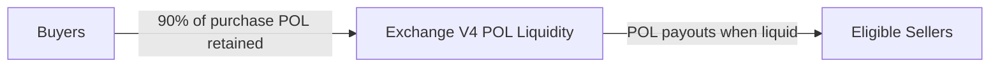
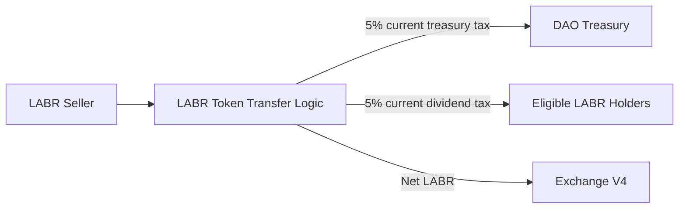

[economic-flow.md](https://github.com/user-attachments/files/29432456/economic-flow.md)
# LaborCoin Economic Flow

## Overview

LaborCoin separates economic activity, treasury custody, governance authorization, and fund distribution into distinct on-chain paths.

This distinction is important because the protocol contains two different kinds of flow:

1. **Value flow**, which describes where POL and LABR move.
2. **Authority flow**, which describes who may authorize treasury distributions.

Governance V13 does not hold treasury assets. The Aragon DAO is the treasury custodian. Governance V13 records proposals and votes, evaluates fixed thresholds, and constructs a constrained DAO execution request for approved POL transfers.

**Network:** Polygon Mainnet  
**Chain ID:** 137

---

# High-Level Economic Model

LaborCoin economic activity has four primary sources and destinations:

* Participants purchase LABR from Exchange V4 using POL.
* Exchange V4 routes part of each purchase directly to the Aragon DAO treasury.
* Eligible LABR sales return POL from Exchange V4 to participants.
* Governance-approved treasury distributions move POL from the Aragon DAO through Treasury Module V1 to approved recipients.

Direct donations may also be sent to the Aragon DAO treasury.



The arrows from Governance V13 to the DAO represent authorization, not custody or transfer of funds into Governance V13.

---

# Core Economic Components

## 1. Participants

Participants may interact with the economic system in several ways:

* Purchase LABR through Exchange V4
* Hold or transfer LABR
* Sell eligible LABR back to Exchange V4
* Receive configured LABR-holder dividends
* Donate POL directly to the Aragon DAO treasury
* Register for LABRV governance rights
* Create and vote on treasury proposals
* Execute approved proposals during the execution window

Economic participation through LABR is separate from governance participation through LABRV.

---

## 2. Exchange V4

Exchange V4 is the protocol-managed LABR distribution and redemption mechanism.

**Address:**

[`0x4Cf18cB39203B678f5C26f2338a10a79f9684749`](https://polygonscan.com/address/0x4Cf18cB39203B678f5C26f2338a10a79f9684749)

Exchange V4:

* Sells LABR using a deterministic bonding curve
* Accepts POL for purchases
* Routes 10% of incoming purchase POL to the Aragon DAO treasury
* Retains 90% of incoming purchase POL as exchange liquidity
* Pays POL for eligible LABR sales when sufficient liquidity is available
* Measures actual LABR received during sales
* Updates the net distribution state
* Enforces exchange-specific transaction, wallet, cooldown, and oracle controls

Exchange V4 does not own the DAO treasury and cannot withdraw DAO funds.

---

## 3. LABR Token

LABR is the transferable economic token.

**Address:**

[`0x460DD873A1D2a41e77410B125cD3027C5FEd2f78`](https://polygonscan.com/address/0x460DD873A1D2a41e77410B125cD3027C5FEd2f78)

LABR provides:

* Economic participation
* Transferable token ownership
* Eligibility for configured holder dividends
* The one-time minimum balance requirement for DAO registration

The current sell-side LABR tax configuration is:

| Destination | Rate |
|---|---:|
| Aragon DAO treasury | 5% |
| Eligible LABR-holder dividends | 5% |
| Burn | 0% |
| Total | 10% |

The tax is enforced by the LABR token during the sale-side token transfer. Exchange V4 pays POL according to the LABR amount it actually receives after token-level transfer mechanics.

---

## 4. Aragon DAO Treasury

The Aragon DAO is the protocol treasury custodian.

**Address:**

[`0x0C2e5679153593b82a84eAB5CA90895BB291Cec4`](https://polygonscan.com/address/0x0C2e5679153593b82a84eAB5CA90895BB291Cec4)

The treasury may receive value from:

* Ten percent of each Exchange V4 purchase
* The current five percent LABR sell-side treasury tax
* Direct POL donations
* Other voluntary transfers

The DAO treasury is distinct from Exchange V4 liquidity.

POL held by the DAO is not available for Exchange V4 sale payouts unless a separate governance-approved transfer explicitly moves funds through the permitted treasury path.

---

## 5. Governance V13

Governance V13 is the proposal, voting, and constrained execution engine.

**Address:**

[`0x8238105d31F6Bb26897d8Ab270a0A521FEF03E8c`](https://polygonscan.com/address/0x8238105d31F6Bb26897d8Ab270a0A521FEF03E8c)

Governance V13:

* Records treasury-transfer proposals
* Records one vote per eligible LABRV holder
* Evaluates participation and approval requirements
* Enforces the proposal duration and execution window
* Enforces the minimum-member requirement
* Enforces the execution-time transfer cap
* Constructs the approved Aragon DAO action
* Prevents the caller from changing the stored recipient or amount

Governance V13 does not:

* Hold treasury POL
* Hold exchange liquidity
* Receive purchase taxes
* Receive sell taxes
* Select recipients outside the proposal process
* Transfer DAO funds directly
* Construct arbitrary DAO actions
* Modify the bonding curve or token economics

---

## 6. Treasury Module V1

Treasury Module V1 is the final transfer mechanism in the approved treasury path.

**Address:**

[`0x10F2798ef055950B897AF4B3A8ae90dE34f6C56C`](https://polygonscan.com/address/0x10F2798ef055950B897AF4B3A8ae90dE34f6C56C)

Treasury Module V1:

* Accepts execution only from the fixed Aragon DAO
* Receives the approved POL as call value
* Forwards that POL to the approved proposal recipient
* Records cumulative distributed POL

Treasury Module V1 is not the primary treasury custodian. It is a constrained distribution module.

---

# Purchase Flow

A LABR purchase moves both POL and LABR.



## Purchase Allocation

For a purchase of \(Q\) POL:

$$
\text{DAO Contribution} = 0.10Q
$$

$$
\text{Exchange Liquidity Retained} = 0.90Q
$$

### Example

For a purchase of 100 POL:

| Destination | Amount |
|---|---:|
| Aragon DAO treasury | 10 POL |
| Exchange V4 | 90 POL |

The participant's LABR output is calculated from the full submitted POL amount at the current bonding-curve price. The treasury contribution is an allocation of incoming POL rather than a reduction in the displayed LABR amount after calculation.

---

# Sale Flow

A LABR sale moves LABR from the participant and POL from Exchange V4.



## Sale Calculation Principle

Exchange V4 calculates the POL payout using the actual LABR amount it receives.

Let:

* \(A\) = LABR submitted by the participant
* \(t\) = total sell-side LABR tax rate
* \(A_{\text{net}}\) = LABR actually received by Exchange V4
* \(P_{\text{POL}}\) = current POL price per LABR

Under the current 10% total sell tax:

$$
A_{\text{net}} = A(1 - 0.10)
$$

The expected gross POL payout is:

$$
\text{POL Payout} = A_{\text{net}} \times P_{\text{POL}}
$$

This relationship is illustrative. The contract relies on the measured token balance change rather than assuming a fixed tax rate.

### Example

If a participant submits 1,000 LABR:

| Flow | Amount |
|---|---:|
| LABR submitted | 1,000 LABR |
| Treasury tax at 5% | 50 LABR |
| Dividend tax at 5% | 50 LABR |
| LABR received by Exchange V4 | 900 LABR |

Exchange V4 calculates the POL payout using the 900 LABR it actually receives.

---

# Direct Donation Flow

Participants may send POL directly to the Aragon DAO treasury.



Direct donations:

* Do not purchase LABR
* Do not increase `totalSold`
* Do not create exchange liquidity
* Do not grant LABRV
* Do not create a governance proposal
* Increase the DAO treasury balance available for future approved distributions

---

# Governance Allocation Flow

Treasury allocation is an authorization process followed by a value transfer.



## Fixed Governance Requirements

| Requirement | Value |
|---|---:|
| Minimum Registered Members for Execution | 50 |
| Voting Period | 14 days |
| Minimum Participation | 25% |
| Minimum Approval | 67% |
| Maximum Transfer | 5% of DAO native POL balance at execution |
| Execution Window | 7 days |

Participation is evaluated using the current Registration V4 `totalMembers()` value when proposal status is evaluated.

The transfer cap is evaluated against the Aragon DAO's native POL balance at execution time.

---

# Treasury Distribution Sequence

A successful distribution follows this sequence:

1. A participant with LABRV creates a proposal using a valid verifier authorization.
2. The proposal stores a description, recipient, POL amount, and voting deadline.
3. Eligible LABRV holders vote.
4. The voting period ends.
5. Governance V13 evaluates current participation and approval.
6. The protocol confirms at least 50 registered members.
7. The approved amount is checked against 5% of the DAO's current native POL balance.
8. Any address may call `executeProposal`.
9. Governance V13 constructs the fixed DAO action.
10. The Aragon DAO sends the approved POL to Treasury Module V1 as call value.
11. Treasury Module V1 forwards that exact POL amount to the stored recipient.
12. Treasury Module V1 increases `totalDistributed`.
13. Governance V13 marks the proposal executed.

No execution caller may substitute a different recipient or amount.

---

# Economic State Boundaries

LaborCoin maintains several economically important balances that should not be combined.

| State or Balance | Custodian | Purpose |
|---|---|---|
| Participant POL | Participant wallet | Purchases, gas, donations, and other activity |
| Participant LABR | Participant wallet | Economic participation and registration eligibility |
| Exchange V4 POL | Exchange V4 | Eligible sale payouts |
| Exchange V4 LABR | Exchange V4 | LABR distribution inventory |
| Aragon DAO POL | Aragon DAO | Governance-controlled treasury |
| Aragon DAO LABR | Aragon DAO or configured token routing | DAO-owned token assets |
| Treasury Module POL | Temporary call value or direct transfers | Approved distribution execution |
| Dividend allocation | LABR token mechanism | Distribution to eligible LABR holders |

The DAO treasury balance is not the Exchange V4 reserve.

The Exchange V4 POL balance is not available to Governance V13 as treasury funds.

Treasury Module V1 is not intended to accumulate protocol treasury assets.

---

# Economic Feedback Loops

## Treasury Funding Loop



## Exchange Liquidity Loop



Purchase activity can increase Exchange V4 POL liquidity. Sale activity decreases it.

The contract does not enforce a protected reserve ratio or guarantee that every future sale can be filled.

## Token Tax Loop



---

# Economic Controls

## Exchange-Level Controls

| Control | Deployed Value |
|---|---:|
| Maximum Exchange Wallet Balance | 10,000 LABR |
| Maximum Exchange Transaction | 5,000 LABR |
| Address Cooldown | 12 hours |
| Initial Unlocked Supply | 100,000,000 LABR |
| Tranche Increase | 50,000,000 LABR |
| Maximum Curve Supply | 1,000,000,000 LABR |
| Purchase Treasury Share | 10% of incoming POL |
| Oracle Freshness Limit | 30 minutes |
| Maximum Oracle-Protected Price | 100 POL per LABR |

## Governance-Level Controls

| Control | Deployed Value |
|---|---:|
| Minimum Registered Members | 50 |
| Participation Requirement | 25% |
| Approval Requirement | 67% |
| Proposal Duration | 14 days |
| Execution Window | 7 days |
| Maximum Treasury Transfer | 5% of current DAO native POL balance |

## Registration-Level Controls

| Control | Deployed Behavior |
|---|---|
| Minimum LABR at Registration | 1 LABR |
| Continued LABR Holding Requirement | None |
| Governance Credential | One LABRV |
| Registration Revocation | None |
| Duplicate Registration | Rejected |

---

# Accounting and Interpretation

## `totalSold`

Exchange V4 `totalSold` represents current net LABR distribution recognized by the exchange.

It:

* Increases after purchases
* Decreases after eligible sales
* Determines the bonding-curve position
* Is not cumulative lifetime sales volume

## `totalDistributed`

Treasury Module V1 `totalDistributed` represents cumulative POL forwarded through its approved execution function.

It does not necessarily include:

* Direct transfers from the DAO that bypass the module
* Historical transfers from obsolete modules
* Token distributions
* Unexecuted proposal obligations
* Treasury assets still held by the DAO

## Pending Proposal Obligations

The frontend may display the sum of approved but unexecuted proposal amounts as pending obligations.

This is an informational calculation. It does not reserve treasury POL on-chain.

Multiple approved proposals may compete for a changing treasury balance. Each proposal must independently satisfy the execution-time balance and 5% cap conditions.

## Spot Price and Notional Values

The following calculation is not a treasury or reserve measure:

$$
\text{Current Spot Price} \times \texttt{totalSold}
$$

It does not represent:

* DAO treasury value
* Exchange reserve value
* Historical proceeds
* Guaranteed redemption value
* Realized market capitalization
* Future protocol income

---

# Authority and Value Separation

The following table distinguishes economic custody from decision authority.

| Component | Holds Value | Makes Proposals | Records Votes | Executes Transfer Logic |
|---|---:|---:|---:|---:|
| Participants | Yes | Eligible participants | Eligible participants | May call permissionless execution |
| Exchange V4 | LABR and POL liquidity | No | No | Buy and sell settlement |
| LABR Token | Token accounting | No | No | Transfer tax and dividend mechanics |
| Governance V13 | No treasury custody | Yes, by recording participant proposals | Yes | Constructs constrained DAO action |
| Aragon DAO | Treasury custody and LABR ownership | No | No | Executes permission-authorized actions |
| Treasury Module V1 | Temporary call value | No | No | Forwards approved POL |
| Recipients | Receive approved distributions | No | No | No |

This separation prevents a single contract from simultaneously controlling pricing, eligibility, voting, custody, and distribution.

---

# External Economic Dependencies

## Chainlink POL/USD Feed

Exchange V4 uses the fixed Chainlink POL/USD feed to convert the USD-denominated bonding curve into POL.

Oracle availability and validity affect exchange operation.

## Polygon Mainnet

All economic settlement depends upon Polygon execution, finality, and network availability.

## LABR Transfer Logic

Exchange sale calculations depend upon the actual LABR amount received after token-level transfer mechanics.

## Frontend and RPC Providers

The official website estimates outputs and submits minimum-output parameters. The contracts remain the final enforcement layer.

Frontend estimates may differ from final execution because of:

* Oracle movement
* State changes before confirmation
* Token transfer mechanics
* RPC delay
* User-entered slippage tolerance
* Transaction ordering

---

# Economic Risks and Limitations

The economic model does not guarantee:

* LABR price appreciation
* Continuous exchange liquidity
* Successful sale execution
* Treasury growth
* Dividend income
* Governance distributions
* Recipient performance
* Recovery of transferred assets
* Stable POL value
* Oracle availability
* A particular governance outcome

Important limitations include:

* Exchange V4 sales require sufficient POL liquidity.
* The DAO treasury is separate from exchange liquidity.
* Governance-approved proposals may become unexecutable if treasury conditions change.
* Token taxes reduce LABR received by Exchange V4 during sales.
* The verifier may become unavailable.
* Oracle data may be stale or invalid.
* Immutable contracts cannot be administratively repaired in place.
* Direct transfers to a contract may lack a recovery path.

---

# Independent Verification

A reviewer may verify the economic flow by inspecting:

## Exchange Purchases

* Incoming POL to Exchange V4
* Ten percent POL transfer to the DAO
* LABR transfer to the buyer
* `totalSold` increase
* `unlockedSupply` changes where applicable

## Exchange Sales

* Participant LABR transfer
* LABR treasury-tax routing
* LABR dividend-tax routing
* Net LABR received by Exchange V4
* POL payout to the participant
* `totalSold` decrease

## Treasury Funding

* DAO POL balance
* Direct donation transactions
* Exchange purchase contributions
* LABR tax transfers where visible through token events

## Governance Distribution

* Proposal record
* Vote totals
* Voting deadline
* Execution-time thresholds
* DAO execution transaction
* Treasury Module V1 call value
* Recipient POL receipt
* `totalDistributed` increase

---

# Summary

LaborCoin uses distinct economic and authorization paths.

The economic path is:

```text
Participants
    → Exchange V4
    → LABR distribution and exchange liquidity
    → Aragon DAO treasury contributions
```

The treasury-allocation path is:

```text
LABRV participants
    → Governance V13 proposals and votes
    → Aragon DAO execution
    → Treasury Module V1
    → Approved recipients
```

The core distinctions are:

* Exchange V4 holds market liquidity.
* The Aragon DAO holds treasury assets.
* Governance V13 authorizes constrained treasury actions.
* Treasury Module V1 executes the final approved POL transfer.
* LABR transfer logic routes current sell-side taxes.
* LABRV controls governance participation but does not represent economic ownership.
* Treasury value, exchange liquidity, bonding-curve state, and distributed support are separate accounting concepts.

This architecture allows economic participation to fund a collectively governed treasury while preventing the governance contract itself from becoming the custodian of protocol assets.

---

## Related Documentation

* [Architecture](architecture.md)
* [Bonding Curve](bonding-curve.md)
* [Decentralization](decentralization.md)
* [Governance](governance.md)
* [Security](security.md)
* [User Journey](user-journey.md)
* [Technical Whitepaper](whitepaper.md)
