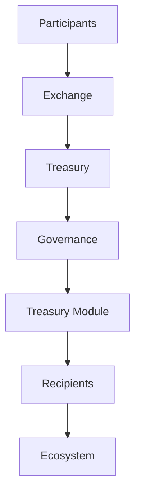

Illustrates the complete circulation of resources through the protocol.

```mermaid
graph TD

Participants
--> Exchange

Exchange
--> Treasury

Treasury
--> Governance

Governance
--> TreasuryModule[Treasury Module]

TreasuryModule
--> Recipients

Recipients
--> Ecosystem
```
The result is a self-contained cycle connecting economic participation to collective resource allocation.
