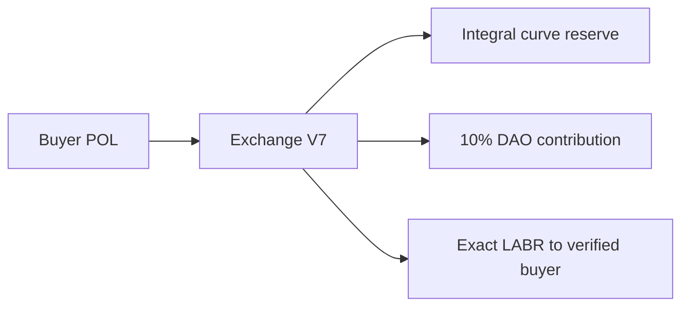
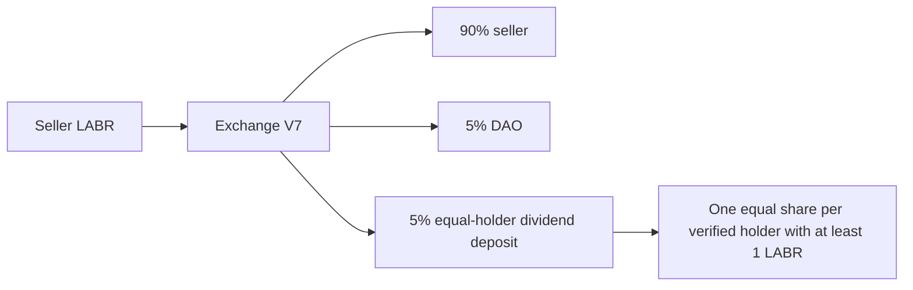

# Economic Flow

## Buy

```mermaid
flowchart LR
    BuyerPOL[Buyer POL] --> Exchange[Exchange V7]
    Exchange --> Reserve[Integral curve reserve]
    Exchange --> DAO[10% DAO contribution]
    Exchange --> BuyerLABR[Exact LABR to verified buyer]
```

## Sell

```mermaid
flowchart LR
    SellerLABR[Seller LABR] --> Exchange[Exchange V7]
    Exchange --> SellerPOL[90% seller]
    Exchange --> DAO[5% DAO]
    Exchange --> LABR[5% equal-holder dividend deposit]
    LABR --> Holders[One equal share per verified holder with at least 1 LABR]
```

The number of LABR held does not increase dividend weight. Identity verification, not wealth, determines whether a qualifying wallet may hold one dividend unit.
