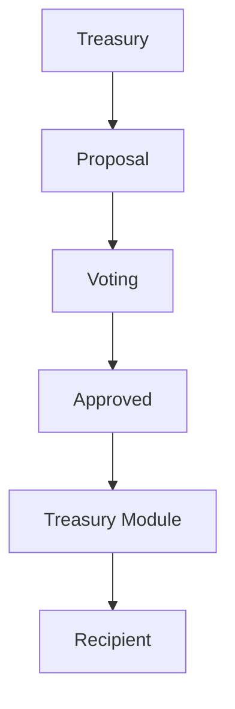

Illustrates the governance approval process required before treasury resources may be distributed.

```mermaid
graph TD

Treasury
--> Proposal[Proposal]

Proposal
--> Voting[Voting]

Voting
--> Approved[Approved]

Approved
--> TreasuryModule[Treasury Module]

TreasuryModule
--> Recipient[Recipient]
```
