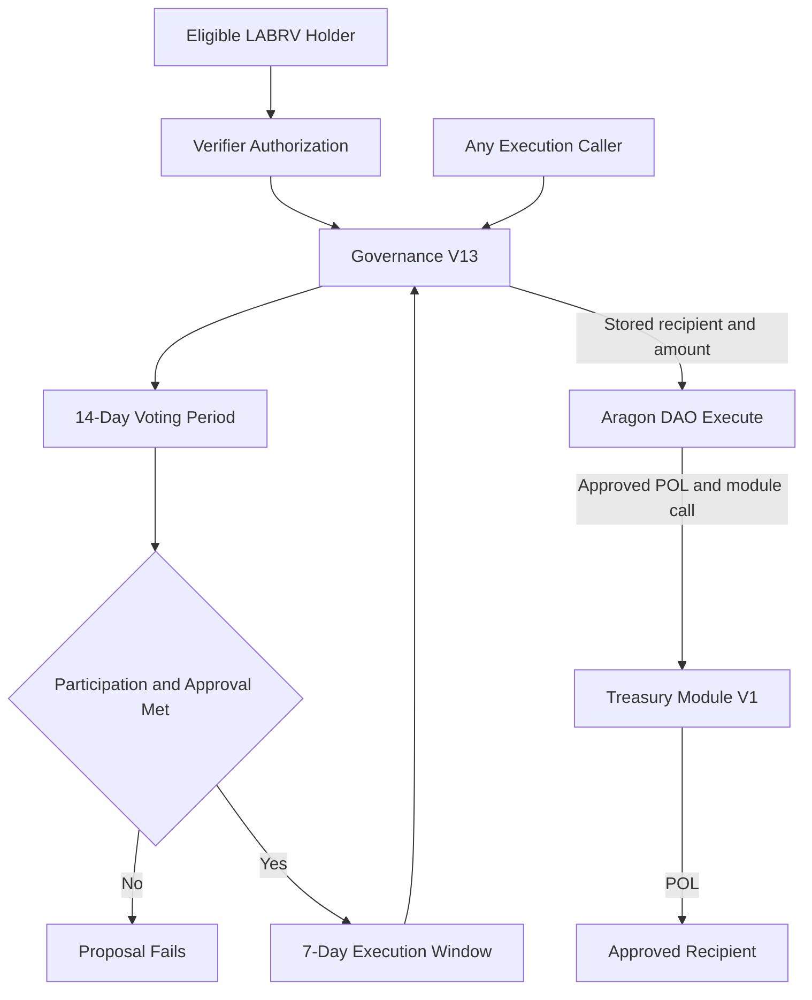
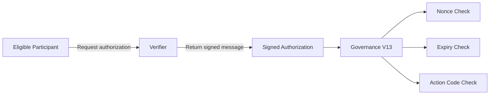
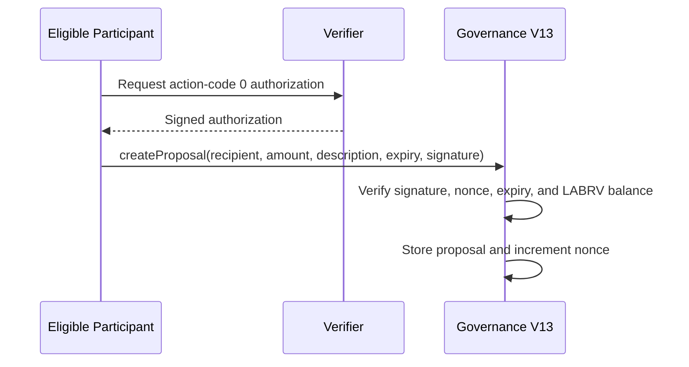
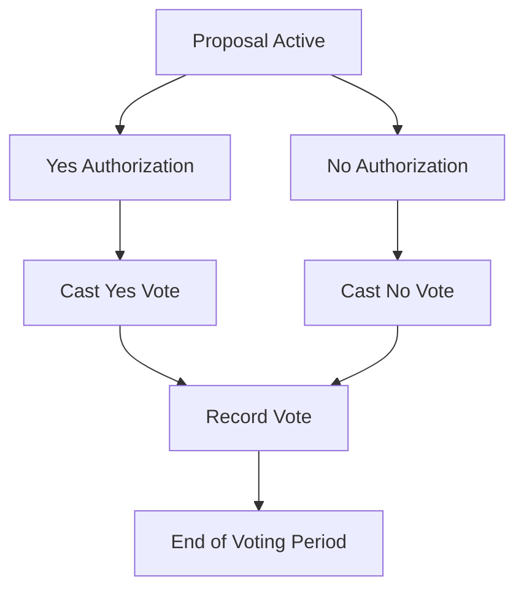
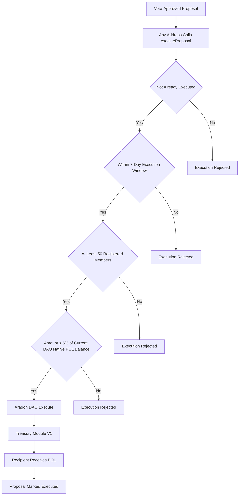
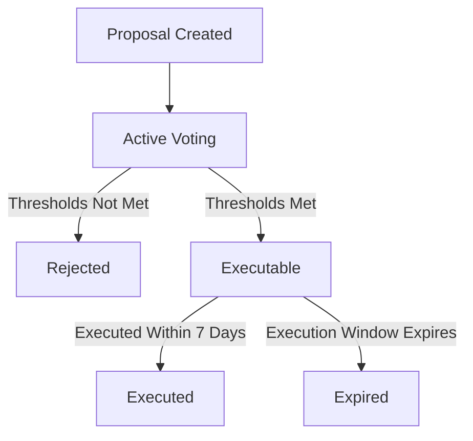

[governance-flow.md](https://github.com/user-attachments/files/29432548/governance-flow.md)
# LaborCoin Governance Flow

## Overview

LaborCoin treasury distributions follow a constrained governance process rather than discretionary administrative spending.

The governance flow separates:

* **Proposal and voting logic**, handled by Governance V13
* **Treasury custody**, held by the Aragon DAO
* **Final distribution execution**, performed by Treasury Module V1
* **Recipient selection**, determined by proposal approval under fixed on-chain rules

This file explains how a treasury proposal moves from eligibility and proposal creation to voting, execution, and final recipient payment.

**Network:** Polygon Mainnet  
**Chain ID:** 137

---

# High-Level Governance Model

The governance path is distinct from the economic path.

Governance V13 does not hold treasury assets. It records proposals, records votes, evaluates thresholds, and constructs the approved DAO execution request.

The Aragon DAO remains the treasury custodian.

Treasury Module V1 forwards approved native POL to the stored recipient.



This governance path authorizes treasury distributions only. It does not alter Exchange V4, Registration V4, LaborVote V7, or other protocol rules.

---

# Core Governance Components

## 1. Eligible LABRV Participants

Governance participation begins with registered participants who hold LABRV.

A participant becomes governance-eligible by:

1. Holding at least 1 LABR at registration time
2. Passing the Human Passport verification flow through the verifier
3. Submitting a successful Registration V4 transaction
4. Receiving one LABRV governance token

After registration, continued LABR ownership is not required for governance access. Governance V13 checks LABRV ownership directly.

Eligible participants may:

* Create treasury proposals with a valid verifier authorization
* Vote yes or no on proposals with a valid verifier authorization
* Submit approved proposals for execution during the execution window

---

## 2. Governance V13

Governance V13 is the proposal and voting contract.

**Address:**

[`0x8238105d31F6Bb26897d8Ab270a0A521FEF03E8c`](https://polygonscan.com/address/0x8238105d31F6Bb26897d8Ab270a0A521FEF03E8c)

Governance V13:

* Records proposals
* Stores recipient and amount
* Stores proposal description
* Records one vote per eligible participant
* Enforces verifier-signature requirements for proposal creation and voting
* Tracks nonces for governance authorizations
* Evaluates participation and approval thresholds
* Enforces the proposal duration
* Enforces the execution window
* Enforces the minimum-member requirement
* Enforces the treasury cap at execution
* Constructs the approved Aragon DAO action

Governance V13 does not:

* Hold treasury assets
* Hold exchange liquidity
* Hold proposal funds in escrow
* Allow arbitrary DAO call construction
* Modify protocol parameters
* Change contract dependencies
* Replace the verifier
* Override the stored recipient or amount after proposal creation

---

## 3. Aragon DAO

The Aragon DAO is the treasury custodian and execution boundary.

**Address:**

[`0x0C2e5679153593b82a84eAB5CA90895BB291Cec4`](https://polygonscan.com/address/0x0C2e5679153593b82a84eAB5CA90895BB291Cec4)

The DAO:

* Holds the treasury
* Owns LABR
* Executes permission-authorized actions
* Supplies approved native POL to Treasury Module V1

The DAO is not the same contract as Governance V13.

Governance V13 is an intended constrained executor that uses DAO permissions to request one specific treasury action.

---

## 4. Treasury Module V1

Treasury Module V1 is the final transfer mechanism in the approved path.

**Address:**

[`0x10F2798ef055950B897AF4B3A8ae90dE34f6C56C`](https://polygonscan.com/address/0x10F2798ef055950B897AF4B3A8ae90dE34f6C56C)

Treasury Module V1:

* Accepts execution only from the fixed Aragon DAO
* Receives approved POL as call value
* Forwards that exact POL to the stored recipient
* Rejects zero recipients
* Rejects zero-value transfers
* Tracks cumulative distributed support

Treasury Module V1 does not evaluate proposals or vote totals. Those functions belong to Governance V13.

---

# Governance Requirements

## Fixed Governance Parameters

| Parameter | Deployed Value |
|---|---:|
| Minimum Registered Members for Execution | 50 |
| Proposal Duration | 14 days |
| Minimum Participation | 25% |
| Minimum Approval | 67% |
| Maximum Treasury Transfer | 5% of current DAO native POL balance at execution |
| Execution Window | 7 days |

These values are fixed by the deployed Governance V13 logic.

## Proposal Eligibility

A participant may create a proposal only when all required conditions are met.

Requirements include:

* The caller holds LABRV
* A valid verifier authorization is supplied
* The authorization has not expired
* The authorization nonce matches the participant's current Governance V13 nonce
* The recipient is not the zero address
* The requested amount is greater than zero

## Voting Eligibility

A participant may vote only when:

* The participant holds LABRV
* The participant has not already voted on the proposal
* The proposal is still within the voting period
* A valid verifier authorization is supplied
* The authorization has not expired
* The authorization nonce matches the participant's current Governance V13 nonce

Each eligible participant contributes one vote.

Governance V13 checks LABRV balance directly. ERC20Votes delegation does not determine voting eligibility or voting weight.

---

# Governance Authorization Flow

Proposal creation and voting require verifier authorizations.

Each authorization binds:

* The participant address
* An action code
* The participant's current nonce
* An expiration timestamp
* The Governance V13 contract address

The action codes are:

| Action | Code |
|---|---:|
| Create proposal | 0 |
| Vote yes | 1 |
| Vote no | 2 |

The verifier authorization does not bind the proposal contents. The proposal recipient, amount, and description are validated through the on-chain function call itself.



The verifier cannot create proposals or cast votes by itself. A participant must submit the transaction and satisfy on-chain checks.

---

# Proposal Lifecycle

## Stage 1: Proposal Creation

A participant creates a treasury proposal by submitting:

* A recipient address
* A native POL amount
* A proposal description
* A valid proposal-creation authorization

On success, Governance V13 stores:

* Proposal identifier
* Creator address
* Recipient address
* Requested POL amount
* Proposal description
* Start timestamp
* End timestamp
* Vote totals
* Execution state



## Stage 2: Active Voting

A proposal becomes active immediately after creation and remains active for 14 days.

During this period:

* Eligible participants may vote yes or no
* Each vote requires its own verifier authorization
* A participant may vote only once per proposal
* Vote totals are recorded on-chain



## Stage 3: Outcome Evaluation

After the voting period, Governance V13 evaluates whether the proposal satisfies the required thresholds.

Participation is calculated from:

$$
\text{Participation} =
\left\lfloor
\frac{(\text{yesVotes} + \text{noVotes}) \times 100}
{\texttt{RegistrationV4.totalMembers()}}
\right\rfloor
$$

Approval is calculated from:

$$
\text{Approval} =
\left\lfloor
\frac{\text{yesVotes} \times 100}
{\text{yesVotes} + \text{noVotes}}
\right\rfloor
$$

Important details:

* Participation uses the current Registration V4 `totalMembers()` value when proposal status is evaluated.
* The registered-member count is not snapshotted at proposal creation.
* Approval is based only on participating votes.

A proposal is approved only if both conditions hold:

* Participation is at least 25%
* Approval is at least 67%

---

# Execution Flow

A proposal that meets the voting thresholds is not automatically paid out. It must still be executed during the execution window.

## Permissionless Execution

Any address may call `executeProposal` during the seven-day execution window.

The execution caller does not receive discretion over the proposal.

The caller cannot change:

* The stored recipient
* The stored amount
* The vote totals
* The proposal description
* The DAO action constructed by Governance V13

## Execution Checks

Before execution succeeds, Governance V13 revalidates:

* The proposal has not already executed
* The proposal was approved
* The execution window has not expired
* Registration V4 `totalMembers()` is at least 50
* The requested amount does not exceed 5% of the DAO's current native POL balance
* The DAO action completes successfully



## Treasury Distribution Path

A successful execution follows this exact path:

1. Governance V13 constructs the fixed DAO action.
2. The Aragon DAO sends the approved native POL to Treasury Module V1 as call value.
3. Treasury Module V1 forwards that POL to the stored recipient.
4. Treasury Module V1 updates `totalDistributed`.
5. Governance V13 marks the proposal executed.

This is the intended constrained treasury path.

---

# Proposal-State Diagram



A proposal has no on-chain Draft state. It becomes active immediately after `createProposal` succeeds.

---

# Governance and Treasury Separation

It is important to keep the LaborCoin governance layers distinct.

| Layer | Role |
|---|---|
| LABRV Holder | Creates proposals, votes, and may submit approved proposals for execution |
| Governance V13 | Records proposals and votes, evaluates thresholds, and constructs the approved DAO action |
| Aragon DAO | Holds treasury assets and executes permission-authorized actions |
| Treasury Module V1 | Forwards approved native POL to the stored recipient |
| Recipient | Receives the final approved distribution |

The treasury does not flow into Governance V13.

Governance V13 is not the treasury custodian.

Treasury Module V1 is not the proposal and voting engine.

---

# Governance Controls and Constraints

## Treasury Constraints

Governance V13 proposals are limited to native POL transfers.

A proposal cannot:

* Transfer LABR through the Governance V13 proposal format
* Transfer arbitrary ERC-20 assets
* Trigger arbitrary DAO actions
* Modify DAO permissions
* Modify Exchange V4 parameters
* Modify Registration V4 requirements
* Modify LABRV minting or ownership
* Change governance thresholds
* Change the bonding curve

## Participation Constraints

Governance execution is disabled unless the current registered-member count is at least 50.

This means a vote-approved proposal may still fail execution if the registered-member count is below the activation threshold when execution is attempted.

## Treasury-Cap Constraint

The 5% transfer cap is evaluated against the DAO's current native POL balance at execution time.

This means a vote-approved proposal may fail execution if:

* The DAO treasury balance falls before execution
* Another proposal executes first
* The approved amount now exceeds 5% of the remaining native POL balance

## Time Constraints

A proposal can be voted on only during the 14-day voting period.

A vote-approved proposal can be executed only during the following 7-day execution window.

If the execution window expires, the proposal becomes permanently expired.

---

# Governance Accountability

LaborCoin governance is publicly auditable because the following are recorded on-chain:

* Proposal creators
* Proposal descriptions
* Proposal recipients
* Proposal amounts
* Vote totals
* Proposal timestamps
* Execution status
* Treasury-transfer execution transactions
* Treasury Module V1 `totalDistributed`

This enables independent review of:

* Which proposals were created
* How the voting process unfolded
* Whether thresholds were met
* Whether execution succeeded
* Which recipient received funds
* How much native POL was distributed

---

# Governance Risks and Limitations

The governance flow does not guarantee:

* Proposal approval
* Proposal execution
* Treasury sufficiency
* Recipient performance
* Verifier availability
* Stable registered-member counts
* Stable DAO treasury balances

Important limitations include:

* The verifier must remain available to authorize protected governance actions.
* Vote-approved proposals may still fail execution if conditions change.
* Governance V13 is limited to native POL distributions.
* Immutable rules cannot be amended in place.
* Aragon permission configuration remains a dependency for final constrained execution.
* Any approved proposal must still be actively submitted for execution during the execution window.

---

# Independent Verification

A reviewer may independently verify the governance flow through the following process.

## 1. Verify Proposal Creation

Inspect a proposal-creation transaction and confirm:

* The caller held LABRV
* The recipient and amount were stored
* The verifier authorization was accepted
* The proposal start and end timestamps were recorded

## 2. Verify Voting

Inspect vote transactions and confirm:

* The caller held LABRV
* The caller voted only once
* The vote occurred during the voting period
* The appropriate vote total increased
* The nonce advanced after the authorization was used

## 3. Verify Thresholds

Compare:

* Total yes votes
* Total no votes
* Current `Registration V4.totalMembers()`
* Participation percentage
* Approval percentage

## 4. Verify Execution

Inspect the execution transaction and confirm:

* The proposal had not already executed
* The execution window had not expired
* The current registered-member count was at least 50
* The amount satisfied the 5% cap against the DAO's current native POL balance
* The DAO executed the approved action
* Treasury Module V1 forwarded native POL to the stored recipient
* Governance V13 marked the proposal executed

## 5. Verify Treasury Distribution

Compare:

* DAO balance movement
* Treasury Module V1 call value
* Recipient receipt of native POL
* Treasury Module V1 `totalDistributed`

---

# Summary

LaborCoin treasury governance follows a fixed sequence:

```text
Eligible LABRV holder
    → Governance V13 proposal creation
    → 14-day voting period
    → threshold evaluation
    → 7-day execution window
    → Aragon DAO execution
    → Treasury Module V1
    → approved recipient
```

The core principles are:

* Governance V13 records and evaluates proposals.
* The Aragon DAO holds treasury custody.
* Treasury Module V1 performs the final approved native POL transfer.
* Governance V13 is constrained to treasury-allocation proposals only.
* The treasury does not flow into Governance V13.
* Any address may submit a valid approved proposal for execution.
* Execution succeeds only if all fixed conditions still hold at execution time.

This governance structure enables democratic treasury allocation while preventing the governance contract itself from becoming a general protocol administrator or treasury custodian.

---

## Related Documentation

* [Architecture](architecture.md)
* [Decentralization](decentralization.md)
* [Economic Flow](economic-flow.md)
* [Governance](governance.md)
* [Security](security.md)
* [Technical Whitepaper](whitepaper.md)
