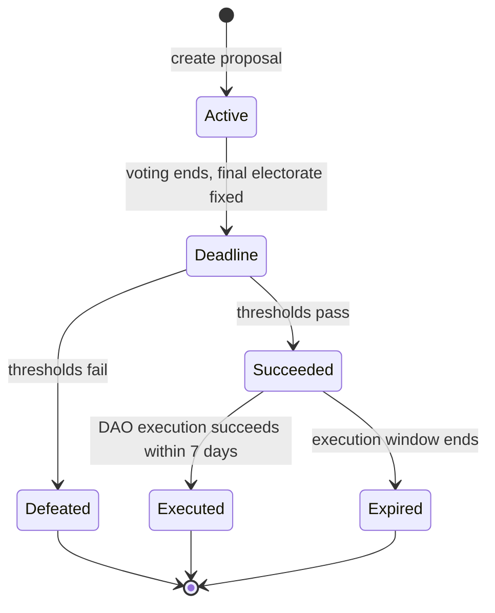

# Governance V15.1 Flow

## Eligibility

Governance eligibility requires:

- exactly one LABRV membership unit;
- a matching permanent Registration V6.1 record;
- registration strictly before the proposal voting deadline;
- a direct wallet for proposal creation and voting.

## Activation and thresholds

```text
Minimum registered users: 50
Proposal duration: 14 days
Execution window: 7 days
Participation: ceiling(25% of final deadline electorate)
Approval: ceiling(67% of votes cast)
Maximum transfer: 5% of DAO native-POL balance
```

Any member who registers while voting is active may vote before the deadline. The provisional electorate and participation target may grow during voting. At the deadline, Registration V6.1 reconstructs the final electorate from permanent member timestamps. Registrations at or after the deadline cannot vote or change the closed result. Participation and approval use ceiling division so small electorates cannot pass by downward truncation.

## Proposal lifecycle


```mermaid
stateDiagram-v2
    [*] --> Active: create proposal
    Active --> Deadline: voting ends, final electorate fixed
    Deadline --> Defeated: thresholds fail
    Deadline --> Succeeded: thresholds pass
    Succeeded --> Executed: DAO execution succeeds within 7 days
    Succeeded --> Expired: execution window ends
    Executed --> [*]
    Defeated --> [*]
    Expired --> [*]
```

Each proposal stores a fixed title, screened description and hash, recipient, amount, creator, creation-time member count, treasury snapshot, start and end times, votes, execution status, call ID, and execution timestamp. The final electorate is derived from Registration V6.1 at the proposal deadline.

## Proposal restrictions

Governance can execute one native-POL transfer through the existing Aragon DAO. It cannot:

- execute arbitrary calldata;
- transfer arbitrary tokens;
- upgrade contracts;
- alter tokenomics;
- change thresholds;
- pause Exchange;
- appoint an administrator;
- call the superseded Treasury Module.

## Aragon permission

Governance needs the DAO's `EXECUTE_PERMISSION_ID`. Deployment is not complete until the correct permission is granted to Governance V15.1, verified through `hasPermission`, rehearsed on a fork, and all obsolete LaborCoin execute permissions are revoked.

## Cumulative-spending limitation

The 5% cap applies per proposal at creation and execution. It is not a cumulative period cap. Multiple successful proposals can reduce treasury materially over time. This is a governance and participation risk that cannot be repaired after immutable launch.
