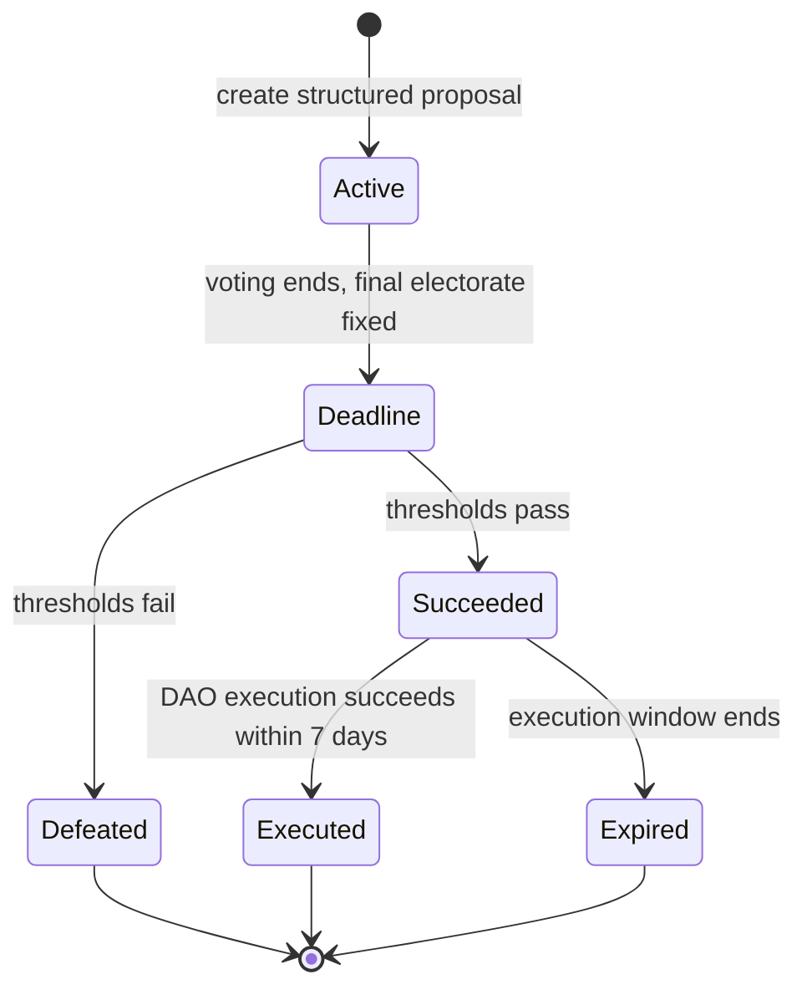

# Governance V15.2 Structured Treasury Flow

## Eligibility

Governance eligibility requires:

- exactly one LABRV membership unit;
- a matching permanent Registration V6.1 record;
- registration strictly before the proposal voting deadline;
- a direct wallet for proposal creation and voting.

## Activation and thresholds

```text
Minimum registered users: 50
Proposal duration: 14 days
Execution window: 7 days
Participation: ceiling(25% of final deadline electorate)
Approval: ceiling(67% of votes cast)
Maximum transfer: 5% of DAO native-POL balance
```

Any member who registers while voting is active may vote before the deadline. The provisional electorate and participation target may grow during voting. At the deadline, Registration V6.1 reconstructs the final electorate from permanent member timestamps. Registrations at or after the deadline cannot vote or change the closed result. Participation and approval use ceiling division so small electorates cannot pass by downward truncation.

## Structured Treasury Proposal Schema V1

There is no unrestricted proposal-description field. Every proposal is created from the fixed on-chain schema:

| Field | On-chain type/rule |
|---|---|
| Requesting Organization / Group | Required short text; maximum 96 ASCII bytes; Proposal Text Policy validated |
| Treasury Address | Executable `address payable recipient`; must contain deployed contract code |
| Worker Group or Campaign | Required short text; maximum 128 ASCII bytes; Proposal Text Policy validated |
| Requested Amount | Native POL amount; positive and subject to the 5% treasury cap |
| Purpose | Required closed `Purpose` enum |
| Verification Source | One required HTTPS/IPFS URI; maximum 256 ASCII bytes; dedicated URI validation |
| Contact Method | Required closed `ContactMethod` enum; public details remain at the verification source |
| Distribution Plan | Required closed `DistributionPlan` enum |
| Content Hash | Deterministic commitment to the complete immutable proposal content |

The purpose enum covers strike/work-stoppage support, organizing/unionization, worker mutual aid/emergency relief, legal defense/representation, direct action/demonstration, worker cooperative/workplace democracy, education/outreach/communications, and other worker-led collective action.

The distribution-plan enum covers direct worker payments, needs-based worker relief, shared strike/mutual-aid funds, organizing/campaign operations, legal/professional expenses, supplies/equipment/logistics, **Democratic Worker Enterprise Development**, mixed use, and other collective use. Selecting an `Other` category does not open a free-text field.

The verification URI is a reference, not a contract-level endorsement of external content. Governance can validate URI syntax but cannot prove that material at an HTTPS address is truthful, safe, permanent, or unchanged.

## Proposal lifecycle


```mermaid
stateDiagram-v2
    [*] --> Active: create structured proposal
    Active --> Deadline: voting ends, final electorate fixed
    Deadline --> Defeated: thresholds fail
    Deadline --> Succeeded: thresholds pass
    Succeeded --> Executed: DAO execution succeeds within 7 days
    Succeeded --> Expired: execution window ends
    Executed --> [*]
    Defeated --> [*]
    Expired --> [*]
```

Each proposal stores its structured content, `contentHash`, creator, creation-time member count, treasury snapshot, start/end times, votes, execution status, call ID, and execution timestamp. The final electorate is derived from Registration V6.1 at the proposal deadline. The execution `callId` commits to proposal ID, recipient, amount, and `contentHash`, binding the executable transfer identity to the proposal content voters approved.

## Recipient restriction

The recipient cannot be zero, the LaborCoin DAO itself, current or superseded protected LaborCoin protocol addresses, or an ordinary EOA. Governance requires `recipient.code.length > 0`. This prevents direct treasury transfers to personal wallets without hard-coding an Aragon-specific recipient interface. It does not prove that every contract recipient is worker-controlled; members must still verify control and legitimacy off-chain.

## Proposal restrictions

Governance can execute one native-POL transfer through the existing Aragon DAO. It cannot:

- execute arbitrary calldata;
- transfer arbitrary tokens;
- upgrade contracts;
- alter tokenomics;
- change thresholds;
- pause Exchange;
- appoint an administrator;
- call the superseded Treasury Module.

## Aragon permission

Governance needs the DAO's `EXECUTE_PERMISSION_ID`. Deployment is not complete until the correct permission is granted to Governance V15.2, verified through `hasPermission`, rehearsed on a fork, and all obsolete LaborCoin execute permissions are revoked. Aragon is the retained treasury/execution infrastructure, not part of the permanent proposal schema.

## Cumulative-spending limitation

The 5% cap applies per proposal at creation and execution. It is not a cumulative period cap. Multiple successful proposals can reduce treasury materially over time. This is a governance and participation risk that cannot be repaired after immutable launch.
