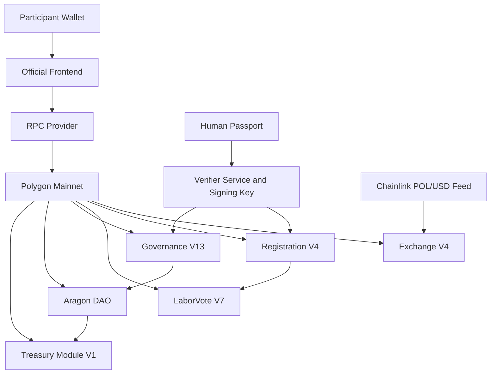
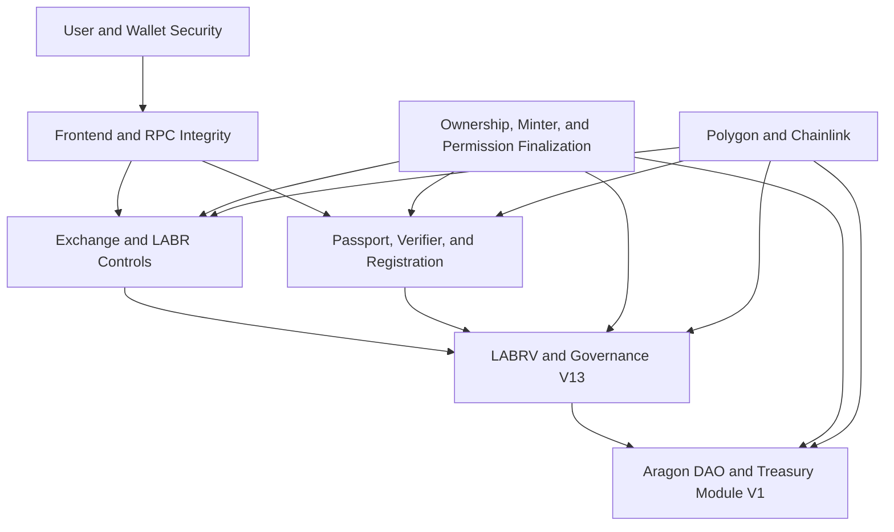

[security.md](https://github.com/user-attachments/files/29432753/security.md)
# LaborCoin Security Architecture

## Overview

LaborCoin was created around a practical security question:

**How can a blockchain-based public infrastructure project support working-class collective action without depending upon hidden control, discretionary founder authority, misleading claims, or unrestricted treasury access?**

The protocol's answer is not a claim of perfect safety.

It is a security model based on:

* Publicly verified contract code
* Explicit authority boundaries
* Narrow contract responsibilities
* Fixed or permanently locked custom-contract rules
* Transparent treasury custody
* Constrained governance authority
* Measurable economic controls
* Public transaction evidence
* Honest disclosure of external dependencies and residual risks

This document is the canonical technical security reference for the LaborCoin protocol.

It explains:

* What the protocol is intended to protect
* Which parties and systems remain trusted
* Which controls are enforced on-chain
* Which controls depend upon external services
* Which risks cannot be eliminated
* How researchers and participants can independently verify the security model

**Network:** Polygon Mainnet  
**Chain ID:** 137  
**Security contact:** [LaborCoinCreator@proton.me](mailto:LaborCoinCreator@proton.me)

For vulnerability-reporting instructions, see [`../.github/SECURITY.md`](../.github/SECURITY.md).

---

# 1. Security Philosophy

## 1.1 Security Is a System Property

No single smart contract, identity service, threshold, audit, or ownership-renouncement transaction can make a protocol secure.

LaborCoin therefore uses defense in depth.

The security model combines:

* Contract-level validation
* Economic limits
* Governance thresholds
* Treasury caps
* Time restrictions
* Signature controls
* Identity-friction mechanisms
* Authority separation
* Public source verification
* Public transaction records
* Operational monitoring

A control should be evaluated according to both:

1. The attack it reduces
2. The residual risk it leaves behind

This document does not describe mitigations as guarantees.

---

## 1.2 Anti-Fraud Design Principles

LaborCoin is intended to avoid several patterns commonly associated with abusive or deceptive blockchain projects.

### No Hidden Custom-Contract Administrator

Exchange V4, Registration V4, Governance V13, and Treasury Module V1 were deployed without owner administration.

LaborVote V7 used temporary ownership only to assign Registration V4 as minter, lock that minter permanently, and renounce ownership.

### No Unrestricted Governance Contract

Governance V13 does not expose arbitrary proposal execution.

Its proposal format is restricted to a stored native POL amount and recipient through the Aragon DAO and Treasury Module V1.

### No Creator-Controlled Treasury Custody

The Aragon DAO holds treasury assets.

The official website, verifier, Governance V13, and creator wallet do not custody participant wallets or DAO treasury funds.

### Public Economic Rules

Exchange V4 pricing, transaction limits, wallet limits, cooldown, oracle checks, treasury contribution, and supply-release rules are public and deterministic.

### Explicit Remaining Authority

LABR is DAO-owned rather than ownerless.

The verifier remains an externally operated signing dependency.

Aragon permissions remain a material security boundary.

These dependencies must be disclosed rather than hidden behind a universal claim of immutability.

### No Guaranteed Financial Outcome

The protocol does not guarantee:

* Price appreciation
* Exchange liquidity
* Treasury growth
* Dividend income
* Proposal approval
* Recipient performance
* Recovery of funds
* Adoption or social impact

Security includes accurate representation of what the system does and does not promise.

---

## 1.3 Immutability Is Not Equivalent to Safety

Immutable contracts remove certain administrative-abuse risks, but they also remove repair options.

For the final custom contracts:

* A defect cannot be patched in place.
* A fixed dependency cannot be replaced.
* A fixed threshold cannot be adjusted.
* Exchange V4 cannot be paused by an administrator.
* Exchange V4 liquidity cannot be withdrawn administratively.
* A compromised fixed verifier cannot be replaced inside existing contracts.
* Recovery from a critical defect may require migration to new contracts.

LaborCoin treats immutability as an authority-minimization decision, not as proof that the deployed code is defect-free.

---

# 2. Assurance Status

## 2.1 Source Verification

The final deployed contracts are intended to have publicly verified source code on Polygonscan.

Source verification allows reviewers to compare deployed bytecode with published source and compiler settings.

Source verification does not prove:

* Correctness
* Economic safety
* Absence of vulnerabilities
* Correct permission configuration
* Correct verifier policy
* Correct frontend behavior
* Successful independent audit

## 2.2 Audit Claims

This document does not claim that source verification, internal testing, public testing, or documentation review constitutes an independent security audit.

Unless a separate signed audit report is published, LaborCoin should not be described as independently audited.

## 2.3 Finalization Evidence

A complete launch-security record should include:

* Deployment transactions
* Constructor arguments
* Compiler and EVM settings
* Verified-source links
* Artifact hashes
* Ownership and minter finalization
* Aragon permission grants
* Aragon permission revocations
* Removal of obsolete executors
* Functional validation transactions
* Final repository and publication hashes

Security claims should be tied to evidence rather than project intention.

---

# 3. Protected Assets and Security Objectives

## 3.1 Protected Assets

The primary assets and security-sensitive states are:

| Asset or State | Security Objective |
|---|---|
| Participant wallet funds | Prevent unauthorized transaction construction or misleading interaction |
| Exchange V4 POL | Preserve liquidity from unauthorized withdrawal and incorrect settlement |
| Exchange V4 LABR | Preserve distribution inventory from unauthorized transfer |
| Aragon DAO treasury | Prevent unauthorized or unconstrained distribution |
| LABR ownership authority | Prevent undocumented exercise of owner-only token functions |
| LABRV issuance | Prevent unauthorized or duplicate governance credentials |
| Registration records | Prevent unauthorized, duplicate, or expired registration |
| Governance votes | Prevent duplicate, unauthorized, replayed, or stale voting |
| Proposal execution | Prevent invalid, repeated, excessive, or stale distributions |
| Verifier key | Prevent unauthorized registration and governance authorizations |
| Frontend integrity | Prevent address substitution, altered transaction calldata, or deceptive display |
| Deployment records | Preserve accurate provenance and public accountability |

---

## 3.2 Security Objectives

LaborCoin seeks to preserve:

### Asset Integrity

Assets move only according to valid contract rules and authorized wallet transactions.

### Governance Integrity

Governance participation remains tied to LABRV ownership and protected action authorization.

### Treasury Integrity

Treasury transfers remain constrained by proposal approval, execution timing, transfer caps, DAO permissions, and the fixed Treasury Module V1 path.

### Economic Predictability

Exchange V4 executes according to publicly inspectable pricing and limit rules.

### Authority Transparency

Every meaningful authority relationship is documented and independently verifiable.

### Availability

Participants should be able to interact with the protocol when Polygon, Chainlink, wallet infrastructure, RPC infrastructure, and the verifier are available.

Availability is an objective, not a guarantee.

---

# 4. Trust Boundaries

The protocol crosses several trust boundaries.

## 4.1 On-Chain Enforcement Boundary

Polygon executes:

* Exchange rules
* Registration rules
* LABRV minting and transfer restrictions
* Governance rules
* DAO permissions
* Treasury Module V1 execution

## 4.2 External Eligibility Boundary

Human Passport and the verifier determine whether an authorization is issued.

The contracts verify signatures but do not independently reproduce Passport scoring.

## 4.3 Oracle Boundary

Chainlink supplies the POL/USD value used by Exchange V4.

## 4.4 Interface Boundary

The official frontend:

* Displays state
* Requests verifier authorizations
* Constructs transactions
* Submits user-approved transactions

The frontend is not the final enforcement layer.

A compromised interface may still mislead a user or construct harmful transactions that remain valid under a broader contract interface.

## 4.5 DAO Permission Boundary

The Aragon DAO permission registry determines which addresses or plugins may cause the DAO to execute actions.

This is a separate security boundary from Governance V13's internal constraints.

---

# 5. Final Component Registry

| Component | Address | Security-Relevant Authority State |
|---|---|---|
| LABR Token | [`0x460DD873A1D2a41e77410B125cD3027C5FEd2f78`](https://polygonscan.com/address/0x460DD873A1D2a41e77410B125cD3027C5FEd2f78) | Owned by Aragon DAO; owner-only functions remain |
| LaborVote V7 | [`0x833242E933c675846D8f8982048FecA95B8e435A`](https://polygonscan.com/address/0x833242E933c675846D8f8982048FecA95B8e435A) | Ownership renounced; Registration V4 permanently locked as minter |
| Registration V4 | [`0xd1CD6C0B6f1F709A52908B40C07D3C54649e323C`](https://polygonscan.com/address/0xd1CD6C0B6f1F709A52908B40C07D3C54649e323C) | No owner; fixed dependencies |
| Governance V13 | [`0x8238105d31F6Bb26897d8Ab270a0A521FEF03E8c`](https://polygonscan.com/address/0x8238105d31F6Bb26897d8Ab270a0A521FEF03E8c) | No owner; fixed dependencies and governance constants |
| Treasury Module V1 | [`0x10F2798ef055950B897AF4B3A8ae90dE34f6C56C`](https://polygonscan.com/address/0x10F2798ef055950B897AF4B3A8ae90dE34f6C56C) | No owner; fixed DAO-only caller |
| Exchange V4 | [`0x4Cf18cB39203B678f5C26f2338a10a79f9684749`](https://polygonscan.com/address/0x4Cf18cB39203B678f5C26f2338a10a79f9684749) | No owner, pause, administrative withdrawal, or upgrade interface |
| Aragon DAO | [`0x0C2e5679153593b82a84eAB5CA90895BB291Cec4`](https://polygonscan.com/address/0x0C2e5679153593b82a84eAB5CA90895BB291Cec4) | Permission-controlled treasury and LABR owner |
| Verifier | `0x475d519631d2406753aCA29F305f19b83E97513e` | Externally controlled fixed signing address |
| Chainlink POL/USD Feed | [`0xAB594600376Ec9fD91F8e885dADF0CE036862dE0`](https://polygonscan.com/address/0xAB594600376Ec9fD91F8e885dADF0CE036862dE0) | Fixed external oracle dependency |

---

# 6. Layered Security Model

No layer independently provides complete protection.

A failure in one layer may be constrained by another, but some failures can still cause material harm.

---

# 7. Exchange V4 Security

## 7.1 Reentrancy Protection

Critical buy and sell operations use reentrancy protection.

This reduces recursive-call attacks that attempt to re-enter a protected function before execution completes.

Reentrancy protection does not validate economic assumptions or prevent every external-call failure.

## 7.2 Deterministic Pricing

Exchange V4 uses a public quadratic USD-denominated curve:

$$
P_{\text{USD}}(x)=1+14x^2
$$

where:

$$
x=\frac{\texttt{totalSold}}{1{,}000{,}000{,}000\ \text{LABR}}
$$

Given the same on-chain state and valid oracle value, the contract returns the same spot price.

The contract applies one current spot price to a transaction. It does not integrate marginal prices across the transaction amount.

## 7.3 Oracle Validation

Exchange V4 validates the fixed Chainlink POL/USD feed through:

* Positive-price validation
* A 30-minute freshness limit
* A maximum calculated price of 100 POL per LABR

These checks reduce exposure to stale or anomalous values.

They do not eliminate:

* Oracle-network failure
* Incorrect but apparently valid oracle data
* Polygon-wide disruption
* Extreme POL market movement
* Dependency failure at the fixed feed address

## 7.4 Transaction and Wallet Limits

Exchange V4 applies:

| Control | Value |
|---|---:|
| Maximum Exchange Transaction | 5,000 LABR |
| Maximum Exchange Wallet Balance | 10,000 LABR |
| Address Cooldown | 12 hours |

These limits reduce transaction-scale exposure and rapid repeated activity.

They do not prevent coordinated use of multiple addresses.

## 7.5 Minimum-Output Protection

Purchases accept `minTokensOut`.

Sales accept `minPOL`.

These values protect users from receiving less than an acceptable minimum.

The contracts enforce the submitted minimum. The frontend currently constructs a tolerance, but users remain responsible for reviewing transactions and accepting the displayed minimum.

## 7.6 Actual-Receipt Accounting

Exchange V4 measures the actual LABR balance change during transfers.

This is especially important on sales because LABR transfer taxes may reduce the amount received by the exchange.

The POL payout and `totalSold` reduction use the actual amount received rather than the submitted gross amount.

## 7.7 Supply Controls

Exchange V4 enforces:

* A one-billion-LABR curve maximum
* A 100-million-LABR initial unlocked supply
* Automatic 50-million-LABR tranche increases
* Current unlocked-supply boundaries
* Available LABR inventory

These controls limit distribution according to public state.

## 7.8 Treasury Routing

Ten percent of incoming purchase POL is routed directly to the Aragon DAO.

The remaining 90% stays in Exchange V4 as liquidity available for eligible sale payouts.

The DAO treasury and Exchange V4 liquidity remain separately custodied.

## 7.9 Removed Administrative Capabilities

Exchange V4 has no:

* Owner
* Pause function
* Administrative withdrawal function
* Upgrade function
* Parameter setter

This prevents an administrator from changing exchange rules or extracting exchange liquidity.

It also means a critical exchange defect cannot be paused or repaired in place.

## 7.10 Exchange Residual Risks

* Exchange V4 may lack sufficient POL for a requested sale.
* A transaction may fail because state changes before confirmation.
* Front-running or transaction ordering may alter expected output.
* Oracle data may be wrong while still passing contract checks.
* A fixed dependency may fail permanently.
* Assets sent directly to an incompatible function may be unrecoverable.
* The absence of a pause function limits emergency response.
* Exchange limits do not prevent coordinated multi-wallet activity.

---

# 8. LABR Token Security

## 8.1 DAO Ownership

LABR ownership is held by the Aragon DAO.

LABR should not be described as ownerless or fully immutable.

The token retains owner-only management functions involving areas such as:

* Pause and unpause
* Blacklist management
* Token recovery
* Tax and fee-recipient settings
* Fee and limit exclusions
* Automated-market-maker settings
* Wallet and transaction limits
* Trading and cooldown configuration

The exact callable surface must be verified from the deployed source.

## 8.2 Governance V13 Limitation

Governance V13's proposal format does not provide arbitrary calls into LABR owner functions.

However, any other address or plugin holding sufficiently broad Aragon DAO execution authority could potentially cause the DAO to call those functions.

The final Aragon permission registry is therefore a critical LABR security control.

## 8.3 Transfer-Tax Accounting

Under the current configuration, LABR sell-side transfers allocate:

| Destination | Current Rate |
|---|---:|
| Aragon DAO treasury | 5% |
| Eligible LABR-holder dividends | 5% |
| Burn | 0% |
| Total | 10% |

These values are current configuration, not necessarily immutable token constants.

## 8.4 LABR Residual Risks

* DAO permissions may expose owner-only token functions.
* Token configuration may be changed if a valid DAO executor can exercise ownership.
* Blacklist or pause functionality may affect user transfers.
* Dividend and tax mechanics increase integration complexity.
* Transfer behavior may differ from ordinary ERC-20 assumptions.
* A token-level defect cannot be corrected by Exchange V4.

---

# 9. Registration V4 Security

## 9.1 On-Chain Registration Conditions

Registration V4 requires:

* The caller is not already registered
* The caller holds at least 1 LABR at registration time
* The submitted authorization has not expired
* The recovered signer equals the fixed verifier
* The LABRV mint succeeds where required

The 1 LABR requirement applies at registration time only.

Registration is permanent and is not revoked when the participant later holds less than 1 LABR.

## 9.2 Duplicate Registration Prevention

Registration V4 stores permanent registration state for each wallet.

A registered wallet cannot register again.

LaborVote V7 also prevents ordinary accumulation of multiple governance credentials through its minting rules.

These controls enforce one LABRV per successfully registered wallet.

They do not independently prove one human per wallet.

## 9.3 Registration Signature Scope

Registration authorizations are bound to:

* The registering wallet address
* An expiration timestamp

Registration V4 does not use a participant nonce for registration.

Replay against the same Registration V4 contract is constrained by:

* Address binding
* Expiration
* Permanent registered state

A registration authorization is not a general-purpose identity proof and should not be reused for another contract or purpose.

## 9.4 External Passport Policy

The published minimum Passport score is 15.

That score is enforced by the verifier workflow rather than by a numeric score stored inside Registration V4.

Registration V4 proves that the fixed verifier signed an authorization. It does not prove how the verifier reached its decision.

## 9.5 Attestation Boundary

The official frontend presents and signs the LaborCoin attestation as part of onboarding.

Registration V4 does not store an attestation text hash or acceptance flag.

The attestation is an interface and participation-process control, not an independent on-chain registration condition.

## 9.6 Registration Residual Risks

* A verifier compromise may authorize wallets contrary to policy.
* Verifier unavailability may prevent new registration.
* Human Passport signals are probabilistic and may be manipulated.
* A person may control multiple wallets that independently satisfy external checks.
* A compromised registered wallet cannot be administratively deregistered.
* The fixed verifier cannot be rotated inside Registration V4.
* Recovery from verifier-key compromise requires migration or external operational containment.

---

# 10. LaborVote V7 Security

## 10.1 Permanent Minter

Registration V4 is the permanent LABRV minter.

The minter assignment was locked, and ownership was renounced.

The required final state is:

| State | Required Value |
|---|---|
| `minter` | Registration V4 |
| `minterLocked` | `true` |
| `owner` | Zero address |

## 10.2 Non-Transferability

LABRV is non-transferable between ordinary addresses.

This prevents:

* Market purchase of voting credentials
* Delegated custody through ordinary transfers
* Accumulation of governance weight by buying LABRV
* Transfer-based vote renting through the token itself

Non-transferability does not prevent:

* Sale or compromise of the wallet controlling LABRV
* Coordinated voting blocs
* Coercion
* Off-chain arrangements
* Multiple externally verified wallets controlled by one person

## 10.3 Governance V13 Balance Model

Governance V13 checks LABRV balance directly.

ERC20Votes delegation and checkpoints do not determine Governance V13 voting eligibility or weight.

No self-delegation transaction is required for LaborCoin governance.

## 10.4 LaborVote Residual Risks

* Compromised registered wallets retain their governance credential.
* The permanent minter cannot be replaced if Registration V4 fails.
* A defect in LABRV cannot be patched.
* Non-transferability reduces markets for voting power but does not eliminate social or wallet-level vote control.

---

# 11. Governance V13 Security

## 11.1 Fixed Governance Parameters

| Control | Value |
|---|---:|
| Minimum Registered Members for Execution | 50 |
| Voting Period | 14 days |
| Minimum Participation | 25% |
| Minimum Approval | 67% |
| Maximum Treasury Transfer | 5% of current DAO native POL balance |
| Execution Window | 7 days |

Governance V13 has no administrative setter for these parameters.

## 11.2 Governance Eligibility

A participant must hold LABRV to create a proposal or vote.

Each eligible wallet may cast one vote per proposal.

Governance weight is based on LABRV ownership rather than LABR holdings or delegated ERC20Votes checkpoints.

## 11.3 Governance Authorization

Proposal creation and voting require verifier authorizations.

Governance authorizations bind:

* Participant address
* Action code
* Participant nonce
* Expiration timestamp
* Governance V13 contract address

Action codes distinguish:

| Action | Code |
|---|---:|
| Create proposal | 0 |
| Vote yes | 1 |
| Vote no | 2 |

After successful use, the participant nonce advances.

This prevents reuse of the same authorization after it has been consumed.

## 11.4 Governance Authorization Scope Limitation

The authorization proves permission for an action category.

The proposal recipient, amount, description, or proposal identifier are supplied in the transaction call and are not all necessarily cryptographically bound into the verifier authorization.

Participants must therefore review the complete wallet transaction, not only the prior verifier result.

A malicious or compromised interface may attempt to redirect a still-valid action authorization into different valid calldata before the nonce is consumed.

The on-chain proposal and voting rules still apply, but transaction review remains important.

## 11.5 Duplicate-Vote Prevention

Governance V13 records whether a wallet has voted on a proposal.

A wallet cannot vote twice on the same proposal.

A wallet may vote on multiple different proposals, using a fresh nonce authorization for each protected action.

## 11.6 Participation and Approval

Participation is based on:

$$
\text{yesVotes}+\text{noVotes}
$$

relative to the current `Registration V4.totalMembers()` value when status is evaluated.

The member denominator is not snapshotted at proposal creation.

Approval is based on yes votes divided by participating votes.

This creates a transparent rule but introduces changing-denominator risk.

## 11.7 Constrained Execution

Governance V13 does not accept arbitrary DAO actions.

For an approved proposal, it constructs the fixed action that:

1. Uses the stored proposal amount
2. Uses the stored proposal recipient
3. Sends native POL through the Aragon DAO
4. Calls Treasury Module V1
5. Causes Treasury Module V1 to forward POL to the recipient

The execution caller cannot substitute a different recipient, amount, or arbitrary target.

## 11.8 Permissionless Submission

Any address may call `executeProposal` during the execution window.

Permissionless submission improves liveness by avoiding dependence upon the proposal creator or a designated operator.

The caller receives no authority over the approved value.

## 11.9 Execution-Time Checks

Execution requires:

* Voting period ended
* Participation threshold met
* Approval threshold met
* Proposal not already executed
* Execution window still open
* At least 50 current registered members
* Amount no greater than 5% of current DAO native POL balance
* Successful DAO and module execution

## 11.10 Governance Residual Risks

* A coordinated bloc may pass proposals if it satisfies fixed thresholds.
* Broader participants may fail to vote.
* A changing member denominator may affect proposal status.
* Multiple approved proposals may compete for the same treasury balance.
* Passed proposals do not reserve funds.
* A proposal may pass voting but fail execution.
* Verifier compromise may authorize protected actions contrary to policy.
* Governance cannot recover funds from a recipient after successful execution.
* Governance cannot amend defects or improve fixed parameters.
* Governance V13 security depends on the DAO granting only intended execution authority.

---

# 12. Aragon DAO and Treasury Security

## 12.1 Treasury Custody

The Aragon DAO holds treasury assets.

Governance V13 does not hold proposal funds.

Treasury Module V1 is not the primary treasury custodian.

## 12.2 Permission Registry

The Aragon permission registry determines who may cause the DAO to execute actions.

Final security requires confirmation that:

* Governance V13 has the intended execution permission
* Obsolete governance contracts are revoked
* Obsolete treasury modules are revoked
* Obsolete plugins and executors are revoked
* Creator-controlled wallets retain no undocumented execution authority
* Any remaining executor is documented and justified

## 12.3 LABR Ownership

The DAO also owns LABR.

An address capable of causing arbitrary DAO execution may potentially exercise LABR owner-only functions.

DAO permission review must therefore cover both:

* Treasury custody
* LABR administrative authority

## 12.4 Native POL Cap

Governance V13 limits each proposal to 5% of the DAO's current native POL balance at execution.

The cap applies to native POL.

It does not automatically cap:

* LABR
* Other ERC-20 tokens
* NFTs
* Assets moved through another DAO executor
* Actions outside Governance V13

## 12.5 Repeated-Proposal Risk

The 5% cap limits a single Governance V13 proposal.

It does not impose:

* A daily spending cap
* A monthly spending cap
* A cumulative lifetime cap
* A limit on the number of separately approved proposals

Repeated approved proposals may allocate substantial treasury resources over time.

This is a governance risk rather than a contract bypass.

## 12.6 DAO Residual Risks

* A broad or obsolete executor permission may bypass Governance V13.
* Permission misconfiguration may block legitimate execution.
* DAO-held non-POL assets are outside the Governance V13 transfer format.
* DAO plugins introduce their own implementation and configuration risks.
* Compromise of an authorized executor may affect treasury or LABR ownership.
* Final security claims depend on current on-chain permissions, not documentation alone.

---

# 13. Treasury Module V1 Security

## 13.1 Fixed Caller

Treasury Module V1 accepts its distribution call only from the fixed Aragon DAO.

Governance V13 cannot call the module directly.

## 13.2 Narrow Functionality

The module:

* Accepts approved native POL as call value
* Validates the caller
* Rejects a zero recipient
* Rejects zero value
* Forwards the call value
* Tracks cumulative distributed POL

The module does not:

* Evaluate proposals
* Record votes
* Choose recipients
* Choose amounts
* Withdraw DAO assets
* Change its DAO address
* Upgrade itself

## 13.3 Direct-Transfer Risk

Native POL or tokens sent directly to Treasury Module V1 outside its intended execution path may not be recoverable.

The module has no administrative recovery function.

## 13.4 Module Residual Risks

* A recipient contract may reject native POL and cause execution failure.
* Directly transferred assets may become stranded.
* A defect cannot be patched.
* Security depends upon the fixed DAO address and the DAO permission registry.

---

# 14. Verifier and Human Passport Security

## 14.1 Verifier Role

The verifier:

* Evaluates Human Passport results
* Applies the published score policy
* Issues registration authorizations
* Issues governance action authorizations

The verifier does not directly:

* Register a wallet
* Mint LABRV
* Create an on-chain proposal
* Cast an on-chain vote
* Execute a treasury transfer
* Withdraw Exchange V4 liquidity

A participant transaction must still satisfy contract checks.

## 14.2 Fixed Signing Address

Registration V4 and Governance V13 trust one fixed verifier address.

This removes an on-chain key-rotation administrator.

It also creates a permanent dependency on the security and availability of that key.

## 14.3 Key Compromise

A compromised verifier key may:

* Authorize registration contrary to policy
* Authorize proposal creation
* Authorize yes or no voting actions
* Undermine the intended Human Passport gate

A compromised verifier key cannot by itself:

* Move participant wallet funds
* Directly mint LABRV
* Directly create or vote without a submitted transaction
* Bypass Governance V13 thresholds
* Bypass the 5% cap
* Directly transfer DAO POL
* Change contract code

## 14.4 Availability Failure

If the verifier becomes unavailable:

* Existing registered participants keep LABRV
* Existing registration state remains valid
* New registrations may stop
* New proposal and voting authorizations may stop
* Permissionless execution of already approved proposals may remain possible if no new authorization is required

## 14.5 Passport Limitations

Human Passport provides Sybil-resistance signals.

It is not:

* Proof of legal identity
* Proof of employment
* Proof of one human for all time
* Proof that a wallet is uncompromised
* Proof that a participant will act honestly

## 14.6 Operational Requirements

Verifier security should include:

* Private-key isolation
* Minimal key exposure
* Restricted deployment access
* Secret rotation for non-fixed service credentials
* Request validation
* Rate limiting
* Logging without unnecessary personal data
* Dependency pinning
* Backup and recovery procedures
* Monitoring for unusual authorization volume
* Clear incident documentation

The fixed on-chain verifier address itself cannot be rotated without migration.

---

# 15. Frontend and Wallet Security

## 15.1 Frontend Is Not the Trust Root

The official website is a convenience interface.

The deployed contracts remain the final enforcement layer.

Users may interact with verified contracts through other compatible tools.

## 15.2 Frontend Threats

A compromised frontend may:

* Substitute contract addresses
* Change displayed recipient addresses
* Change transaction amounts
* Request unexpected approvals
* Hide relevant transaction details
* Misrepresent balances or proposal state
* Redirect users to malicious wallet prompts
* Serve altered JavaScript dependencies

## 15.3 Wallet Confirmation

Participants should verify:

* Polygon Mainnet is selected
* The destination contract is correct
* Approval amounts are expected
* Proposal recipients are correct
* Treasury amounts are correct
* The function requested matches the intended action
* No seed phrase or private key is requested

LaborCoin does not require users to disclose seed phrases or private keys.

## 15.4 Dependency and CDN Risk

Client-side libraries loaded from third-party CDNs introduce supply-chain and availability risk.

Exact dependency-version pinning reduces unexpected upstream changes but does not eliminate CDN compromise or availability failure.

For an immutable launch posture, tested frontend dependencies should be version-pinned and, where practical, preserved locally with recorded hashes.

## 15.5 Service Worker and Cache Risk

A progressive web app service worker may continue serving cached code after a deployment.

Cache-version changes and network-first or appropriate update behavior are important when publishing security corrections.

Users may need to refresh, clear site data, or reinstall the PWA when a frontend security release is announced.

## 15.6 Frontend Residual Risks

* DNS or hosting compromise
* Compromised third-party scripts
* Stale service-worker cache
* RPC misinformation or outage
* Wallet-extension compromise
* Malicious browser extensions
* User approval of unexpected calldata
* Phishing domains and impersonation

---

# 16. Network and Oracle Security

## 16.1 Polygon Dependency

LaborCoin depends upon Polygon Mainnet for:

* Consensus
* Transaction ordering
* Execution
* Finality
* Data availability
* Gas pricing

A Polygon disruption may delay or prevent protocol operation.

## 16.2 Chainlink Dependency

Exchange V4 depends upon the fixed Chainlink POL/USD feed.

The exchange cannot switch to another feed through an administrative setter.

## 16.3 Transaction Ordering

Public mempools may expose transactions before confirmation.

Possible effects include:

* State changes before execution
* Changed exchange outputs
* Competing proposal execution
* Approval front-running in other token contexts
* Increased gas costs

Minimum-output protections reduce some exchange-ordering risks.

They do not prevent all forms of MEV or state contention.

---

# 17. Security Controls Matrix

| Threat | Primary Control | Enforcement Layer | Residual Risk |
|---|---|---|---|
| Duplicate wallet registration | Permanent `registered` state | Registration V4 | Does not prove one human per wallet |
| Duplicate LABRV mint | Registration checks and LaborVote mint guard | Registration V4 and LaborVote V7 | Compromised or separately verified wallets remain possible |
| Multi-wallet Sybil participation | Human Passport policy, verifier authorization, one LABRV per registered wallet | External verifier and on-chain registration | Sybil resistance is probabilistic |
| Unauthorized registration | Fixed-verifier signature, wallet binding, expiry, 1 LABR requirement | Registration V4 | Verifier compromise or policy failure |
| Registration replay | Wallet binding, expiry, permanent registered state | Registration V4 | No registration nonce; authorization format should not be reused elsewhere |
| Governance authorization replay | Participant nonce, action code, expiry, Governance V13 binding | Governance V13 | Valid unconsumed authorization may still be misused through malicious calldata |
| Governance signature reuse across actions | Action code and nonce | Governance V13 | Signature does not replace full transaction review |
| Verifier compromise | Limited signing role plus on-chain eligibility and threshold checks | Verifier and contracts | Compromise can undermine registration and action gating |
| Verifier outage | Existing state remains on-chain | Protocol architecture | New registration, proposal creation, and voting may stop |
| Governance-token purchase | Non-transferable LABRV | LaborVote V7 | Wallet sale, compromise, coercion, and coordination remain possible |
| Unauthorized LABRV minter change | Permanently locked minter and renounced ownership | LaborVote V7 | Fixed minter cannot be replaced if it fails |
| Duplicate voting | Per-proposal voter tracking | Governance V13 | Multiple qualifying wallets may still vote |
| Low participation | 25% participation threshold and 14-day voting period | Governance V13 | Community disengagement remains possible |
| Minority control | 67% approval requirement | Governance V13 | Coordinated supermajority can still control outcomes |
| Premature treasury activation | Minimum 50 registered members at execution | Governance V13 | Identity quality still depends on verifier policy |
| Single-proposal treasury drain | 5% native POL cap at execution | Governance V13 | Repeated proposals can allocate more over time |
| Stale proposal execution | 7-day execution window | Governance V13 | Valid proposals require active execution submission |
| Double execution | Executed-state tracking | Governance V13 | Depends on correct DAO call behavior and transaction atomicity |
| Arbitrary DAO action through Governance V13 | Fixed constructed DAO action | Governance V13 | Other DAO executors may remain a separate risk |
| Unauthorized Treasury Module call | Fixed `onlyDAO` caller | Treasury Module V1 | DAO permission compromise may still authorize execution |
| Invalid treasury recipient or zero transfer | Zero-address and zero-value checks | Treasury Module V1 | Recipient contract may reject payment |
| Exchange reentrancy | Reentrancy guard | Exchange V4 | Does not eliminate economic or dependency failures |
| Rapid repeated exchange activity | 12-hour address cooldown | Exchange V4 | Multi-address coordination remains possible |
| Oversized exchange transaction | 5,000 LABR transaction limit | Exchange V4 | Multiple transactions over time remain possible |
| Exchange concentration | 10,000 LABR exchange wallet limit | Exchange V4 | Off-exchange transfers and multiple wallets remain possible |
| Slippage or state movement | `minTokensOut` and `minPOL` | Exchange V4 and user | User may accept weak minimums |
| Fee-on-transfer accounting error | Actual-receipt balance measurement | Exchange V4 | Unexpected token behavior remains possible |
| Stale oracle data | 30-minute freshness validation | Exchange V4 | Incorrect recent data may still pass |
| Invalid oracle value | Positive-value validation | Exchange V4 | Oracle-network or feed-level risk remains |
| Extreme POL conversion anomaly | 100 POL per LABR ceiling | Exchange V4 | May halt exchange during legitimate extreme markets |
| Creator withdrawal of exchange liquidity | No owner or administrative withdrawal function | Exchange V4 | Defects cannot be paused or rescued |
| Creator alteration of custom contracts | Ownerless deployment or locked minter | Final custom contracts | LABR and DAO permissions remain separate authority surfaces |
| LABR administrative abuse | DAO ownership and permission review | Aragon DAO | Broad executor permissions may exercise token owner functions |
| Obsolete governance path | Permission revocation and provenance report | Aragon DAO | Security claim is incomplete until verified on-chain |
| Frontend address substitution | Published addresses, source review, wallet confirmation | Interface and user | Compromised interface may still deceive users |
| Third-party dependency compromise | Version pinning, local preservation, artifact hashes | Frontend operations | CDN and dependency ecosystem risk remains |
| Smart-contract defect | Narrow responsibilities, public source, testing, review | Development and deployment | Immutable defects may require migration |
| Misleading security claims | Explicit assurance and residual-risk disclosure | Documentation | Readers must still independently verify |

---

# 18. Defense-in-Depth Examples

## 18.1 Governance Legitimacy

Governance legitimacy depends simultaneously upon:

* Human Passport signals
* Verifier policy
* Registration V4 validation
* Permanent LABRV issuance rules
* Non-transferable LABRV
* One vote per eligible wallet
* 25% participation
* 67% approval
* 50-member execution activation
* Public proposal and vote records

No individual control proves democratic legitimacy.

## 18.2 Treasury Protection

Treasury protection depends upon:

* Governance proposal constraints
* Participation and approval thresholds
* Execution-time member requirement
* Five-percent native POL cap
* Seven-day execution window
* Double-execution prevention
* Fixed proposal recipient and amount
* Constrained DAO action construction
* DAO permission correctness
* Treasury Module V1's DAO-only caller
* Public transaction visibility

The five-percent cap alone does not protect assets from an unrelated broad DAO executor.

## 18.3 Exchange Protection

Exchange security depends upon:

* Deterministic pricing
* Oracle checks
* Transaction limits
* Wallet limits
* Cooldown
* Reentrancy protection
* Minimum-output protections
* Actual-receipt accounting
* Supply-release limits
* No administrative withdrawal
* User transaction review

The absence of owner authority reduces abuse risk but removes emergency intervention.

---

# 19. Incident Response for Immutable Infrastructure

## 19.1 Classification

A reported issue should first be classified as affecting:

* Frontend
* Verifier
* Documentation
* DAO permissions
* LABR owner configuration
* Final custom contract
* External oracle or network dependency

The response options differ by layer.

## 19.2 Mutable Operational Layers

The following may be changed operationally:

* Website content
* Frontend JavaScript
* Service-worker cache version
* Verifier service deployment
* Non-fixed verifier infrastructure credentials
* Public warnings and documentation
* DAO permissions, where an authorized path remains
* LABR configuration, where DAO authority permits

Changes must be documented and must not be described as contract changes when they are interface or operational changes.

## 19.3 Immutable Contract Layer

The final custom contracts cannot be patched or upgraded.

For a critical immutable-contract defect, available responses may include:

* Public warning
* Disabling or removing the official interface to the affected function
* Verifier refusal to authorize affected protected actions
* DAO permission revocation where relevant
* Migration planning
* Deployment of replacement contracts
* Clear declaration that prior contracts remain deployed
* Preservation of historical records

Exchange V4 has no pause function. Removing the official interface does not disable direct contract interaction.

## 19.4 Evidence Preservation

Incident handling should preserve:

* Original report
* Affected addresses
* Transaction hashes
* Blocks and timestamps
* Reproduction steps
* Relevant frontend commit
* Relevant verifier build
* Logs that do not expose unnecessary personal data
* Mitigation transactions
* Final public disclosure

## 19.5 Coordinated Disclosure

Public disclosure should balance:

* Participant protection
* Researcher credit
* Evidence preservation
* Mitigation feasibility
* The fact that immutable vulnerabilities may remain exploitable

No disclosure delay should be represented as proof that a report has been fixed.

---

# 20. Participant Security Guidance

Participants should:

1. Use the official domain and verify spelling.
2. Confirm Polygon Mainnet and Chain ID 137.
3. Confirm contract addresses against published deployment records.
4. Review every wallet transaction before approval.
5. Reject requests for seed phrases or private keys.
6. Use a dedicated wallet where appropriate.
7. Keep wallet software and browsers updated.
8. Avoid unknown browser extensions.
9. Verify proposal recipients and requested POL amounts.
10. Confirm token approvals and revoke approvals no longer needed.
11. Treat direct messages claiming to represent LaborCoin as untrusted until independently verified.
12. Remember that irreversible blockchain transactions generally cannot be recovered.

LaborCoin cannot restore a lost private key or reverse a valid confirmed transaction.

---

# 21. Security Monitoring and Public Accountability

A mature public-security process should monitor:

* Exchange V4 POL and LABR balances
* Oracle freshness failures
* Reverted buy and sell patterns
* Unexpected token configuration changes
* DAO permission changes
* LABR ownership state
* Verifier authorization volume
* Registration growth anomalies
* Proposal creation and voting anomalies
* Treasury execution transactions
* Treasury Module V1 `totalDistributed`
* Frontend deployment hashes
* Domain and TLS changes
* Dependency updates

Monitoring detects anomalies.

It does not prevent every exploit.

---

# 22. Launch Security Checklist

## Contract Identity

- [ ] Final addresses match every repository document
- [ ] Polygonscan source verification is complete
- [ ] Constructor arguments are recorded
- [ ] Compiler, optimizer, EVM target, and dependency versions are recorded
- [ ] Runtime bytecode or artifact hashes are preserved

## Authority Finalization

- [x] Registration V4 assigned as LABRV minter
- [x] LABRV minter permanently locked
- [x] LaborVote V7 ownership renounced
- [x] Exchange V4 deployed without owner administration
- [x] Registration V4 deployed without owner administration
- [x] Governance V13 deployed without owner administration
- [x] Treasury Module V1 deployed without owner administration
- [x] LABR ownership transferred to Aragon DAO
- [ ] Final Aragon permission cleanup verified
- [ ] Obsolete executors and modules revoked
- [ ] Final permission-state report published

## Functional Validation

- [ ] Exchange purchase validated
- [ ] Exchange sale validated
- [ ] Buy-side treasury routing validated
- [ ] Registration and LABRV mint validated
- [ ] Duplicate registration rejection validated
- [ ] Governance authorization nonce behavior validated
- [ ] Proposal creation validated
- [ ] Yes and no voting validated
- [ ] Threshold calculations validated
- [ ] Treasury cap validated
- [ ] Execution-window behavior validated
- [ ] Double execution rejection validated
- [ ] Treasury Module recipient transfer validated
- [ ] Existing member access without continued LABR ownership validated

## Operational Security

- [ ] Verifier secrets reviewed
- [ ] Verifier access restricted
- [ ] Frontend dependency versions pinned
- [ ] Tested dependencies preserved or hashed
- [ ] Service-worker cache version finalized
- [ ] Domain and hosting access reviewed
- [ ] Security contact monitored
- [ ] Vulnerability-reporting policy published

## Publication

- [ ] Launch provenance report complete
- [ ] Ownership finalization record complete
- [ ] Aragon permission record complete
- [ ] Validation report complete
- [ ] Final repository commit recorded
- [ ] Publication SHA-256 values recorded
- [ ] No unsupported audit or security claim remains

---

# 23. Independent Verification Procedure

A reviewer should not rely solely on this document.

## 23.1 Verify Deployed Code

For each contract:

1. Open the Polygonscan address.
2. Confirm source verification.
3. Confirm compiler and optimizer settings.
4. Compare published source with repository source.
5. Confirm constructor values.
6. Compare runtime code where practical.

## 23.2 Verify Authority State

Confirm:

* Exchange V4 has no owner interface.
* Registration V4 has no owner interface.
* Governance V13 has no owner interface.
* Treasury Module V1 has no owner interface.
* LaborVote V7 owner is the zero address.
* LaborVote V7 minter is Registration V4.
* LaborVote V7 minter is locked.
* LABR owner is the Aragon DAO.

## 23.3 Verify DAO Permissions

Confirm every address holding:

* DAO execution permission
* Root permission
* Upgrade-related permission
* Plugin-management permission
* Any authority capable of arbitrary DAO action

Compare the current state with `deployment-records/aragon-permissions.md`.

## 23.4 Verify Economic Controls

Read Exchange V4 state and constants for:

* Transaction limit
* Wallet limit
* Cooldown
* Oracle address
* Treasury address
* Supply limits
* Tranche state
* `totalSold`
* `unlockedSupply`

## 23.5 Verify Governance Controls

Read Governance V13 state and test:

* LABRV eligibility
* Nonces
* Proposal duration
* Vote recording
* Participation
* Approval
* Execution window
* Fifty-member activation
* Five-percent cap
* Double-execution rejection
* Fixed DAO and module dependencies

## 23.6 Verify Treasury Execution

For a known execution:

* Confirm proposal recipient and amount
* Confirm DAO execution
* Confirm Treasury Module V1 call value
* Confirm recipient POL receipt
* Confirm `totalDistributed` increase

---

# 24. Known Limitations

LaborCoin does not eliminate:

* Smart-contract risk
* Oracle risk
* Polygon risk
* Verifier compromise or outage
* Human Passport errors
* Sybil attacks
* Wallet compromise
* Phishing
* Frontend compromise
* DAO permission errors
* Governance collusion
* Low participation
* Poor treasury decisions
* Recipient misconduct
* Exchange illiquidity
* Token configuration risk
* Irreversible transaction risk
* Legal or regulatory risk

The protocol reduces selected risks through explicit controls.

It does not convert uncertain systems into risk-free systems.

---

# 25. Security Control Interpretation

The following claims are appropriate:

* Final custom-contract authority is narrowly defined.
* Exchange V4 has no owner, pause, administrative withdrawal, or upgrade function.
* Registration V4, Governance V13, and Treasury Module V1 have no owner.
* LABRV minter authority is permanently locked to Registration V4.
* LABR remains DAO-owned.
* Governance V13 is constrained to native POL treasury-allocation proposals.
* The protocol uses layered controls and public evidence.

The following claims should not be made without additional evidence:

* LaborCoin is unhackable.
* LaborCoin is risk-free.
* LaborCoin is fully trustless.
* Every component is immutable.
* Human Passport guarantees one human per wallet.
* Source verification proves security.
* Internal testing is an audit.
* The DAO can never execute another action.
* Exchange liquidity is guaranteed.
* Treasury distributions are guaranteed to help recipients.
* A fixed contract can always be recovered after a defect.

Honest limitations are part of the security model.

---

# 26. Summary

LaborCoin's security architecture seeks to make abuse difficult, authority visible, and protocol behavior independently verifiable.

The model relies on:

* Ownerless final custom contracts
* Permanently locked LABRV minting
* DAO-owned LABR with explicit permission risk
* Deterministic Exchange V4 rules
* Oracle validation
* Transaction, wallet, and cooldown limits
* Minimum-output protections
* Actual-receipt accounting
* Fixed registration requirements
* Verifier signatures
* Permanent duplicate-registration prevention
* Non-transferable LABRV
* Governance nonces and expirations
* One vote per eligible wallet
* Participation and approval thresholds
* A fifty-member activation requirement
* A five-percent native POL proposal cap
* A seven-day execution window
* Double-execution prevention
* Constrained DAO action construction
* Treasury Module V1's fixed DAO-only caller
* Public source, transaction, and permission evidence

The architecture is intended to support transparent collective infrastructure rather than founder-controlled financial extraction.

Its credibility depends on maintaining the same standard in documentation as in code:

* No hidden authority
* No misleading security claim
* No concealed dependency
* No unsupported audit claim
* No promise of financial return
* No substitution of intention for on-chain evidence

Security remains a continuing process of verification, monitoring, responsible disclosure, and honest public accounting.

---

## Related Documentation

* [Architecture](architecture.md)
* [Bonding Curve](bonding-curve.md)
* [Decentralization](decentralization.md)
* [Economic Flow](economic-flow.md)
* [Governance](governance.md)
* [Governance Flow](governance-flow.md)
* [Technical Whitepaper](whitepaper.md)
* [Ownership Transfer Records](../deployment-records/ownership-transfer.md)
* [Aragon Permission Records](../deployment-records/aragon-permissions.md)
* [Vulnerability Reporting Policy](../.github/SECURITY.md)
