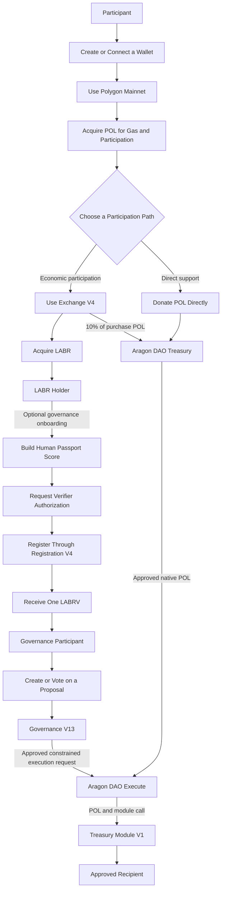
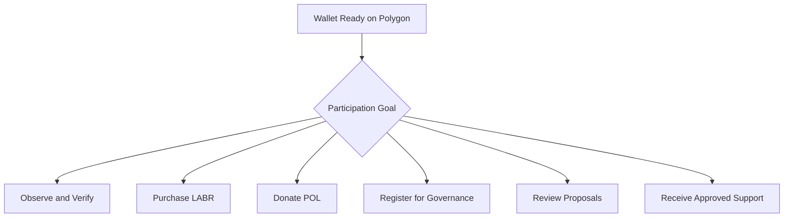
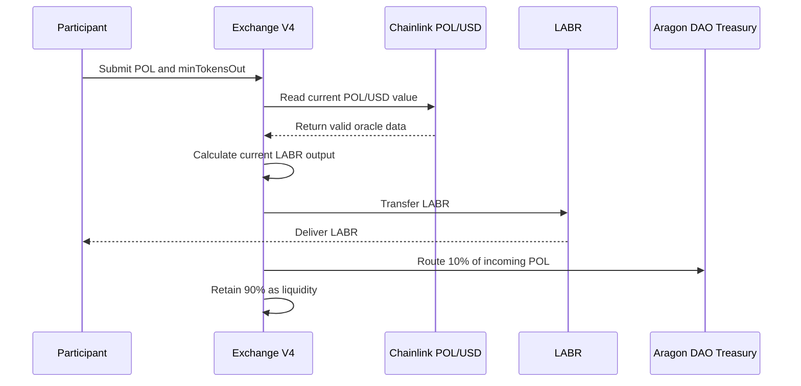
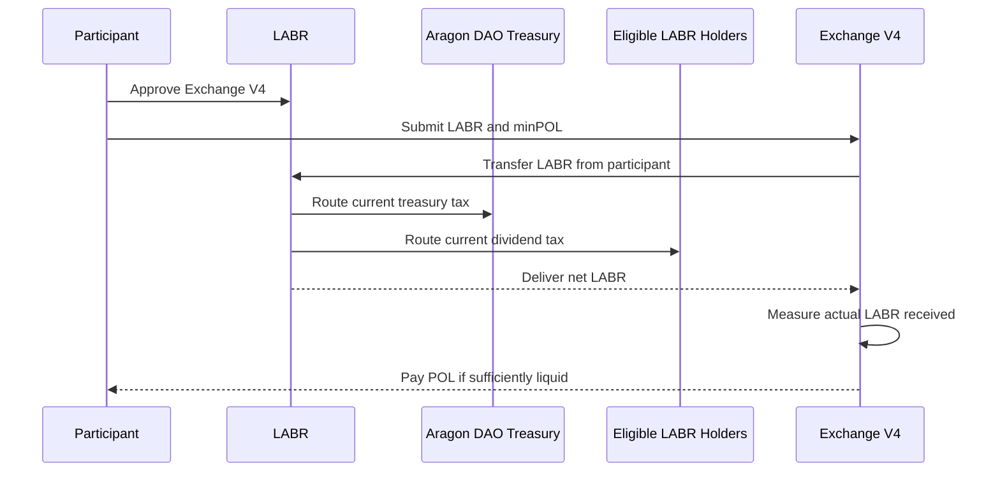
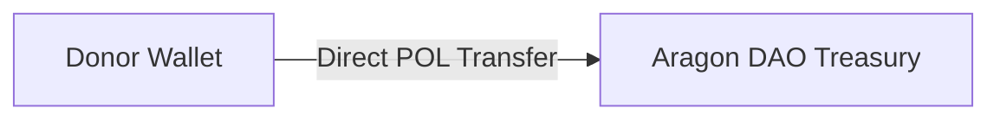
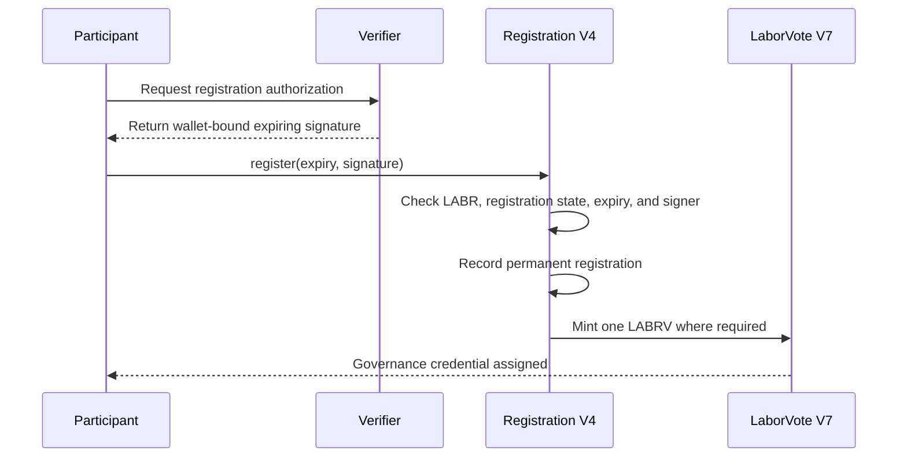
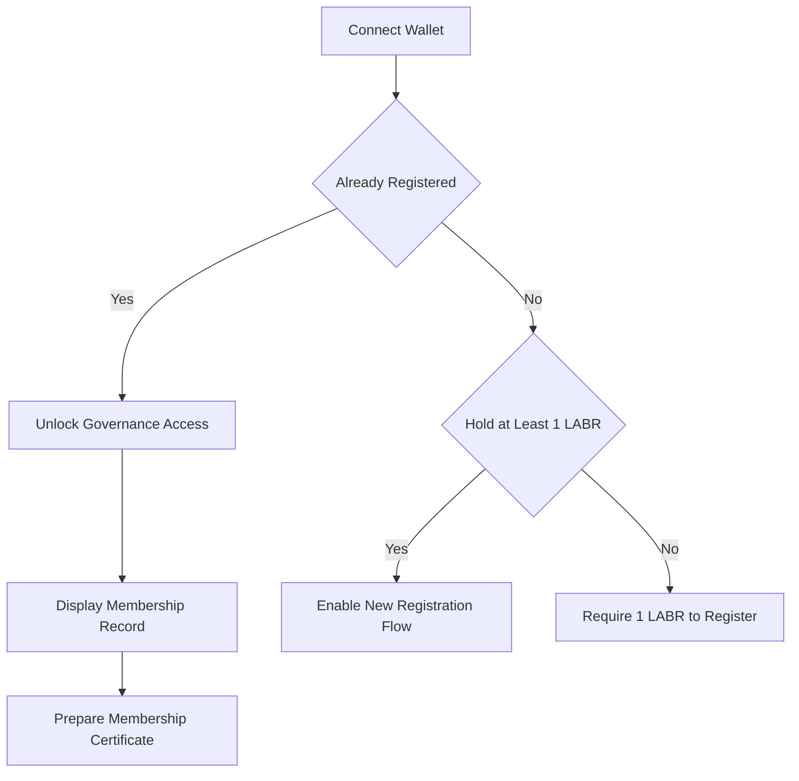
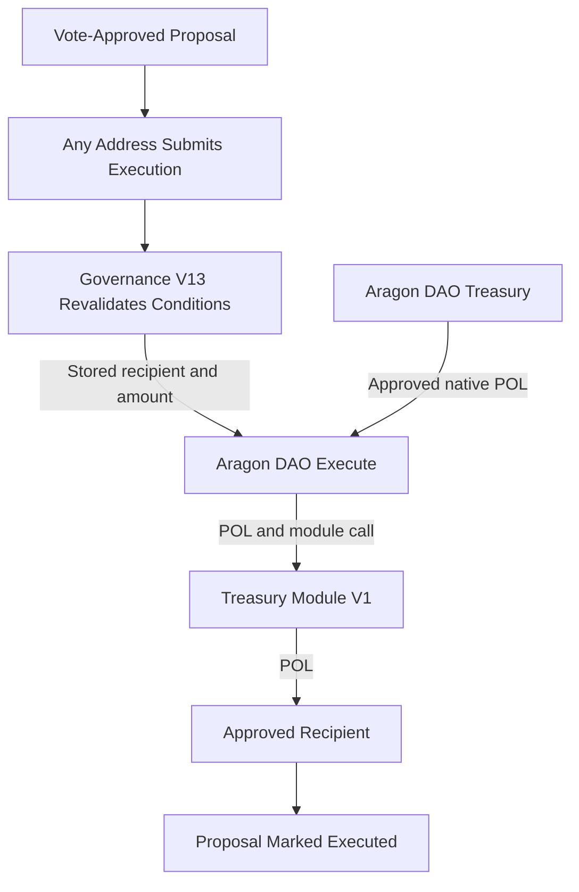
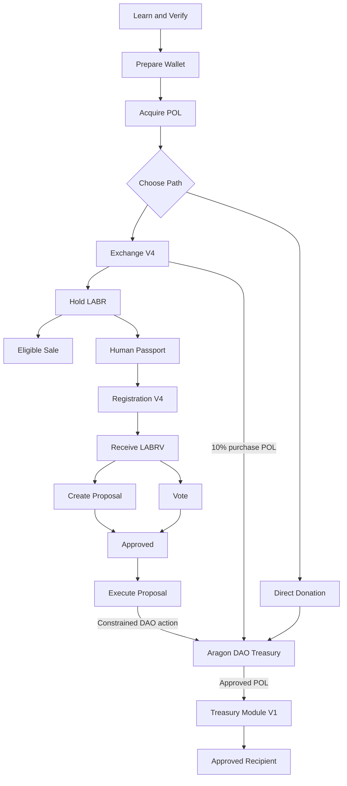

[user-journey.md](https://github.com/user-attachments/files/29432913/user-journey.md)
# LaborCoin User Journey

## Overview

LaborCoin supports several forms of participation rather than requiring every person to follow one mandatory path.

A participant may:

* Purchase and hold LABR
* Sell eligible LABR back through Exchange V4
* Receive configured LABR-holder dividends
* Donate POL directly to the Aragon DAO treasury
* Register for LABRV governance rights
* Create and vote on treasury proposals
* Submit an approved proposal for execution
* Receive support through an approved treasury distribution

Economic participation and governance participation are related but distinct.

Holding LABR does not automatically grant governance rights.

Governance participation requires successful Registration V4 onboarding and receipt of one non-transferable LABRV.

**Network:** Polygon Mainnet  
**Chain ID:** 137

---

# High-Level Participant Journey



Not every participant will complete every stage.

The protocol allows people to participate economically, govern, donate, receive support, or use only the parts relevant to them.

---

# Participant Roles

| Role | Primary Activity | Required Credential or Asset |
|---|---|---|
| Visitor | Reviews public information and contract state | None |
| Wallet User | Connects a compatible wallet to Polygon | Wallet and POL for gas |
| LABR Participant | Purchases, holds, transfers, or sells LABR | POL and compatible wallet |
| Donor | Sends POL directly to the Aragon DAO | POL |
| Registration Applicant | Completes governance onboarding | At least 1 LABR at registration, Passport eligibility, verifier authorization |
| Governance Participant | Creates proposals and votes | One LABRV |
| Execution Caller | Submits an approved proposal for execution | Any wallet with POL for gas |
| Treasury Recipient | Receives an approved native POL distribution | Valid recipient address |
| Independent Reviewer | Verifies contracts, transactions, balances, and permissions | Public blockchain access |

One person may occupy several roles.

---

# Stage 1: Learn Before Interacting

Before submitting a transaction, a participant should review:

* The technical whitepaper
* The disclaimer
* The security architecture
* The bonding-curve model
* The governance rules
* The final contract registry
* The current protocol status
* The verified source code on Polygonscan

Important facts include:

* LABR is a transferable economic token.
* LABRV is a non-transferable governance credential.
* Purchasing LABR does not guarantee profit or liquidity.
* Registration is permanent for the registered wallet.
* Governance V13 is limited to native POL treasury-allocation proposals.
* Exchange V4 sales require sufficient POL liquidity.
* Blockchain transactions are generally irreversible.

The website is an interface to the deployed contracts, not a replacement for wallet review or independent verification.

---

# Stage 2: Prepare a Wallet

A participant needs a compatible self-custody wallet.

The wallet should support:

* Polygon Mainnet
* WalletConnect or an injected browser connection
* Message signing
* Contract transactions
* Native POL

The participant controls the wallet and is responsible for:

* Protecting the private key or recovery phrase
* Confirming the network
* Reviewing transaction details
* Maintaining enough POL for gas
* Avoiding phishing and malicious browser extensions

LaborCoin does not require a participant to disclose a seed phrase or private key.

---

## Polygon Network Details

| Field | Value |
|---|---|
| Network | Polygon Mainnet |
| Chain ID | 137 |
| Native Gas Token | POL |
| Block Explorer | Polygonscan |

A participant should confirm that the wallet displays Polygon Mainnet before signing a transaction.

---

# Stage 3: Acquire POL

POL is required for:

* Polygon transaction fees
* Purchasing LABR
* Direct treasury donations
* Registration transaction gas
* Proposal and voting transaction gas
* Proposal execution gas

A participant may acquire POL through a compatible exchange, wallet provider, bridge, or transfer from another Polygon wallet.

The participant should confirm that the POL arrives on Polygon Mainnet rather than another network.

---

# Stage 4: Choose an Initial Participation Path

After preparing a wallet and obtaining POL, a participant may choose one or more paths.



The available paths have different requirements.

A direct donation does not require LABR or LABRV.

A governance registration requires at least 1 LABR at the moment of registration.

---

# Economic Participation Path

## Stage 5: Connect to Exchange V4

The participant connects a wallet to the official Exchange page or another compatible interface.

**Exchange V4:**

[`0x4Cf18cB39203B678f5C26f2338a10a79f9684749`](https://polygonscan.com/address/0x4Cf18cB39203B678f5C26f2338a10a79f9684749)

Before purchasing, the participant should confirm:

* The connected wallet address
* Polygon Mainnet
* The Exchange V4 address
* Available POL balance
* Current LABR price
* Estimated LABR output
* Submitted minimum output
* Current wallet and transaction limits
* Current cooldown status

---

## Stage 6: Purchase LABR

A purchase follows this path:



The participant receives LABR according to:

* The current bonding-curve state
* The current Chainlink POL/USD value
* Exchange limits
* Available unlocked supply
* Available Exchange V4 LABR inventory
* The submitted `minTokensOut`

### Exchange-Level Limits

| Control | Deployed Value |
|---|---:|
| Maximum Exchange Transaction | 5,000 LABR |
| Maximum Exchange Wallet Balance | 10,000 LABR |
| Address Cooldown | 12 hours |

The official interface may estimate output, but the contract transaction determines the final result.

---

## Stage 7: Hold LABR

A LABR holder may:

* Keep LABR in the wallet
* Transfer LABR, subject to token rules
* Become eligible for configured dividends
* Use at least 1 LABR to satisfy the one-time registration balance requirement
* Sell eligible LABR through Exchange V4
* Participate in the broader LaborCoin ecosystem

Holding LABR does not automatically create LABRV or voting rights.

LABR and LABRV have separate purposes.

| Token | Function |
|---|---|
| LABR | Transferable economic participation |
| LABRV | Non-transferable governance participation |

---

## Stage 8: Sell Eligible LABR

A participant may attempt to sell LABR back through Exchange V4.

The participant must:

1. Connect the wallet.
2. Enter the LABR amount.
3. Review the expected POL output.
4. Review the submitted `minPOL`.
5. Approve Exchange V4 to transfer LABR.
6. Submit the sale transaction.



Under the current LABR configuration:

| Sell-Side Allocation | Current Rate |
|---|---:|
| Aragon DAO treasury | 5% |
| Eligible LABR-holder dividends | 5% |
| Burn | 0% |
| Total | 10% |

Exchange V4 calculates the POL payout using the LABR it actually receives after token-level transfer mechanics.

A sale is not guaranteed.

It may fail because of:

* Insufficient Exchange V4 POL liquidity
* Transaction or wallet limits
* Cooldown
* Oracle failure
* Minimum-output protection
* Token approval failure
* State changes before confirmation

---

# Direct Support Path

## Stage 9: Donate POL to the Aragon DAO

A participant may support the treasury without purchasing LABR or registering for governance.

**Aragon DAO:**

[`0x0C2e5679153593b82a84eAB5CA90895BB291Cec4`](https://polygonscan.com/address/0x0C2e5679153593b82a84eAB5CA90895BB291Cec4)



A direct donation:

* Does not purchase LABR
* Does not create Exchange V4 liquidity
* Does not increase `totalSold`
* Does not mint LABRV
* Does not create voting rights
* Increases the DAO's native POL balance

The donor should verify the DAO address before sending funds.

---

# Governance Onboarding Path

## Stage 10: Prepare Human Passport

A participant seeking governance access must satisfy the current Human Passport policy used by the verifier.

The published minimum score is:

```text
15
```

Human Passport provides Sybil-resistance signals.

It is not proof of:

* Legal identity
* Employment status
* One human for all time
* Wallet security
* Honest conduct

The participant should use the same wallet for Passport verification and Registration V4.

---

## Stage 11: Meet the Registration Requirements

Registration V4 requires:

| Requirement | Condition |
|---|---|
| LABR balance | At least 1 LABR at registration time |
| Registration status | Wallet not previously registered |
| Verifier authorization | Valid signature from the fixed verifier |
| Expiration | Authorization still valid |
| Wallet transaction | Submitted by the registering wallet |

The 1 LABR requirement applies only when registering.

After successful registration:

* Registration remains recorded permanently.
* The participant does not need to continue holding LABR for governance access.
* Governance eligibility is based on LABRV ownership.

---

## Stage 12: Verify Identity Through the Interface

The participant:

1. Connects the registration wallet.
2. Confirms the wallet holds at least 1 LABR.
3. Requests identity verification.
4. Waits for the verifier response.
5. Confirms that the required score was met.
6. Receives a time-limited registration authorization.

The verifier authorization does not itself register the participant.

The participant must still submit the Registration V4 transaction.

---

## Stage 13: Review and Sign the Attestation

The official interface presents the LaborCoin DAO attestation.

The participant signs the attestation message with the wallet.

This creates evidence that the wallet signed the presented statement.

Registration V4 does not store the attestation text or a text hash.

The attestation is part of the onboarding process rather than an independent on-chain registration condition.

---

## Stage 14: Submit Registration V4

The participant submits one Registration V4 transaction using the verifier authorization.



A successful registration provides:

* Permanent registered-member status
* A member number
* A registration timestamp
* One LABRV governance credential
* Access to the governance interface
* A downloadable membership certificate through the official frontend

No LABRV delegation transaction is required for Governance V13.

---

## Stage 15: Existing Member Return Path

A registered participant may return later and reconnect the same wallet.

The interface checks Registration V4 status before checking the current LABR balance.



An existing member is not blocked from governance access merely because the wallet later holds less than 1 LABR.

---

# Governance Participation Path

## Stage 16: Review Governance State

A governance participant should review:

* Current proposals
* Proposal descriptions
* Recipient addresses
* Requested POL amounts
* Voting deadlines
* Yes and no vote totals
* Current participation
* Current approval
* Execution deadlines
* DAO treasury balance
* Existing pending obligations

Governance V13 does not reserve treasury POL when a proposal passes.

A vote-approved proposal may still become unexecutable if treasury conditions change.

---

## Stage 17: Create a Proposal

An eligible LABRV holder may create a native POL treasury proposal.

The participant supplies:

* Proposal title
* Proposal description
* Recipient address
* Native POL amount
* A valid proposal-creation authorization

Before submitting, the participant should verify:

* The recipient address
* The amount
* The proposal text
* The Governance V13 contract
* The wallet transaction calldata

The verifier authorization permits the action category but does not independently confirm every proposal field.

---

## Stage 18: Vote

An eligible participant may vote yes or no during the 14-day voting period.

Each vote requires:

* LABRV ownership
* A valid action-specific verifier authorization
* The current governance nonce
* An unexpired signature
* A proposal that remains open
* A wallet that has not already voted on that proposal

Each eligible wallet has one vote per proposal.

Governance V13 checks LABRV balance directly.

---

## Stage 19: Proposal Outcome

After the voting period, the proposal must satisfy:

| Requirement | Value |
|---|---:|
| Minimum Participation | 25% |
| Minimum Approval | 67% |

Participation is calculated against the current Registration V4 `totalMembers()` value when proposal status is evaluated.

The member count is not snapshotted at proposal creation.

A proposal that meets both voting requirements becomes eligible for execution, subject to additional execution-time checks.

---

## Stage 20: Execute an Approved Proposal

Any address may submit an approved proposal for execution during the 7-day execution window.

The execution caller does not gain control over the recipient or amount.

Governance V13 verifies:

* The proposal has not already executed.
* The execution window remains open.
* At least 50 participants are currently registered.
* The amount is no greater than 5% of the DAO's current native POL balance.
* The proposal still satisfies participation and approval.
* The DAO and Treasury Module V1 calls succeed.



Governance V13 does not hold the treasury funds.

The Aragon DAO remains the treasury custodian.

---

# Recipient Path

## Stage 21: Receive Approved Support

A recipient may be:

* A worker organization
* A strike-support effort
* A mutual-aid initiative
* Another approved worker-centered recipient

The recipient supplies a compatible address during the proposal process.

If execution succeeds:

1. The Aragon DAO supplies the approved native POL.
2. Treasury Module V1 receives the POL as call value.
3. Treasury Module V1 forwards it to the stored recipient.
4. The recipient receives the funds.
5. The transaction remains publicly auditable.

A recipient contract that rejects native POL may cause execution to revert.

The protocol cannot guarantee how successfully transferred funds will be used.

---

# Participant Journey by Goal

## Goal: Purchase LABR Only

```text
Prepare wallet
→ Acquire POL
→ Connect to Exchange V4
→ Review price and limits
→ Purchase LABR
→ Hold, transfer, or later attempt an eligible sale
```

Governance registration is optional.

---

## Goal: Donate Without Purchasing LABR

```text
Prepare wallet
→ Acquire POL
→ Verify Aragon DAO address
→ Send direct POL donation
```

A donation does not create LABR or LABRV.

---

## Goal: Become a Governance Participant

```text
Prepare wallet
→ Acquire POL
→ Purchase or otherwise hold at least 1 LABR
→ Build eligible Passport score
→ Obtain verifier authorization
→ Sign attestation
→ Submit Registration V4 transaction
→ Receive one LABRV
→ Access governance
```

Continued LABR ownership is not required after successful registration.

---

## Goal: Vote on a Proposal

```text
Hold LABRV
→ Review proposal
→ Obtain vote authorization
→ Review wallet transaction
→ Submit yes or no vote
→ Confirm vote on-chain
```

---

## Goal: Create a Treasury Proposal

```text
Hold LABRV
→ Identify recipient and native POL amount
→ Prepare public proposal description
→ Obtain proposal authorization
→ Review complete transaction
→ Submit proposal
→ Participate in public deliberation
```

---

## Goal: Execute an Approved Proposal

```text
Identify vote-approved proposal
→ Confirm execution window
→ Confirm treasury and member requirements
→ Submit executeProposal
→ Verify DAO and Treasury Module transaction
→ Confirm recipient receipt
```

The execution caller does not need to be the proposal creator.

---

# Common Failure States

| Stage | Possible Failure | Participant Response |
|---|---|---|
| Wallet connection | Wallet provider unavailable or wrong network | Reconnect and confirm Polygon Mainnet |
| Purchase | Insufficient POL, cooldown, limit, oracle, or slippage failure | Review status and retry only after conditions change |
| Sale | Insufficient approval or Exchange V4 POL liquidity | Review approval and current liquidity |
| Passport verification | Score below threshold | Improve eligible Passport signals and retry |
| Registration | Less than 1 LABR | Acquire or receive enough LABR before registering |
| Registration | Authorization expired | Request a new verifier authorization |
| Registration | Wallet already registered | Reconnect as an existing member |
| Proposal creation | Invalid signature, nonce, recipient, or amount | Refresh authorization and review inputs |
| Voting | Proposal closed or wallet already voted | Review proposal state |
| Execution | Voting period active | Wait until voting ends |
| Execution | Participation or approval not met | Proposal cannot execute |
| Execution | Fewer than 50 current members | Wait until activation requirement is met |
| Execution | Amount exceeds current 5% cap | Proposal cannot execute at the current treasury balance |
| Execution | Seven-day window expired | Proposal is no longer executable |
| Execution | Recipient rejects POL | Recipient address or contract compatibility must be addressed through a new proposal |

Blockchain reverts do not normally reverse gas already spent.

---

# Security Guidance Throughout the Journey

At every stage, participants should:

* Verify the official domain
* Confirm Polygon Mainnet
* Compare contract addresses with the published registry
* Review every wallet confirmation
* Reject unexpected approvals
* Confirm proposal recipients and amounts
* Never disclose seed phrases or private keys
* Treat direct messages and unsolicited support offers as untrusted
* Verify completed actions on Polygonscan

The official interface can simplify interaction but cannot eliminate wallet, browser, phishing, or transaction-review risk.

---

# Privacy and Public Records

Blockchain activity is public.

Publicly visible information may include:

* Wallet addresses
* LABR and LABRV balances
* Registration status
* Member number
* Registration timestamp
* Proposal creation
* Vote transactions
* Proposal recipients and amounts
* Treasury distributions
* Exchange purchases and sales

Participants should not assume wallet activity is private.

Human Passport and verifier operations may involve additional external privacy policies and infrastructure.

---

# Accessibility and Alternative Interfaces

The official website and PWA are intended to simplify participation.

However:

* The deployed contracts remain accessible through compatible tools.
* A participant is not required to install the PWA.
* A participant may use desktop or mobile wallet connections.
* Independent reviewers may use Polygonscan, RPC tools, or contract interfaces.
* Interface failure does not erase on-chain state.

Some actions may be technically available outside the official interface but remain subject to the same contract rules.

---

# Journey Boundaries

The user journey does not imply that:

* Every LABR holder must register
* Every registered participant must create proposals
* Every participant must vote
* Every vote-approved proposal will execute
* Every treasury recipient will produce the intended outcome
* Every LABR sale will succeed
* Every participant will receive dividends
* Participation guarantees financial return

Each stage is optional except for the prerequisites of the specific action being attempted.

---

# Complete Journey Summary



The complete journey connects individual participation to collective resource allocation while preserving distinct roles for:

* Exchange V4
* LABR
* Registration V4
* LaborVote V7
* Governance V13
* The Aragon DAO
* Treasury Module V1
* Approved recipients

Economic participation may enable governance onboarding.

Governance participation may authorize treasury allocation.

Treasury allocation remains subject to fixed voting, timing, permission, balance, and execution constraints.

Not every participant will progress through every stage, and no stage guarantees a financial or governance outcome.

---

## Related Documentation

* [Architecture](architecture.md)
* [Bonding Curve](bonding-curve.md)
* [Economic Flow](economic-flow.md)
* [Governance](governance.md)
* [Governance Flow](governance-flow.md)
* [Decentralization](decentralization.md)
* [Security](security.md)
* [Technical Whitepaper](whitepaper.md)
* [Protocol Status](status.md)
