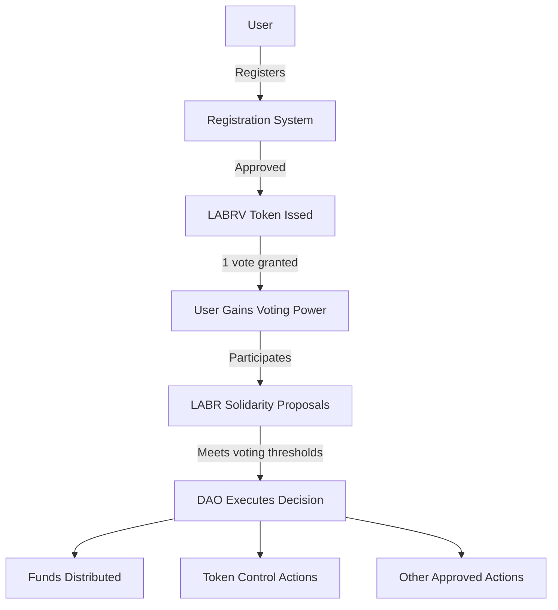

```mermaid
flowchart TD

    A[User] -->|Registers| B["Registration System"]

    B -->|Approved| C[LABRV Token Issed]

    C -->|1 vote granted| D[User Gains Voting Power]

    D -->|Participates| E["LABR Solidarity Proposals"]

    E -->|Meets voting thresholds| F["DAO Executes Decision"]

    F --> G1[Funds Distributed]
    F --> G2[Token Control Actions]
    F --> G3[Other Approved Actions]
```
