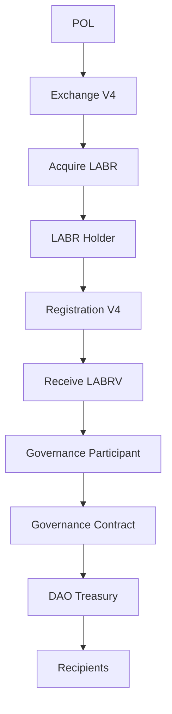

Illustrates the participant pathway from acquiring LABR through governance participation and treasury allocation. Economic participation enables governance onboarding, which in turn enables collective decision-making regarding treasury resources.

This sequence illustrates how economic participation may ultimately contribute to collective resource allocation.

Not every participant will progress through every stage.

However, each stage remains available to eligible participants.
