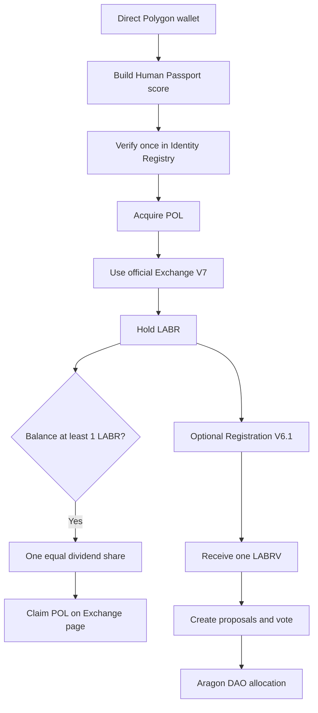

# Participant Journey

```mermaid
flowchart TD
    Wallet[Direct Polygon wallet] --> Passport[Build Human Passport score]
    Passport --> Verify[Verify once in Identity Registry]
    Verify --> POL[Acquire POL]
    POL --> Exchange[Use official Exchange V7]
    Exchange --> LABR[Hold LABR]
    LABR --> Dividend{Balance at least 1 LABR?}
    Dividend -->|Yes| EqualShare[One equal dividend share]
    EqualShare --> Claim[Claim POL on Exchange page]
    LABR --> Register[Optional Registration V6.1]
    Register --> LABRV[Receive one LABRV]
    LABRV --> Governance[Create proposals and vote]
    Governance --> DAO[Aragon DAO allocation]
```

1. Install or open a compatible self-custody wallet.
2. Use a direct EOA on Polygon and obtain POL for network fees and Exchange purchases.
3. Build a Human Passport score of at least 15.
4. Request a verifier authorization and permanently verify the wallet on-chain.
5. Buy up to 5,000 LABR per trade while remaining at or below 10,000 LABR. LABR cannot be transferred peer to peer and can move only through the official Exchange.
6. Once the verified wallet holds at least 1 LABR, it has one equal dividend share.
7. Claim available POL dividends from the Exchange page.
8. Optionally register for governance while holding at least 1 LABR.
9. Receive one nontransferable LABRV and permanent member number.
10. After 50 members, participate in constrained treasury proposals and votes. A participant who joins during an active proposal may vote before its deadline; the final participation denominator is fixed when voting closes.
