[LaborCoin-Technical-Whitepaper-v1.0-user-journey-synchronized.md](https://github.com/user-attachments/files/29432961/LaborCoin-Technical-Whitepaper-v1.0-user-journey-synchronized.md)
Version: 1.0

Network: Polygon Mainnet (Chain ID 137)

Document SHA-256:
[To be inserted after the publication artifact is frozen]

Last Updated: June 27, 2026

Status: Final Deployment Publication Candidate

Protocol Status: Final contracts deployed and source-verified; final DAO permission cleanup, launch provenance, validation evidence, and publication freeze remain outstanding

# LaborCoin Technical Whitepaper v1.0

Decentralized Treasury Governance Infrastructure for Collective Economic Coordination

---

## Disclaimer

This document describes the technical architecture, governance framework, economic mechanisms, and deployment structure of the LaborCoin protocol.

This whitepaper is intended solely for informational and educational purposes.

Nothing in this document constitutes:

* Investment advice
* Legal advice
* Tax advice
* Financial advice
* Solicitation of securities
* Offer to sell any financial product

Participation in blockchain networks involves risk.

Readers should independently evaluate all technical, legal, financial, and operational considerations before interacting with the protocol.

The LaborCoin protocol is designed as governance infrastructure. No guarantees are made regarding adoption, treasury growth, governance outcomes, economic performance, or future utility.

---

# Revision History

Table 1. Revision History

Chronological summary of major development milestones leading to the publication of LaborCoin Technical Whitepaper v1.0.

| Version | Milestone                  | Description           |
| ------- | -------------------------- | --------------------- |
| 0.1     | Initial Draft              | Internal Development  |
| 0.5     | Architecture Revision      | Governance Refinement |
| 0.8     | Pre-Launch Specification   | Deployment Validation |
| 1.0     | Final Technical Whitepaper | Final Deployment, Security, Authority, and User Journey Publication Candidate |

---

# Abstract

LaborCoin is a decentralized treasury governance protocol deployed on Polygon and designed to facilitate transparent, community-directed allocation of resources through democratic governance.

The protocol combines:

* LABR utility token distribution
* Deterministic bonding curve exchange
* Human Passport (formerly Gitcoin Passport)-assisted Sybil resistance
* LABRV governance participation
* Treasury governance
* Constrained treasury execution through the Aragon DAO and Treasury Module V1

into a unified system intended to operate as public infrastructure rather than a permanently administered organization.

LaborCoin separates economic participation from governance participation while maintaining transparent pathways between the two.

The final protocol contracts have been deployed and source-verified. Exchange V4, Registration V4, Governance V13, and Treasury Module V1 contain no owner administration; LaborVote V7 has a permanently locked minter and renounced ownership; and LABR ownership is held by the DAO. The remaining external trust assumptions are described explicitly in this document.

This document serves as the formal technical specification of the LaborCoin protocol.

---

# Table of Contents

## Core Specification

1. Executive Summary
2. Problem Statement
3. LaborCoin Design
4. System Architecture
5. LABR Token
6. Bonding Curve Exchange
7. Mathematical Specification
8. Tranche Distribution System
9. Registration Protocol
10. Identity Verification and Sybil Resistance
11. LABRV Governance Token
12. Governance Framework
13. Treasury Architecture
14. Security Architecture
15. Threat Model
16. User Journey
17. Decentralization Framework
18. Contract Registry and Deployment Architecture
19. Launch Validation and Operational Readiness
20. Risk Considerations
21. Future Governance and Conclusion

---

## Appendices

A. Contract Registry

B. Tokenomics Specification

C. Governance Constants

D. Complete System Architecture

E. Final Authority and Renouncement Status

F. Threat Model Matrix

G. Mathematical Analysis of the LaborCoin Bonding Curve

H. Economic Flows and Treasury Architecture

I. Economic Scale Analysis

J. State Transition Diagrams

K. Glossary

L. Protocol Constants Reference

M. Security Controls Matrix

N. Decentralization Status Summary

O. Launch Validation Evidence Register

---

# Figures Index

| Figure    | Caption                                    |
| --------- | ------------------------------------------ |
| Figure 1  | LaborCoin System Architecture              |
| Figure 2  | Multi-Path User Journey Overview           |
| Figure 3  | Treasury Execution Lifecycle               |
| Figure 4  | Registration Lifecycle                     |
| Figure 5  | Registration Authorization Flow            |
| Figure 6  | Proposal Lifecycle                         |
| Figure 7  | Governance Allocation Flow                 |
| Figure 8  | Detailed Multi-Path Participant Lifecycle  |
| Figure 9  | Economic and Treasury Distribution Flow     |
| Figure 10 | Governance Authorization Flow              |
| Figure 11 | Post-Finalization Authority Structure      |
| Figure 12 | Bonding Curve Distribution Model           |
| Figure 13 | Buy-Side Economic Flow                     |
| Figure 14 | Sell-Side Economic Flow                    |
| Figure 15 | Treasury Accumulation Flow                 |
| Figure 16 | Security Trust Boundaries                  |
| Figure 17 | Layered Security Model                     |

# Tables Index

| Table    | Caption                                     |
| -------- | ------------------------------------------- |
| Table 1  | Revision History                            |
| Table 2  | Contract Registry                           |
| Table 3  | Tokenomics Allocation                       |
| Table 4  | Threat Model Matrix                         |
| Table 5  | Treasury Protection Layers                  |
| Table 6  | Distribution Milestones                     |
| Table 7  | Theoretical Economic Scale                  |
| Table 8  | LABR Token Constants                        |
| Table 9  | Exchange Constants                          |
| Table 10 | Treasury Constants                          |
| Table 11 | Governance Constants                        |
| Table 12 | Registration Constants                      |
| Table 13 | Governance Token (LABRV) Constants          |
| Table 14 | Security Controls Matrix                    |

---

# Reading Guide

This document is intended for multiple audiences.

### General Readers

Recommended Sections:

* Executive Summary
* Problem Statement
* LaborCoin Design
* User Journey
* Conclusion

### Governance Participants

Recommended Sections:

* Registration
* Governance Framework
* Treasury Architecture
* User Journey

### Developers

Recommended Sections:

* System Architecture
* Contract Registry
* Security Architecture
* Technical Appendices

### Auditors and Researchers

Recommended Sections:

* Security Architecture
* Threat Model
* Decentralization Framework
* Contract Registry
* Mathematical Appendices
* Repository `docs/security.md`
* Repository `.github/SECURITY.md`

---

# Author's Note

LaborCoin was created in response to a practical observation:

While modern financial infrastructure provides extensive mechanisms for investment, speculation, and capital coordination, equivalent infrastructure for transparent, decentralized collective economic support remains comparatively limited.

The protocol was not created to demonstrate blockchain technology for its own sake.

Rather, it represents an attempt to explore whether transparent treasury governance, Sybil-resistant participation, and durable public infrastructure can provide useful tools for collective economic coordination.

This document describes that system as it exists today.

---

# Chapter 1: Executive Summary

## 1.1 Introduction

LaborCoin is a decentralized treasury governance protocol built on the Polygon blockchain. The protocol combines a transferable utility token (LABR), a non-transferable governance token (LABRV), Sybil-resistant registration, a deterministic bonding curve exchange, and constrained treasury governance into a unified framework for democratic resource allocation.

The protocol was created to address a practical challenge that exists independently of blockchain technology.

Workers who engage in collective action frequently face economic retaliation. Strikes, labor disputes, organizing campaigns, and other forms of workplace action can impose immediate financial costs on participants. Lost wages, reduced income, and uncertainty often create significant barriers to sustained collective action.

While labor unions, strike funds, mutual aid networks, and community organizations have historically provided support in these situations, access to such institutions varies considerably across industries, regions, and workplaces. Many workers lack practical access to durable solidarity infrastructure capable of mobilizing resources across organizational or geographic boundaries.

LaborCoin was developed as an attempt to create transparent, democratic, and globally accessible infrastructure through which participants may collectively build and allocate resources according to shared decisions.

Blockchain technology is used not as an end in itself, but as a tool for creating transparent accounting, verifiable governance, automated execution, and public auditability. The protocol's purpose is not to solve problems internal to cryptocurrency ecosystems. Its purpose is to provide infrastructure that may assist communities seeking to coordinate economic solidarity at scale.

The protocol operates as public infrastructure rather than founder-managed software. Governance V13 is limited to treasury-allocation decisions and does not expose general protocol-administration functions.

The enforcement model is divided between on-chain rules and external eligibility services. Exchange pricing, exchange limits, governance thresholds, treasury limits, Registration V4's minimum-LABR check, signature validation, and LABRV issuance are enforced on-chain. Passport scoring and attestation presentation occur through the verifier and official interface rather than through direct Passport-score evaluation inside Registration V4.

The final contracts have been deployed and source-verified. Exchange V4, Registration V4, Governance V13, and Treasury Module V1 have no owner administration. LaborVote V7 ownership has been renounced after permanently locking Registration V4 as minter. LABR remains owned by the DAO and is therefore DAO-controlled rather than ownerless; the DAO permission state governing any use of LABR owner functions is part of the separate launch provenance record.

---

## 1.2 Protocol Objectives

LaborCoin was designed with two complementary objectives.

The first objective is social.

The protocol seeks to provide infrastructure through which participants may collectively accumulate and democratically allocate resources in support of workers and communities facing economic hardship resulting from collective action, labor disputes, strikes, lockouts, or related circumstances. The protocol itself does not determine how treasury resources should be allocated. Those decisions remain subject to governance participation and community judgment.

The second objective is technical.

To support durable collective coordination, the underlying infrastructure must be transparent, resistant to manipulation, auditable, and capable of operating without dependence upon trusted intermediaries. These requirements motivated the protocol's use of public blockchain infrastructure, deterministic smart contracts, transparent treasury accounting, and constrained governance authority.

The resulting system combines democratic participation with programmable execution. Governance participants determine how treasury resources are allocated, while protocol rules remain fixed and publicly verifiable.

The objective is not to replace existing labor organizations, mutual aid networks, or solidarity institutions. Rather, LaborCoin seeks to provide an additional coordination mechanism that can operate across organizational boundaries while maintaining transparency and democratic accountability.

---

## 1.3 Core Components

LaborCoin consists of six primary protocol components.

### LABR Utility Token

LABR functions as the protocol's transferable utility token. Participants may acquire, hold, transfer, buy, and sell LABR through the protocol exchange.

LABR represents economic participation within the ecosystem but does not independently confer governance rights.

### Bonding Curve Exchange

The LaborCoin Exchange provides deterministic pricing through a quadratic bonding curve.

Rather than relying upon traditional order books, market makers, or external liquidity providers, the exchange calculates token pricing according to protocol-defined mathematical rules based on distribution progress.

### Registration System

The Registration System serves as the gateway to governance participation.

Participants must hold the minimum LABR balance and submit a valid, unexpired authorization from the fixed verifier before Registration V4 can issue LABRV. The verifier and official interface apply the Passport-score and attestation workflow described in Chapter 10.

### LABRV Governance Token

LABRV is a non-transferable governance token issued upon successful registration.

Each successfully registered wallet may possess only one LABRV token. Because LABRV cannot be transferred, governance rights cannot be accumulated through token markets.

### Governance Framework

The governance framework allows registered participants to propose, vote upon, and execute treasury allocation decisions.

Governance authority is intentionally constrained and cannot alter protocol economics, registration requirements, or system parameters.

### Treasury Architecture

The treasury architecture provides transparent collection and allocation of protocol resources.

Under the final intended Aragon permission configuration, protocol treasury distributions follow Governance V13-approved proposals through the DAO and Treasury Module V1.

---

## 1.4 Governance Philosophy

LaborCoin adopts a governance model that separates governance authority from protocol administration.

Many decentralized systems grant governance broad powers over protocol operation. In such systems, governance can frequently alter token economics, change voting rules, modify treasury behavior, pause operation, or replace critical infrastructure.

LaborCoin intentionally rejects this model.

Governance controls treasury allocation decisions but does not control protocol operation.

Protocol economics are defined by smart contracts. Registration V4's on-chain conditions are defined by smart contracts, while Passport scoring remains a verifier policy. Treasury limits and governance thresholds are defined by smart contracts.

As a result, governance participants may decide how treasury resources are allocated without possessing authority to alter the foundational rules under which governance itself operates.

This distinction is central to the protocol's architecture.

---

## 1.5 Final Authority State

LaborCoin was developed through three operational phases.

### Development Phase

Administrative authority existed while contracts, interfaces, and integrations were being designed and tested.

### Deployment and Validation Phase

Final contracts were deployed to Polygon Mainnet, source-verified, connected to the DAO, and exercised through registration, proposal, voting, exchange, and treasury workflows.

### Final Deployed State

The final authority model is contract-specific:

* **LaborCoin Exchange V4:** no owner or administrative interface.
* **LaborCoin Registration V4:** no owner; fixed LABR, LABRV, and verifier addresses.
* **LaborCoin Governance V13:** no owner; fixed DAO, LABRV, verifier, Treasury Module V1, and Registration V4 dependencies.
* **LaborCoin Treasury Module V1:** no owner; only the DAO may call its transfer function.
* **LaborVote V7:** Registration V4 is the permanently locked minter and contract ownership has been renounced.
* **LABR Token:** ownership is held by the DAO rather than an externally owned creator wallet. Owner-only functions remain present in the token contract, so the DAO permission registry is a material part of the final authority record.
* **Verifier:** an externally controlled signing address remains necessary for Passport-based registration and governance-action authorization.

Accordingly, LaborCoin removes creator ownership from the final protocol contracts while retaining explicitly documented external dependencies and DAO-held LABR ownership. It does not claim that every component is ownerless or that every operational dependency is decentralized.

Final Deployment Requirements

✓ Final contract addresses deployed and source-verified

✓ Registration V4 assigned as the permanently locked LABRV minter

✓ LaborVote V7 ownership renounced

✓ Exchange V4, Registration V4, Governance V13, and Treasury Module V1 deployed without owner administration

✓ LABR ownership transferred to the DAO

✓ Governance authority constrained to treasury allocation through Governance V13

△ Final DAO permission cleanup and provenance records remain to be completed and published in the separate launch report

## 1.6 Summary

LaborCoin combines deterministic token economics, verifier-assisted Sybil resistance, constrained governance authority, ownerless final custom contracts, and permanently locked LABRV minting into a unified governance protocol.

By separating governance rights from token ownership and restricting governance authority to treasury allocation decisions, the protocol seeks to establish a durable framework for democratic resource coordination that remains accountable to participants while preserving the integrity of its underlying rules.

LaborCoin should not be understood primarily as a cryptocurrency project. The protocol uses blockchain technology because transparency, auditability, programmable execution, and decentralized governance provide useful properties for collective resource coordination. The protocol's central objective is the creation of durable infrastructure through which communities may organize economic solidarity according to democratically determined priorities.

The chapters that follow describe the protocol architecture, economic systems, governance mechanisms, security model, decentralization framework, and operational procedures that collectively define the LaborCoin ecosystem.

---

# Chapter 2: Problem Statement

## 2.1 Introduction

The development of LaborCoin was motivated by a practical coordination problem rather than a technological one.

Throughout modern economic history, workers have relied upon collective action to improve wages, benefits, workplace conditions, and political representation. Collective action can take many forms, including strikes, work stoppages, organizing campaigns, public demonstrations, mutual aid efforts, and coordinated bargaining initiatives.

While collective action can be effective, participation frequently carries significant economic risks. Individuals who participate in labor disputes often face immediate financial consequences, including lost wages, reduced hours, diminished job security, and uncertainty regarding future income. These pressures can weaken collective efforts even when substantial support exists among affected workers.

The challenge is not simply one of organization. It is also a challenge of sustaining economic solidarity over time.

LaborCoin was conceived as an attempt to address this problem by creating infrastructure through which resources can be accumulated, governed, and distributed collectively according to transparent and democratic procedures.

The protocol does not claim to solve labor relations, economic inequality, or workplace conflict. Rather, it seeks to provide a new coordination mechanism that may assist communities seeking to support collective action.

---

## 2.2 Economic Retaliation as a Structural Constraint

One of the most significant barriers to collective action is economic retaliation.

Workers typically depend upon wages to meet immediate needs such as housing, food, transportation, healthcare, and family expenses. When participation in collective action threatens access to income, individuals may face difficult decisions between supporting long-term collective goals and addressing short-term economic necessities.

Historically, labor organizations have attempted to address this challenge through strike funds, mutual aid systems, community support networks, and cooperative institutions. These mechanisms have often played a critical role in sustaining collective action.

However, access to such support structures remains uneven.

Some workers belong to well-resourced organizations with substantial institutional support. Others operate in industries, regions, or employment arrangements where comparable support systems do not exist.

As a result, the ability to sustain collective action often depends not only on the merits of a dispute but also on the availability of financial support mechanisms.

LaborCoin seeks to create infrastructure through which support resources can be accumulated and governed collectively regardless of geography or organizational affiliation.

## 2.3 Fragmentation of Existing Support Systems

Existing solidarity institutions frequently operate within organizational, geographic, or jurisdictional boundaries.

Labor unions typically focus on specific workplaces, industries, or bargaining units. Mutual aid organizations often serve particular communities. Advocacy groups frequently pursue specialized objectives.

These organizations perform important functions and have historically achieved significant successes. However, fragmentation can make it difficult to coordinate support across broader networks of participants.

Workers in one region may possess resources that could assist workers elsewhere, but no practical mechanism may exist for transparent and democratic coordination.

LaborCoin does not seek to replace existing institutions. Instead, it seeks to provide infrastructure that may complement them by enabling broader participation and coordination across organizational boundaries.

## 2.4 Governance Challenges

Any collective treasury requires mechanisms for determining how resources should be allocated.

Historically, such decisions have often relied upon centralized leadership structures, administrative committees, or trusted intermediaries. While these approaches can be effective, they may also create concerns regarding transparency, accountability, and representation.

The emergence of blockchain governance systems introduced new possibilities for collective decision-making. However, many governance systems introduced their own challenges.

Most governance tokens are transferable and frequently concentrate among large holders. In such systems, voting power is often proportional to capital ownership.

This creates a tension between democratic participation and financial influence.

LaborCoin was designed to address this tension by separating governance participation from token ownership.

## 2.5 The Need for Transparent Infrastructure

Collective resource management depends heavily upon trust.

Participants must trust that resources are accounted for accurately, that governance outcomes are respected, and that treasury distributions occur according to established procedures.

Traditional institutions frequently rely upon centralized accounting systems and trusted administrators to provide these assurances.

Blockchain systems provide an alternative approach.

Through transparent ledgers, deterministic execution, and public verification, blockchain infrastructure can reduce dependence upon trusted intermediaries while increasing visibility into governance and treasury operations.

LaborCoin adopts this approach not because decentralization is inherently desirable in all circumstances, but because transparency and verifiability are particularly valuable when managing collectively governed resources.

## 2.6 Summary

The problem LaborCoin seeks to address is fundamentally one of coordination.

Workers and communities often face substantial economic barriers when engaging in collective action. Existing support systems may be fragmented, inaccessible, or limited in scope. At the same time, collective resource management requires transparent and accountable governance mechanisms.

LaborCoin attempts to address these challenges through a combination of democratic governance, transparent treasury management, Sybil-resistant participation controls, and durable protocol infrastructure.

The following chapter describes the principles that guided the design of the protocol.

---

# Chapter 3: LaborCoin Design

## 3.1 Introduction

The architecture of LaborCoin is shaped by a set of design principles derived from the problems outlined in the previous chapter.

These principles informed decisions regarding governance, identity verification, treasury management, protocol administration, and decentralization.

The objective was not to maximize complexity or novelty. Instead, the goal was to create a system that remains understandable, transparent, and resistant to manipulation while supporting long-term collective coordination.

---

## 3.2 Transparency

Transparency is the foundation upon which the protocol operates.

Participants should be able to verify:

Treasury balances
Treasury distributions
Governance outcomes
Voting participation
Token distributions
Exchange activity

Without requiring permission from any administrator.

The protocol therefore relies upon public blockchain infrastructure and deterministic smart contract execution.

Transparency serves both practical and governance purposes. It reduces informational asymmetries and allows participants to independently evaluate protocol behavior.

---

## 3.3 Democratic Participation

LaborCoin was designed around the principle that governance participation should not be determined solely by capital ownership.

Many governance systems allocate voting power according to token balances. While such systems align influence with economic exposure, they can also produce highly concentrated governance structures.

LaborCoin separates economic participation from governance participation.

Ownership of LABR allows participation in the economic layer of the protocol.

Governance participation requires registration and issuance of a LABRV governance token.

This separation allows economic activity and governance authority to exist as distinct systems.

---

## 3.4 Sybil Resistance

Democratic participation requires reasonable protection against duplicate identities.

Without such protections, governance systems become vulnerable to manipulation through large numbers of controlled accounts.

LaborCoin utilizes Human Passport evaluation, fixed-verifier signatures, and duplicate-registration controls as its primary Sybil-resistance mechanism.

The objective is not to establish absolute proof of identity. Rather, it is to increase confidence that each governance participant represents a distinct individual.

This approach seeks to balance accessibility, privacy, and governance integrity.

---

## 3.5 Constrained Governance

Governance authority within LaborCoin is intentionally limited.

The protocol distinguishes between:

Treasury governance
Protocol administration

Governance controls treasury allocation decisions.

Governance does not control:

Token economics
Exchange parameters
Registration requirements
Governance thresholds
Protocol ownership

This separation reduces opportunities for governance capture and preserves the predictability of protocol behavior.

---

## 3.6 Finalization and Authority Minimization

The protocol was designed to remove creator-controlled administration after deployment and validation.

The final contracts use different authority models according to their function:

* Exchange V4, Registration V4, Governance V13, and Treasury Module V1 contain no owner administration.
* LaborVote V7 has a locked minter and renounced ownership.
* LABR remains DAO-owned because its deployed token contract contains owner-only configuration functions.
* Passport evaluation and signature issuance remain dependent upon the fixed verifier address and its supporting service.

This architecture substantially reduces founder control, but it does not justify describing every component or dependency as immutable. The whitepaper therefore distinguishes ownerless contracts, permanently locked configuration, DAO-controlled token ownership, and externally operated verification infrastructure.

## 3.7 Public Infrastructure

LaborCoin is intended to function as public infrastructure.

The protocol is not designed around exclusive access, privileged participants, or centralized administration.

Its architecture seeks to create a durable framework through which communities can coordinate resources according to collectively determined priorities.

This principle influenced every major design decision within the protocol.

---

## 3.8 Summary

LaborCoin's design principles emphasize transparency, democratic participation, Sybil resistance, constrained governance, authority minimization, predictable rules, and public accessibility.

These principles provide the foundation upon which the protocol architecture is constructed.

The following chapter describes how these principles are implemented through the protocol's technical structure.

---

# Chapter 4: System Architecture

## 4.1 Introduction

LaborCoin consists of multiple independent components that work together to provide economic participation, governance participation, treasury management, and democratic resource allocation.

The protocol deliberately separates responsibilities among specialized contracts.

This separation reduces complexity, limits authority concentration, improves auditability, and supports long-term decentralization.

Rather than relying upon a single contract to manage all functions, LaborCoin distributes responsibilities across multiple interacting components.

This architecture reflects the principle that no single component should possess unrestricted control over the system.

The result is a modular governance infrastructure in which economic participation, identity verification, governance participation, and treasury execution remain distinct but interconnected.

---

## 4.2 Architectural Overview

The LaborCoin protocol consists of six primary components:

1. LABR Utility Token
2. Bonding Curve Exchange
3. Registration System
4. LABRV Governance Token
5. Governance Contract
6. Treasury Infrastructure

Each component performs a specific function within the broader protocol.

Together, they create a complete governance ecosystem.

The architecture can be summarized as follows:

Figure 1. LaborCoin System Architecture.

High-level relationship between all core protocol components.

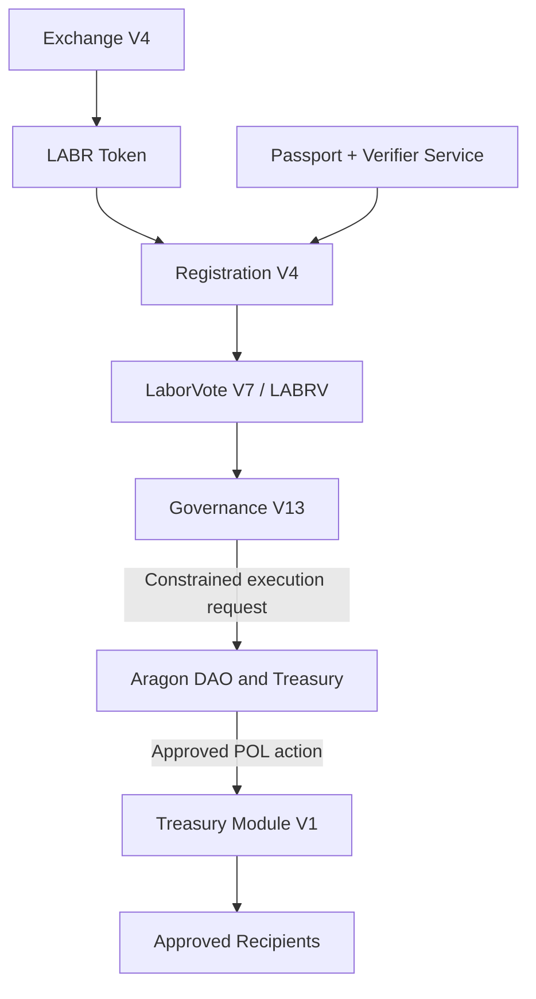

The protocol intentionally separates economic participation from governance participation.

Ownership of LABR alone does not confer governance authority.

Governance rights require successful registration and issuance of LABRV.

---

## 4.3 Economic Layer

The economic layer consists primarily of the LABR utility token and the Bonding Curve Exchange.

Its responsibilities include:

* Token distribution
* Protocol-managed buy and sell access, subject to available liquidity
* Treasury funding
* Economic participation

The economic layer serves as the entry point for most participants.

Users acquire LABR through the exchange and may subsequently choose to participate in governance.

Importantly, economic participation does not automatically grant governance authority.

This separation reduces the influence of wealth concentration on governance outcomes.

---

## 4.4 Identity Layer

The identity layer is responsible for governance eligibility.

Its purpose is to reduce the influence of duplicate identities and automated account creation.

The identity layer consists of:

* Human Passport
* Verifier Infrastructure
* Registration Contract

Participants must satisfy predefined eligibility requirements before receiving governance rights.

The protocol does not attempt to establish perfect identity verification.

Instead, it seeks to provide practical Sybil resistance while preserving accessibility and privacy.

This approach reflects the protocol's objective of one verified participant per LABRV without requiring traditional identity systems, while recognizing that uniqueness remains probabilistic.

---

## 4.5 Governance Layer

The governance layer is responsible for collective decision-making.

It consists of:

* LABRV Governance Token
* Governance Contract

Once registered, participants receive LABRV.

LABRV functions exclusively as a governance credential.

It cannot be traded, transferred, or accumulated through market activity.

Each registered participant receives the same governance weight.

This design intentionally separates governance influence from economic ownership.

The governance system therefore operates according to participant registration rather than token accumulation.

---

## 4.6 Treasury Layer

The treasury layer is responsible for custody and distribution of protocol resources.

It consists of:

* DAO Treasury
* Treasury Module

The treasury accumulates resources through protocol activity.

Those resources may only be distributed following successful governance approval.

The treasury layer therefore serves as the execution mechanism through which governance decisions become real-world outcomes.

Importantly, treasury execution is automated and constrained by protocol rules.

Under the final intended Aragon permission configuration, treasury distributions are limited to the Governance V13 execution path. This security claim depends upon removal of obsolete DAO execute permissions and publication of the final permission registry.

---

## 4.7 Participant and Information Flow

LaborCoin supports multiple participation paths rather than requiring every participant to progress through one mandatory sequence.

A participant may:

* Purchase, hold, transfer, or sell eligible LABR
* Donate native POL directly to the Aragon DAO
* Register for LABRV governance rights
* Create or vote on treasury proposals
* Submit an approved proposal for execution
* Receive an approved treasury distribution
* Observe and independently verify protocol activity without transacting

Figure 2. Multi-Path User Journey Overview.

Illustrates the principal economic, governance, donation, and treasury-recipient paths.

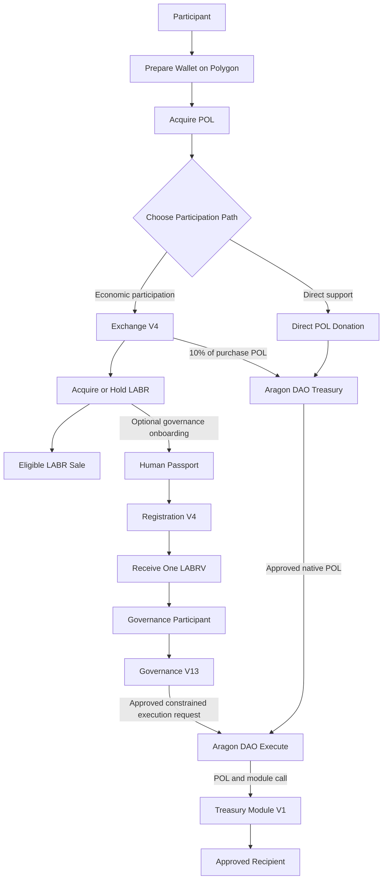

The diagram combines several distinct forms of participation.

The Aragon DAO remains the treasury custodian. Governance V13 records proposals and votes and constructs a constrained execution request, but it does not receive or hold treasury assets.

Not every participant will progress through every stage.

Economic participation, direct support, governance participation, execution submission, and recipient participation remain separate optional paths subject to their own requirements.

---
## 4.8 Governance Separation

One of the defining characteristics of the LaborCoin architecture is the separation between economic ownership and governance authority.

Many blockchain systems assign governance influence according to token ownership.

Under such systems, governance power increases as economic ownership increases.

LaborCoin adopts a different approach.

Economic ownership and governance participation are intentionally separated.

This distinction seeks to reduce the influence of concentrated capital within governance processes.

The protocol therefore prioritizes participant equality over ownership-weighted governance.

---

## 4.9 Treasury Decision Lifecycle

Treasury distributions combine a governance-authorization process with a separate treasury-value transfer.

The Aragon DAO holds custody of treasury assets. Governance V13 does not receive or hold proposal funds.

The process proceeds through the following stages:

1. An eligible LABRV holder creates a treasury proposal.
2. Eligible participants vote during the fourteen-day voting period.
3. Governance V13 evaluates participation and approval.
4. A vote-approved proposal enters the seven-day execution window.
5. Any address may submit the proposal for execution.
6. Governance V13 revalidates all execution-time conditions.
7. The Aragon DAO supplies the approved native POL to Treasury Module V1.
8. Treasury Module V1 forwards the POL to the stored recipient.

Figure 3. Treasury Execution Lifecycle

Illustrates the intended governance-controlled process from proposal creation through final recipient distribution. The Aragon DAO remains the treasury custodian throughout the governance process. Exclusivity of this path depends upon the final Aragon DAO permission registry and removal of obsolete executors.

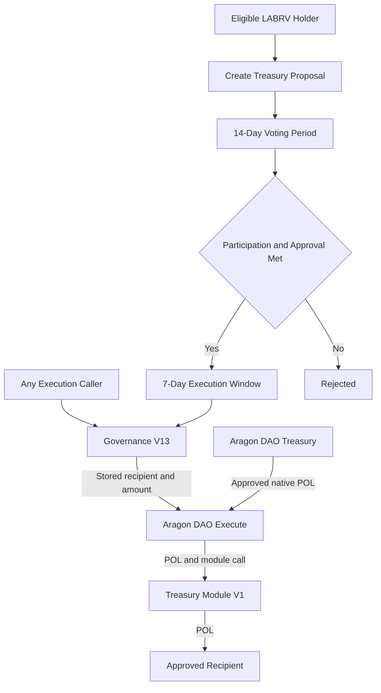

The two Aragon DAO nodes represent separate aspects of the same DAO:

* **Aragon DAO Treasury** represents custody.
* **Aragon DAO Execute** represents permission-controlled action execution.

---
## 4.10 Security Architecture

Security within LaborCoin does not rely upon a single defensive mechanism.

Instead, the protocol utilizes multiple independent controls.

Examples include:

* Passport verification
* Signature authorization
* Non-transferable governance rights
* Participation thresholds
* Approval thresholds
* Treasury spending caps
* Execution windows
* Exchange cooldowns
* Oracle validation

These mechanisms operate together to provide layered security.

The objective is not to eliminate all risk, which is impossible, but to reduce opportunities for abuse and governance manipulation.

---

## 4.11 Final Authority Architecture

The deployed authority structure is based on narrow, fixed dependencies rather than a single universal ownership model.

Exchange V4, Registration V4, Governance V13, and Treasury Module V1 expose no owner role. LaborVote V7 retains only the permanently locked Registration V4 minter relationship and has no remaining owner. LABR ownership is held by the Aragon DAO, and the verifier remains an external signing dependency.

The resulting system therefore operates through:

* Ownerless core exchange, registration, governance, and treasury-execution contracts
* Permanently fixed LABRV minting authority
* DAO custody of treasury assets and LABR ownership
* Governance V13's constrained treasury-allocation logic
* A fixed verifier address for eligibility and action authorizations

This structure removes direct creator administration while preserving the dependencies required by the deployed design.

## 4.12 Architectural Principles

Several principles guided the design of the protocol.

### Separation of Responsibilities

Each component performs a narrowly defined role.

### Constrained Governance

Governance controls treasury allocation rather than protocol rules.

### Transparency

Core operations remain publicly auditable.

### Predictability

Protocol behavior remains governed by fixed rules.

### Decentralization

Direct creator administration has been removed from the final custom contracts. Remaining DAO-held LABR authority and verifier dependence are explicit and must be documented through the launch provenance record.

Together, these principles shape the structure of the LaborCoin protocol.

---

## 4.13 Summary

LaborCoin consists of multiple specialized components operating together to provide economic participation, governance participation, treasury management, and collective resource allocation.

The architecture separates economic ownership from governance authority, uses verifier-assisted Sybil resistance, constrains treasury governance through predefined rules, and applies a documented combination of ownerless contracts, locked configuration, DAO-held ownership, and external verification dependencies.

The following chapters describe each component in detail, beginning with the LABR utility token and the economic layer that serves as the foundation of the protocol.

---

# Chapter 5: LABR Token

## 5.1 Introduction

LABR serves as the primary utility token within the LaborCoin protocol.

The token functions as the economic participation layer of the system and provides access to the protocol's exchange, registration, and treasury ecosystem.

LABR is intentionally distinct from governance rights.

Ownership of LABR does not automatically grant authority over treasury decisions, voting processes, or protocol administration. Instead, LABR functions as an economic asset within the protocol while governance participation is provided separately through issuance of the non-transferable LABRV governance token.

This distinction is a foundational characteristic of the LaborCoin architecture and reflects the protocol's broader objective of separating economic participation from governance participation.

---

## 5.2 Purpose

LABR fulfills several functions within the protocol.

Economic Participation

Participants acquire LABR through the LaborCoin Exchange and may hold, transfer, buy, or sell tokens subject to protocol rules.

LABR represents participation in the economic layer of the ecosystem and serves as the asset through which exchange activity occurs.

Registration Eligibility

Ownership of at least one LABR is required for governance registration.

This requirement establishes a minimal economic connection between governance participants and the protocol while avoiding governance systems based entirely upon token ownership.

Treasury Contribution Mechanism

LABR transaction flows contribute resources to the protocol treasury through predefined allocation mechanisms.

These contributions provide the economic foundation upon which governance-directed treasury distributions operate.

Ecosystem Participation

LABR functions as the primary transferable asset of the LaborCoin ecosystem and serves as the bridge between participants and the broader governance framework.

---

## 5.3 Supply Structure

The protocol establishes a fixed maximum token supply.

Maximum Supply

1,000,000,000 LABR

No mechanism exists within the deployed protocol for increasing the maximum supply beyond this limit.

The maximum supply is embedded within protocol logic and forms the basis of the exchange's distribution calculations.

This fixed supply model provides predictable issuance behavior and establishes a known upper bound on total token creation.

---

## 5.4 Distribution Model

Unlike traditional token launches that distribute the entire supply immediately, LaborCoin utilizes a staged distribution model.

Tokens enter circulation progressively through the bonding curve exchange.

This approach serves several objectives:

Predictable issuance
Controlled distribution
Transparent supply growth
Reduced concentration during early stages

The protocol therefore separates total supply from immediately accessible supply.

Only a portion of the maximum supply is available for distribution at any given time.

Additional supply becomes available automatically as distribution milestones are reached.

The detailed mechanics of this process are described in Chapter 8.

Table 3. Tokenomics Allocation

The LaborCoin supply is allocated entirely to protocol-controlled distribution through the exchange mechanism. No founder, team, investor, advisor, or private-sale allocations exist.

| Allocation Category          | Amount (LABR) | Percentage |
| ---------------------------- | ------------- | ---------: |
| Exchange Distribution Pool   | 1,000,000,000 |       100% |
| Founder Allocation           | 0             |         0% |
| Team Allocation              | 0             |         0% |
| Investor Allocation          | 0             |         0% |
| Advisor Allocation           | 0             |         0% |
| Private Sale Allocation      | 0             |         0% |
| Treasury Pre-Mint Allocation | 0             |         0% |

Total Supply: 1,000,000,000 LABR

All LABR enters circulation exclusively through protocol-defined exchange operations. No tokens are reserved for founders, developers, investors, or affiliated organizations.

---

## 5.5 Initial Availability

At deployment, the protocol unlocks:

100,000,000 LABR

for distribution through the exchange.

This initial tranche represents the first phase of protocol distribution.

Subsequent tranches are unlocked automatically according to predefined distribution thresholds.

No administrative action is required for tranche releases.

---

## 5.6 Distribution and Transfer Controls

LaborCoin uses two separate layers of concentration controls.

### LABR Token-Level Limits

The LABR token contract enforces:

Maximum Wallet:

1,000,000 LABR

Maximum Transaction:

500,000 LABR

These limits are part of the deployed LABR token configuration and apply at the token layer, subject to any addresses explicitly excluded through token administration.

### Exchange V4 Limits

Exchange V4 independently enforces stricter limits on transactions conducted through the protocol exchange:

Maximum Exchange Wallet:

10,000 LABR

Maximum Exchange Transaction:

5,000 LABR

These are on-chain Exchange V4 limits, not merely interface warnings.

### Exchange Cooldown

Cooldown Period:

12 Hours

Exchange V4 records the most recent exchange transaction time for each address and applies the cooldown to both purchases and sales. Ordinary wallet-to-wallet transfers are governed by the LABR token contract rather than Exchange V4's cooldown mapping.

## 5.7 Treasury Contributions

The protocol treasury receives contributions through exchange activity.

Purchase Contributions

When participants purchase LABR:

Users receive the full purchased token amount.
10% of incoming POL is allocated to the DAO treasury.
Remaining POL remains within exchange liquidity.

This mechanism allows treasury resources to grow alongside protocol adoption.

Sale Contributions

When LABR is transferred to the exchange for sale:

5% is allocated to the treasury mechanism.
5% is allocated to holder reward distribution.
Total sell-side allocation equals 10%.

These allocations contribute to treasury growth and participant incentives while preserving deterministic exchange pricing.

---

## 5.8 Relationship to Governance

One of the most important aspects of the LaborCoin architecture is the deliberate separation between LABR ownership and governance authority.

Many governance systems allocate voting power directly according to token balances.

LaborCoin intentionally avoids this approach.

Ownership of LABR:

Does Not Provide

Additional voting power
Additional governance rights
Additional proposal authority
Additional treasury control

Governance rights are instead derived from LABRV issuance through the registration process.

This distinction seeks to reduce the influence of capital concentration on governance outcomes.

Participants may accumulate LABR without acquiring additional governance authority.

Likewise, governance participants possess equal voting rights regardless of LABR holdings beyond registration requirements.

---

## 5.9 LABR Ownership and Administrative Surface

LABR differs from the final custom LaborCoin contracts because it was deployed from a configurable token implementation before the final protocol contracts.

The deployed LABR implementation retains owner-only functions involving pause and unpause controls, blacklist management, token-recovery functions, fee and tax-recipient configuration, fee and limit exclusions, automated-market-maker and router configuration, wallet and transaction limits, trading and cooldown controls, and related token settings. Ownership has been transferred to the Aragon DAO rather than renounced.

This produces two important consequences:

* No creator-controlled wallet owns LABR.
* LABR is DAO-controlled rather than ownerless and is not immutable in the same sense as Exchange V4, Registration V4, Governance V13, or Treasury Module V1.

Whether an owner-only LABR function can be exercised in practice depends upon the DAO's installed permission structure and the addresses holding DAO execution authority. The launch provenance and permission report must therefore document the final DAO permission state, including removal of obsolete governance or executor permissions.

No function exists to mint LABR beyond the fixed deployed supply. Token ownership does not create additional LABRV or governance voting weight.

## 5.10 Economic Role Within the Protocol

LABR serves as the economic foundation of the LaborCoin ecosystem.

The token provides:

Access to the exchange
Access to registration eligibility
Treasury growth mechanisms
Participation in protocol economics

At the same time, the token intentionally does not function as a governance weighting mechanism.

This separation allows the protocol to pursue democratic governance objectives while maintaining a transferable economic asset capable of supporting treasury growth and ecosystem participation.

---

## 5.11 Summary

LABR functions as the utility and economic participation token of the LaborCoin protocol.

Its fixed supply, staged distribution model, treasury contribution mechanisms, and separation from governance authority reflect the broader design principles established earlier in this document.

The following chapter describes the LaborCoin Exchange, the mechanism through which LABR enters circulation and through which the protocol's deterministic pricing model operates.

---

# Chapter 6: Bonding Curve Exchange

## 6.1 Introduction

The LaborCoin Exchange serves as the primary mechanism through which LABR enters circulation and through which participants acquire or sell LABR.

Unlike traditional cryptocurrency exchanges that rely upon order books, liquidity pools, or third-party market makers, the LaborCoin Exchange operates according to deterministic rules embedded directly within the protocol.

Pricing is not determined by bids, asks, speculation, or external market participants.

Instead, pricing is calculated mathematically according to the protocol's distribution progress.

This design reflects several objectives:

* Transparent price discovery
* Protocol-managed buy and sell access, subject to available liquidity
* Predictable issuance
* Treasury growth
* Reduced dependence upon external market infrastructure

The exchange therefore functions not merely as a marketplace, but as a core component of the protocol's distribution and treasury architecture.

---

## 6.2 Exchange Philosophy

The exchange was designed around the principle that token distribution should be transparent, predictable, and publicly verifiable.

Many token launches rely upon mechanisms such as:

* Private sales
* Venture capital allocations
* Insider distributions
* Pre-mines
* Market-maker arrangements

These approaches frequently create substantial asymmetries between early participants and later participants.

LaborCoin instead distributes LABR through a publicly accessible exchange governed by deterministic pricing rules.

Every participant interacts with the same pricing mechanism.

Every participant purchases according to the same mathematical model.

Every participant can independently verify how pricing is calculated.

The exchange therefore functions as a distribution mechanism rather than a speculative marketplace.

---

## 6.3 Core Architecture

The exchange consists of several integrated components:

### Distribution Engine

Responsible for releasing LABR into circulation.

### Pricing Engine

Responsible for calculating deterministic token prices.

### Oracle Interface

Responsible for converting target USD prices into executable POL prices.

### Treasury Allocation System

Responsible for routing treasury contributions.

### Liquidity Balance

Holds retained purchase POL used to fund eligible sell payouts.

### Tranche Release System

Responsible for progressive supply availability.

These components operate together to create a transparent and self-contained distribution system.

---

## 6.4 Deterministic Pricing

Traditional exchanges rely upon participant behavior to determine pricing.

The LaborCoin Exchange takes a different approach.

Price is determined solely by:

* Maximum supply
* Distributed supply
* Bonding curve formula

This means that pricing is independent of:

* Order books
* Liquidity providers
* Market makers
* Exchange listings
* External trading volume

The protocol therefore produces a known and publicly auditable pricing path.

Participants can calculate expected pricing outcomes directly from protocol state.

---

## 6.5 Protocol-Managed Liquidity

One challenge faced by many token ecosystems is liquidity availability.

In traditional markets, participants may encounter situations where:

* Buyers cannot find sellers.
* Sellers cannot find buyers.
* Large transactions significantly impact markets.
* Liquidity providers withdraw support.

The LaborCoin Exchange addresses this through protocol-managed buy and sell access, subject to available LABR inventory, available POL liquidity, oracle validity, and contract limits.

Participants may purchase LABR directly from the exchange.

Participants may sell LABR directly back to the exchange.

As long as protocol conditions are satisfied and sufficient POL liquidity exists, transactions can occur without requiring counterparties.

This design simplifies participation and reduces dependence upon external infrastructure.

---

## 6.6 Oracle Integration

Although the protocol determines target pricing internally, transactions occur using POL.

Consequently, the exchange must convert target USD values into POL-denominated execution prices.

To accomplish this, the protocol utilizes the Polygon Chainlink POL/USD oracle.

### Oracle Responsibilities

The oracle provides:

* Current POL/USD pricing
* Market conversion information

The exchange then converts target USD prices into executable POL prices.

### Example

If:

Target LABR Price = $4.50

POL Price = $0.90

Then:

Required POL Price = 5 POL

The exchange performs this conversion automatically.

---

## 6.7 Oracle Security Controls

Oracle systems represent a critical dependency.

The protocol therefore incorporates multiple protections.

### Positive Price Validation

Oracle values must be positive.

Negative or invalid values are rejected.

### Freshness Requirements

Oracle updates must be recent.

Stale data is rejected automatically.

### Price Boundaries

Exchange V4 rejects a calculated LABR price above 100 POL per LABR. This cap is an oracle-anomaly safeguard applied to the calculated token price, not a maximum POL/USD oracle value.

These controls help reduce exposure to oracle failures and abnormal market conditions.

---

## 6.8 Purchase Flow

When a participant purchases LABR, the exchange performs several actions.

### Step 1

Participant submits POL.

### Step 2

Current distribution state is evaluated.

### Step 3

Bonding curve price is calculated.

### Step 4

Oracle conversion determines required POL pricing.

### Step 5

LABR amount is calculated.

### Step 6

Tokens are transferred to the participant.

### Step 7

Treasury contribution is allocated.

### Step 8

Distribution totals are updated.

### Step 9

Tranche unlock conditions are evaluated.

This process occurs atomically within a single transaction.

---

## 6.9 Purchase Treasury Contributions

Each purchase contributes directly to treasury growth.

When POL enters the exchange:

### Treasury Allocation

10%

### Exchange Liquidity

90%

This mechanism aligns treasury growth with protocol participation.

As distribution increases, treasury resources grow alongside ecosystem activity.

---

## 6.10 Sale Flow

Participants may also sell LABR back to the exchange.

The sale process reverses the distribution flow.

### Step 1

Participant transfers LABR.

### Step 2

Transfer taxes are applied by the LABR token.

### Step 3

Exchange receives tokens.

### Step 4

Current curve price is calculated.

### Step 5

POL payout is determined.

### Step 6

POL is transferred to the participant.

### Step 7

Distribution totals are adjusted.

The process remains fully deterministic and publicly auditable.

---

## 6.11 Liquidity Availability

Exchange V4 retains 90% of incoming purchase POL as exchange liquidity.

Before completing a sale, the contract verifies that its current POL balance is sufficient to cover the calculated payout.

Exchange V4 does not enforce a separate reserve ratio or minimum retained-balance floor. If the contract does not hold enough POL to satisfy a calculated sale payout, the transaction is rejected.

## 6.12 Cooldown Enforcement

To discourage rapid automated trading activity, the exchange enforces transaction cooldowns.

### Cooldown Duration

12 Hours

Following an exchange transaction, participants must wait twelve hours before conducting another exchange transaction.

The cooldown applies equally to purchases and sales.

This mechanism serves several purposes:

* Reduced speculative churn
* Reduced bot activity
* More orderly distribution
* Reduced manipulation opportunities

The cooldown is intended as a distribution safeguard rather than a trading restriction.

---

## 6.13 Progressive Distribution

A defining feature of the exchange is its integration with the tranche distribution system.

The protocol does not release the entire supply immediately.

Instead:

### Initial Availability

100,000,000 LABR

### Additional Tranches

50,000,000 LABR

Each tranche becomes available automatically as distribution progresses.

This structure allows the protocol to:

* Control distribution pace
* Maintain predictable supply growth
* Align pricing progression with adoption

The detailed mechanics of tranche unlocking are described in Chapter 8.

---

## 6.14 Exchange Governance Independence

An important design decision within LaborCoin is the separation between governance authority and exchange operation.

Governance does not possess authority to:

* Modify the bonding curve
* Alter exchange parameters
* Change oracle sources
* Change tranche sizes
* Pause exchange operation
* Modify pricing behavior

These parameters remain fixed by protocol logic.

As a result, treasury governance cannot alter the underlying economic rules governing token distribution.

This separation helps preserve predictability and limits governance capture risks.

---

## 6.15 Autonomous Deployment

LaborCoin Exchange V4 was deployed without an owner role, pause function, administrative withdrawal function, or upgrade mechanism.

Its constructor permanently sets the LABR token and DAO treasury addresses. The Chainlink POL/USD feed and operational constants are embedded in the deployed contract.

Accordingly, Exchange V4 did not require a later ownership-renouncement transaction. Its behavior is fixed by the deployed bytecode from the moment of deployment.

## 6.16 Economic Significance

The LaborCoin Exchange performs multiple functions simultaneously.

It serves as:

* Distribution mechanism
* Liquidity provider
* Treasury funding source
* Price discovery system
* Supply management system

These functions are unified within a single deterministic framework.

By combining distribution, treasury growth, and liquidity provision into one system, the exchange becomes a central component of the broader LaborCoin architecture.

---

## 6.17 Summary

The LaborCoin Exchange provides protocol-managed buy and sell access through a deterministic quadratic bonding curve, subject to available LABR inventory, available POL liquidity, oracle validity, and contract limits.

The exchange distributes LABR, funds treasury growth, enforces distribution safeguards, and provides transparent pricing without relying upon traditional market-making infrastructure.

Its integration with tranche releases, treasury allocations, oracle pricing, and ownerless deployment reflects the broader protocol goals of transparency, predictability, and post-launch autonomy.

The following chapter formally defines the mathematical model that governs exchange pricing and supply progression.

---

# Chapter 7: Mathematical Specification

## 7.1 Introduction

The LaborCoin Exchange utilizes a deterministic quadratic bonding curve to govern token distribution and pricing.

Unlike conventional financial markets, where prices emerge through interactions between buyers and sellers, the LaborCoin protocol defines pricing through an explicit mathematical function embedded within the exchange contract.

This approach serves several objectives:

* Transparent pricing
* Predictable distribution
* Protocol-managed buy and sell access, subject to available liquidity
* Public verifiability
* Independence from external market makers

Every participant interacts with the same pricing function and can independently verify protocol behavior directly from on-chain data. Successful sale execution remains conditional on sufficient Exchange V4 POL liquidity.

This chapter formally defines the mathematical framework governing LABR distribution.

---

## 7.2 Design Objectives

The bonding curve was designed to satisfy several requirements simultaneously.

First, the protocol should permit broad early participation.

Second, prices should increase as distribution progresses.

Third, the pricing function should remain simple enough to audit and verify independently.

Fourth, the function should avoid abrupt discontinuities that could create unstable market conditions.

Finally, the function should operate entirely through deterministic smart contract logic.

These requirements led to the selection of a quadratic pricing model.

---

## 7.3 Supply Variables

Let:

$$
S
$$

represent the total amount of LABR distributed through the exchange.

Let:

$$
M
$$

represent the maximum token supply.

For LaborCoin:

$$
M = 1,000,000,000
$$

LABR.

Define the normalized distribution variable:

$$
x = \frac{S}{M}
$$

where:

$$
0 \le x \le 1
$$

The variable (x) therefore represents the percentage of total protocol distribution completed.

Examples:

| Distributed Supply | x    |
| ------------------ | ---- |
| 0 LABR             | 0.00 |
| 100,000,000 LABR   | 0.10 |
| 500,000,000 LABR   | 0.50 |
| 1,000,000,000 LABR | 1.00 |

This normalized variable forms the basis of the pricing function.

---

## 7.4 Pricing Function

The LaborCoin pricing function is:

P(x)=1+14x^2

Where:

* (P(x)) is the target token price in USD.
* (x) is the fraction of total supply distributed.

The curve begins at approximately:

$$
\$1.00
$$

and reaches:

$$
\$15.00
$$

when the maximum supply has been distributed.

---

## 7.5 Boundary Conditions

The pricing function was designed with explicit lower and upper bounds.

### Initial State

At deployment:

$$
x = 0
$$

Therefore:

$$
P(0)=1
$$

Result:

Initial Target Price = $1.00

---

### Maximum Distribution

At complete distribution:

$$
x = 1
$$

Therefore:

$$
P(1)=15
$$

Result:

Maximum Target Price = $15.00

---

## 7.6 Sample Price Points

The following table illustrates the behavior of the pricing function across the distribution lifecycle.

| Distribution | x    | Price  |
| ------------ | ---- | ------ |
| 0%           | 0.00 | $1.00  |
| 10%          | 0.10 | $1.14  |
| 20%          | 0.20 | $1.56  |
| 30%          | 0.30 | $2.26  |
| 40%          | 0.40 | $3.24  |
| 50%          | 0.50 | $4.50  |
| 60%          | 0.60 | $6.04  |
| 70%          | 0.70 | $7.86  |
| 80%          | 0.80 | $9.96  |
| 90%          | 0.90 | $12.34 |
| 100%         | 1.00 | $15.00 |

Several characteristics are immediately visible.

Early distribution occurs at relatively modest prices.

As distribution progresses, prices accelerate.

This structure encourages broad early participation while preserving increasing scarcity as supply enters circulation.

---

## 7.7 Curve Characteristics

The pricing curve exhibits positive convexity.

In practical terms, this means that price growth accelerates over time.

The protocol therefore distributes tokens according to three broad phases:

### Early Distribution

0% - 30%

Price Range:

$1.00 - $2.26

Objective:

Encourage participation and distribution.

---

### Growth Phase

30% - 70%

Price Range:

$2.26 - $7.86

Objective:

Balance accessibility with increasing scarcity.

---

### Maturity Phase

70% - 100%

Price Range:

$7.86 - $15.00

Objective:

Reflect increasing scarcity as available supply approaches exhaustion.

---

## 7.8 Oracle Conversion

The pricing function produces a target value denominated in United States dollars.

Transactions, however, occur using POL.

The protocol therefore converts USD target prices into POL prices using the Chainlink POL/USD oracle.

Let:

$$
U
$$

represent the oracle price of POL in USD.

Then:

$$
POLPrice = \frac{P(x)}{U}
$$

This conversion allows the protocol to maintain consistent USD-denominated pricing targets while executing transactions entirely in POL.

---

## 7.9 Oracle Example

Suppose:

$$
P(x)=4.50
$$

and:

$$
U=0.90
$$

Then:

$$
POLPrice=\frac{4.50}{0.90}
$$

Result:

$$
5.0 , POL
$$

per LABR.

This conversion occurs automatically during exchange execution.

---

## 7.10 Tranche Mathematics

The protocol separates maximum supply from currently available supply.

Let:

$$
A
$$

represent available supply.

Initially:

$$
A = 100,000,000
$$

LABR.

Each unlock event increases availability by:

$$
50,000,000
$$

LABR.

Until:

$$
A = M
$$

---

## 7.11 Tranche Unlock Condition

A new tranche becomes available when:

$$
S \ge A
$$

where:

* (S) = distributed supply
* (A) = available supply

The exchange automatically evaluates this condition after each purchase.

No administrator, governance vote, or external trigger is required.

---

## 7.12 Treasury Contribution Mathematics

### Purchases

For incoming POL amount:

$$
B
$$

Treasury allocation:

$$
0.10B
$$

Liquidity retention:

$$
0.90B
$$

---

### Sales

LABR transfer taxes apply:

Treasury:

$$
5%
$$

Holder Rewards:

$$
5%
$$

Total:

$$
10%
$$

---

## 7.13 Cooldown Constraint

Let:

$$
t
$$

represent current timestamp.

Let:

$$
l
$$

represent the participant's previous exchange transaction timestamp.

A transaction is permitted only when:

$$
t \ge l + 12 , hours
$$

This creates a deterministic transaction frequency limit enforced by smart contract logic.

---

## 7.14 Deterministic Behavior

A key characteristic of the LaborCoin economic model is determinism.

Given:

* Current supply
* Oracle value
* Transaction amount

all participants can independently calculate:

* Expected token output
* Expected POL requirements
* Treasury allocations
* Tranche unlock status

No discretionary intervention exists within the pricing process.

This property improves transparency and reduces informational asymmetry between participants.

---

## 7.15 Why a Quadratic Curve?

Several alternative pricing models were considered conceptually.

Linear curves produce constant price growth.

Exponential curves can become excessively steep.

Step functions introduce abrupt discontinuities.

The quadratic model was selected because it provides:

* Simplicity
* Predictability
* Continuous behavior
* Increasing scarcity
* Ease of independent verification

The resulting curve remains understandable to participants while providing progressively increasing prices as distribution advances.

---

## 7.16 Summary

The LaborCoin economic model is governed by a deterministic quadratic bonding curve that links token pricing directly to distribution progress.

The model combines:

* Fixed maximum supply
* Progressive tranche releases
* Protocol-managed buy and sell access, subject to available liquidity
* Treasury funding
* Oracle-based execution pricing

within a single mathematical framework.

Because all variables are publicly observable and all calculations are deterministic, participants can independently verify pricing outcomes and protocol behavior.

The following chapter describes how these mathematical principles govern the tranche distribution system and the controlled release of LABR into circulation.

---

# Chapter 8: Tranche Distribution System

## 8.1 Introduction

The LaborCoin protocol utilizes a staged distribution model rather than releasing the entire token supply at deployment.

Although the protocol defines a maximum supply of one billion LABR, only a fraction of that supply is initially available through the exchange.

Additional supply becomes available automatically as distribution progresses.

This mechanism is known as the tranche distribution system.

The tranche system serves several objectives:

* Controlled distribution
* Transparent issuance
* Reduced concentration risk
* Progressive scarcity
* Predictable supply expansion

Unlike traditional token issuance schedules that may depend upon administrative decisions, governance votes, or discretionary releases, LaborCoin's tranche mechanics are enforced entirely through smart contract logic.

The release schedule operates automatically and cannot be modified through governance.

---

## 8.2 Distribution Philosophy

A common challenge in tokenized systems is balancing accessibility with long-term distribution objectives.

If the entire token supply becomes available immediately, early participants may accumulate disproportionate ownership before broader participation develops.

Conversely, if supply remains excessively restricted, participation may become unnecessarily difficult.

The tranche system seeks a middle path.

Rather than releasing the entire supply at once, the protocol releases supply gradually in response to actual distribution progress.

This approach ties supply expansion directly to ecosystem participation rather than administrative intervention.

The result is a distribution process that remains predictable, transparent, and publicly auditable.

---

## 8.3 Maximum Supply

The protocol defines a fixed maximum supply:

$$
1,000,000,000
$$

LABR.

This value represents the total number of LABR that may ever enter circulation through the exchange.

No mechanism exists to increase this maximum supply.

The maximum supply therefore functions as a permanent upper bound on protocol issuance.

---

## 8.4 Initial Distribution Availability

At deployment, only a portion of the total supply is available.

Initial unlocked supply:

$$
100,000,000
$$

LABR.

This amount represents the first distribution tranche.

Participants may purchase LABR only from the currently unlocked supply.

Consequently, although the protocol defines a maximum supply of one billion LABR, only one hundred million LABR are available at launch.

---

## 8.5 Subsequent Tranches

After the initial tranche, additional supply becomes available through fixed-size releases.

Tranche size:

$$
50,000,000
$$

LABR.

Each release increases the amount of available supply by fifty million LABR.

The process repeats until the maximum supply has been reached.

---

## 8.6 Automatic Unlocking

A defining characteristic of the LaborCoin tranche system is that unlocks occur automatically.

No governance proposal is required.

No administrator action is required.

No external trigger is required.

The exchange evaluates tranche conditions during normal operation.

Whenever distributed supply reaches the currently unlocked supply threshold, the next tranche becomes available automatically.

This design eliminates discretionary control over issuance.

---

## 8.7 Unlock Condition

Let:

$$
S
$$

represent distributed supply.

Let:

$$
A
$$

represent currently available supply.

The unlock condition is:

$$
S \ge A
$$

When this condition becomes true, the exchange increases available supply by one tranche.

This process continues until:

$$
A = 1,000,000,000
$$

LABR.

---

## 8.8 Distribution Sequence

The following table illustrates the tranche progression.

| Stage       | Available Supply |
| ----------- | ---------------- |
| Launch      | 100,000,000      |
| Tranche 2   | 150,000,000      |
| Tranche 3   | 200,000,000      |
| Tranche 4   | 250,000,000      |
| Tranche 5   | 300,000,000      |
| Tranche 6   | 350,000,000      |
| Tranche 7   | 400,000,000      |
| Tranche 8   | 450,000,000      |
| Tranche 9   | 500,000,000      |
| ...         | ...              |
| Final Stage | 1,000,000,000    |

The process continues until all supply becomes available.

---

## 8.9 Relationship to Pricing

The tranche system and bonding curve operate together but perform different functions.

The bonding curve determines price.

The tranche system determines availability.

Price is based on:

$$
P(x)=1+14x^2
$$

where (x) represents distributed supply relative to maximum supply.

Availability is determined separately through tranche progression.

This separation allows the protocol to manage supply release without altering pricing mechanics.

---

## 8.10 Early Distribution Effects

The tranche system has several important implications during early protocol growth.

Because only a fraction of total supply is initially available:

* Distribution progresses gradually.
* Treasury growth develops alongside participation.
* Price progression remains tied to actual adoption.
* Token concentration is reduced.

The protocol therefore avoids situations in which the entire supply becomes immediately accessible to a relatively small number of early participants.

---

## 8.11 Late Distribution Effects

As distribution approaches maturity, tranche releases become less significant because an increasingly large portion of the supply is already available.

Eventually:

$$
A = M
$$

where:

* (A) = available supply
* (M) = maximum supply

At that point, all remaining supply is available and no further tranche releases occur.

The protocol continues operating normally under the bonding curve model.

---

## 8.12 Governance Independence

The tranche system is intentionally isolated from governance.

Governance cannot:

* Change tranche size.
* Accelerate releases.
* Delay releases.
* Create additional tranches.
* Increase maximum supply.
* Decrease maximum supply.

These restrictions help preserve predictability and prevent governance from manipulating issuance schedules.

The supply release process remains governed exclusively by smart contract logic.

---

## 8.13 Administrative Independence

Exchange V4 contains no administrative function capable of modifying tranche behavior.

The creator cannot modify tranche releases.

Governance cannot modify tranche releases.

Treasury participants cannot modify tranche releases.

The exchange evaluates unlock conditions automatically and executes releases according to immutable protocol rules.

---

## 8.14 Economic Rationale

The tranche system exists because distribution itself is part of the protocol's economic design.

LaborCoin was not designed around maximizing short-term liquidity or speculative trading volume.

Instead, the protocol seeks to balance:

* Accessibility
* Transparency
* Predictability
* Progressive scarcity
* Broad participation

The tranche model supports these objectives by aligning supply expansion with actual protocol usage.

Supply growth therefore becomes a consequence of participation rather than administrative discretion.

---

## 8.15 Comparison to Alternative Models

Many token ecosystems employ one of several common distribution approaches:

### Immediate Full Release

Entire supply becomes available at launch.

Advantages:

* Simplicity

Disadvantages:

* Concentration risk
* Rapid accumulation

---

### Administrative Releases

Supply is released through administrator decisions.

Advantages:

* Flexibility

Disadvantages:

* Trust requirements
* Centralization risk

---

### Time-Based Vesting

Supply is released according to predetermined dates.

Advantages:

* Predictability

Disadvantages:

* Independent of actual adoption

---

### LaborCoin Tranche Model

Supply is released according to distribution progress.

Advantages:

* Transparent
* Automatic
* Adoption-linked
* Governance-independent

The protocol therefore ties issuance to ecosystem growth rather than time or administrative decisions.

---

## 8.16 Summary

The tranche distribution system governs how LABR enters circulation over the lifetime of the protocol.

Starting from an initial unlocked supply of one hundred million LABR, additional fifty-million-token tranches become available automatically as distribution milestones are reached.

Because tranche releases occur through deterministic smart contract logic rather than administrative intervention, the issuance process remains transparent, predictable, and resistant to manipulation.

Together with the bonding curve described in Chapter 7, the tranche system forms the foundation of LaborCoin's economic architecture.

---

# Chapter 9: Registration Protocol

## 9.1 Introduction

The LaborCoin Registration Protocol serves as the gateway to governance participation.

While LABR enables economic participation within the protocol, governance participation requires successful completion of a separate registration process.

This distinction reflects one of the central design principles of LaborCoin: governance rights should not be determined solely by token ownership.

The registration protocol establishes eligibility for governance participation, verifies compliance with protocol requirements, and issues a non-transferable LABRV governance token upon successful registration.

By separating registration from token ownership, the protocol seeks to support democratic participation while maintaining resistance to duplicate registrations and governance manipulation.

---

## 9.2 Purpose of Registration

Registration exists to establish a verifiable relationship between a participant and the governance system.

Without registration, governance rights could be distributed solely according to token ownership or unrestricted wallet creation.

Both approaches introduce challenges.

Pure token-weighted governance can concentrate influence among large holders.

Unrestricted wallet participation can expose governance systems to Sybil attacks, in which a single participant controls multiple identities.

The Registration Protocol attempts to balance accessibility, privacy, and governance integrity by requiring participants to satisfy a set of eligibility criteria before governance rights are granted.

---

## 9.3 Governance Eligibility

Governance onboarding combines an off-chain eligibility workflow with on-chain enforcement.

The official workflow requires:

1. Ownership of at least one LABR.
2. Passport evaluation under the verifier's published score policy.
3. Acceptance of the LaborCoin attestation in the official interface.
4. A valid verifier signature bound to the participant address and an expiration timestamp.
5. Successful execution of the Registration V4 transaction.

Registration V4 directly enforces the LABR balance, signature validity, signature expiration, and duplicate-registration check. It records the registration and conditionally requests an LABRV mint when the wallet does not already hold LABRV. It does not independently query Passport or store the attestation text on-chain.

## 9.4 Minimum LABR Requirement

Registration requires ownership of at least:

$$
1 \text{ LABR}
$$

This requirement serves several purposes.

First, it establishes a minimal economic connection between governance participants and the protocol.

Second, it ensures that governance participation is not entirely disconnected from protocol involvement.

Third, it discourages purely passive registration activity by requiring participants to engage with the protocol before obtaining governance rights.

The threshold is intentionally low to minimize barriers to participation while preserving a meaningful relationship between governance and protocol usage.

---

## 9.5 Passport Verification Policy

A central objective of the registration workflow is reducing the risk of duplicate participation.

The verifier service evaluates Passport data and applies the published LaborCoin eligibility policy. Passport does not function as proof of legal identity. It supplies signals intended to increase confidence that a participant represents a distinct individual.

Passport evaluation occurs outside Registration V4. The on-chain contract accepts only the resulting cryptographic authorization from its fixed verifier address.

---

## 9.6 Passport Threshold

The published LaborCoin verifier policy requires a minimum Passport score of:

$$
15
$$

This value is an operational verifier policy rather than a numeric constant stored inside Registration V4. Governance V13 cannot change the Registration V4 verifier address or its on-chain checks, but continued enforcement of the score threshold depends upon the verifier service applying the documented policy consistently.

The threshold seeks to balance accessibility and Sybil resistance. It provides probabilistic evidence of uniqueness rather than proof of identity.

## 9.7 Verifier Authorization

Registration requires authorization from the fixed verifier address:

`0x475d519631d2406753aCA29F305f19b83E97513e`

After evaluating the participant under the published Passport policy, the verifier signs an authorization containing:

* The participant wallet address
* An expiration timestamp

Unlike Governance V13 authorizations, the Registration V4 signature does not contain a nonce or the Registration V4 contract address. Within Registration V4, expiration and the permanent registration record prevent the same address from registering repeatedly.

Registration V4 recovers the signer from the submitted signature and accepts the registration only when the recovered address matches the fixed verifier and the authorization has not expired.

The verifier cannot call the LABRV mint function directly. It can authorize or withhold registration eligibility, while Registration V4 performs the on-chain checks, records the registration, and conditionally requests the mint.

## 9.8 Attestation Workflow

The official onboarding interface presents the LaborCoin Attestation before registration.

Acceptance records the participant's declared understanding and intent within the documented user workflow. Registration V4 does not store a separate attestation flag or text hash, so attestation acceptance is an interface and verifier-process requirement rather than an independent on-chain condition.

This distinction is material: the attestation supports informed participation, while the enforceable Registration V4 conditions are the LABR balance, unexpired verifier signature, duplicate-registration prevention, registration-state update, and conditional LABRV minting.

## 9.9 Registration Workflow

The official registration workflow contains the following prerequisites and actions:

### Step 1

Acquire at least one LABR.

### Step 2

Establish a Passport score meeting the published verifier policy.

### Step 3

Review and accept the LaborCoin attestation in the official interface.

### Step 4

Request and receive an unexpired registration authorization from the fixed verifier.

### Step 5

Submit the Registration V4 transaction.

### Step 6

Receive one LABRV governance token.

The interface may collect the attestation and verifier authorization within the same onboarding sequence. Registration V4 itself enforces the LABR balance, signature, expiry, and duplicate-registration rule, then records the registration and conditionally requests an LABRV mint; it does not store a separate attestation record.

## 9.10 Registration Sequence

The registration process can be summarized as follows:

Figure 4. Registration Lifecycle.

Illustrates the sequence required for governance eligibility. Participants must hold LABR, satisfy Passport verification requirements, obtain a valid verifier signature, complete registration, and receive a non-transferable LABRV governance credential.

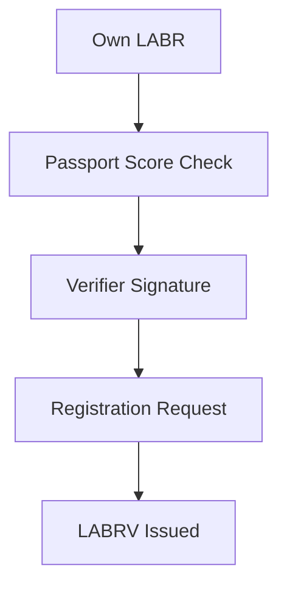

---

## 9.11 LABRV Issuance

For a successfully registering wallet that does not already hold LABRV, Registration V4 requests issuance of:

$$
1 	ext{ LABRV}
$$

LaborVote V7 mints the governance token directly to the participant's wallet and rejects a mint to any address that already holds LABRV.

If a previously unregistered wallet already holds LABRV, Registration V4 records the registration without requesting another mint. The wallet continues to hold one LABRV.

Governance influence is therefore derived from registered status and one non-transferable LABRV rather than token accumulation.

---

## 9.12 One-Time Registration

Registration may occur only once per wallet address.

Registration V4 permanently records successful registration through its registration-state mapping. Once an address is recorded as registered, any later registration attempt from that address is rejected.

LaborVote V7 separately prevents minting to an address that already holds LABRV. If an otherwise eligible, previously unregistered address already holds LABRV, Registration V4 records the registration without minting an additional governance token.

These controls prevent duplicate LABRV issuance to the same wallet address.

## 9.13 Governance Independence

Governance V13 cannot:

* Change Registration V4's contract dependencies.
* Change the fixed verifier address stored in Registration V4.
* Mint LABRV directly.
* Change the one-LABRV-per-registered-wallet rule.
* Change the minimum on-chain LABR balance requirement.

Passport scoring is not performed by governance, but the verifier service remains an external eligibility dependency.

---

## 9.14 Administrative and Operational Dependencies

Registration V4 has no owner role and no administrative setters. Its LABR, LABRV, and verifier addresses are fixed at deployment.

The absence of a contract owner does not remove all operational dependence. The verifier can withhold signatures, become unavailable, or apply its policy incorrectly. A verifier compromise could authorize wallets that do not satisfy the published Passport policy, although Registration V4 would still prevent duplicate registration by the same address and LABRV could still be minted only through the permanently locked Registration V4 minter.

Registration is therefore autonomous at the contract layer but dependent upon an external verifier for new participant authorization.

## 9.15 Security Considerations

The Registration Protocol incorporates multiple layers of protection.

### Economic Requirement

Minimum LABR ownership establishes protocol participation.

### Passport Verification

Provides Sybil-resistance signals.

### Verifier Signatures

Prevent unauthorized registration.

### Duplicate Prevention

Restricts governance token issuance to one per registered wallet address.

### Fixed On-Chain Rules

Protect Registration V4's contract-enforced conditions from governance interference. Passport scoring remains a verifier policy.

Together, these mechanisms support governance integrity while preserving participant accessibility.

---

## 9.16 Role Within the Protocol

The Registration Protocol serves as the bridge between the economic layer and the governance layer.

Without registration:

Participants may own LABR.

With registration:

Participants may own LABR and participate in governance.

This distinction allows LaborCoin to separate economic activity from governance authority while maintaining a transparent pathway between the two.

---

## 9.17 Summary

The Registration Protocol establishes governance eligibility through an on-chain minimum-LABR and duplicate-registration check combined with an unexpired authorization from the fixed verifier. Passport evaluation and attestation acceptance occur in the documented verifier and interface workflow.

Under the standard onboarding path, successful registration results in issuance of a single LABRV governance token. If the wallet already holds LABRV, Registration V4 records the registration without minting another token. This implements the protocol's one verified participant per LABRV model while acknowledging that Passport-based uniqueness remains probabilistic.

By separating registration from token ownership, LaborCoin seeks to reduce governance concentration while maintaining resistance to duplicate participation.

---

# Chapter 10: Identity Verification and Sybil Resistance

## 10.1 Introduction

A central challenge facing any democratic governance system is determining who is eligible to participate.

Traditional political systems frequently rely upon legal identity, citizenship, residency, or institutional membership. Decentralized blockchain systems operate in a fundamentally different environment, where participants interact through cryptographic addresses rather than government-issued identities.

This creates a significant challenge.

If governance participation is unrestricted, a single individual may create large numbers of wallets and obtain disproportionate influence. This problem is commonly referred to as a Sybil attack.

LaborCoin addresses this challenge through integration with Human Passport.

The purpose of Passport integration is not to establish legal identity or perform traditional Know Your Customer (KYC) verification. Rather, the objective is to increase confidence that governance participants represent distinct individuals while preserving accessibility and privacy.

This chapter explains the rationale behind Passport integration, the design tradeoffs involved, and the role Passport plays within the broader LaborCoin governance architecture.

---

## 10.2 The Sybil Problem

The term "Sybil attack" refers to a situation in which one participant controls multiple identities within a system.

In blockchain environments, creating additional wallet addresses is generally inexpensive and requires little effort.

Without countermeasures, governance systems based solely on wallet ownership may become vulnerable to manipulation.

For example:

* One individual could create hundreds of wallets.
* One organization could control thousands of wallets.
* Governance outcomes could be distorted without acquiring meaningful community support.

This problem becomes particularly important when governance rights are distributed equally among participants.

A one verified participant per LABRV system only functions if there is reasonable confidence that each participant represents a unique individual.

Consequently, some form of Sybil resistance becomes necessary.

---

## 10.3 Why Not Pure Token Voting?

Many blockchain governance systems avoid the Sybil problem by assigning voting power according to token ownership.

Under this model:

One token = One vote.

This approach reduces concerns regarding duplicate identities because influence is tied directly to capital ownership.

However, it introduces a different problem.

Governance power becomes concentrated among participants who possess the largest token balances.

Over time, governance influence often accumulates among:

* Early investors
* Large holders
* Institutional participants
* Exchanges

While this model may be appropriate for some systems, it conflicts with LaborCoin's objective of separating governance participation from wealth accumulation.

Because LaborCoin seeks to maintain a one verified participant per LABRV governance structure, an alternative approach to Sybil resistance is required.

---

## 10.4 Why Not Traditional KYC?

Another possible approach would be traditional identity verification.

Under this model, participants might submit:

* Government identification
* Proof of residence
* Personal information
* Biometric data

While such systems can provide strong identity assurance, they introduce significant drawbacks.

### Privacy Concerns

Participants may be unwilling to disclose sensitive personal information.

### Accessibility Concerns

Identity documentation requirements may exclude otherwise legitimate participants.

### Centralization Concerns

KYC systems frequently require centralized custodians capable of storing and managing personal data.

### Security Concerns

Centralized identity databases create attractive targets for misuse or compromise.

LaborCoin therefore avoids traditional KYC requirements.

The protocol seeks to verify uniqueness rather than identity.

---

## 10.5 Why Human Passport?

Human Passport provides a practical middle ground between unrestricted participation and traditional KYC systems.

Passport aggregates a variety of identity signals and produces a score representing confidence that a participant corresponds to a distinct individual.

These signals may include:

* Social accounts
* Blockchain activity
* Reputation systems
* Community participation
* Additional verification mechanisms

Rather than requiring disclosure of legal identity, Passport evaluates the strength and diversity of a participant's identity footprint.

This approach aligns with LaborCoin's objective of balancing:

* Accessibility
* Privacy
* Governance integrity

---

## 10.6 Passport Threshold Selection

LaborCoin currently requires a minimum Passport score of:

$$
15
$$

This threshold serves as the minimum requirement for governance eligibility.

The selection of any threshold involves tradeoffs.

### Lower Thresholds

Advantages:

* Greater accessibility
* Easier onboarding

Disadvantages:

* Reduced Sybil resistance

### Higher Thresholds

Advantages:

* Stronger Sybil resistance

Disadvantages:

* Increased participation barriers

The selected threshold represents a governance design choice intended to provide meaningful protection against duplicate participation while remaining achievable for legitimate users.

---

## 10.7 Passport as Evidence, Not Identity

It is important to distinguish between identity verification and uniqueness verification.

LaborCoin does not attempt to determine:

* Legal identity
* Nationality
* Citizenship
* Occupation
* Political affiliation

The protocol does not require this information.

Instead, Passport functions as evidence suggesting that a participant represents a distinct individual.

The governance system therefore relies on uniqueness signals rather than personal identity disclosures.

This distinction is fundamental to the protocol's privacy model.

---

## 10.8 Verifier Architecture

Passport data is evaluated through a verifier service associated with the fixed signing address:

`0x475d519631d2406753aCA29F305f19b83E97513e`

The verifier performs two related authorization functions.

### Registration Authorization

For Registration V4, the verifier signs the participant address and an expiration timestamp after the participant satisfies the published Passport policy.

### Governance-Action Authorization

Governance V13 requires verifier authorizations for proposal creation and voting. These authorizations bind the caller, an action code, the caller's nonce, an expiration timestamp, and the Governance V13 contract address.

The verifier does not directly register users, mint LABRV, record votes, create proposals, or execute treasury transfers. Those state changes remain controlled by the deployed contracts.

---

## 10.9 Cryptographic Authorization

Registration and governance actions use different replay-protection mechanisms.

### Registration V4

A registration authorization is bound to the participant address and expiry. Registration V4 also records whether the address has already registered, so the same address cannot use a signature to mint a second LABRV.

### Governance V13

Proposal and vote authorizations include an action code, the participant's current nonce, an expiration timestamp, and the Governance V13 contract address. Governance V13 stores participant nonces and rejects reused or expired authorizations.

The verifier can authorize eligibility, but it cannot bypass the contract's on-chain conditions or perform the protected state change itself.

## 10.10 Privacy Model

Privacy considerations influenced several aspects of the protocol's design.

The protocol intentionally minimizes collection of personal information.

LaborCoin does not require:

* Government-issued identification
* Real names
* Residential addresses
* Employment records
* Financial statements

Governance participation is therefore based on eligibility verification rather than identity disclosure.

Participants retain control over their personal information while still contributing uniqueness signals through Passport.

---

## 10.11 Limitations

No Sybil resistance system is perfect.

Human Passport provides probabilistic confidence rather than absolute guarantees.

It is possible that some duplicate identities may evade detection.

It is also possible that some legitimate participants may encounter difficulties obtaining sufficient Passport scores.

LaborCoin acknowledges these limitations.

The objective is not perfect identity verification.

The objective is practical resistance to governance manipulation while preserving accessibility and privacy.

---

## 10.12 Tradeoffs

The Passport model reflects a deliberate tradeoff between competing objectives.

### Accessibility

The protocol seeks to remain open to broad participation.

### Privacy

The protocol seeks to avoid unnecessary identity disclosure.

### Security

The protocol seeks to reduce duplicate participation.

### Decentralization

The protocol seeks to minimize dependence on centralized identity providers.

No single system optimizes all four objectives simultaneously.

Passport integration represents LaborCoin's attempt to balance these competing requirements.

---

## 10.13 Relationship to Governance

Passport verification is not intended to determine governance outcomes.

Passport determines eligibility.

LABRV determines governance participation.

Governance decisions remain subject to community voting.

Passport therefore functions as an entry requirement rather than a governance weighting mechanism.

Participants with higher Passport scores do not receive additional voting power.

Once eligibility is established, all registered participants possess equal governance rights.

This principle reinforces the protocol's commitment to democratic participation.

---

## 10.14 Governance Independence and Verifier Dependence

Governance V13 does not control Passport scores, the fixed verifier address, or Registration V4's eligibility checks.

However, the verifier is not merely passive evidence. Because proposal creation, voting, and new registration require valid signatures under the deployed design, verifier availability and correct policy operation remain material dependencies.

A verifier cannot fabricate an on-chain vote or treasury transfer by itself. It can nevertheless authorize ineligible activity, refuse eligible activity, or interrupt onboarding and authenticated governance actions if unavailable. This dependency is included in the threat model rather than being described as fully decentralized identity infrastructure.

---

## 10.15 Future Considerations

The decentralized-identity ecosystem may provide improved methods for establishing uniqueness and participation eligibility. The deployed LaborCoin contracts do not contain a verifier-upgrade mechanism, so replacing the fixed verifier would require a separate migration rather than a Governance V13 parameter change.

The guiding principle remains unchanged:

Governance participation should reflect distinct participants rather than concentrated capital or unrestricted wallet creation.

## 10.16 Summary

Human Passport serves as the foundation of LaborCoin's Sybil-resistance model.

By focusing on uniqueness rather than legal identity, the protocol seeks to support democratic participation without requiring traditional KYC systems.

Passport verification, combined with verifier authorization and LABRV issuance, forms the identity layer of the LaborCoin governance architecture.

This layer supports the protocol's one verified participant per LABRV model while preserving privacy and accessibility, subject to the limitations and external dependencies described above.

Figure 5. Registration Authorization Flow

Illustrates the separation between off-chain eligibility evaluation and on-chain registration enforcement.

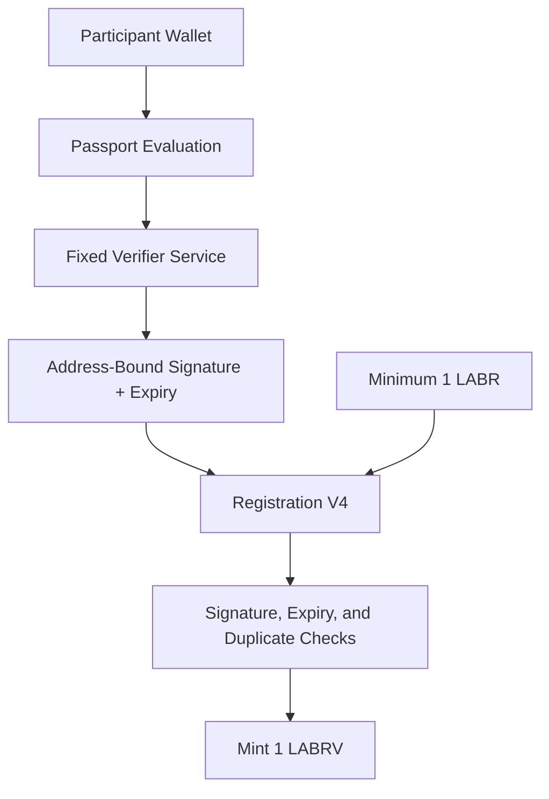
---

# Chapter 11: LABRV Governance Token

## 11.1 Introduction

The LaborCoin Governance Token (LABRV) serves as the governance participation layer of the LaborCoin protocol.

Unlike LABR, which functions as a transferable utility token, LABRV exists exclusively to represent governance rights.

The token is issued through the Registration Protocol and grants eligible participants the ability to propose, vote upon, and execute governance decisions according to protocol rules.

A defining characteristic of LABRV is that it is non-transferable.

Governance rights therefore cannot be purchased, sold, delegated through market transactions, or accumulated through token acquisition. Instead, governance participation is linked directly to successful registration.

This design reflects one of the central objectives of LaborCoin:

To separate governance authority from capital ownership.

---

## 11.2 Purpose

LABRV exists to represent governance participation rather than economic ownership.

The token performs several functions within the protocol.

### Governance Eligibility

LABRV serves as proof that a participant has completed registration and satisfied governance requirements.

### Voting Rights

LABRV enables participation in governance proposals.

### Proposal Creation

LABRV holders may create governance proposals subject to protocol rules.

### Governance Execution

LABRV holders determine proposal outcomes through voting. After voting ends, any address may submit an approved proposal for permissionless execution during the execution window.

Importantly, LABRV does not function as an economic asset.

It was not designed for speculation, trading, or investment purposes.

Its sole purpose is governance participation.

---

## 11.3 Governance Separation

A foundational design principle of LaborCoin is the separation between:

* Economic participation
* Governance participation

LABR represents economic participation.

LABRV represents governance participation.

This distinction seeks to address a recurring challenge within blockchain governance systems.

When governance rights are tied directly to token ownership, governance influence tends to concentrate among large holders.

LaborCoin attempts to mitigate this effect by establishing an independent governance credential.

Ownership of LABR does not automatically grant governance authority.

Governance authority requires registration and issuance of LABRV.

---

## 11.4 One Verified Participant per LABRV

The governance architecture is built around one non-transferable LABRV for each successfully registered participant wallet.

Each successful registrant receives:

$$
1 \text{ LABRV}
$$

The protocol does not issue additional governance tokens based on:

* LABR holdings
* Exchange activity
* Treasury contributions
* Proposal history
* Voting frequency

Every registered wallet holding one LABRV possesses the same voting weight in Governance V13.

This design prioritizes participant equality over wealth-weighted governance while recognizing that Passport-assisted uniqueness is an approximation rather than proof of personhood.

---

## 11.5 Fixed Governance Weight

Because each participant receives exactly one LABRV token, governance influence remains constant across participants.

A participant holding:

1 LABR

and a participant holding:

10,000 LABR

possess identical governance voting weight once registered.

The protocol therefore intentionally separates financial ownership from governance influence.

This distinction represents one of the most significant differences between LaborCoin and traditional token-governance systems.

---

## 11.6 Soulbound Design

LABRV is implemented as a non-transferable token.

Tokens may be:

* Minted
* Held

Tokens may not be:

* Sold
* Purchased
* Traded
* Transferred between participants

This design is commonly described as a soulbound token model.

The objective is to ensure that governance rights remain attached to registered participants rather than becoming commodities within secondary markets.

---

## 11.7 Why Non-Transferability Matters

The non-transferable nature of LABRV serves several important purposes.

### Governance Integrity

Voting rights remain connected to registered participants.

### Reduced Market Influence

Governance power cannot be accumulated through token purchases.

### Reduced Governance Speculation

Governance participation is separated from token trading.

### Consistency

Governance weight remains stable across participants.

Without non-transferability, governance rights could gradually become concentrated among participants willing to purchase governance tokens from others.

The soulbound design prevents ordinary token purchases and transfers from producing this outcome. Wallet compromise, wallet sale, coercion, coordinated voting, and multi-wallet identity manipulation remain separate risks.

---

## 11.8 Registration Integration

LABRV issuance is controlled by the Registration Protocol.

The governance token cannot be acquired directly.

The only method of obtaining LABRV is successful registration.

The registration workflow ensures that governance participation remains tied to:

* Passport verification
* Verifier authorization
* Completion of the documented attestation workflow
* Protocol eligibility requirements

This relationship forms the bridge between the identity layer and the governance layer.

---

## 11.9 Minting Architecture

The LABRV contract includes a designated minter role.

The permanently locked minter is:

Registration V4

Contract Address:

0xd1CD6C0B6f1F709A52908B40C07D3C54649e323C

When registration succeeds and the participant wallet holds no LABRV, Registration V4 requests the mint of exactly one LABRV. If the wallet already holds LABRV, registration is recorded without an additional mint.

The LABRV contract itself does not evaluate registration requirements.

Those responsibilities remain within the Registration Protocol.

This separation simplifies auditing and reduces contract complexity.

---

## 11.10 Duplicate Prevention

Registration V4 rejects any wallet address already recorded as registered.

For a previously unregistered address, Registration V4 checks the address's LABRV balance before minting. If the balance is zero, Registration V4 calls LaborVote V7 to mint one LABRV. If the address already holds LABRV, Registration V4 records the registration without attempting an additional mint.

LaborVote V7 independently rejects any mint call targeting an address that already holds LABRV. Together, these controls prevent duplicate LABRV issuance to the same wallet address.

## 11.11 Completed Minter Lock Procedure

The final LABRV configuration was completed as follows:

### Step 1

Registration V4 was assigned as the LABRV minter.

### Step 2

Registration and minting functionality were validated on Polygon Mainnet.

### Step 3

The minter configuration was permanently locked.

The final minter is:

`0xd1CD6C0B6f1F709A52908B40C07D3C54649e323C`

The minter can no longer be changed.

---

## 11.12 Ownership Renouncement

After the minter was locked, LaborVote V7 ownership was renounced.

Current state:

* No owner remains.
* Registration V4 is the only minter.
* The minter address cannot be changed.
* LABRV transfer restrictions remain governed by deployed bytecode.

## 11.13 Governance Rights

Possession of LABRV grants participation rights within the governance framework.

These rights include:

### Proposal Creation

Eligible participants may create governance proposals.

### Voting

Participants may vote on active proposals.

Proposal creation and voting rights are granted equally to eligible registered participants.

### Proposal Execution

Proposal execution is permissionless. After voting ends, any address may submit an approved proposal for execution during its seven-day execution window. The executing address cannot change the recipient, amount, or proposal terms. Governance V13 revalidates the stored proposal, voting thresholds, execution deadline, treasury cap, and prior-execution status.

---

## 11.14 Governance Rights Not Granted

LABRV does not provide unrestricted authority.

Possession of LABRV does not permit participants to:

* Modify token economics
* Change exchange parameters
* Alter registration requirements
* Increase token supply
* Change voting thresholds
* Change treasury limits
* Pause exchange activity

These restrictions reflect the protocol's principle of constrained governance.

LABRV grants treasury governance rights rather than administrative authority.

---

## 11.15 Relationship to Treasury Governance

The purpose of LABRV is not to govern every aspect of the protocol.

Its purpose is to govern treasury allocation.

Participants collectively determine:

* Whether proposals pass
* How treasury resources are allocated
* Which recipients receive approved distributions

The governance token therefore functions as an instrument of collective decision-making rather than protocol administration.

---

## 11.16 Governance Equality

A central philosophical objective of LABRV is governance equality.

Within the governance system:

* Every registered participant receives one governance token.
* Every governance token possesses equal weight.
* Every vote contributes equally to outcomes.

The protocol therefore attempts to approximate democratic participation while maintaining practical Sybil resistance through the registration process.

---

## 11.17 Security Considerations

Several security properties arise from the LABRV design.

### Non-Transferability

Prevents ordinary token-transfer markets for LABRV. It does not prevent wallet sale, wallet compromise, coercion, or off-chain coordination.

### Single Issuance

Prevents repeated registration and duplicate LABRV minting by the same wallet.

### Registration Integration

Restricts governance access to verified participants.

### Minter Locking

Prevents replacement of the permanent Registration V4 minter. It does not protect against a defect in the fixed minter contract.

### Ownership Renouncement

Eliminates LaborVote V7 owner administration after minter locking.

Together, these mechanisms help preserve governance integrity.

---

## 11.18 Governance Philosophy

LABRV reflects a broader philosophical distinction within LaborCoin.

The protocol does not assume that financial ownership should automatically translate into governance authority.

Instead, LaborCoin attempts to establish governance participation through verified registration and equal voting rights.

Whether this model proves effective will ultimately depend upon participation, community engagement, and governance outcomes.

However, the architecture itself is intentionally designed to prioritize participation equality over capital concentration.

---

## 11.19 Summary

LABRV serves as the governance participation token of the LaborCoin protocol.

Issued through Registration V4, restricted to one token per registered address, and permanently non-transferable, LABRV forms the foundation of LaborCoin's one verified participant per LABRV governance model.

The token separates governance rights from economic ownership while providing participants with equal authority over treasury allocation decisions.

Together with Passport verification and the Registration Protocol, LABRV forms the core of the protocol's democratic governance framework.

---

# Chapter 12: Governance Framework

## 12.1 Introduction

The LaborCoin Governance Framework provides the mechanism through which registered participants collectively determine how treasury resources are allocated.

The governance system is intentionally limited in scope.

Unlike many blockchain governance systems, LaborCoin governance does not control protocol operation, token economics, exchange behavior, registration requirements, or administrative permissions.

Instead, governance exists for a single purpose:

**Collective treasury allocation.**

This distinction is fundamental to the protocol architecture.

Governance determines where resources are directed.

The protocol determines how the system operates.

By separating these responsibilities, LaborCoin seeks to reduce governance capture risks while preserving democratic control over treasury resources.

---

## 12.2 Governance Objectives

The governance system was designed around several objectives.

### Democratic Participation

Every registered participant should possess equal voting authority.

### Transparency

All proposals, votes, and outcomes should be publicly auditable.

### Accountability

Treasury distributions should occur only after explicit approval.

### Predictability

Governance procedures should remain consistent over time.

### Limited Authority

Governance should control treasury allocation without controlling protocol rules.

These objectives guided the design of the governance architecture.

---

## 12.3 Governance Eligibility

Participation in governance requires successful Registration V4 onboarding and LABRV ownership.

The official workflow includes LABR ownership, Passport evaluation, verifier authorization, and successful registration. Governance V13 additionally requires a valid action-code-specific verifier authorization when a participant creates a proposal or casts a vote.

This structure creates a clear distinction between economic participation and governance participation while preserving an external verifier dependency for authenticated governance actions.

---

## 12.4 Governance-Action Authorization

Governance V13 requires a verifier signature for proposal creation and voting.

Each authorization binds:

* The participant address
* An action code
* The participant's expected nonce
* An expiration timestamp
* The Governance V13 contract address

The action codes are:

* `0` for proposal creation
* `1` for a yes vote
* `2` for a no vote

The signature does not bind a proposal ID, proposal title, description, recipient, requested amount, or other proposal contents.

Governance V13 verifies the signature against the fixed verifier address, checks the nonce and expiration timestamp, and increments the participant's nonce after successful use. This prevents the same authorization from being reused.

## 12.5 Proposal Creation

Governance begins with proposal creation.

A proposal represents a request to allocate treasury resources to a specified recipient.

Each proposal contains:

### Title

A concise description of the proposal.

### Description

Detailed explanation of the proposal's purpose.

### Recipient

Destination address for treasury funds.

### Amount

Requested treasury allocation.

### Start Time

Beginning of voting period.

### End Time

End of voting period.

### Execution Status

Records whether the proposal has been executed.

These fields ensure proposals remain transparent and publicly verifiable.

---

## 12.6 Treasury Allocation Focus

LaborCoin governance is intentionally restricted to treasury allocation decisions.

Governance may determine:

* Whether a proposal receives funding.
* How much funding is allocated.
* Which recipient receives approved funds.

Governance may not determine:

* Token supply.
* Token taxes.
* Exchange pricing.
* Registration requirements.
* Governance thresholds.
* Treasury caps.

These restrictions preserve the distinction between governance and protocol administration.

---

## 12.7 Proposal Lifecycle

Every proposal progresses through a defined lifecycle.

Figure 6. Proposal Lifecycle.

Illustrates the progression from proposal creation through voting and permissionless execution. Vote approval and execution eligibility are distinct: a proposal may satisfy the voting thresholds but still fail execution conditions such as the fifty-member minimum, execution-time treasury cap, execution deadline, or DAO permission requirements.

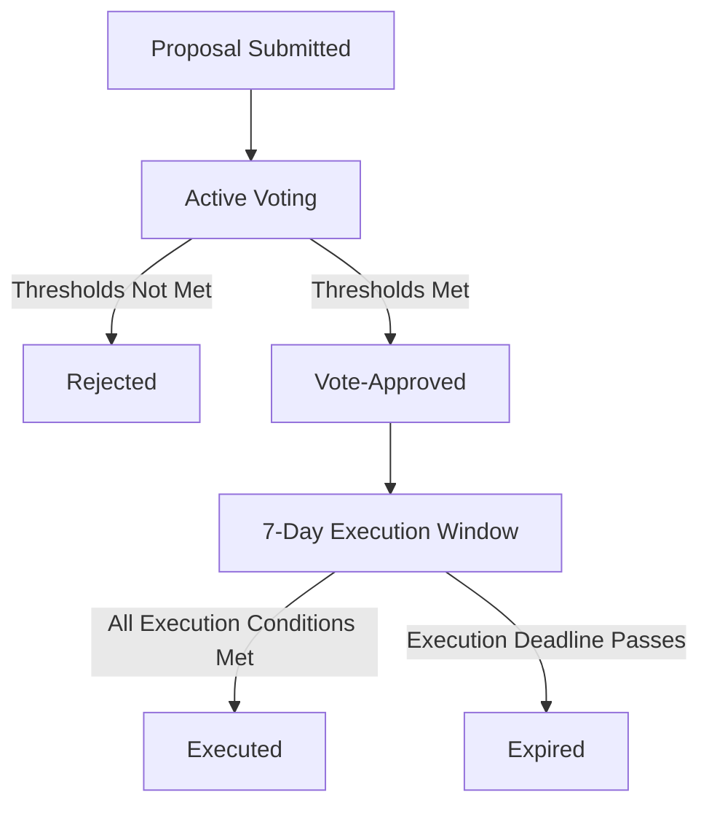

---

## 12.8 Voting Period

LaborCoin proposals remain open for voting for:

$$
14 \text{ Days}
$$

This period is intended to balance two competing considerations.

### Shorter Voting Periods

Advantages:

* Faster decisions

Disadvantages:

* Reduced participation opportunity

### Longer Voting Periods

Advantages:

* Greater participation opportunity

Disadvantages:

* Slower governance response

The fourteen-day period represents a compromise between responsiveness and inclusiveness.

---

## 12.9 Voting Process

During the voting period, eligible LABRV holders may cast votes by submitting the proposal choice together with a valid verifier signature, nonce, and expiry.

Each LABRV token represents one vote.

Participants may vote:

### For

Support proposal approval.

### Against

Oppose proposal approval.

After Governance V13 validates eligibility and authorization, votes are recorded on-chain and remain publicly auditable.

Because LABRV is non-transferable, voting rights remain attached to registered participants.

---

## 12.10 Participation Threshold

Not every proposal should pass simply because a small number of participants vote.

To address this concern, LaborCoin requires a minimum participation threshold.

Participation Threshold:

$$
25%
$$

At least twenty-five percent of registered governance participants must vote for a proposal to become eligible for approval.

This requirement helps ensure that treasury decisions reflect meaningful community participation.

---

## 12.11 Why Participation Thresholds Exist

Without participation thresholds, governance systems may become vulnerable to low-turnout decision making.

For example:

* A small group of participants could approve proposals during periods of low activity.
* Treasury allocations could occur without broad community awareness.

The participation threshold seeks to reduce these risks by requiring a minimum level of engagement before proposals can succeed.

---

## 12.12 Approval Threshold

Participation alone is not sufficient.

A proposal must also receive sufficient support.

Approval Threshold:

$$
67%
$$

A proposal must receive at least sixty-seven percent approval among participating voters.

This threshold exceeds a simple majority.

The objective is to encourage broad agreement before treasury resources are allocated.

---

## 12.13 Why Two-Thirds Approval?

Several voting thresholds were considered conceptually.

### Simple Majority

50% + 1

Advantages:

* Easier proposal passage

Disadvantages:

* Greater polarization

---

### Supermajority

67%

Advantages:

* Stronger consensus
* Greater legitimacy
* Reduced factionalism

Disadvantages:

* Higher approval requirement

LaborCoin adopts the supermajority approach because treasury allocations involve collectively managed resources.

---

## 12.14 Treasury Spending Cap

Governance authority is constrained by treasury limits.

Maximum Proposal Size:

$$
5%
$$

of the Aragon DAO's native POL balance at execution.

This restriction prevents individual proposal executions from exhausting treasury resources.

The cap is not checked when a proposal is created or while votes are cast. Governance V13 evaluates it when execution is attempted, using the Aragon DAO's native POL balance at that time.

The cap serves as a risk-management mechanism that limits potential governance failures.

---

## 12.15 Why Treasury Limits Exist

Treasury governance always involves risk.

Potential concerns include:

* Poor decision making
* Governance manipulation
* Concentrated voting campaigns
* Community disagreement

The treasury cap reduces the impact of any single proposal.

Even successful proposals remain limited in scope relative to total treasury resources.

---

## 12.16 Minimum Membership Requirement

The governance system includes a minimum membership threshold before treasury execution becomes active.

Minimum Registered Members:

$$
50
$$

The purpose of this requirement is to ensure governance participation has reached a meaningful level before treasury resources become subject to governance decisions.

This safeguard helps avoid situations where a very small number of participants control treasury allocation during early protocol development.

---

## 12.17 Vote Approval and Execution Conditions

A proposal is vote-approved after the voting period only when both voting requirements are satisfied:

### Voting Requirement 1

Participation is at least twenty-five percent.

### Voting Requirement 2

At least sixty-seven percent of participating votes support the proposal.

The proposal amount, fifty-member activation requirement, seven-day deadline, prior-execution status, current DAO POL balance, and DAO permission state are execution conditions rather than vote-approval conditions. A vote-approved proposal may therefore remain unexecuted if any execution condition is not satisfied.

### Governance Calculation Timing

Governance V13 evaluates participation using the current number of registered members whenever proposal status is checked:

`participation = floor((yesVotes + noVotes) × 100 / current totalMembers)`

Approval is calculated from participating votes:

`approval = floor(yesVotes × 100 / (yesVotes + noVotes))`

The registered-member count is not snapshotted when the proposal is created. The fifty-member activation requirement and the five-percent limit based on the DAO's native POL balance are checked when execution is attempted.

---

## 12.18 Execution Window

Approved proposals do not remain executable indefinitely.

Execution Window:

$$
7 \text{ Days}
$$

Following approval, participants have seven days to execute the proposal.

If execution does not occur during this period, the proposal expires.

---

## 12.19 Why Execution Windows Exist

Execution windows serve several purposes.

### Predictability

Governance outcomes remain timely.

### Security

Old approvals cannot be executed years later.

### Administrative Clarity

Treasury state remains current.

### Replay Prevention

Execution authority remains bounded in time.

The seven-day period balances flexibility and certainty.

---

## 12.20 Treasury Execution

When an approved proposal is executed:

### Step 1

Governance V13 verifies proposal status, participation, approval, the five-percent cap based on the Aragon DAO's native POL balance at execution, the execution window, and non-execution.

### Step 2

Governance V13 submits the constrained execution action to the Aragon DAO.

### Step 3

The DAO calls Treasury Module V1 and supplies the approved POL amount.

### Step 4

Treasury Module V1 verifies that the caller is the DAO and forwards the value to the approved recipient.

### Step 5

Treasury Module V1 updates `totalDistributed`, and Governance V13 records the proposal as executed.

The process occurs on-chain. The `executeProposal` function is permissionless: any address may submit the execution transaction after voting ends. The caller does not select the recipient, amount, or execution action; Governance V13 uses the proposal data already stored on-chain and revalidates every execution condition.

The exclusivity of the resulting DAO action depends upon the final Aragon permission registry granting the required execution permission to Governance V13 and removing obsolete executors.

## 12.21 Governance Security Model

Several security mechanisms support governance integrity.

### One Verified Participant per LABRV

Prevents governance concentration through token accumulation.

### Passport Verification

Provides Sybil resistance.

### Non-Transferable LABRV

Prevents governance markets.

### Participation Threshold

Reduces low-turnout decisions.

### Supermajority Approval

Encourages broad consensus.

### Treasury Cap

Limits proposal impact.

### Execution Window

Restricts delayed execution risks.

Together, these mechanisms create multiple layers of governance protection.

---

## 12.22 Governance Independence

Governance possesses authority over treasury allocation.

Governance does not possess authority over protocol operation.

Governance V13 cannot:

* Change Exchange V4 behavior.
* Call LABR token administration functions through its proposal format.
* Change Registration V4 dependencies or its fixed verifier.
* Change governance thresholds.
* Modify Treasury Module V1.
* Modify the five-percent treasury-allocation cap based on the Aragon DAO's native POL balance at execution.

The external verifier service, not Governance V13, applies the published Passport-score policy.

This distinction is one of the defining characteristics of the LaborCoin protocol.

---

## 12.23 Governance Philosophy

LaborCoin governance is intentionally narrower than governance systems commonly found within blockchain ecosystems.

The protocol does not attempt to govern every aspect of operation through voting.

Instead, it seeks to combine:

* Fixed protocol rules
* Democratic treasury allocation
* Transparent execution

within a single governance framework.

Participants determine how resources are allocated.

The protocol determines how the system operates.

This separation is intended to provide both democratic participation and long-term stability.

---

## 12.24 Summary

The LaborCoin Governance Framework provides a transparent and constrained mechanism for collective treasury allocation.

Through equal LABRV voting weight, verifier-assisted Sybil resistance, action-code-specific signatures, supermajority approval requirements, treasury spending caps, and execution windows, the protocol seeks to balance democratic participation with treasury protection.

Governance controls treasury decisions, but governance does not control the protocol itself.

This distinction forms one of the central architectural principles of LaborCoin.

---

# Chapter 13: Treasury Architecture

## 13.1 Introduction

The Treasury Architecture serves as the financial execution layer of the LaborCoin protocol.

Its purpose is to securely receive, hold, account for, and distribute resources according to approved governance decisions.

The treasury system was designed around several principles:

* Transparency
* Limited authority
* Governance accountability
* Security through separation of responsibilities
* Post-launch autonomy

Unlike many blockchain systems in which governance directly controls treasury assets, LaborCoin intentionally separates treasury custody, governance decision-making, and treasury execution into distinct components.

This separation reduces attack surfaces, simplifies auditing, and limits the consequences of governance failures.

---

## 13.2 Treasury Philosophy

The LaborCoin treasury exists to support collective resource allocation.

The protocol itself does not determine which causes, organizations, workers, communities, or initiatives should receive support.

Those decisions remain subject to governance participation.

The treasury therefore functions as neutral infrastructure.

Its role is not to decide.

Its role is to execute decisions that satisfy governance requirements.

This distinction is fundamental.

The treasury is not an administrator.

The treasury is an executor.

---

## 13.3 Treasury Components

The treasury architecture consists of two primary components.

### DAO Treasury

Primary treasury account responsible for holding treasury assets.

Current Address:

`0x0C2e5679153593b82a84eAB5CA90895BB291Cec4`

### Treasury Module

Dedicated execution contract responsible for carrying out approved treasury transfers.

Current Address:

`0x10F2798ef055950B897AF4B3A8ae90dE34f6C56C`

These components operate together but perform different functions.

---

## 13.4 Why Treasury Separation Exists

A common pattern within blockchain governance systems is direct treasury control.

Under this model:

Governance approves a proposal.

Governance directly transfers funds.

While simple, this design creates risks.

For example:

* Larger attack surface
* More complex governance contracts
* Greater auditing complexity
* Increased authority concentration

LaborCoin instead separates:

### Governance Decisions

From

### Treasury Execution

Governance decides.

Treasury executes.

This architecture simplifies responsibilities and reduces protocol complexity.

---

## 13.5 Treasury Growth

Treasury resources accumulate primarily through protocol activity.

The treasury grows through:

### Exchange Purchases

10% of incoming POL from purchases.

### Sell-Side Treasury Allocations

5% allocation generated through LABR transfer taxation.

### Voluntary Contributions

Participants may contribute assets directly.

As protocol participation increases, treasury resources grow alongside ecosystem activity.

This creates a direct relationship between protocol usage and treasury capacity.

---

## 13.6 Treasury Neutrality

The treasury does not evaluate proposals.

The treasury does not determine recipients.

The treasury does not possess discretionary authority.

Instead, treasury behavior is entirely dependent upon governance outcomes.

Once governance approval requirements have been satisfied, Governance V13 can invoke the predefined DAO and Treasury Module V1 execution path, subject to the final DAO permission registry.

This neutrality helps preserve transparency and predictability.

---

## 13.7 Treasury Module V1 Design

Treasury Module V1 is intentionally narrow.

Its deployed constructor permanently sets the Aragon DAO as the only authorized caller. The module exposes one transfer function: the DAO calls `executeTransfer(recipient)` while supplying the approved POL amount as transaction value. The module forwards that value to the recipient and increments `totalDistributed`.

The module does not:

* Hold governance authority
* Create or evaluate proposals
* Store voting logic
* Change governance outcomes
* Change protocol parameters
* Maintain an owner or upgrade role

The module is an execution boundary rather than a general-purpose treasury administrator.

---

## 13.8 Treasury Execution Process

Treasury execution follows this sequence:

### Step 1

Governance V13 validates that the proposal passed, remains within the execution window, has not already executed, and satisfies the treasury cap.

### Step 2

Governance V13 instructs the Aragon DAO to execute the approved action.

### Step 3

The DAO calls Treasury Module V1 with the approved POL value.

### Step 4

Treasury Module V1 verifies that the caller is the DAO, forwards the POL to the approved recipient, updates `totalDistributed`, and emits the transfer event.

This design keeps custody in the DAO Treasury until execution and prevents the module from independently initiating a distribution.

## 13.9 Governance Allocation Flow

Treasury allocation involves authorization and value transfer through separate contracts.

Governance V13 records the proposal and votes. The Aragon DAO remains the treasury custodian. Treasury Module V1 performs the final approved native POL transfer.

Figure 7. Governance Allocation Flow.

Illustrates the final intended execution path from proposal creation and voting through Governance V13, the Aragon DAO, Treasury Module V1, and the approved recipient.

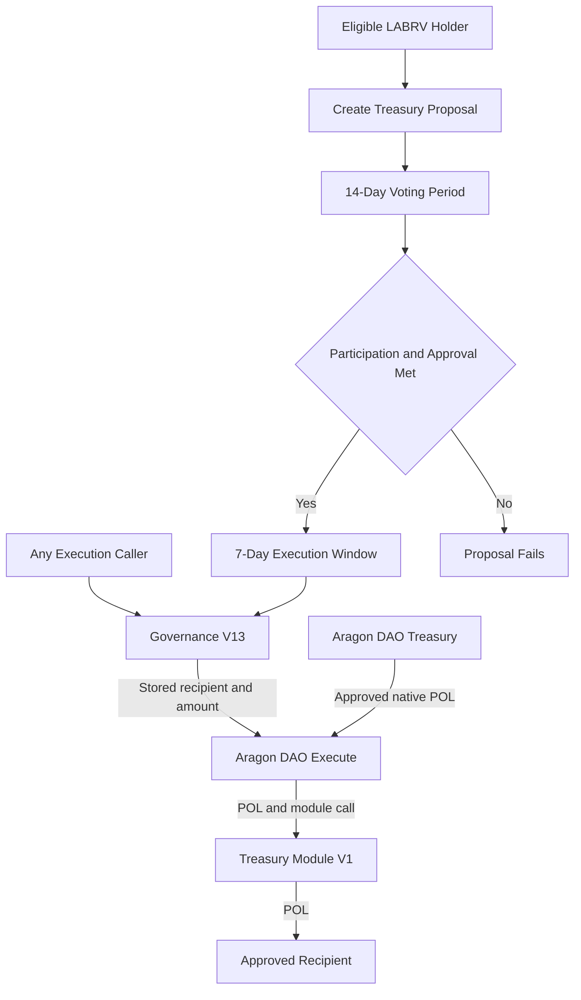

The treasury does not flow into Governance V13. Governance V13 supplies the constrained authorization logic, while the Aragon DAO supplies custody and execution.

The execution caller cannot change the stored recipient, amount, or DAO action.

---
## 13.10 Distribution Accounting

The Treasury Module maintains accounting information regarding treasury distributions.

Current implementation tracks:

### Total Distributed

Cumulative value distributed through governance-approved transfers.

This accounting information provides:

* Transparency
* Historical tracking
* Auditability

Participants can independently verify treasury activity using on-chain records.

---

## 13.11 Governance Constraints

Treasury execution remains subject to governance limitations.

Governance V13 cannot encode arbitrary transfers; its proposal and execution format is limited to the constrained treasury-allocation path.

Every treasury action must satisfy:

### Participation Threshold

25%

### Approval Threshold

67%

### Treasury Cap

5%

### Execution Window

7 Days

These requirements apply before treasury resources may be distributed.

---

## 13.12 Treasury Spending Cap

The treasury spending cap represents one of the protocol's most important safeguards.

Maximum proposal size:

$$
5%
$$

of the Aragon DAO's native POL balance at execution.

This limitation exists regardless of proposal popularity.

Even unanimous approval cannot bypass treasury caps.

The objective is to reduce systemic risk and preserve treasury longevity.

---

## 13.13 Why Spending Caps Matter

Consider a hypothetical governance failure.

Without treasury caps:

A single proposal could potentially exhaust treasury resources.

With treasury caps:

The maximum exposure remains limited.

This restriction provides several benefits:

* Reduced governance risk
* Improved treasury sustainability
* Greater community oversight
* Lower impact of mistakes

Treasury caps therefore function as a form of risk management.

---

## 13.14 Execution Windows

Treasury transfers remain executable only during the approved execution period.

Execution Window:

$$
7 \text{ Days}
$$

After expiration:

* Execution authority ends.
* Proposal becomes inactive.
* Treasury resources remain protected.

Execution windows prevent stale approvals from remaining valid indefinitely.

---

## 13.15 Security Boundaries

The treasury architecture intentionally defines clear security boundaries.

### Governance Controls

Proposal approval.

### Treasury Controls

Fund custody.

### Treasury Module Controls

Execution.

Each component performs a narrow function.

No single component possesses unrestricted authority.

This separation reduces systemic risk.

---

## 13.16 Post-Launch Operation

Following protocol finalization:

* Governance continues operating.
* Treasury continues accumulating resources.
* Treasury Module continues executing approved transfers.

No creator intervention is required for the Governance V13 execution path. Treasury security nevertheless depends upon the final Aragon permission configuration and verifier availability for authenticated proposal and voting actions.

This aligns with the protocol's broader objective of creating autonomous public infrastructure.

---

## 13.17 Transparency and Auditing

Every treasury action generates an on-chain record.

Participants may independently verify:

* Treasury balances
* Treasury growth
* Governance approvals
* Distribution history
* Recipient addresses

This transparency reduces dependence upon trust and enables public accountability.

Unlike traditional institutions, treasury activity remains continuously auditable.

---

## 13.18 Treasury Philosophy and Economic Solidarity

The treasury represents the practical purpose of the LaborCoin protocol.

The exchange distributes tokens.

The registration system establishes participation.

The governance framework coordinates decision-making.

The treasury is where collective decisions become tangible outcomes.

Through treasury allocations, participants may direct resources toward causes, communities, organizations, and workers according to collectively determined priorities.

The treasury therefore transforms governance from discussion into action.

---

## 13.19 Limitations

The treasury architecture does not guarantee:

* Effective governance
* Wise allocation decisions
* Community consensus
* Successful outcomes

The protocol provides infrastructure.

Participants remain responsible for governance choices.

The system can facilitate collective decision-making, but it cannot determine what decisions should be made.

---

## 13.20 Summary

The Treasury Architecture provides the financial execution layer of the LaborCoin protocol.

By separating governance decisions from treasury execution, limiting proposal sizes, enforcing execution windows, and maintaining transparent accounting, the protocol seeks to balance democratic participation with treasury protection.

The treasury exists not as a governing authority, but as an execution mechanism through which collectively approved decisions become real-world actions.

---

# Chapter 14: Security Architecture

## 14.1 Security Objective

LaborCoin was developed around a practical security question:

**How can blockchain-based public infrastructure support working-class collective action without depending upon hidden control, unrestricted founder authority, misleading claims, or discretionary access to shared resources?**

The protocol does not answer that question by claiming perfect security.

Its security model is based on:

* Publicly verified contract code
* Narrow and documented authority
* Separation of economic, identity, governance, custody, and execution functions
* Fixed or permanently locked custom-contract rules
* Constrained treasury governance
* Measurable economic controls
* Public transaction and permission evidence
* Explicit disclosure of external dependencies and residual risks

Security is treated as a system property rather than a feature of one contract.

No individual control is expected to provide complete protection.

---

## 14.2 Anti-Fraud Design Principles

LaborCoin is intended to avoid several patterns associated with deceptive or abusive blockchain projects.

### No Hidden Custom-Contract Administrator

Exchange V4, Registration V4, Governance V13, and Treasury Module V1 were deployed without owner administration.

LaborVote V7 used temporary ownership only to assign Registration V4 as minter, lock that minter permanently, and renounce ownership.

### No Unrestricted Governance Contract

Governance V13 does not accept arbitrary proposal actions.

Its proposal format is limited to a stored native POL amount and recipient through the Aragon DAO and Treasury Module V1.

### No Creator-Controlled Treasury Custody

The Aragon DAO holds treasury assets.

The creator wallet, official frontend, verifier, and Governance V13 do not custody participant wallets or DAO treasury assets.

### Public Economic Rules

Exchange V4 pricing, transaction limits, wallet limits, cooldown, oracle checks, treasury routing, and supply-release rules are publicly inspectable.

### Explicit Remaining Authority

LABR remains DAO-owned and retains owner-only functions.

The verifier remains an externally operated signing dependency.

The Aragon DAO permission registry remains a material security boundary.

These dependencies are disclosed rather than hidden behind a claim of universal immutability.

### No Guaranteed Financial Outcome

LaborCoin does not guarantee:

* LABR appreciation
* Exchange liquidity
* Treasury growth
* Dividend income
* Proposal approval
* Recipient performance
* Recovery of transferred assets
* Adoption or social impact

Accurate representation of these limitations is part of the security model.

---

## 14.3 Assurance Status

The final contracts are deployed and source-verified on Polygonscan.

Source verification allows reviewers to compare published source code, compiler settings, and deployed bytecode.

Source verification does not prove:

* Correctness
* Economic safety
* Absence of vulnerabilities
* Correct DAO permission configuration
* Correct verifier policy
* Correct frontend behavior
* Completion of an independent security audit

Unless a separate signed audit report is published, LaborCoin should not be described as independently audited.

Internal review, functional testing, source verification, and public inspection improve assurance, but they do not eliminate smart-contract risk.

---

## 14.4 Immutability and Recoverability

Immutability removes certain administrative-abuse risks.

It also removes repair options.

For the final custom contracts:

* A defect cannot be patched in place.
* A fixed dependency cannot be replaced.
* A fixed governance threshold cannot be adjusted.
* Exchange V4 cannot be paused by an administrator.
* Exchange V4 liquidity cannot be withdrawn administratively.
* The fixed verifier address cannot be changed inside Registration V4 or Governance V13.
* Recovery from a critical defect may require migration to new contracts.

Immutability is therefore an authority-minimization decision, not evidence that deployed code is defect-free.

---

## 14.5 Protected Assets and Security Objectives

| Asset or State | Primary Security Objective |
|---|---|
| Participant wallet funds | Prevent misleading or unauthorized transaction construction |
| Exchange V4 POL | Prevent administrative extraction and incorrect settlement |
| Exchange V4 LABR | Preserve distribution inventory and settlement accounting |
| Aragon DAO treasury | Prevent unauthorized or unconstrained distribution |
| LABR ownership authority | Prevent undocumented exercise of owner-only token functions |
| LABRV issuance | Prevent unauthorized or duplicate governance credentials |
| Registration records | Prevent unauthorized, duplicate, or expired registration |
| Governance votes | Prevent duplicate, unauthorized, replayed, or stale voting |
| Proposal execution | Prevent invalid, repeated, excessive, or stale distributions |
| Verifier key | Prevent unauthorized registration and governance authorizations |
| Frontend integrity | Prevent address substitution, altered calldata, or deceptive display |
| Deployment evidence | Preserve accurate provenance and public accountability |

The principal security objectives are:

* **Asset integrity:** assets move only according to valid contract rules and wallet approvals.
* **Governance integrity:** governance participation remains tied to LABRV ownership and valid protected-action authorization.
* **Treasury integrity:** distributions remain constrained by voting, timing, treasury caps, DAO permissions, and the fixed execution path.
* **Economic predictability:** Exchange V4 follows publicly inspectable pricing and limit rules.
* **Authority transparency:** material authority relationships remain documented and independently verifiable.
* **Availability:** participants can interact when Polygon, Chainlink, wallet infrastructure, RPC providers, and the verifier remain available.

Availability is an objective, not a guarantee.

---

## 14.6 Security Trust Boundaries

Figure 16. Security Trust Boundaries.

Illustrates the principal on-chain and off-chain systems whose behavior affects LaborCoin security.

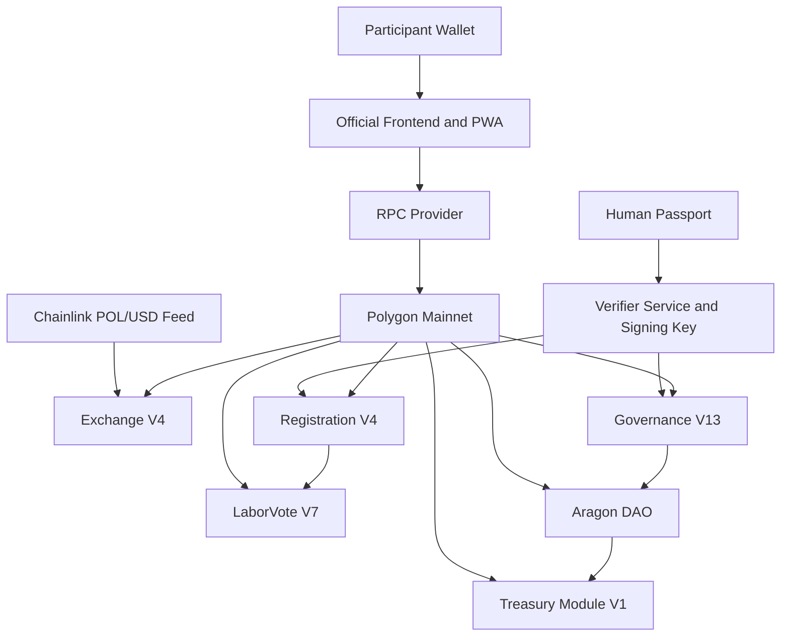

The protocol crosses several distinct trust boundaries.

### On-Chain Enforcement Boundary

Polygon executes:

* Exchange rules
* Registration rules
* LABRV minting and transfer restrictions
* Governance rules
* DAO permissions
* Treasury Module V1 transfers

### External Eligibility Boundary

Human Passport and the verifier determine whether an authorization is issued.

The contracts validate signatures but do not independently reproduce Passport scoring.

### Oracle Boundary

Chainlink supplies the POL/USD value used by Exchange V4.

### Interface Boundary

The official frontend displays state, requests authorizations, constructs transactions, and submits user-approved calls.

The frontend is not the final enforcement layer, but a compromised interface may still mislead users or construct harmful valid calldata.

### DAO Permission Boundary

The Aragon permission registry determines which addresses or plugins may cause the DAO to execute actions.

This is separate from Governance V13's internal proposal constraints.

---

## 14.7 Layered Security Model

Figure 17. Layered Security Model.

Illustrates how independent controls combine rather than relying on a single protection.

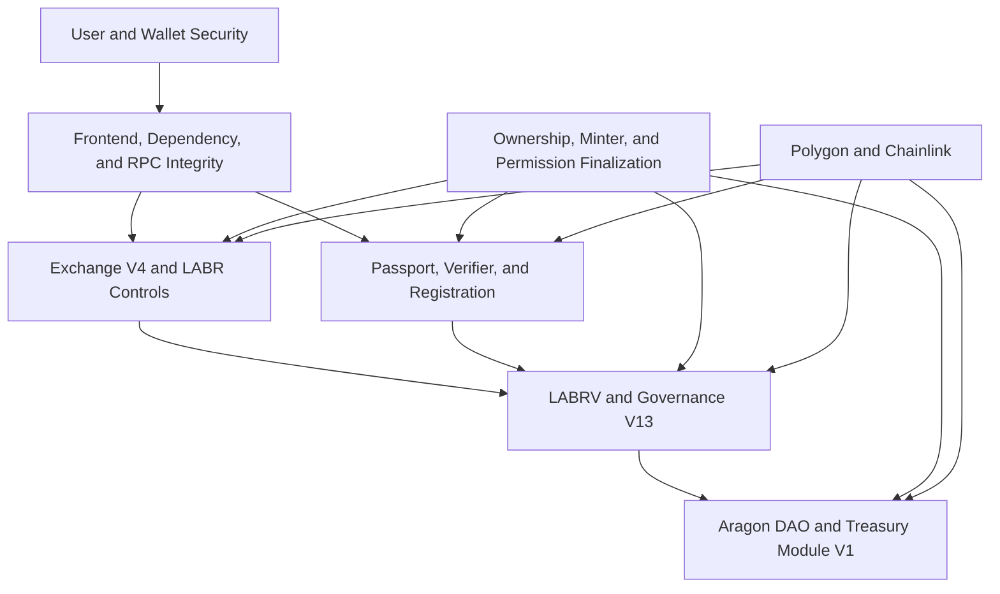

A failure in one layer may be constrained by another, but some failures can still produce material harm.

---

## 14.8 Exchange V4 Security

Exchange V4 directly handles LABR and native POL and is therefore one of the most exposed protocol components.

### Reentrancy Protection

The `buy` and `sell` functions use reentrancy protection.

This reduces recursive-call attacks during asset settlement.

### Actual-Receipt Accounting

Exchange V4 measures token balance changes rather than assuming that the gross submitted amount equals the amount received.

This is especially important during sales because LABR transfer mechanics may reduce the amount delivered to Exchange V4.

The POL payout and `totalSold` reduction use the actual LABR received.

### Minimum-Output Protection

Purchases accept `minTokensOut`.

Sales accept `minPOL`.

These parameters protect participants from accepting less than a chosen minimum.

The contract enforces the submitted value, while participants remain responsible for reviewing the minimum constructed by the interface.

### Exchange Limits

| Control | Deployed Value |
|---|---:|
| Maximum Exchange Transaction | 5,000 LABR |
| Maximum Exchange Wallet Balance | 10,000 LABR |
| Address Cooldown | 12 hours |

These controls reduce transaction-scale exposure and rapid repeated activity.

They do not prevent coordinated use of multiple wallets.

### Oracle Validation

Exchange V4 requires:

* A positive Chainlink price
* Oracle data no older than 30 minutes
* A calculated LABR price no greater than 100 POL per LABR

These controls reduce exposure to stale and anomalous values.

They do not guarantee that a recent oracle value is economically correct.

### Supply and Inventory Controls

Exchange V4 enforces:

* A one-billion-LABR curve maximum
* A 100-million-LABR initial unlocked supply
* Automatic 50-million-LABR tranche increases
* The current `unlockedSupply` boundary
* Available LABR inventory

### Treasury Routing and Liquidity Separation

Ten percent of incoming purchase POL is routed to the Aragon DAO.

The remaining 90% stays in Exchange V4 as protocol-managed liquidity.

DAO treasury POL and Exchange V4 POL are separately custodied.

### Removed Administrative Capabilities

Exchange V4 has no:

* Owner
* Pause function
* Administrative withdrawal function
* Upgrade function
* Parameter setter

This prevents administrative alteration or extraction.

It also means a critical Exchange V4 defect cannot be paused or repaired in place.

### Residual Exchange Risks

* A sale fails when Exchange V4 lacks sufficient POL.
* Transaction ordering may change expected output.
* Oracle data may be wrong while still passing validation.
* Multiple wallets can reduce the effectiveness of address-based limits.
* Directly sent assets may lack a recovery path.
* The official interface can be removed, but direct contract interaction cannot be disabled.

---

## 14.9 LABR Token and DAO-Owned Authority

LABR follows a different authority model from the ownerless final custom contracts.

LABR ownership is held by the Aragon DAO.

The deployed token retains owner-only functions involving areas such as:

* Pause and unpause
* Blacklist management
* Token recovery
* Tax and fee-recipient settings
* Fee and limit exclusions
* Automated-market-maker and router settings
* Wallet and transaction limits
* Trading and cooldown configuration

Governance V13 cannot directly call those functions through its treasury-transfer proposal format.

However, another address or plugin with sufficiently broad Aragon execution authority could potentially cause the DAO to exercise LABR owner functions.

The final Aragon permission registry is therefore a critical LABR security control.

LABR should not be described as ownerless or immutable in the same sense as Exchange V4, Registration V4, Governance V13, or Treasury Module V1.

---

## 14.10 Registration V4 Security

Registration V4 requires:

* The caller is not already registered
* The caller holds at least 1 LABR at registration time
* The authorization has not expired
* The recovered signer equals the fixed verifier

After successful validation, the contract records permanent registration state and conditionally requests one LABRV mint.

The 1 LABR requirement applies at registration time only.

Continued LABR ownership is not required after registration.

### Duplicate Prevention

A wallet recorded as registered cannot register again.

LaborVote V7 also rejects minting to an address that already holds LABRV.

These controls enforce one LABRV per successfully registered wallet.

They do not independently prove one human per wallet.

### Registration Authorization Scope

A Registration V4 authorization binds:

* The participant wallet address
* An expiration timestamp

It does not include:

* A participant nonce
* Registration V4's contract address
* Chain ID
* Passport score
* Attestation text

Within Registration V4, expiry and permanent registration state prevent repeated registration by the same wallet.

Because the signed message lacks explicit contract and chain domain separation, it should be treated as a registration-specific authorization issued only by the official verifier and should not be reused by another system.

### Passport and Attestation Boundary

The published score threshold is applied by the verifier rather than stored as a numeric constant inside Registration V4.

The official frontend presents the LaborCoin attestation.

Registration V4 does not store a Passport score, attestation text hash, or acceptance flag.

These are external eligibility and participation-process controls, not independent on-chain registration conditions.

### Residual Registration Risks

* Verifier compromise may authorize wallets contrary to policy.
* Verifier unavailability may stop new registration.
* Human Passport signals are probabilistic.
* One person may control multiple wallets that independently satisfy external checks.
* A compromised registered wallet cannot be administratively deregistered.
* The fixed verifier cannot be rotated inside Registration V4.

---

## 14.11 LaborVote V7 Security

LaborVote V7 implements the non-transferable LABRV governance credential.

### Permanent Minter

Registration V4 is the permanently locked minter.

The final required state is:

| State | Required Value |
|---|---|
| `minter` | Registration V4 |
| `minterLocked` | `true` |
| `owner` | Zero address |

### Non-Transferability

LABRV cannot be transferred between ordinary addresses.

This prevents ordinary token transfers and market purchases from accumulating voting credentials.

It does not prevent:

* Wallet compromise
* Wallet sale or custody transfer
* Coercion
* Coordinated voting blocs
* Off-chain arrangements
* Multiple externally verified wallets controlled by one person

### Governance Eligibility

Governance V13 checks LABRV balance directly.

ERC20Votes delegation and checkpoint state do not determine Governance V13 eligibility or voting weight.

No delegation transaction is required for LaborCoin governance.

### Residual LABRV Risks

* A compromised wallet retains its governance credential.
* Registration V4 cannot be replaced as minter if it fails.
* A defect in LaborVote V7 cannot be patched.
* Non-transferability reduces token-market capture but does not eliminate social or wallet-level control.

---

## 14.12 Governance V13 Security

Governance V13 combines eligibility checks, verifier authorization, one-vote tracking, fixed thresholds, and constrained execution.

### Governance Authorization

Proposal creation and voting authorizations bind:

* Participant address
* Action code
* Participant nonce
* Expiration timestamp
* Governance V13 contract address

Action codes distinguish proposal creation, yes voting, and no voting.

After successful use, the participant nonce increments.

This prevents the same authorization from being consumed again.

### Authorization Scope Limitation

The verifier authorization covers an action category.

It does not cryptographically bind all transaction contents.

For proposal creation, the authorization does not bind the proposal title, description, recipient, or amount.

For voting, it does not bind a proposal identifier.

The signed message also does not include Chain ID.

Participants must therefore review the complete wallet transaction rather than treating verifier approval as confirmation of every calldata field.

Governance V13's on-chain eligibility, proposal, vote, and threshold checks still apply.

### Duplicate-Vote Prevention

Governance V13 records whether a wallet has voted on each proposal.

A wallet cannot vote twice on the same proposal.

### Current-Member Denominator

Participation uses the current `Registration V4.totalMembers()` value when proposal status is evaluated.

The denominator is not snapshotted at proposal creation.

Membership growth during or after the voting period may therefore change whether a proposal satisfies participation.

### Constrained Execution

Governance V13 constructs one fixed DAO action using:

* The stored proposal recipient
* The stored proposal amount
* Treasury Module V1 as the target

The execution caller cannot substitute a different recipient, amount, or arbitrary DAO action.

### Permissionless Submission

Any address may call `executeProposal` during the execution window.

This improves liveness without giving the caller control over proposal data.

### Execution Checks

Execution requires:

* Voting has ended
* Participation is at least 25%
* Approval is at least 67%
* The proposal has not already executed
* The seven-day execution window remains open
* At least 50 participants are currently registered
* The amount does not exceed 5% of the DAO's current native POL balance
* The DAO and Treasury Module V1 calls succeed

`executeProposal` also uses reentrancy protection.

### Residual Governance Risks

* A coordinated bloc may satisfy the fixed thresholds.
* Low participation remains possible.
* Membership growth may change the participation denominator.
* Vote-approved proposals do not reserve treasury funds.
* Multiple approved proposals may compete for the same treasury balance.
* A valid unconsumed authorization may be misdirected by a compromised interface into different valid calldata.
* Governance cannot recover funds after successful distribution.
* Governance security depends upon the DAO granting only intended execution authority.

---

## 14.13 Aragon DAO and Treasury Security

The Aragon DAO is the treasury custodian and LABR owner.

Governance V13 is one intended constrained executor within the DAO permission model.

### Permission Registry

Final security requires confirming that:

* Governance V13 holds the intended permission
* Obsolete governance contracts are revoked
* Obsolete treasury modules are revoked
* Obsolete plugins and executors are revoked
* Creator-controlled wallets retain no undocumented execution authority
* Any remaining broad executor is documented and justified

### Five-Percent Proposal Cap

Governance V13 limits one proposal to 5% of the DAO's current native POL balance at execution.

The cap does not create:

* A daily spending limit
* A monthly spending limit
* A cumulative lifetime limit
* A limit on the number of approved proposals
* A cap on LABR or other non-POL assets
* A restriction on unrelated DAO executors

Repeated approved proposals may distribute substantial resources over time.

### Treasury Module V1

Treasury Module V1:

* Accepts `executeTransfer` only from the fixed Aragon DAO
* Rejects zero recipients
* Rejects zero-value transfers
* Forwards the exact call value
* Records cumulative distributed POL

The module does not evaluate proposals, choose recipients, or withdraw DAO assets independently.

Native POL or tokens sent directly to the module outside the intended execution call may be stranded because no administrative recovery function exists.

### Recipient Risk

A recipient contract may reject native POL and cause execution to revert.

After a successful transfer, the protocol cannot recover the funds or guarantee recipient performance.

---

## 14.14 Verifier and Human Passport Security

The verifier evaluates Human Passport results and issues protected-action authorizations.

The verifier cannot directly:

* Register a wallet
* Mint LABRV
* Create an on-chain proposal
* Cast an on-chain vote
* Execute a treasury transfer
* Withdraw Exchange V4 liquidity

A participant must still submit a transaction that satisfies contract checks.

### Fixed Signing Address

Registration V4 and Governance V13 trust one fixed verifier address.

This removes an on-chain key-rotation administrator.

It also creates a permanent dependency on that key.

### Verifier Compromise

A compromised verifier may authorize:

* Registration contrary to policy
* Proposal creation
* Yes voting
* No voting

A compromised verifier cannot by itself bypass:

* Wallet transaction submission
* LABRV ownership checks
* Duplicate-vote checks
* Participation and approval thresholds
* The 5% treasury cap
* DAO permissions
* Treasury Module V1's DAO-only caller

### Verifier Outage

If the verifier is unavailable:

* Existing registration records and LABRV balances remain
* New registrations may stop
* New proposal and vote authorizations may stop
* Execution of already approved proposals may remain possible

### Passport Limitations

Human Passport supplies Sybil-resistance signals.

It is not proof of:

* Legal identity
* Employment status
* One human for all time
* Wallet security
* Honest future conduct

---

## 14.15 Frontend, Wallet, and Dependency Security

The official website is a convenience interface rather than the protocol trust root.

A compromised interface may:

* Substitute contract addresses
* Change recipients or amounts
* Request unexpected approvals
* Hide transaction details
* Misrepresent balances or proposal state
* Serve altered dependencies

Participants should verify:

* Polygon Mainnet and Chain ID 137
* Destination contract addresses
* Approval amounts
* Proposal recipients
* Native POL amounts
* Requested function calls

LaborCoin does not require seed phrases or private keys.

### Dependency Risk

Third-party client libraries and content-delivery networks create supply-chain and availability risks.

Exact version pinning reduces unexpected upstream changes.

For a durable launch posture, tested dependencies should also be preserved locally or recorded with hashes where practical.

### Service Worker Risk

A progressive web app may serve cached code after deployment.

Cache-version management, update behavior, and public refresh instructions are important when releasing a frontend security correction.

Removing or changing the official interface does not disable direct interaction with deployed contracts.

---

## 14.16 Network, Oracle, and RPC Dependencies

LaborCoin depends upon Polygon Mainnet for:

* Consensus
* Transaction ordering
* Execution
* Finality
* Data availability
* Gas pricing

Exchange V4 depends upon the fixed Chainlink POL/USD feed.

The official frontend also depends upon RPC providers for state queries and transaction submission.

A network, oracle, or RPC failure may delay or prevent operation.

Public transaction ordering may also cause:

* Changed exchange outputs
* Competing proposal execution
* State changes before confirmation
* Increased gas costs

Minimum-output parameters reduce some exchange risks but do not eliminate all ordering and state-contention risks.

---

## 14.17 Authority Finalization and Evidence

Security claims must be tied to on-chain evidence.

The final security record should include:

* Deployment transactions
* Constructor arguments
* Compiler and EVM settings
* Verified-source links
* Artifact hashes
* LABRV minter assignment
* LABRV minter lock
* LaborVote V7 ownership renouncement
* LABR ownership transfer
* Aragon permission grants
* Aragon permission revocations
* Removal of obsolete executors
* Functional validation transactions
* Final repository and publication hashes

The outstanding Aragon permission cleanup and publication work should remain described as outstanding until independently confirmed.

---

## 14.18 Incident Response for Immutable Infrastructure

Incident response depends upon the affected layer.

### Mutable Operational Layers

The project may change:

* Website content
* Frontend JavaScript
* Service-worker cache version
* Verifier service deployment
* Non-fixed service credentials
* Public warnings and documentation
* DAO permissions where an authorized path remains
* LABR settings where DAO authority permits

### Immutable Contract Layer

The final custom contracts cannot be patched or upgraded.

For a critical immutable-contract defect, available responses may include:

* Public warnings
* Removal of the affected official interface
* Verifier-side containment where applicable
* DAO permission revocation where applicable
* Migration planning
* Deployment of replacement contracts
* Clear disclosure that prior contracts remain deployed

Exchange V4 has no pause function.

Removing the official interface does not stop direct Exchange V4 interaction.

---

## 14.19 Vulnerability Reporting

Suspected vulnerabilities should be reported privately to:

`LaborCoinCreator@proton.me`

Researchers should not publish unmitigated exploit details before review and coordinated disclosure where practical.

The repository should maintain a separate `.github/SECURITY.md` file containing:

* Reporting instructions
* In-scope components
* Safe-testing boundaries
* Severity guidance
* Coordinated disclosure expectations
* The absence of any promised bounty unless separately announced

---

## 14.20 Security Limitations

LaborCoin does not eliminate:

* Smart-contract risk
* Oracle risk
* Polygon risk
* Verifier compromise or outage
* Human Passport errors
* Sybil attacks
* Wallet compromise
* Phishing
* Frontend compromise
* DAO permission errors
* Governance collusion
* Low participation
* Poor treasury decisions
* Recipient misconduct
* Exchange illiquidity
* LABR configuration risk
* Irreversible transaction risk
* Legal or regulatory risk

The protocol reduces selected risks through explicit controls.

It does not transform uncertain systems into risk-free systems.

---

## 14.21 Summary

LaborCoin's security architecture seeks to make abuse difficult, authority visible, and protocol behavior independently verifiable.

The model combines:

* Ownerless final custom contracts
* Permanently locked LABRV minting
* DAO-owned LABR with explicit permission risk
* Deterministic Exchange V4 rules
* Oracle validation
* Exchange limits and cooldown
* Minimum-output protections
* Actual-receipt accounting
* Fixed registration requirements
* Verifier signatures
* Duplicate-registration prevention
* Non-transferable LABRV
* Governance nonces and expirations
* One vote per eligible wallet
* Participation and approval thresholds
* A fifty-member execution requirement
* A five-percent native POL proposal cap
* A seven-day execution window
* Double-execution prevention
* Constrained DAO action construction
* Treasury Module V1's DAO-only caller
* Public source, transaction, and permission evidence

The architecture is intended to support transparent collective infrastructure rather than founder-controlled financial extraction.

Its credibility depends upon the same standard in documentation as in code:

* No hidden authority
* No misleading security claim
* No concealed dependency
* No unsupported audit claim
* No promise of financial return
* No substitution of intention for on-chain evidence

---
# Chapter 15: Threat Model

## 15.1 Purpose and Scope

A threat model identifies protected assets, potential adversaries, attack paths, controls, and residual risk.

LaborCoin assumes that adversarial behavior may arise from:

* Malicious participants
* Coordinated voting groups
* Automated traders
* Compromised wallets
* Compromised frontend or infrastructure operators
* Compromised verifier infrastructure
* Misconfigured DAO permissions
* Defective external dependencies
* Undiscovered smart-contract defects

The objective is not to claim that every threat has been eliminated.

The objective is to make material threats explicit and to document which protections limit their effect.

---

## 15.2 Threat Categories

The principal threat categories are:

1. Identity and registration threats
2. Governance authorization and capture threats
3. Treasury and DAO permission threats
4. Exchange and economic threats
5. Frontend and operational threats
6. Smart-contract and infrastructure threats
7. Social and governance-quality threats

---

# Identity and Registration Threats

## 15.3 Sybil Registration

### Threat

One person attempts to obtain multiple governance credentials through multiple wallets or manipulated external identity signals.

### Controls

* Human Passport evaluation
* Published verifier score policy
* Fixed-verifier authorization
* Permanent Registration V4 state
* One LABRV maximum per wallet
* Non-transferable LABRV

### Residual Risk

Human Passport provides probabilistic Sybil resistance rather than proof of unique legal identity.

A person may control multiple wallets that independently satisfy external checks.

The protocol cannot prove one human per wallet with certainty.

---

## 15.4 Duplicate Registration and LABRV Issuance

### Threat

A wallet attempts to register or mint LABRV repeatedly.

### Controls

* `registered[msg.sender]` must be false
* Successful registration permanently records the wallet
* LaborVote V7 rejects minting to a wallet with an existing LABRV balance
* Registration V4 is the only permanently authorized minter

### Residual Risk

The controls operate per wallet.

They do not prevent one person from controlling multiple separately eligible wallets.

---

## 15.5 Registration Authorization Replay and Domain Risk

### Threat

A valid registration signature is reused after issuance or applied outside its intended context.

### Controls

* The signature binds the participant address
* The signature expires
* The same wallet cannot register again after successful registration

### Residual Risk

Registration V4 does not include a nonce, contract address, or Chain ID in the signed message.

Permanent state prevents repeated registration in the deployed Registration V4 contract, but the signature format has weaker domain separation than the Governance V13 format.

The verifier should issue these signatures only for the intended registration flow, and no other system should accept the same message schema as a general identity credential.

---

## 15.6 Verifier Compromise

### Threat

An attacker obtains control of the fixed verifier key or causes the verifier service to authorize activity contrary to policy.

### Controls

* Registration and governance state changes still require participant-submitted transactions
* Registration V4 validates LABR balance, expiry, duplicate status, and signature
* Governance V13 validates LABRV balance, nonce, action code, expiry, voting state, and thresholds
* Treasury execution remains subject to DAO permissions and fixed caps

### Residual Risk

A compromised verifier may undermine the intended eligibility gate for registration, proposal creation, and voting.

Because the verifier address is fixed, on-chain key rotation is unavailable.

Containment may require verifier shutdown, interface warnings, permission changes where relevant, or migration.

---

## 15.7 Verifier Outage

### Threat

The verifier becomes unavailable through infrastructure failure, key loss, service shutdown, censorship, or attack.

### Controls

* Existing registration state and LABRV balances remain on-chain
* Existing proposals and votes remain on-chain
* Approved-proposal execution does not require a new verifier signature

### Residual Risk

New registration, proposal creation, and voting may stop.

The fixed contracts cannot switch to another verifier.

---

# Governance Threats

## 15.8 Governance Capture

### Threat

A coordinated group gains sufficient influence to control treasury decisions.

### Controls

* LABRV voting weight is separate from LABR wealth
* LABRV is non-transferable
* One vote per eligible wallet
* 25% participation threshold
* 67% approval threshold
* Public on-chain proposal and voting records

### Residual Risk

A coordinated bloc may still satisfy the fixed thresholds.

Non-transferability does not prevent wallet compromise, coercion, off-chain coordination, or multi-wallet Sybil participation.

---

## 15.9 Low Participation

### Threat

A small subset of the community determines outcomes because broader participants do not vote.

### Controls

* Fourteen-day voting period
* Twenty-five-percent participation requirement
* Public proposal visibility
* Equal LABRV voting weight

### Residual Risk

The protocol cannot force engagement.

A sufficiently active minority may control outcomes when broader participation remains near the minimum threshold.

---

## 15.10 Governance Authorization Replay

### Threat

A proposal or vote authorization is reused.

### Controls

Governance V13 binds authorization to:

* Participant address
* Action code
* Participant nonce
* Expiration timestamp
* Governance V13 address

The nonce increments after successful use.

### Residual Risk

The message does not include Chain ID.

Cross-chain reuse would require compatible deployment, address, signer, and nonce conditions, but explicit chain domain separation is absent.

---

## 15.11 Governance Authorization Misrouting

### Threat

A malicious or compromised interface obtains a valid unconsumed authorization and submits different valid transaction data.

Examples include:

* A different proposal recipient
* A different proposal amount
* A different proposal description
* A vote on a different proposal identifier

### Controls

* The action code distinguishes proposal creation, yes voting, and no voting
* Governance V13 enforces LABRV ownership
* Proposal values must satisfy basic on-chain validation
* Each wallet may vote only once per proposal
* Threshold and execution checks remain enforced

### Residual Risk

The authorization does not bind proposal contents or proposal identifier.

Participants must review the full wallet transaction before signing.

The verifier result alone does not authenticate all calldata.

---

## 15.12 Duplicate Voting

### Threat

A wallet attempts to vote more than once on one proposal.

### Controls

* Per-proposal `hasVoted` state
* Action-specific verifier authorization
* Participant nonce
* Voting deadline

### Residual Risk

Multiple independently eligible wallets controlled by one actor may each vote.

---

## 15.13 Changing Participation Denominator

### Threat

Membership growth changes the participation percentage after a proposal is created or after voting ends.

### Controls

* The formula is public and deterministic
* The current `totalMembers()` value is visible on-chain
* Proposal status can be independently recalculated

### Residual Risk

The denominator is not snapshotted.

A proposal's participation status may change as registration grows before execution.

This is a fixed governance behavior rather than an implementation bypass.

---

# Treasury and DAO Threats

## 15.14 Single-Proposal Treasury Drain

### Threat

One proposal attempts to extract most or all native POL from the DAO.

### Controls

* Five-percent cap based on the DAO's current native POL balance at execution
* Twenty-five-percent participation
* Sixty-seven-percent approval
* Fifty-member execution requirement
* Seven-day execution window
* Stored recipient and amount
* Double-execution prevention

### Residual Risk

The cap applies to one proposal and native POL only.

It does not restrict repeated proposals or unrelated DAO executors.

---

## 15.15 Repeated-Proposal Treasury Depletion

### Threat

A group passes multiple proposals that cumulatively distribute a large share of the treasury.

### Controls

Each proposal independently requires:

* Voting
* Participation
* Approval
* Execution within seven days
* Compliance with the current five-percent cap

### Residual Risk

No daily, monthly, or lifetime spending cap exists.

Repeated approved proposals can intentionally allocate substantial treasury resources over time.

---

## 15.16 Obsolete or Broad DAO Executor

### Threat

An old plugin, governance contract, treasury module, creator wallet, or other address retains permission to execute arbitrary DAO actions.

### Controls

* Final Aragon permission cleanup
* Revocation of obsolete executors and modules
* Published permission-state records
* Independent on-chain permission verification

### Residual Risk

An address with broad DAO execution authority may bypass Governance V13's proposal limits and may exercise DAO-owned LABR authority.

This is one of the most important remaining launch-finalization risks.

---

## 15.17 Execution Race and Treasury-Balance Change

### Threat

Multiple approved proposals compete for a changing treasury balance.

### Controls

* The 5% cap is checked at execution
* The DAO balance is checked at execution
* Failed execution reverts
* Each proposal can execute only once

### Residual Risk

Vote approval does not reserve funds.

A proposal may become unexecutable because another transaction changes the DAO balance first.

---

## 15.18 Stale or Repeated Execution

### Threat

An old proposal is executed long after approval or executes more than once.

### Controls

* Seven-day execution window
* `executed` state
* Voting must have ended
* `executeProposal` uses reentrancy protection
* State and external calls are transaction-atomic

### Residual Risk

A valid proposal still requires someone to submit execution before expiry.

---

## 15.19 Recipient Failure or Misconduct

### Threat

The approved recipient rejects payment, loses access, misuses funds, or fails to deliver the intended support.

### Controls

* Recipient and amount are public before execution
* Proposal voting permits community review
* Treasury Module V1 reverts if native POL transfer fails
* Successful transfers remain publicly auditable

### Residual Risk

The protocol cannot guarantee recipient conduct or recover successfully transferred funds.

---

## 15.20 Direct Transfer to Treasury Module

### Threat

Native POL or tokens are sent directly to Treasury Module V1 outside the approved execution flow.

### Controls

* The intended distribution function requires the DAO caller
* Documentation identifies the DAO as the treasury custodian

### Residual Risk

The module has a payable receive function and no administrative recovery mechanism.

Assets sent directly may become stranded.

---

# Exchange and Economic Threats

## 15.21 Reentrancy and External Calls

### Threat

A malicious token recipient, seller, DAO treasury, or recipient contract attempts recursive execution during asset transfer.

### Controls

* Exchange V4 `buy` and `sell` use reentrancy protection
* Governance V13 `executeProposal` uses reentrancy protection
* State changes and external calls revert atomically on failure
* Treasury Module V1 restricts its distribution call to the DAO

### Residual Risk

Reentrancy protection does not eliminate economic errors, dependency failure, or all forms of malicious external behavior.

---

## 15.22 Oracle Failure or Manipulation

### Threat

Incorrect or stale Chainlink data changes Exchange V4 pricing.

### Controls

* Fixed Chainlink POL/USD feed
* Positive-price requirement
* Thirty-minute freshness requirement
* 100 POL per LABR maximum conversion check

### Residual Risk

A recent but incorrect oracle value may pass.

A legitimate extreme market condition may trigger the anomaly ceiling and halt exchange transactions.

The fixed feed cannot be replaced administratively.

---

## 15.23 Exchange Liquidity Stress

### Threat

Sell demand exceeds the native POL held by Exchange V4.

### Controls

* Ninety percent of purchase POL remains in Exchange V4
* Sales require sufficient POL before payout
* Distribution is progressively unlocked
* Transaction limits constrain individual sales

### Residual Risk

Sell liquidity is conditional and not guaranteed.

DAO treasury POL does not automatically replenish Exchange V4.

A valid sale may fail because available liquidity is insufficient.

---

## 15.24 Token Transfer Integration Risk

### Threat

LABR taxes or transfer behavior cause a mismatch between gross submitted amounts and actual received amounts.

### Controls

* Exchange V4 measures actual token balance changes
* Buy-side `totalSold` increases by actual LABR received
* Sell payout and `totalSold` reduction use actual LABR received
* Safe low-level wrappers validate token-call success

### Residual Risk

Complex token configuration or future DAO-authorized LABR changes may affect exchange behavior.

---

## 15.25 Multi-Wallet Limit Evasion

### Threat

One actor distributes activity across multiple wallets to evade wallet, transaction, or cooldown controls.

### Controls

* Per-address 10,000 LABR exchange wallet limit
* Per-address 5,000 LABR exchange transaction limit
* Per-address 12-hour cooldown
* Separate registration and governance identity controls

### Residual Risk

Address-based exchange limits do not identify common control across wallets.

---

## 15.26 Transaction Ordering and Slippage

### Threat

State or oracle values change between transaction submission and confirmation.

### Controls

* `minTokensOut`
* `minPOL`
* Deterministic public pricing
* Public on-chain state

### Residual Risk

Users may accept weak minimums.

Public transaction ordering, gas competition, and state contention remain possible.

---

# Frontend and Operational Threats

## 15.27 Frontend Address or Calldata Substitution

### Threat

A compromised website changes contract addresses, recipients, amounts, approvals, or requested functions.

### Controls

* Published contract registry
* Wallet confirmation
* Verified source code
* Independent direct-contract access
* Repository history and deployment records

### Residual Risk

Users may approve malicious but technically valid transactions.

Contract checks cannot protect against every user-approved action.

---

## 15.28 Dependency and CDN Compromise

### Threat

A third-party JavaScript dependency or CDN serves altered code.

### Controls

* Exact version pinning
* Minimal dependency surface
* Local preservation or hashing of tested assets where practical
* Repository review
* Content Security Policy where implemented

### Residual Risk

Version pinning does not prevent CDN compromise, package compromise, or availability failure.

---

## 15.29 Service Worker and Stale Cache

### Threat

A progressive web app continues serving obsolete or vulnerable frontend code.

### Controls

* Explicit service-worker cache versioning
* Controlled cache update behavior
* Public refresh and reinstall instructions for security releases

### Residual Risk

Some users may continue to run cached code after a deployment.

---

## 15.30 Wallet, Browser, and Phishing Risk

### Threat

A participant exposes credentials, uses a compromised wallet, installs a malicious extension, or visits an impersonating domain.

### Controls

* No seed phrase or private key is required by LaborCoin
* Public domain and contract-address documentation
* Wallet transaction confirmation
* Participant security guidance

### Residual Risk

The protocol cannot restore private keys or reverse valid confirmed transactions.

---

## 15.31 RPC Failure or Misinformation

### Threat

An RPC endpoint becomes unavailable, delayed, inconsistent, or malicious.

### Controls

* On-chain state remains independently queryable
* Alternative RPC providers may be used
* Wallet confirmation and explorer verification provide additional evidence

### Residual Risk

A compromised or faulty RPC may mislead an interface or prevent timely transaction submission.

---

# Smart Contract and Infrastructure Threats

## 15.32 Undiscovered Smart-Contract Defect

### Threat

A final contract contains an access-control, arithmetic, state, integration, or logic defect.

### Controls

* Narrow contract responsibilities
* Public verified source
* Functional testing
* Deployment validation
* Reentrancy protection where used
* Public review
* Explicit constants and dependencies

### Residual Risk

No independent audit claim should be made without a published audit report.

Ownerless and locked contracts cannot be patched in place.

A critical defect may require migration.

---

## 15.33 No Emergency Pause

### Threat

A critical Exchange V4 vulnerability remains directly callable during incident response.

### Controls

The official interface may be removed or disabled, and public warnings may be issued.

### Residual Risk

Exchange V4 has no pause function.

Direct interaction cannot be stopped by an administrator.

This is the principal recoverability tradeoff of removing pause authority.

---

## 15.34 Polygon Failure

### Threat

Polygon experiences outage, consensus failure, severe congestion, reorganization, or unexpected execution behavior.

### Controls

* Mature public infrastructure
* Public transaction records
* Wallet confirmation
* Operational monitoring

### Residual Risk

Polygon operation is outside LaborCoin control.

---

## 15.35 Fixed Dependency Failure

### Threat

Registration V4, Governance V13, Treasury Module V1, LaborVote V7, or the Chainlink feed becomes unusable or insecure.

### Controls

* Public dependency addresses
* Narrow interfaces
* Source verification
* Operational monitoring

### Residual Risk

Fixed dependencies cannot be replaced in place.

Migration may be the only recovery path.

---

# Social and Governance-Quality Threats

## 15.36 Governance Misjudgment

### Threat

Participants approve a proposal that is wasteful, ineffective, divisive, or harmful despite valid procedure.

### Controls

* Fourteen-day deliberation period
* Public proposal details
* Participation threshold
* Supermajority approval
* Five-percent cap

### Residual Risk

Smart contracts validate process, not wisdom.

Democratic governance cannot guarantee good decisions.

---

## 15.37 Community Coordination Failure

### Threat

Participants fail to monitor proposals, vote, submit execution, or maintain public accountability.

### Controls

* Public on-chain state
* Permissionless execution
* Equal LABRV voting weight
* Long voting period
* Public documentation

### Residual Risk

No protocol can guarantee participation or social coordination.

---

## 15.38 Misleading Security or Economic Claims

### Threat

Project communications overstate decentralization, audit status, identity assurance, liquidity, safety, or financial outcomes.

### Controls

* Public source and transaction evidence
* Explicit authority categories
* Explicit residual-risk disclosure
* Separate security policy
* No unsupported audit claim
* No guaranteed-return language

### Residual Risk

Readers must still verify evidence and distinguish code behavior from project intention.

---

## 15.39 Summary

The LaborCoin threat model recognizes that technical, economic, operational, and social risks remain even after creator ownership is minimized.

The most important security principle is:

**No participant, proposal, verifier, administrator, or interface should possess undocumented or unlimited power.**

The protocol reduces selected risks through:

* Fixed contract rules
* Narrow responsibilities
* Public evidence
* Signature validation
* Nonce and expiry controls
* Non-transferable governance credentials
* Governance thresholds
* Treasury limits
* DAO permission review
* Oracle checks
* Economic limits
* Participant transaction review

Residual risk remains in verifier operation, DAO permissions, LABR ownership, external infrastructure, immutable defects, governance behavior, and participant wallet security.

---
# Chapter 16: User Journey

## 16.1 Introduction

A protocol may possess sound economics, governance rules, and security controls while remaining inaccessible to ordinary participants.

LaborCoin therefore distinguishes between several voluntary participation paths:

* Economic participation through LABR
* Direct support through native POL donations
* Governance onboarding through Registration V4 and LABRV
* Proposal creation and voting through Governance V13
* Permissionless submission of approved proposals for execution
* Receipt of approved treasury support
* Independent public review without transacting

Economic participation and governance participation are related but distinct.

Holding LABR does not automatically grant governance authority.

Governance participation requires successful Registration V4 onboarding and ownership of one LABRV.

Not every participant must complete every stage.

---

## 16.2 Participant Roles

| Role | Primary Activity | Required Credential or Asset |
|---|---|---|
| Visitor | Reviews public information and on-chain state | None |
| Wallet User | Connects a compatible wallet to Polygon | Wallet and POL for gas |
| LABR Participant | Purchases, holds, transfers, or sells eligible LABR | POL and compatible wallet |
| Donor | Sends POL directly to the Aragon DAO | POL |
| Registration Applicant | Completes governance onboarding | At least 1 LABR at registration, Passport eligibility, verifier authorization |
| Governance Participant | Creates proposals and votes | One LABRV |
| Execution Caller | Submits an approved proposal for execution | Any wallet with POL for gas |
| Treasury Recipient | Receives an approved native POL distribution | Valid recipient address |
| Independent Reviewer | Verifies contracts, transactions, permissions, and balances | Public blockchain access |

One person may occupy several roles.

---

## 16.3 Detailed Participant Lifecycle

Figure 8. Detailed Multi-Path Participant Lifecycle.

Illustrates the complete participant journey while preserving the distinction between optional economic, donation, governance, execution, and recipient paths.

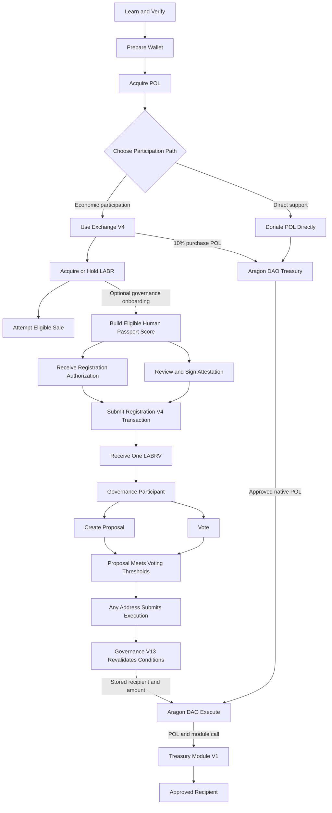

The Aragon DAO remains the treasury custodian throughout the governance process.

Governance V13 supplies proposal, voting, threshold, and constrained execution logic. It does not hold proposal funds.

---

## 16.4 Learn Before Interacting

Before submitting a transaction, participants should review:

* The technical whitepaper
* The disclaimer
* The security architecture
* The bonding-curve model
* The governance rules
* The final contract registry
* The current protocol status
* Verified source code on Polygonscan

Important facts include:

* LABR is a transferable economic token.
* LABRV is a non-transferable governance credential.
* Purchasing LABR does not guarantee appreciation or liquidity.
* Registration is permanent for the registered wallet.
* At least 1 LABR is required only at registration time.
* Governance V13 is limited to native POL treasury-allocation proposals.
* Exchange V4 sales require sufficient POL liquidity.
* Blockchain transactions are generally irreversible.

The official website is an interface to the deployed contracts rather than a replacement for transaction review or independent verification.

---

## 16.5 Prepare a Wallet

A participant requires a compatible self-custody wallet supporting:

* Polygon Mainnet
* WalletConnect or an injected browser connection
* Message signing
* Contract transactions
* Native POL

The participant controls the wallet and remains responsible for:

* Protecting private keys and recovery phrases
* Confirming the network
* Reviewing transaction details
* Maintaining sufficient POL for gas
* Avoiding phishing and malicious extensions

LaborCoin does not require a participant to disclose a seed phrase or private key.

### Polygon Network Details

| Field | Value |
|---|---|
| Network | Polygon Mainnet |
| Chain ID | 137 |
| Native Gas Token | POL |
| Block Explorer | Polygonscan |

---

## 16.6 Acquire POL

POL is required for:

* Polygon transaction fees
* LABR purchases
* Direct treasury donations
* Registration transaction gas
* Proposal and voting transaction gas
* Approved-proposal execution gas

POL must be available on Polygon Mainnet rather than another network.

A participant may acquire POL through a compatible exchange, wallet provider, bridge, or transfer from another Polygon wallet.

---

# Economic Participation

## 16.7 Connect to Exchange V4

A participant may connect to the official Exchange interface or another compatible contract interface.

Before purchasing, the participant should verify:

* The connected wallet
* Polygon Mainnet
* The Exchange V4 address
* Available POL
* Current LABR price
* Estimated LABR output
* Submitted minimum output
* Wallet and transaction limits
* Cooldown state

Exchange V4 address:

`0x4Cf18cB39203B678f5C26f2338a10a79f9684749`

---

## 16.8 Purchase LABR

A purchase follows this sequence:

1. The participant submits POL and `minTokensOut`.
2. Exchange V4 reads the current bonding-curve state.
3. Exchange V4 reads the fixed Chainlink POL/USD feed.
4. Exchange V4 calculates the current LABR output.
5. Exchange V4 transfers LABR.
6. The contract measures the LABR actually received.
7. Ten percent of incoming POL is routed to the Aragon DAO.
8. Ninety percent remains in Exchange V4 as protocol-managed liquidity.
9. `totalSold` increases by the LABR actually received.

### Exchange-Level Controls

| Control | Deployed Value |
|---|---:|
| Maximum Exchange Transaction | 5,000 LABR |
| Maximum Exchange Wallet Balance | 10,000 LABR |
| Address Cooldown | 12 hours |

The interface may estimate output. The confirmed contract transaction determines the final result.

---

## 16.9 Hold or Transfer LABR

A LABR holder may:

* Hold LABR
* Transfer LABR subject to token rules
* Become eligible for configured dividends
* Use at least 1 LABR to satisfy the one-time registration requirement
* Attempt an eligible sale through Exchange V4
* Participate economically without joining governance

LABR and LABRV perform different functions.

| Token | Function |
|---|---|
| LABR | Transferable economic participation |
| LABRV | Non-transferable governance participation |

Holding LABR alone does not create LABRV or voting rights.

---

## 16.10 Sell Eligible LABR

A participant may attempt to sell LABR through Exchange V4.

The participant:

1. Reviews the expected POL output.
2. Reviews the submitted `minPOL`.
3. Approves Exchange V4 to transfer LABR.
4. Submits the sale.
5. LABR token logic applies configured transfer mechanics.
6. Exchange V4 measures the LABR actually received.
7. Exchange V4 calculates the payout from that measured amount.
8. Exchange V4 pays POL if sufficient liquidity and all other conditions are satisfied.
9. `totalSold` decreases by the LABR actually received.

Current sell-side configuration:

| Allocation | Current Rate |
|---|---:|
| Aragon DAO treasury | 5% |
| Eligible LABR-holder dividends | 5% |
| Burn | 0% |
| Total | 10% |

A sale may fail because of:

* Insufficient Exchange V4 POL liquidity
* Transaction or wallet limits
* Cooldown
* Invalid or stale oracle data
* Minimum-output protection
* Token approval failure
* State changes before confirmation

Sale execution is conditional rather than guaranteed.

---

# Direct Support

## 16.11 Donate POL Directly

A participant may send native POL directly to the Aragon DAO without purchasing LABR or registering for governance.

Aragon DAO address:

`0x0C2e5679153593b82a84eAB5CA90895BB291Cec4`

A direct donation:

* Does not purchase LABR
* Does not create Exchange V4 liquidity
* Does not increase `totalSold`
* Does not mint LABRV
* Does not create governance rights
* Increases the DAO's native POL balance

The donor should independently verify the DAO address before sending assets.

---

# Governance Onboarding

## 16.12 Prepare Human Passport

A participant seeking governance access must satisfy the Human Passport policy applied by the verifier.

The published minimum score is:

$$
15
$$

Human Passport supplies Sybil-resistance signals.

It is not proof of:

* Legal identity
* Employment status
* One human for all time
* Wallet security
* Honest future conduct

The participant should use the same wallet for Passport evaluation and Registration V4.

---

## 16.13 Meet Registration Requirements

Registration V4 requires:

| Requirement | Condition |
|---|---|
| LABR balance | At least 1 LABR at registration time |
| Registration state | Wallet not previously registered |
| Verifier authorization | Valid signature from the fixed verifier |
| Expiration | Authorization remains valid |
| Transaction caller | Registering wallet |

The 1 LABR requirement applies only when registration occurs.

After successful registration:

* Registration remains permanent.
* Continued LABR ownership is not required for governance access.
* Governance eligibility is based on LABRV ownership.

---

## 16.14 Receive Verifier Authorization

The participant:

1. Connects the intended registration wallet.
2. Confirms that the wallet holds at least 1 LABR.
3. Requests identity verification.
4. Waits for the verifier result.
5. Confirms that the published score threshold was met.
6. Receives an address-bound, expiring registration authorization.

The verifier authorization does not register the participant.

The participant must still submit a Registration V4 transaction.

---

## 16.15 Review and Sign the Attestation

The official interface presents the LaborCoin DAO attestation.

The participant signs the attestation message with the wallet.

Registration V4 does not store:

* The attestation text
* An attestation hash
* An attestation acceptance flag

The attestation is part of the official onboarding process rather than an independent on-chain registration condition.

---

## 16.16 Submit Registration V4

The participant submits one Registration V4 transaction using the verifier authorization.

Registration V4 verifies:

* The wallet is not already registered.
* The wallet holds at least 1 LABR.
* The authorization has not expired.
* The recovered signer is the fixed verifier.

If successful:

* The wallet becomes permanently registered.
* A member number is assigned.
* A registration timestamp is recorded.
* One LABRV is minted where required.
* Governance access becomes available.

No LABRV delegation transaction is required for Governance V13.

The official interface may also display membership data and prepare a downloadable membership certificate.

---

## 16.17 Returning Registered Participant

When an existing member reconnects, the interface checks Registration V4 status before applying the new-applicant LABR balance requirement.

An already registered participant:

* Receives governance access
* May display membership data
* May prepare a membership certificate
* Is not required to continue holding 1 LABR

An unregistered participant must still hold at least 1 LABR before beginning the registration flow.

This distinction reflects the deployed contract model: LABR is an entry requirement, while LABRV is the continuing governance credential.

---

# Governance Participation

## 16.18 Review Governance State

A governance participant should review:

* Proposal descriptions
* Recipient addresses
* Requested native POL amounts
* Voting deadlines
* Yes and no vote totals
* Current participation
* Current approval
* Execution deadlines
* DAO treasury balance
* Pending proposal obligations

Governance V13 does not reserve treasury POL when a proposal passes.

A vote-approved proposal may later fail execution if treasury or membership conditions change.

---

## 16.19 Create a Proposal

An eligible LABRV holder may create a native POL treasury proposal.

The participant supplies:

* Proposal title
* Proposal description
* Recipient address
* Native POL amount
* Valid proposal-creation authorization

The verifier authorization permits the action category but does not bind every proposal field.

The participant should review the complete wallet transaction, recipient, and amount before signing.

No treasury funds move during proposal creation.

---

## 16.20 Vote

An eligible participant may vote yes or no during the 14-day voting period.

Each vote requires:

* LABRV ownership
* An action-specific verifier authorization
* The current Governance V13 nonce
* An unexpired authorization
* A proposal that remains open
* A wallet that has not already voted on that proposal

Each eligible wallet has one vote per proposal.

Governance V13 checks LABRV balance directly rather than ERC20Votes delegation state.

---

## 16.21 Proposal Outcome

After voting ends, the proposal must satisfy:

| Requirement | Value |
|---|---:|
| Minimum Participation | 25% |
| Minimum Approval | 67% |

Participation is calculated against the current Registration V4 `totalMembers()` value when proposal status is evaluated.

The member denominator is not snapshotted at proposal creation.

A proposal meeting both voting thresholds becomes vote-approved, but further execution-time conditions still apply.

---

## 16.22 Execute an Approved Proposal

Any address may call `executeProposal` during the 7-day execution window.

The execution caller does not gain discretion over the proposal.

Governance V13 revalidates:

* Voting has ended.
* Participation remains at least 25%.
* Approval remains at least 67%.
* The proposal has not already executed.
* The execution window remains open.
* At least 50 participants are currently registered.
* The amount is no greater than 5% of the DAO's current native POL balance.
* The DAO and Treasury Module V1 calls succeed.

The caller cannot change:

* The recipient
* The amount
* The proposal description
* The recorded vote totals
* The DAO action constructed by Governance V13

---

## 16.23 Treasury Distribution Workflow

Approved treasury distributions combine:

1. Governance authorization
2. DAO custody and execution
3. Treasury Module V1 forwarding

Figure 9. Economic and Treasury Distribution Flow.

Illustrates the separate value and authorization paths through the LaborCoin ecosystem.

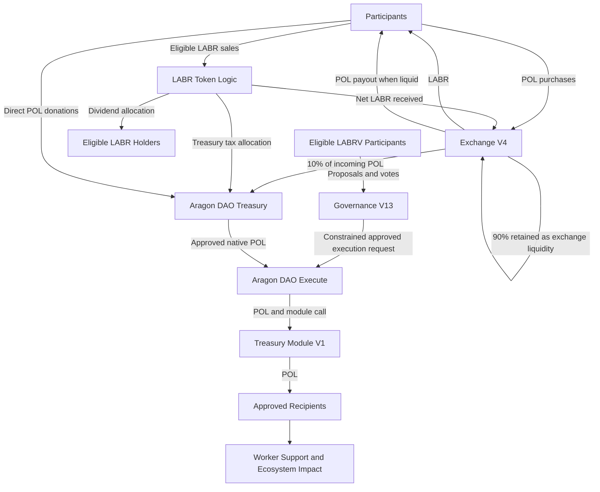

The two DAO nodes represent different aspects of the same Aragon DAO:

* **Aragon DAO Treasury** represents custody.
* **Aragon DAO Execute** represents permission-controlled action execution.

A successful distribution follows this sequence:

1. A LABRV holder creates a proposal.
2. Eligible LABRV holders vote.
3. Governance V13 evaluates the voting thresholds.
4. Any address submits execution during the valid window.
5. Governance V13 revalidates all execution conditions.
6. Governance V13 constructs the fixed DAO action.
7. The Aragon DAO supplies the approved native POL to Treasury Module V1.
8. Treasury Module V1 forwards that exact POL to the stored recipient.
9. Governance V13 marks the proposal executed.
10. Treasury Module V1 updates cumulative distribution accounting.

Governance V13 does not hold treasury assets.

Governance V13 proposals distribute native POL only. LABR and other assets held by the DAO remain outside this proposal format.

---

# Recipient and Review Paths

## 16.24 Receive Approved Support

A recipient may be a worker organization, strike-support effort, mutual-aid initiative, or another approved worker-centered recipient.

If execution succeeds:

1. The Aragon DAO supplies the approved POL.
2. Treasury Module V1 receives the POL as call value.
3. Treasury Module V1 forwards the POL.
4. The recipient receives the distribution.
5. The transaction remains publicly auditable.

A recipient contract that rejects native POL may cause execution to revert.

The protocol cannot guarantee recipient performance or recover funds after a successful transfer.

---

## 16.25 Independent Review

A person may participate without purchasing, registering, proposing, or voting.

Public reviewers may inspect:

* Verified contract source
* Contract addresses
* Exchange state
* Registration totals
* Proposal records
* Vote totals
* DAO balances
* Permission assignments
* Treasury distributions
* Deployment and finalization records

Public verifiability is itself a participation path because it supports accountability without requiring economic exposure.

---

# Operational Guidance

## 16.26 Common Failure States

| Stage | Possible Failure | Response |
|---|---|---|
| Wallet connection | Provider unavailable or wrong network | Reconnect and confirm Polygon Mainnet |
| Purchase | Insufficient POL, limit, cooldown, oracle, or slippage failure | Review current state before retrying |
| Sale | Insufficient approval or Exchange V4 POL liquidity | Review approval and available liquidity |
| Passport verification | Score below threshold | Improve eligible Passport signals and retry |
| Registration | Less than 1 LABR | Acquire or receive enough LABR before registering |
| Registration | Authorization expired | Request a new authorization |
| Registration | Wallet already registered | Reconnect as an existing member |
| Proposal creation | Invalid signature, nonce, recipient, or amount | Refresh authorization and review inputs |
| Voting | Proposal closed or wallet already voted | Review proposal state |
| Execution | Voting remains active | Wait until voting ends |
| Execution | Voting thresholds not met | Proposal cannot execute |
| Execution | Fewer than 50 registered members | Wait until the activation requirement is met |
| Execution | Amount exceeds current 5% cap | Proposal cannot execute at the current balance |
| Execution | Seven-day window expired | Proposal is permanently expired |
| Execution | Recipient rejects native POL | A compatible recipient requires a new proposal |

A reverted blockchain transaction does not normally refund gas already consumed.

---

## 16.27 Security Guidance

At every stage, participants should:

* Verify the official domain.
* Confirm Polygon Mainnet and Chain ID 137.
* Compare contract addresses with the published registry.
* Review every wallet confirmation.
* Reject unexpected approvals.
* Confirm proposal recipients and amounts.
* Never disclose seed phrases or private keys.
* Treat unsolicited support messages as untrusted.
* Verify completed actions on Polygonscan.

The official interface simplifies interaction but cannot eliminate wallet, browser, phishing, RPC, dependency, or transaction-review risk.

---

## 16.28 Privacy and Public Records

Blockchain activity is public.

Publicly visible data may include:

* Wallet addresses
* LABR and LABRV balances
* Registration state
* Member number and registration timestamp
* Proposal creation
* Vote transactions
* Proposal recipients and amounts
* Treasury distributions
* Exchange purchases and sales

Participants should not assume wallet activity is private.

Human Passport and verifier operations may be subject to additional external privacy policies.

---

## 16.29 Accessibility and Alternative Interfaces

The official website and PWA are intended to simplify participation.

However:

* Installing the PWA is optional.
* Desktop and mobile wallet connections may be used.
* Compatible direct-contract interfaces remain available.
* Polygonscan and RPC tools may be used for independent review.
* Interface failure does not erase on-chain state.
* Removing the official interface does not disable deployed contracts.

All alternative interfaces remain subject to the same contract rules.

---

## 16.30 Participation Boundaries

The user journey does not imply that:

* Every LABR holder must register.
* Every registered participant must create proposals.
* Every participant must vote.
* Every vote-approved proposal will execute.
* Every treasury recipient will produce the intended outcome.
* Every LABR sale will succeed.
* Every LABR holder will receive dividends.
* Participation guarantees financial return.

Each stage is optional except for the prerequisites of the specific action being attempted.

---

## 16.31 Long-Term Participation

Governance participation does not end after registration.

Participants may continue to:

* Vote
* Create proposals
* Review treasury activity
* Monitor governance outcomes
* Submit valid approved proposals for execution
* Participate in public discussion
* Independently verify protocol state

The system supports ongoing participation rather than one-time onboarding.

---

## 16.32 Summary

The LaborCoin user journey is not one linear funnel.

It consists of several connected but distinct paths:

### Economic Path

```text
Prepare wallet
→ Acquire POL
→ Use Exchange V4
→ Hold, transfer, or attempt an eligible LABR sale
```

### Direct Support Path

```text
Prepare wallet
→ Acquire POL
→ Donate directly to the Aragon DAO
```

### Governance Path

```text
Hold at least 1 LABR at registration
→ Satisfy Passport policy
→ Receive verifier authorization
→ Submit Registration V4
→ Receive one LABRV
→ Create proposals or vote
```

### Treasury Execution Path

```text
Vote-approved proposal
→ Permissionless execution submission
→ Governance V13 revalidation
→ Aragon DAO execution
→ Treasury Module V1
→ Approved recipient
```

### Public Review Path

```text
Review verified source
→ Inspect on-chain state
→ Compare permissions, balances, proposals, and transactions
```

Economic participation may enable governance onboarding.

Governance participation may authorize treasury allocation.

Treasury custody remains with the Aragon DAO.

Not every participant will complete every path, and no path guarantees a financial, governance, or social outcome.

---
# Chapter 17: Decentralization Framework

## 17.1 Introduction

Decentralization is frequently discussed within blockchain ecosystems, yet the term often encompasses a wide range of meanings.

Some systems are decentralized in operation but remain centrally administered.

Others are decentralized in governance but retain substantial founder authority.

Still others rely upon trusted organizations for critical functions despite decentralized infrastructure.

LaborCoin adopts a specific interpretation of decentralization.

The objective is not merely distributed operation.

The objective is the elimination of unnecessary administrative authority following protocol validation.

Under this model, decentralization is achieved not by creating new centers of power, but by removing power wherever practical.

This chapter describes the framework through which LaborCoin transitions from a deployed protocol into autonomous public infrastructure.

---

## 17.2 Decentralization Philosophy

The protocol was designed around a simple principle:

**Participants should govern treasury allocation, but no participant should govern the protocol itself.**

Many decentralized systems rely upon governance to modify protocol rules continuously.

Under such systems, governance may:

* Change token economics
* Alter voting requirements
* Modify treasury limits
* Replace infrastructure
* Pause protocol operation

While flexible, these systems often transform governance into a permanent administrative authority.

LaborCoin intentionally rejects this model.

Governance controls treasury allocation.

Core custom-contract behavior remains governed by fixed deployed logic, while DAO permissions, LABR ownership, and verifier operation remain explicit external authority surfaces.

This distinction forms the foundation of the protocol's decentralization strategy.

---

## 17.3 Development Phase

During development, creator-controlled wallets and temporary deployment permissions were used to deploy, configure, test, and connect the protocol components.

---

## 17.4 Deployment and Validation Phase

The final contracts were deployed to Polygon Mainnet and source-verified. Registration, LABRV minting, governance proposal and voting flows, exchange operations, and treasury execution were validated before the final authority state was documented.

---

## 17.5 Final Deployed Phase

The final deployed phase is characterized by:

* Ownerless Exchange V4, Registration V4, Governance V13, and Treasury Module V1
* Permanently locked Registration V4 minter authority over LaborVote V7
* Renounced LaborVote V7 ownership
* DAO custody of treasury resources
* DAO ownership of LABR
* Fixed verifier addresses in Registration V4 and Governance V13
* DAO permission cleanup and provenance records designated for final launch publication

Autonomy is therefore achieved through narrow contract authority and removal of creator ownership, while external verifier dependence and DAO-held LABR ownership remain explicit.

## 17.6 Ownership and Authority

The relevant decentralization question is not simply whether an `owner()` function exists, but which actors can cause state changes in each component.

---

## 17.7 Exchange V4

Exchange V4 has no owner, pause function, upgrade function, or administrative withdrawal function. Its dependencies and constants were fixed at construction.

---

## 17.8 LaborVote V7

LaborVote V7 originally used ownership to set its minter. Registration V4 was set as minter, the minter was permanently locked, and ownership was renounced.

---

## 17.9 Registration V4

Registration V4 has no owner or administrative setter. Its LABR, LABRV, and verifier addresses are fixed.

Registration remains operationally dependent upon the fixed verifier for new authorization signatures.

---

## 17.10 Governance V13

Governance V13 has no owner or upgrade mechanism. Proposal duration, participation threshold, approval threshold, execution window, minimum-member activation threshold, DAO address, verifier address, Registration V4 address, LABRV address, and Treasury Module V1 address are fixed in the deployed contract.

Governance V13 controls treasury-allocation execution only. It is not a general DAO administration interface.

---

## 17.11 Treasury Module V1 and LABR

Treasury Module V1 has no owner and accepts transfer calls only from the Aragon DAO.

LABR follows a different model. Its ownership is held by the Aragon DAO, and its bytecode retains owner-only token-management functions. Final decentralization therefore depends upon the DAO permission registry preventing unauthorized or obsolete executors from exercising DAO-held authority.

## 17.12 Creator Role

The creator performed deployment, configuration, testing, documentation, and permission-management work required to finalize the protocol.

The creator does not own Exchange V4, Registration V4, Governance V13, Treasury Module V1, or LaborVote V7 in the final state. The creator should not retain DAO execution permissions outside those explicitly documented for the final protocol.

The verifier signing infrastructure remains an operational role and must be distinguished from protocol ownership.

---

## 17.13 Governance Does Not Replace Ownership

LaborCoin does not grant Governance V13 unrestricted DAO administration.

Governance V13 can approve and execute treasury allocations under fixed constraints. It cannot alter its own thresholds, replace dependencies, or issue arbitrary owner calls to LABR through the proposal format.

---

## 17.14 Fixed and Non-Fixed Elements

The final architecture contains several categories.

### Fixed by Ownerless Contract Bytecode

* Exchange V4 pricing and exchange limits
* Registration V4 dependencies and minimum LABR check
* Governance V13 thresholds and proposal rules
* Treasury Module V1's DAO-only execution rule

### Permanently Locked

* LaborVote V7 minter address

### DAO Controlled

* LABR token ownership
* DAO treasury custody
* Aragon permission assignments

### Externally Operated

* Passport evaluation
* Verifier signature service
* Website and interface infrastructure

These categories are distinct and do not support a claim of universal immutability.

---

## 17.15 Why Predictability Matters

Fixed contract parameters provide predictability, reduce unilateral intervention risk, and make future behavior easier to audit.

The tradeoff is reduced recoverability. Defects in ownerless or locked contracts cannot be corrected in place.

---

## 17.16 Remaining Trust Assumptions

Even after removal of creator ownership, the protocol depends upon:

### Polygon

For transaction execution and consensus.

### Chainlink

For POL/USD price data used by Exchange V4.

### Passport and Verifier Infrastructure

For eligibility evaluation and action authorizations.

### Aragon DAO Permissions

For control of DAO custody and DAO-owned LABR authority.

### Cryptographic Security

For signature validation and account control.

---

## 17.17 Public Infrastructure

LaborCoin is intended to remain publicly accessible, transparent, and durable without routine creator administration.

The system's public-infrastructure claim rests on documented authority boundaries rather than a claim that all supporting services are decentralized.

---

## 17.18 Decentralization as a Process

The process consists of:

### Development

Build and test the system.

### Deployment

Deploy and verify final contracts.

### Authority Finalization

Lock the LABRV minter, renounce LaborVote ownership, transfer LABR ownership, and establish final DAO permissions.

### Documentation

Publish contract, permission, validation, and provenance records.

### Operation

Allow the system to function under the final authority model.

---

## 17.19 Long-Term Vision

The long-term objective is protocol completion rather than permanent founder administration.

Treasury decisions remain democratic through Governance V13. Core custom-contract rules remain fixed. DAO-held LABR ownership and verifier operations remain bounded by public documentation, permissions, and the limitations described in this whitepaper.

## 17.20 Summary

The LaborCoin Decentralization Framework defines the process through which the protocol transitions from founder-managed deployment to autonomous public infrastructure.

Through ownerless final contracts, locked LABRV minting, constrained Governance V13 authority, DAO custody, and explicit disclosure of verifier and LABR-ownership dependencies, the protocol minimizes creator control while preserving democratic treasury allocation.

The final goal is a system in which no creator-controlled wallet can alter the ownerless final contracts, while any remaining DAO-held or verifier authority is narrow, documented, and independently auditable.

---

# Chapter 18: Contract Registry and Deployment Architecture

## 18.1 Introduction

This chapter documents the deployed infrastructure that constitutes the LaborCoin protocol on Polygon Mainnet.

The purpose of this chapter is to provide a permanent technical reference describing:

* Deployed contract addresses
* Component relationships
* Authority boundaries
* Deployment architecture
* Ownership status
* Decentralization procedures

---

## 18.2 Network

LaborCoin is deployed on:

Polygon PoS

The protocol utilizes Polygon for:

* Smart contract execution
* Governance participation
* Treasury operations
* Exchange transactions
* Registration transactions

The selection of Polygon was motivated by:

* Low transaction costs
* Broad ecosystem adoption
* Compatibility with Ethereum tooling
* Mature infrastructure

---

## 18.3 Core Protocol Registry

### LABR Utility Token

Address:

`0x460DD873A1D2a41e77410B125cD3027C5FEd2f78`

Purpose:

* Economic participation token
* Exchange asset
* Registration eligibility requirement
* Treasury contribution source

---

### LaborCoin Exchange V4

Address:

`0x4Cf18cB39203B678f5C26f2338a10a79f9684749`

Purpose:

* Deterministic bonding curve exchange
* Token distribution
* Treasury contribution collection
* Protocol-managed buy and sell access, subject to available liquidity

---

### LaborCoin Registration V4

Address:

`0xd1CD6C0B6f1F709A52908B40C07D3C54649e323C`

Purpose:

* Governance registration
* Verifier-authorized registration enforcement
* Signature and expiration validation
* LABRV issuance

---

### LaborVote (LABRV) V7

Address:

`0x833242E933c675846D8f8982048FecA95B8e435A`

Purpose:

* Governance participation
* Voting rights
* Proposal eligibility
* One verified participant per LABRV governance model

---

### LaborCoin Governance V13

Address:

`0x8238105d31F6Bb26897d8Ab270a0A521FEF03E8c`

Purpose:

* Proposal management
* Voting
* Approval validation
* Treasury execution authorization

---

### DAO Treasury

Address:

`0x0C2e5679153593b82a84eAB5CA90895BB291Cec4`

Purpose:

* Treasury custody
* Treasury accumulation
* Treasury accounting

---

### LaborCoin Treasury Module V1

Address:

`0x10F2798ef055950B897AF4B3A8ae90dE34f6C56C`

Purpose:

* Execution of approved treasury transfers
* Distribution accounting
* Treasury transfer enforcement

---

## 18.4 Verifier Infrastructure

Current Verifier Address:

`0x475d519631d2406753aCA29F305f19b83E97513e`

The verifier is an externally controlled signing address rather than a smart contract.

Responsibilities include:

* Applying the published Passport-score policy
* Issuing expiring Registration V4 authorizations
* Issuing nonce-bound Governance V13 proposal and vote authorizations
* Maintaining the supporting off-chain verification service

The verifier cannot directly:

* Mint LABRV
* Register a wallet
* Create a proposal
* Cast a vote
* Execute a treasury transfer

Its influence is limited by contract checks, but its availability and policy integrity remain material trust assumptions.

## 18.5 Exchange Oracle Dependency

The Exchange V4 contract utilizes:

### Chainlink POL/USD Price Feed

Contract Address:

`0xAB594600376Ec9fD91F8e885dADF0CE036862dE0`

Purpose:

* POL price discovery
* USD-to-POL conversion
* Exchange pricing calculations

The oracle provides external market data used by the bonding curve exchange.

---

## 18.6 System Architecture

The complete protocol architecture can be summarized as follows:

Reproduction of Figure 1. LaborCoin System Architecture.
High-level relationship between all core protocol components.

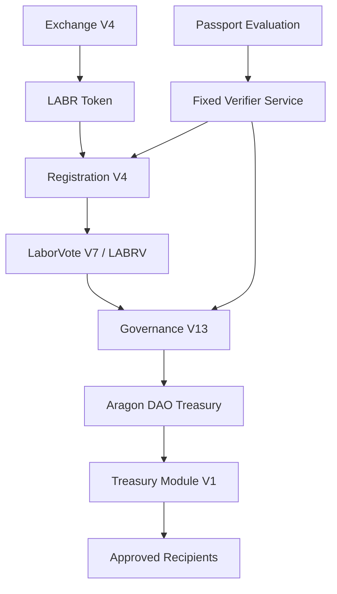

This architecture separates:

* Economic participation
* Registration
* Governance
* Treasury execution

into independent but interconnected systems.

---

## 18.7 Final Authority Relationships

The final authority structure is component-specific.

### LaborCoin Exchange V4

Authority:

None. The contract has no owner or administrative setter.

### LaborVote (LABRV) V7

Authority:

Registration V4 is the permanently locked minter. Ownership is renounced.

### LaborCoin Registration V4

Authority:

No owner. The contract accepts registration authorizations only from its fixed verifier.

### LaborCoin Governance V13

Authority:

No owner. Registered LABRV participants may create proposals and vote only with valid action-code-specific verifier authorizations. Execution remains limited by fixed governance and treasury rules.

### LaborCoin Treasury Module V1

Authority:

No owner. Only the Aragon DAO may call `executeTransfer`.

### DAO Treasury

Authority:

The Aragon DAO permission registry controls execution authority. Governance V13 is the intended constrained treasury-allocation executor after obsolete permissions are removed.

### LABR Token

Authority:

Owned by the Aragon DAO. Owner-only token functions remain present, making the final Aragon permission registry material to the security model.

### Verifier

Authority:

External signing authority for registration and authenticated governance actions. It cannot directly mint, vote, create proposals, or transfer treasury funds.

## 18.8 Final Deployment Sequence

The final deployment record is:

1. **LABR Token** — deployed April 2, 2025.
2. **LaborVote (LABRV) V7** — deployed June 16, 2026.
3. **LaborCoin Registration V4** — deployed June 22, 2026.
4. **LaborCoin Treasury Module V1** — deployed June 24, 2026.
5. **LaborCoin Governance V13** — deployed June 24, 2026.
6. **LaborCoin Exchange V4** — deployed June 25, 2026.

After deployment, the components were connected through constructor dependencies, LABRV minter configuration, Aragon DAO permissions, LABR ownership and AMM configuration, and interface updates. Full deployment metadata appears in Appendix A and the separate launch provenance report.

## 18.9 Governance Dependency Map

Governance depends upon several components.

Figure 10. Governance Authorization Flow

Illustrates the progression from identity verification through governance participation and treasury execution authority.

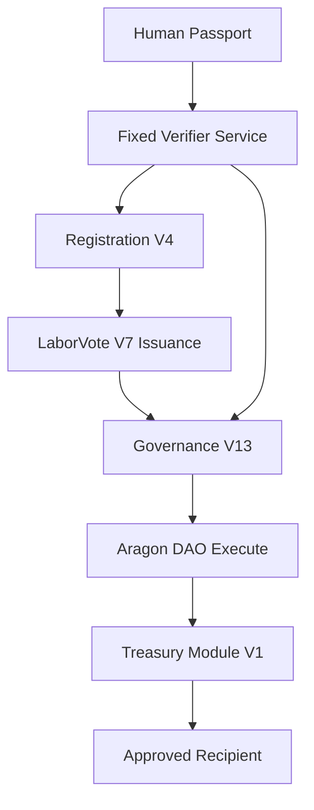

This structure illustrates how governance participation originates from registration rather than token ownership.

---

## 18.10 Economic Dependency Map

The economic layer follows a separate architecture.

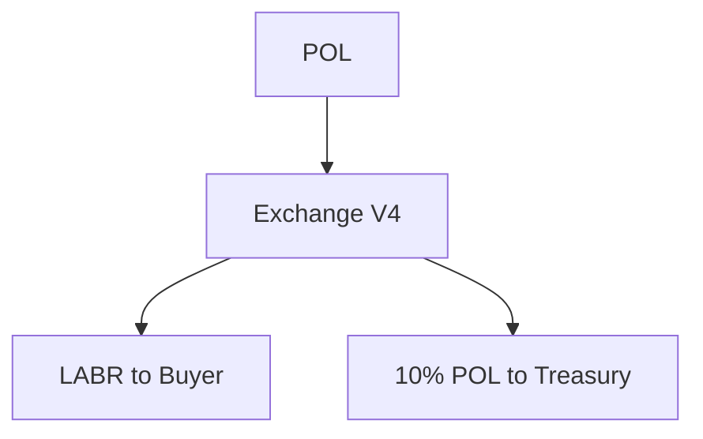

This separation is one of the defining characteristics of the protocol.

Economic participation and governance participation remain distinct.

---

## 18.11 Final Deployment and Authority Status

### LaborVote (LABRV) V7

✓ Registration V4 is the configured minter

✓ Minter permanently locked

✓ Ownership renounced

### LaborCoin Exchange V4

✓ Final address deployed and source-verified

✓ Deployed without owner, pause, administrative withdrawal, or upgrade authority

△ Functional transaction evidence belongs in the launch validation report

### LaborCoin Registration V4

✓ Final address deployed and source-verified

✓ LABR, LABRV, and verifier dependencies fixed at deployment

✓ Deployed without owner administration

△ Registration and mint evidence belongs in the launch validation report

### LaborCoin Governance V13

✓ Final address deployed and source-verified

✓ Governance constants, nonce logic, and constructor dependencies fixed at deployment

✓ Deployed without owner administration

△ Full proposal, vote, threshold, and execution evidence belongs in the launch validation report

### LaborCoin Treasury Module V1

✓ Final address deployed and source-verified

✓ DAO-only caller fixed at deployment

✓ Deployed without owner administration

△ Transfer and accounting evidence belongs in the launch validation report

### LABR and DAO

✓ LABR ownership transferred to the DAO

△ Final DAO permission revocations and executor provenance remain to be completed and published in the separate launch provenance report

### Documentation

✓ Final contract registry incorporated into this whitepaper

△ Document SHA-256 to be inserted after the publication artifact is frozen

## 18.12 Final Authority State

Figure 11. Post-Finalization Authority Structure.

Illustrates the final authority model. Creator ownership is removed from the final custom contracts; Governance V13 retains constrained treasury-allocation authority; the DAO owns LABR and custody assets; and the verifier remains an external authorization dependency.

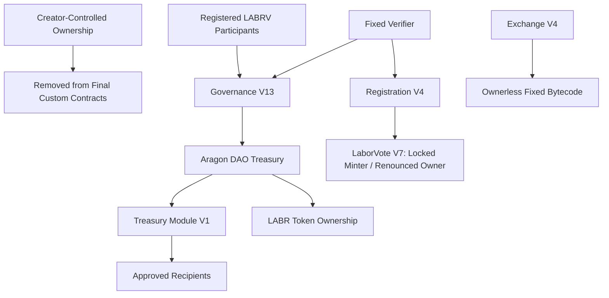

This diagram distinguishes creator-authority removal from complete elimination of all authority. DAO-held LABR ownership and verifier signing remain explicit parts of the deployed system.

## 18.13 Protocol Rules and Enforcement Layers

The principal deployed rules are:

| Rule | Value | Enforcement Layer |
|---|---:|---|
| Maximum LABR supply | 1,000,000,000 LABR | LABR and Exchange V4 supply model |
| Voting participation threshold | 25% | Governance V13 |
| Approval threshold | 67% | Governance V13 |
| Maximum treasury allocation per proposal | 5% of the Aragon DAO's native POL balance at execution | Governance V13 |
| Voting period | 14 days | Governance V13 |
| Execution window | 7 days | Governance V13 |
| Minimum LABR for registration | 1 LABR | Registration V4 |
| Passport-score threshold | 15 | Published verifier policy, not an on-chain Registration V4 constant |

The distinction between contract-enforced constants and verifier policy is material. Governance V13 cannot change its own constants or Registration V4 dependencies, while the off-chain verifier remains responsible for consistently applying the published Passport policy.

## 18.14 Summary

The LaborCoin deployment architecture consists of multiple specialized components operating together to provide economic participation, registration, governance, treasury management, and decentralized resource allocation.

The protocol's structure reflects a deliberate separation of responsibilities, minimizing authority concentration while preserving transparency and auditability.

This registry provides a permanent technical reference describing the deployed state of the LaborCoin protocol and the relationships between its constituent components.

---

# Chapter 19: Launch Validation and Operational Readiness

## 19.1 Introduction

Deployment, source verification, ownership finalization, functional testing, DAO permission cleanup, and publication provenance are separate milestones.

The final contracts have been deployed and source-verified. That fact does not by itself prove that every live, time-dependent protocol path has completed on the final deployment. This chapter therefore distinguishes confirmed deployment facts from validation evidence that must be recorded in the separate launch validation and provenance reports.

---

## 19.2 Confirmed Deployment Facts

The following items are confirmed in the final deployment registry:

* Final contract addresses and deployment blocks
* Public source verification for all listed contracts
* Ownerless deployment of Exchange V4, Registration V4, Governance V13, and Treasury Module V1
* Permanent locking of Registration V4 as the LaborVote V7 minter
* Renouncement of LaborVote V7 ownership
* Transfer of LABR ownership to the Aragon DAO
* Fixed constructor dependencies for the final custom contracts

---

## 19.3 Exchange Validation Evidence

The launch validation report should record transaction-level evidence for:

* Purchase execution
* Sale execution
* Treasury routing
* Chainlink POL/USD conversion
* Twelve-hour cooldown enforcement
* Exchange wallet and transaction limits
* Tranche accounting and unlocking behavior
* Liquidity-balance and payout behavior

Source inspection confirms the deployed functions and constants. Live transaction evidence should be cited separately rather than inferred from source verification alone.

---

## 19.4 Registration and LaborVote Validation Evidence

The launch validation report should record evidence for:

* Valid registration authorization acceptance
* Invalid, altered, and expired authorization rejection
* Minimum-LABR enforcement
* Duplicate-registration rejection
* Member-number assignment
* LABRV minting
* LABRV non-transferability
* Permanent minter lock and ownership renouncement

The minter lock and ownership state are final deployment facts. Other functional claims should be supported by recorded transactions or reproducible tests.

---

## 19.5 Governance Validation Evidence

Governance V13's verified source establishes the configured proposal duration, participation threshold, approval threshold, minimum-member activation requirement, treasury cap, execution window, nonce handling, and execution logic.

The launch validation report should separately document:

* Proposal creation
* Proposal-authorization nonce and expiry enforcement
* Vote casting
* Vote-authorization nonce and expiry enforcement
* Duplicate-vote rejection
* Participation and approval calculations
* Minimum-member activation behavior
* Execution-window behavior
* Double-execution rejection
* The final DAO execution path

A source-code or ABI review is not equivalent to observing a complete fourteen-day final-deployment proposal lifecycle. Any full-lifecycle claim must be supported by the corresponding final-deployment evidence or clearly identified as a prior-environment test.

---

## 19.6 Treasury and DAO Permission Evidence

The launch provenance report must document:

* Governance V13's DAO execute permission
* Treasury Module V1's DAO-only restriction
* Recipient-transfer behavior
* `totalDistributed` accounting
* Removal of obsolete governance, module, treasury, or executor permissions
* The final Aragon permission registry
* The practical authority available through DAO-owned LABR functions

Until obsolete permissions are removed and the final registry is published, Governance V13's exclusivity as the constrained DAO execution path is not established.

---

## 19.7 Documentation Readiness

The publication set should include:

* Technical Whitepaper
* Redpaper
* FAQ
* Onboarding Guide
* Contract Registry
* Deployment Manifest
* Constructor Arguments
* Build Environment Record
* Launch Provenance and DAO Permission Report
* Launch Validation Report

The document hash should be calculated only after the final publication artifact is frozen.

---

## 19.8 Operational Readiness Status

| Area | Status |
|---|---|
| Final contracts deployed | Complete |
| Public source verification | Complete |
| LaborVote V7 minter lock and ownership renouncement | Complete |
| LABR ownership transfer to DAO | Complete |
| Final DAO permission cleanup | Outstanding launch task |
| Final Aragon permission registry | Outstanding launch publication |
| Final-deployment functional evidence | Record in launch validation report |
| Full-duration Governance V13 lifecycle evidence | Record or qualify in launch validation report |
| Final whitepaper SHA-256 | Pending publication freeze |

---

## 19.9 Summary

The final deployment is established, but launch readiness must be demonstrated through evidence rather than inferred from deployment labels. The final permission registry, validation records, provenance report, and publication hash complete the transition from a deployed system to a documented autonomous launch.

# Chapter 20: Risk Considerations

## 20.1 Introduction

Every governance system operates within constraints.

No protocol can eliminate uncertainty, guarantee outcomes, or solve complex social problems through technology alone.

LaborCoin is no exception.

This chapter provides a candid assessment of the protocol's limitations, assumptions, and risks.

The purpose of this section is not to undermine confidence in the system.

Rather, it is to establish realistic expectations regarding what the protocol can and cannot accomplish.

The LaborCoin protocol provides infrastructure.

Infrastructure can enable action.

Infrastructure cannot guarantee success.

Participants, communities, organizations, and governance processes ultimately determine whether the protocol fulfills its intended purpose.

---

## 20.2 Technology Is Not a Substitute for Organization

A common misconception within blockchain ecosystems is that technology alone can solve fundamentally social problems.

LaborCoin rejects this assumption.

The protocol does not create solidarity.

The protocol does not create trust.

The protocol does not create participation.

The protocol does not create effective governance.

Those things must come from people.

The system merely provides a framework through which participants may coordinate resources and make collective decisions.

Without active participation, the protocol remains little more than software.

Consequently, the greatest long-term determinant of success is not technology but community engagement.

---

## 20.3 The Protocol Cannot Guarantee Good Decisions

LaborCoin provides governance infrastructure.

It does not provide wisdom.

Governance participants may make:

* Effective decisions
* Ineffective decisions
* Popular decisions
* Controversial decisions
* Well-informed decisions
* Poorly informed decisions

The protocol intentionally places decision-making authority in the hands of participants.

As a result, governance outcomes may not always be optimal.

This is not a flaw unique to LaborCoin.

It is an inherent characteristic of democratic systems.

The protocol can facilitate collective decision-making.

It cannot guarantee the quality of collective decisions.

---

## 20.4 Governance Participation Risk

The governance system assumes ongoing participation.

If participation declines significantly:

* Proposal review may weaken.
* Community oversight may weaken.
* Governance legitimacy may weaken.

Participation thresholds reduce some risks associated with low engagement, but they cannot create participation where none exists.

A governance system is ultimately only as strong as the community willing to use it.

This reality represents one of the largest long-term risks facing the protocol.

---

## 20.5 Sybil Resistance Is Probabilistic

LaborCoin utilizes Human Passport because it provides a practical balance between accessibility and identity assurance.

However:

Human Passport does not prove identity.

Passport provides evidence suggesting uniqueness.

This distinction is important.

Determined adversaries may still attempt to create multiple eligible identities.

Likewise, some legitimate participants may struggle to achieve sufficient Passport scores.

The protocol therefore provides practical Sybil resistance rather than absolute Sybil prevention.

Participants should understand this limitation clearly.

---

## 20.6 One Verified Participant per LABRV Is an Approximation

The governance model is designed to approximate one distinct participant per LABRV.

However, no decentralized identity system can currently guarantee perfect uniqueness.

As a result:

LaborCoin should be understood as pursuing participant-equality principles rather than claiming perfect proof that each registered wallet corresponds to one unique person.

The protocol seeks to move governance closer to democratic participation than wealth-weighted alternatives.

It does not claim to have solved decentralized identity.

---

## 20.7 Economic Participation and Governance Participation May Diverge

The protocol intentionally separates economic ownership from governance authority.

This design provides several benefits.

However, it also introduces tradeoffs.

For example:

Participants with substantial economic exposure may possess the same governance influence as participants with minimal economic exposure.

Some observers may view this as a strength.

Others may view it as a weakness.

LaborCoin intentionally prioritizes governance equality over economic weighting.

Reasonable individuals may disagree with this choice.

---

## 20.8 Treasury Governance Risk

The treasury exists to be governed.

Therefore, treasury governance necessarily involves risk.

Participants may approve proposals that:

* Fail to achieve intended goals.
* Produce unintended consequences.
* Generate disagreement.
* Allocate resources inefficiently.

Treasury caps reduce the impact of individual decisions.

However, governance remains responsible for how treasury resources are used.

No protocol can guarantee that collective decisions will always produce desirable outcomes.

---

## 20.9 Treasury Capture Risk

Although LaborCoin incorporates numerous governance protections, treasury capture remains theoretically possible.

Examples include:

* Coordinated voting blocs.
* Long-term organizational influence.
* Strategic participation campaigns.
* Governance coalitions.

The protocol attempts to reduce these risks through:

* Registration requirements.
* Passport verification.
* Participation thresholds.
* Supermajority approval.
* Treasury spending caps.

However, no democratic governance system can entirely eliminate the possibility of organized political influence.

The objective is mitigation rather than elimination.

---

## 20.10 Exchange Liquidity Risk

The LaborCoin Exchange provides protocol-managed buy and sell access subject to available LABR inventory, available POL liquidity, oracle validity, and contract limits.

Nevertheless, liquidity is not unlimited.

Extreme market conditions could create situations where:

* Sell pressure exceeds available reserves.
* Liquidity becomes constrained.
* Exchange behavior differs from participant expectations.

Exchange V4 retains 90% of incoming purchase POL as liquidity and rejects a sale when its calculated payout exceeds the contract's available POL balance.

Participants should understand that liquidity remains dependent upon Exchange V4's available POL balance, future purchase inflows, and broader ecosystem activity.

---

## 20.11 Oracle Dependency Risk

The exchange relies upon Chainlink POL/USD price data.

If the oracle experiences:

* Outages
* Incorrect reporting
* Severe delays
* Infrastructure failures

exchange functionality may be affected.

The protocol includes safeguards against stale and invalid data.

However, oracle dependency remains an unavoidable external assumption.

Participants should understand that the exchange is not completely self-contained.

---

## 20.12 Blockchain Dependency Risk

LaborCoin operates on Polygon.

Consequently, the protocol inherits risks associated with the underlying blockchain.

These include:

* Network outages
* Congestion
* Consensus failures
* Infrastructure disruptions
* Future protocol changes

Such risks are not unique to LaborCoin.

They are inherent to any application built upon external blockchain infrastructure.

---

## 20.13 Passport and Verifier Dependency Risk

Governance onboarding and authenticated governance actions depend upon Passport evaluation and the fixed verifier service.

Future changes or failures could affect:

* Registration authorization
* Proposal creation
* Vote authorization
* Participant onboarding
* Governance availability

The verifier can neither mint LABRV directly nor create an on-chain vote by itself. It can nevertheless authorize ineligible actions, refuse eligible actions, or interrupt participation if unavailable.

Because Registration V4 and Governance V13 contain fixed verifier addresses, replacing the verifier would require migration to new contracts rather than a Governance V13 parameter update.

## 20.14 Regulatory Uncertainty

Regulatory treatment of blockchain systems continues to evolve globally.

LaborCoin does not attempt to predict future legal developments.

Participants should understand that:

* Laws may change.
* Regulatory interpretations may change.
* Jurisdictional treatment may vary.

The protocol was designed as governance infrastructure rather than a financial product.

Nevertheless, future legal developments remain uncertain.

No whitepaper can guarantee future regulatory outcomes.

---

## 20.15 LaborCoin Is Not a Strike Guarantee System

One potential misunderstanding should be addressed directly.

LaborCoin does not guarantee financial support for any individual, organization, campaign, or strike.

The protocol merely provides a mechanism through which participants may collectively allocate resources.

Whether support occurs depends entirely upon governance decisions.

The protocol therefore provides infrastructure for solidarity.

It does not guarantee solidarity itself.

---

## 20.16 LaborCoin Does Not Replace Existing Institutions

Another common misconception would be to view LaborCoin as a replacement for labor unions, worker organizations, mutual aid networks, or community institutions.

The protocol was not designed for that purpose.

Existing organizations provide functions that software cannot:

* Organizing
* Representation
* Negotiation
* Education
* Community building

LaborCoin is better understood as complementary infrastructure.

Its purpose is to provide an additional coordination mechanism rather than a replacement for existing institutions.

---

## 20.17 Adoption Risk

A technically sound protocol may still fail to achieve meaningful adoption.

Adoption depends upon:

* Awareness
* Community trust
* Governance participation
* Real-world usefulness

The protocol cannot compel adoption.

Ultimately, LaborCoin succeeds only if participants find value in using it.

This may be the single greatest long-term uncertainty facing the project.

---

## 20.18 Finalization and Recoverability Risk

Ownerless and permanently locked contracts provide predictability, but they also reduce recoverability.

For Exchange V4, Registration V4, Governance V13, Treasury Module V1, and LaborVote V7:

* Bugs may be impossible to correct in place.
* Fixed dependencies cannot be replaced administratively.
* Governance cannot modify contract rules.

LABR presents a different risk. It remains DAO-owned and retains owner-only functions. This creates recoverability and administration possibilities at the token layer, but also creates permission and governance risks that do not apply to the ownerless final contracts.

The protocol therefore contains both immutability risk and DAO-permission risk.

## 20.19 Smart Contract Risk

Despite testing and review efforts, smart contract systems can never be proven completely free of defects.

Potential risks include:

* Logic errors
* Unexpected interactions
* Economic exploits
* Undiscovered vulnerabilities

This risk exists within all smart contract systems and is especially consequential where contracts are ownerless or permanently locked.

The protocol attempts to reduce risk through simplicity, transparency, testing, and separation of responsibilities.

However, smart contract risk can never be reduced to zero.

---

## 20.20 Limits of the Protocol

The most important limitation of LaborCoin is also the simplest.

The protocol cannot solve the underlying social, economic, and political challenges that motivated its creation.

LaborCoin cannot:

* Eliminate economic inequality.
* Eliminate labor conflict.
* Eliminate retaliation against workers.
* Guarantee successful collective action.
* Create political consensus.

Those challenges are larger than any software system.

What the protocol can do is provide infrastructure through which communities may coordinate resources more transparently and democratically than might otherwise be possible.

Whether that infrastructure proves effective remains a question that can only be answered through use.

---

## 20.21 Why These Risks Are Accepted

The existence of risks does not imply the protocol lacks value.

Every governance system operates under constraints.

Traditional institutions possess risks.

Governments possess risks.

Corporations possess risks.

Labor organizations possess risks.

Decentralized systems possess risks.

The relevant question is not whether risks exist.

The relevant question is whether the tradeoffs are acceptable given the objectives being pursued.

LaborCoin represents one particular set of tradeoffs:

* Equality over wealth-weighted governance.
* Transparency over opacity.
* Fixed rules over continual modification.
* Public infrastructure over centralized administration.

Reasonable participants may disagree with these choices.

The protocol simply makes those choices explicit.

---

## 20.22 Summary

LaborCoin provides governance infrastructure, not guarantees.

The protocol can facilitate coordination, treasury management, and democratic resource allocation, but it cannot guarantee participation, wisdom, adoption, or success.

Its effectiveness ultimately depends upon the people who choose to use it.

The purpose of this chapter is not to diminish the protocol's ambitions, but to place them within realistic boundaries.

LaborCoin should be evaluated not as a solution to every challenge facing collective action, but as an attempt to provide durable infrastructure through which collective action may be supported.

---

# Chapter 21: Future Governance and Conclusion

## 21.1 Introduction

Every protocol must ultimately answer a fundamental question:

**What happens after launch?**

Many blockchain projects treat launch as the beginning of an indefinite development process.

New features are proposed.

Parameters are adjusted.

Governance expands.

Complexity grows.

LaborCoin was designed around a different philosophy.

The objective is not perpetual modification.

The objective is completion.

The protocol seeks to provide a durable governance infrastructure that can continue operating without requiring continuous redesign, continuous administration, or continuous intervention.

This chapter describes that philosophy and concludes the technical specification of the LaborCoin protocol.

---

## 21.2 Governance After Finalization

In the final deployed state, Governance V13 continues operating without an owner role.

Participants may:

* Create proposals.
* Vote on proposals.
* Allocate treasury resources.
* Execute approved distributions.

The governance process remains active.

However, governance authority remains intentionally constrained.

Governance V13 cannot rewrite its protocol rules.

Governance V13 cannot alter Exchange V4 or LABR token economics.

Governance V13 cannot replace Registration V4 dependencies or the fixed verifier.

Governance V13 cannot modify its constitutional parameters.

Instead, governance remains focused on its intended purpose:

**Collective treasury allocation.**

---

## 21.3 Community Stewardship

Following decentralization, responsibility shifts from administrators to participants.

The protocol itself continues operating automatically.

The community becomes responsible for:

* Participation
* Proposal review
* Treasury oversight
* Resource allocation
* Governance culture

The distinction is important.

The protocol can execute rules.

Only participants can exercise judgment.

Long-term success therefore depends less on technical infrastructure and more on the quality of community stewardship.

---

## 21.4 The Difference Between Governance and Administration

Many decentralized systems eventually blur the distinction between governance and administration.

Governance becomes capable of changing nearly every aspect of protocol behavior.

In practice, governance often becomes a replacement administrator.

LaborCoin intentionally avoids this outcome.

Creator administration of the final custom contracts is removed.

Constrained governance remains, while DAO-held LABR ownership and verifier operation continue as disclosed dependencies.

The governance system exists to direct resources, not to manage software.

This separation is one of the protocol's defining architectural characteristics.

---

## 21.5 Why LaborCoin Is Designed to Become Finished

A common assumption within software development is that systems should evolve indefinitely.

This assumption is not always appropriate for public infrastructure.

Roads are not redesigned every month.

Bridges are not continuously re-governed.

Constitutions are not intended to change daily.

Infrastructure derives much of its value from predictability.

LaborCoin adopts a similar perspective.

The protocol was designed to become finished.

Not abandoned.

Finished.

The distinction matters.

A finished protocol continues operating.

An abandoned protocol ceases functioning.

LaborCoin seeks the former.

---

## 21.6 Protocol Completion

Protocol completion occurs when several conditions are satisfied.

### Functional Completion

Core systems operate correctly.

### Governance Completion

Treasury governance functions as intended.

### Documentation Completion

System behavior is fully documented.

### Authority Finalization

Creator ownership is removed from the final custom contracts, the LABRV minter is locked, and the final DAO permission state is published.

Once these conditions are met and the final provenance records are published, the protocol does not require ongoing contract development to fulfill its defined purpose.

---

## 21.7 Stability as a Feature

Within blockchain ecosystems, stability is often underestimated.

Participants frequently assume that constant change represents progress.

In practice, constant change can create uncertainty.

Stable systems provide:

* Predictability
* Reliability
* Transparency
* Reduced political conflict

LaborCoin therefore treats stability as a feature rather than a limitation.

Participants can understand the rules because the rules remain fixed.

---

## 21.8 Future Improvements Outside the Protocol

The completion of the protocol does not imply the end of community activity.

Many improvements can occur without modifying core infrastructure.

Examples include:

### Educational Resources

Improved documentation and onboarding.

### Governance Culture

Better proposal review and deliberation.

### Community Growth

Increased participation and awareness.

### Ecosystem Development

Additional tools and integrations.

### Research

Analysis of governance outcomes and treasury effectiveness.

These developments can occur without changing the protocol itself.

---

## 21.9 Future Governance Questions

The protocol intentionally leaves many questions unanswered.

For example:

* Which initiatives should receive support?
* Which proposals deserve approval?
* How should treasury resources be prioritized?
* What forms of solidarity are most effective?

These questions are not technical.

They are political, social, and organizational.

The protocol provides a framework within which participants may address them collectively.

The protocol does not attempt to answer them in advance.

---

## 21.10 LaborCoin as Infrastructure

The most useful way to understand LaborCoin may be as infrastructure.

The protocol does not seek to become:

* A political party
* A labor union
* A charity
* An advocacy organization
* A centralized institution

Instead, it seeks to provide infrastructure that such groups, communities, and individuals may choose to utilize.

Infrastructure is valuable precisely because it remains available regardless of who uses it.

The protocol's objective is therefore not organizational control, but public utility.

---

## 21.11 Economic Solidarity and Infrastructure

The motivation behind LaborCoin is straightforward.

Workers and communities frequently face significant economic pressure when attempting collective action.

This reality predates blockchain technology and exists independently of it.

LaborCoin does not claim that blockchain technology solves this problem.

Rather, the protocol attempts to address a narrower question:

**Can a transparent, decentralized treasury infrastructure make collective economic support easier to coordinate?**

That question remains open.

The protocol represents one attempt to explore it.

The objective is not to use blockchain for its own sake.

The objective is to provide a mechanism for economic solidarity that does not currently exist in a broadly accessible, decentralized form.

The technology serves the purpose.

The purpose does not serve the technology.

---

## 21.12 Why Governance Matters

At its core, LaborCoin is not primarily a token system.

It is a governance system.

The token exists to support participation.

The exchange exists to support distribution.

The registration system exists to support legitimacy.

The treasury exists to support execution.

Governance connects all of these components.

Without governance, the system becomes merely a collection of contracts.

Governance transforms infrastructure into collective action.

---

## 21.13 Why Constraints Matter

One of the recurring themes throughout this whitepaper has been limitation.

Governance is limited.

Treasury spending is limited.

Administrative authority is limited.

Creator ownership is removed from the final custom contracts, and remaining authority is explicitly bounded and disclosed.

These constraints are not accidents.

They are deliberate design decisions.

LaborCoin is based on the belief that durable institutions emerge not from unlimited power, but from clearly defined limits on power.

The protocol therefore seeks to distribute authority while simultaneously constraining it.

---

## 21.14 What Success Would Look Like

Success should not be measured solely through token price, treasury size, or transaction volume.

Those metrics may provide useful information, but they do not capture the protocol's purpose.

A more meaningful measure of success would be whether participants are able to:

* Coordinate resources transparently.
* Make collective decisions democratically.
* Support initiatives they collectively value.
* Maintain governance legitimacy over time.

The protocol exists to enable these outcomes.

Whether it succeeds depends upon the community that adopts it.

---

## 21.15 Final Reflection

The LaborCoin protocol was created in response to a simple observation:

Economic solidarity often requires infrastructure.

Modern financial systems provide extensive infrastructure for investment, speculation, and capital coordination.

Comparable infrastructure for decentralized collective support is far less common.

LaborCoin represents an attempt to contribute to that gap.

The protocol combines:

* Transparent treasury management
* Democratic governance
* Sybil-resistant participation
* Fixed core custom-contract rules
* Constrained operation with explicit DAO and verifier dependencies

into a single system designed to function as public infrastructure.

Whether this approach proves effective remains to be seen.

The protocol itself makes no promises.

It merely provides the framework.

What participants choose to build with that framework is beyond the authority of the protocol and beyond the scope of this document.

---

# Conclusion

LaborCoin is a decentralized treasury governance protocol built on Polygon and designed to support transparent, community-directed allocation of resources.

The system combines:

* The LABR utility token
* A deterministic bonding curve exchange
* Human Passport-based registration
* The LABRV governance token
* Democratic treasury governance
* Constrained treasury execution through the Aragon DAO and Treasury Module V1

within a unified architecture intended to operate without permanent creator administration of the final custom contracts.

The protocol's central objective is not technological novelty.

Its objective is to provide durable infrastructure through which communities may coordinate economic support according to collectively determined priorities.

LaborCoin's final custom contracts are deployed under fixed or permanently locked authority models, while community participation governs treasury allocation through Governance V13. DAO-held LABR ownership and verifier operation remain explicit dependencies rather than being concealed under a universal claim of immutability.

The protocol cannot guarantee participation, consensus, adoption, or success.

It can only provide a transparent framework within which those outcomes may become possible.

In that sense, LaborCoin should be understood not as a finished answer to collective action, but as an attempt to provide infrastructure upon which collective action may be built.

---

**End of LaborCoin Technical Whitepaper v1.0**

---

# Appendix A: Contract Registry

## A.1 Network and Build Context

**Network:** Polygon Mainnet

**Chain ID:** 137

**Final custom-contract compiler:** Solidity 0.8.30

**Final custom-contract EVM target:** Prague

**LABR compiler:** Solidity 0.8.25

**LABR EVM target:** Paris

---

## A.2 Core Contract Registry

### Table 2. Contract Registry

This table identifies the primary smart contracts comprising the LaborCoin protocol. Contract addresses, deployment metadata, verification status, and ownership status are provided to facilitate independent verification of protocol architecture and decentralization status.

| Contract Name | Contract Address | Deployment Block | Deployment Date (UTC) | Verified Source | Ownership Status |
|--------------|------------------|-----------------:|-----------------------|----------------|------------------|
| LABR Token | [0x460DD873A1D2a41e77410B125cD3027C5FEd2f78](https://polygonscan.com/address/0x460DD873A1D2a41e77410B125cD3027C5FEd2f78) | 69797383 | Apr-02-2025 07:56:25 AM +UTC | Yes | DAO Controlled |
| LaborVote (LABRV) V7 | [0x833242E933c675846D8f8982048FecA95B8e435A](https://polygonscan.com/address/0x833242E933c675846D8f8982048FecA95B8e435A) | 88595455 | Jun-16-2026 08:22:48 AM +UTC | Yes | Ownership Renounced / Minter Permanently Locked |
| LaborCoin Registration V4 | [0xd1CD6C0B6f1F709A52908B40C07D3C54649e323C](https://polygonscan.com/address/0xd1CD6C0B6f1F709A52908B40C07D3C54649e323C) | 88997813 | Jun-22-2026 | Yes | Autonomous |
| LaborCoin Treasury Module V1 | [0x10F2798ef055950B897AF4B3A8ae90dE34f6C56C](https://polygonscan.com/address/0x10F2798ef055950B897AF4B3A8ae90dE34f6C56C) | 89052358 | Jun-24-2026 | Yes | Autonomous (DAO Only) |
| LaborCoin Governance V13 | [0x8238105d31F6Bb26897d8Ab270a0A521FEF03E8c](https://polygonscan.com/address/0x8238105d31F6Bb26897d8Ab270a0A521FEF03E8c) | 89084762 | Jun-24-2026 08:15:38 PM +UTC | Yes | Autonomous |
| LaborCoin Exchange V4 | [0x4Cf18cB39203B678f5C26f2338a10a79f9684749](https://polygonscan.com/address/0x4Cf18cB39203B678f5C26f2338a10a79f9684749) | 89115657 | Jun-25-2026 09:08:01 AM +UTC | Yes | Autonomous |


**Ownership Status Definitions**

| Status | Description |
|---------|-------------|
| Creator Controlled | Administrative authority remains with the original deployer. |
| DAO Controlled | Ownership or custody is held by the Aragon DAO and depends upon its permission registry. |
| Autonomous | Contract contains no owner administration or upgrade authority in its deployed form. |
| Locked and Renounced | A required configuration was permanently locked before ownership was renounced. |

**Verification Status**

| Status | Description |
|---------|-------------|
| Yes | Source code has been publicly verified and can be independently reviewed and compared with the deployed bytecode. |
| No | Source code has not yet been publicly verified. |

---

## A.3 Verifier Infrastructure

Verifier Address:

`0x475d519631d2406753aCA29F305f19b83E97513e`

The verifier is an externally controlled signing address and not a smart contract.

Responsibilities include:

* Applying the published Passport policy
* Issuing expiring registration authorizations
* Issuing nonce-bound proposal and vote authorizations
* Operating the supporting verification service

The verifier cannot directly mint LABRV, register a wallet, create a proposal, cast a vote, or execute a treasury transfer.

## A.4 Oracle Dependency

POL/USD Chainlink Oracle:

`0xAB594600376Ec9fD91F8e885dADF0CE036862dE0`

Purpose:

* POL/USD price discovery
* Bonding curve pricing calculations
* Oracle freshness validation

---

# Appendix B: Tokenomics Specification

## B.1 LABR Overview

Token Name:

LaborCoin

Ticker:

LABR

Maximum Supply:

$$
1,000,000,000
$$

No additional supply may be created after deployment.

---

## B.2 Exchange Supply Release

Initial Tranche:

$$
100,000,000
$$

Additional Tranche Size:

$$
50,000,000
$$

Supply unlocks automatically as demand increases.

This mechanism prevents immediate distribution of the entire token supply while maintaining deterministic issuance.

---

## B.3 Purchase Mechanics

When LABR is purchased:

| Destination | Allocation             |
| ----------- | ---------------------- |
| Buyer       | 100% of purchased LABR |
| Treasury    | 10% of incoming POL    |

The buyer receives the full calculated LABR amount.

Treasury contributions are sourced from incoming POL rather than token deductions.

---

## B.4 Sell Mechanics

When LABR is sold:

| Component           | Percentage |
| ------------------- | ---------- |
| Treasury Tax        | 5%         |
| Holder Dividend Tax | 5%         |
| Total Tax           | 10%        |

Current burn tax:

$$
0%
$$

The burn mechanism was removed prior to launch finalization.

---

## B.5 Exchange Cooldown

Exchange cooldown:

$$
12\ Hours
$$

Applies to:

* Purchases
* Sales

Purpose:

* Reduce rapid trading
* Limit automated abuse
* Encourage long-term participation

---

## B.6 Distribution Controls

LaborCoin utilizes two independent layers of concentration controls.

### Token-Level Limits

The LABR token contract currently applies configured token-level transfer restrictions:

| Parameter | Value |
|------------|--------:|
| Maximum Wallet | 1,000,000 LABR |
| Maximum Transaction | 500,000 LABR |

These limits are enforced directly by the token contract, subject to token-level exclusions and any valid future action taken through DAO-held ownership authority.

### Exchange-Level Limits

Exchange V4 enforces additional on-chain distribution safeguards:

| Parameter | Value |
|------------|--------:|
| Maximum Exchange Wallet | 10,000 LABR |
| Maximum Exchange Transaction | 5,000 LABR |

These Exchange V4 limits are intentionally more restrictive than the LABR token-level limits.

The objective is to encourage broader early-stage distribution and reduce concentration during protocol growth.

Both layers are enforced on-chain. The LABR token applies its configured token-level limits, while Exchange V4 applies stricter limits to protocol exchange transactions.

---

# Appendix C: Governance Constants

## C.1 Registration Requirements

Minimum LABR Required:

$$
1\ LABR
$$

Published Verifier Policy Threshold:

$$
15
$$

This score is enforced by the verifier workflow, not stored as a numeric constant in Registration V4.

Governance Token Issued:

$$
1\ LABRV
$$

---

## C.2 Voting Parameters

Voting Duration:

$$
14\ Days
$$

Participation Threshold:

$$
25%
$$

Approval Threshold:

$$
67%
$$

Execution Window:

$$
7\ Days
$$

---

## C.3 Treasury Constraints

Maximum Treasury Allocation Per Proposal:

5% of the Aragon DAO's native POL balance at execution

Minimum Registered Members Required Before Treasury Governance Activates:

$$
50
$$

---

## C.4 Governance Model

Governance Weight:

$$
1\ LABRV = 1\ Vote
$$

LABRV is:

* Non-transferable
* Non-tradable
* Governance-only

---

# Appendix D: Complete System Architecture

Reproduction of Figure 1. LaborCoin System Architecture.
High-level relationship between all core protocol components.


## D.1 Architectural Layers

### Economic Layer

* LABR
* Exchange
* Treasury Funding

### Identity Layer

* Human Passport
* Verifier
* Registration

### Governance Layer

* LABRV
* Governance Contract

### Execution Layer

* Treasury
* Treasury Module

---

# Appendix E: Final Authority and Renouncement Status

## E.1 LaborVote (LABRV) V7

| Item | Status |
|---|---|
| Registration V4 assigned as minter | Complete |
| Minter permanently locked | Complete |
| Ownership renounced | Complete |
| Minting evidence | Reference launch validation report |

---

## E.2 LaborCoin Exchange V4

| Item | Status |
|---|---|
| Owner administration | None in deployed contract |
| Pause authority | None in deployed contract |
| Administrative withdrawal authority | None in deployed contract |
| Buy, sell, oracle, cooldown, and treasury-routing evidence | Reference launch validation report |

---

## E.3 LaborCoin Registration V4

| Item | Status |
|---|---|
| Owner administration | None in deployed contract |
| LABR, LABRV, and verifier dependencies | Fixed at construction |
| Signature, expiry, duplicate-registration, and mint evidence | Reference launch validation report |

---

## E.4 LaborCoin Governance V13

| Item | Status |
|---|---|
| Owner administration | None in deployed contract |
| Governance constants and dependencies | Fixed at construction |
| Proposal, vote, nonce, threshold, and execution evidence | Reference launch validation report |

---

## E.5 LaborCoin Treasury Module V1

| Item | Status |
|---|---|
| Owner administration | None in deployed contract |
| Authorized caller | Aragon DAO only |
| Transfer and accounting evidence | Reference launch validation report |

---

## E.6 LABR and DAO Permissions

| Item | Status |
|---|---|
| LABR ownership held by DAO | Complete |
| Obsolete DAO executor permissions removed | Outstanding launch task |
| Final Aragon permission registry published | Outstanding launch publication |

---

## E.7 Publication

| Item | Status |
|---|---|
| Final contract registry | Included |
| Whitepaper deployment revision | Complete in this publication candidate |
| Launch provenance and permission report | Outstanding publication item |
| Final document SHA-256 | Add after artifact freeze |
| Public launch announcement | Separate publication action |

# Appendix F: Threat Model Matrix

Table 4. Threat Model Matrix

Identifies material threat vectors, affected assets, principal controls, and residual risks.

| Threat | Primary Asset or Process | Principal Controls | Residual Risk |
|---|---|---|---|
| Multi-wallet Sybil participation | Governance eligibility | Human Passport, verifier policy, permanent registration, one LABRV per wallet | External identity assurance is probabilistic |
| Duplicate registration | Registration state | Permanent `registered` mapping | Controls operate per wallet |
| Duplicate LABRV issuance | Governance credential | Locked Registration V4 minter and mint balance check | Multiple eligible wallets may share common control |
| Registration signature replay | Registration authorization | Address binding, expiry, permanent registration | No nonce, contract address, or Chain ID in signed message |
| Governance authorization replay | Proposal and vote authorization | Action code, nonce, expiry, Governance V13 address | No Chain ID in signed message |
| Governance authorization misrouting | Proposal and vote calldata | Action code and on-chain validation | Signature does not bind proposal contents or proposal ID |
| Verifier compromise | Registration and governance gate | Limited signer role plus on-chain checks | Eligibility policy can be undermined |
| Verifier outage | Protocol availability | Existing state remains on-chain | New registration, proposal creation, and voting may stop |
| Governance capture | Treasury decisions | Non-transferable LABRV, one vote per wallet, 25% participation, 67% approval | Coordinated blocs may still prevail |
| Low participation | Governance legitimacy | Fourteen-day voting period and 25% threshold | Participation cannot be compelled |
| Changing member denominator | Proposal status | Public deterministic formula | Membership growth may change participation status |
| Single-proposal treasury drain | DAO native POL | 5% execution-time cap, voting thresholds, 50-member requirement | Applies to one proposal and native POL only |
| Repeated treasury depletion | DAO native POL | Separate voting and execution for every proposal | No cumulative spending cap |
| Obsolete or broad DAO executor | DAO treasury and LABR authority | Permission cleanup, revocation evidence, public registry | Broad permission may bypass Governance V13 |
| Stale proposal execution | Treasury execution | Seven-day window | Valid proposals require timely submission |
| Double execution | Treasury execution | Executed-state tracking and transaction atomicity | Depends on correct DAO execution path |
| Recipient failure or misconduct | Distributed POL | Public proposal details and transfer-revert behavior | Successful transfers are irreversible |
| Direct transfer to Treasury Module V1 | Module-held assets | Documentation and DAO-only execution function | Directly sent assets may be stranded |
| Reentrancy | Exchange and governance execution | Reentrancy guards on buy, sell, and executeProposal | Other economic and integration risks remain |
| Oracle failure | Exchange price | Positive value, 30-minute freshness, 100 POL ceiling | Recent but incorrect data may pass |
| Exchange illiquidity | Sell settlement | Retained purchase POL and liquidity check | Sale execution is not guaranteed |
| Token transfer mismatch | Exchange accounting | Actual-receipt balance measurement | DAO-authorized LABR changes may alter behavior |
| Multi-wallet exchange limit evasion | Exchange controls | Transaction, wallet, and cooldown limits | Address limits do not identify common control |
| Slippage and transaction ordering | Exchange output | `minTokensOut`, `minPOL`, deterministic pricing | Weak user minimums and state contention remain |
| Frontend address substitution | Participant funds | Published addresses and wallet confirmation | Users may approve malicious valid calldata |
| Dependency or CDN compromise | Frontend integrity | Exact version pinning and local preservation where practical | Package and CDN risk remain |
| Stale PWA cache | Frontend integrity | Cache versioning and update instructions | Users may continue running old code |
| Wallet compromise or phishing | Participant wallet | No seed-phrase requirement and transaction review | Confirmed malicious transactions may be irreversible |
| Smart-contract defect | Protocol assets and state | Narrow design, source verification, testing, public review | Immutable defects may require migration |
| No Exchange V4 pause | Incident response | Interface removal and public warnings | Direct contract interaction cannot be halted |
| Polygon failure | All on-chain functions | Public network infrastructure | Outside protocol control |
| Misleading project claim | Participant decision-making | Explicit limitations and evidence-based documentation | Readers must independently verify |

---
# Appendix G: Mathematical Analysis of the LaborCoin Bonding Curve

## G.1 Purpose

The LaborCoin Exchange utilizes a deterministic quadratic bonding curve to distribute LABR over time.

The curve serves several objectives simultaneously:

* Transparent pricing
* Predictable token issuance
* Progressive scarcity
* Contract-managed buy and sell access subject to available liquidity
* Treasury growth through participation

Unlike traditional order-book markets, the exchange price is determined entirely by protocol state and publicly verifiable mathematics.

Every participant can independently calculate the expected LABR price at any point during the distribution process.

---

## G.2 Mathematical Definition

The Exchange V4 contract defines a normalized distribution variable:

$$
x=\frac{S}{1,000,000,000}
$$

Where:

* (S) = Total LABR distributed through the exchange
* (1,000,000,000) = Maximum LABR supply

The normalized variable therefore ranges from:

$$
0 \le x \le 1
$$

The USD-denominated bonding curve is:

$$
P(x)=1+14x^2
$$

Where:

* (P(x)) = LABR price in USD
* (x) = Fraction of maximum supply distributed

This formula is derived directly from the Exchange V4 smart contract:

$$
P_{min}=1
$$

$$
P_{max}=15
$$

and

$$
P(x)=P_{min}+(P_{max}-P_{min})x^2
$$

---

## G.3 Boundary Conditions

At launch:

$$
x=0
$$

Resulting in:

$$
P(0)=\$1
$$

At maximum distribution:

$$
x=1
$$

Resulting in:

$$
P(1)=\$15
$$

Therefore:

$$
\$1 \le P(x) \le \$15
$$

throughout the lifecycle of the protocol.

---

## G.4 Curve Behavior

The first derivative of the bonding curve is:

$$
P'(x)=28x
$$

Since:

$$
P'(x)\ge0
$$

for all valid values of (x), the curve is monotonically increasing.

Consequently, the curve price does not decrease while `totalSold` increases. Because eligible sales reduce `totalSold`, the live curve price can decrease when LABR is sold back to Exchange V4.

### Scarcity Acceleration

The second derivative is:

$$
P''(x)=28
$$

Because:

$$
P''(x)>0
$$

the curve is strictly convex.

This means price acceleration increases as additional supply is distributed.

Early distribution therefore remains relatively accessible, while later distribution experiences progressively stronger scarcity effects.

This behavior was intentionally selected to balance accessibility and long-term scarcity within the protocol.

---

## G.5 Curve Visualization

The chart below illustrates the theoretical USD-denominated LABR price progression as supply distribution increases.

The curve begins gradually and accelerates as a larger percentage of supply enters circulation.

---

## G.6 Why a Quadratic Curve?

Many token distribution systems employ exponential or logarithmic pricing models.

These approaches frequently produce:

* Rapid early price escalation
* Strong concentration incentives
* Reduced accessibility
* Increased speculative volatility

LaborCoin instead utilizes a quadratic curve.

A quadratic model provides:

### Early Accessibility

The initial portion of distribution remains relatively affordable.

### Progressive Scarcity

Price increases accelerate as distribution expands.

### Predictability

The pricing model remains transparent and easily auditable.

### Bounded Pricing

Maximum theoretical price remains known.

The objective is not to maximize speculation, but to balance accessibility with long-term scarcity.

---

## G.7 Distribution Tranches

Supply is released progressively.

### Initial Tranche

$$
100,000,000
$$

LABR

### Subsequent Tranches

$$
50,000,000
$$

LABR

Additional supply unlocks automatically as demand reaches distribution thresholds.

No administrative intervention is required.

---

## G.8 Example Price Points

| Supply Distributed | Price (USD) |
| ------------------ | ----------: |
| 0%                 |       $1.00 |
| 10%                |       $1.14 |
| 20%                |       $1.56 |
| 30%                |       $2.26 |
| 40%                |       $3.24 |
| 50%                |       $4.50 |
| 60%                |       $6.04 |
| 70%                |       $7.86 |
| 80%                |       $9.96 |
| 90%                |      $12.34 |
| 100%               |      $15.00 |

Figure 12. Bonding Curve Distribution Model.

Illustrates the deterministic LABR pricing curve implemented by the deployed Exchange V4 contract. Prices increase quadratically from $1 to $15 as distribution progresses from 0% to 100% of maximum supply.

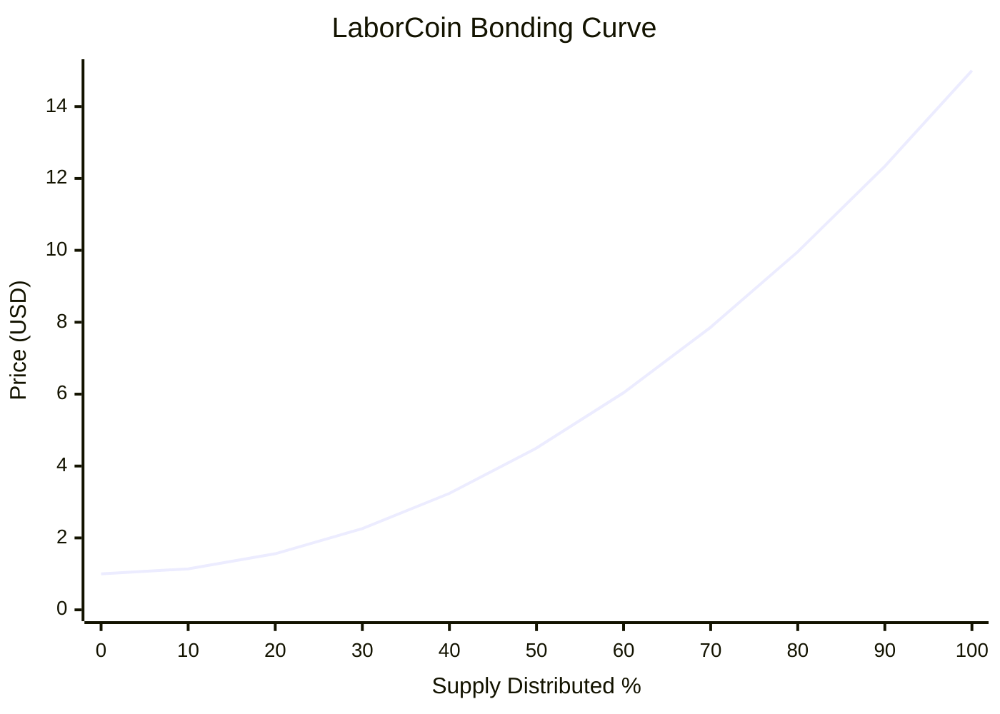

Several observations emerge:

* Early distribution remains relatively accessible.
* Mid-distribution reflects gradual scarcity growth.
* Final distribution stages experience the strongest price acceleration.
* Scarcity emerges progressively rather than abruptly.

---

## G.9 Oracle Conversion Layer

The bonding curve is denominated in USD.

However, transactions occur in POL.

The exchange therefore converts the USD curve price into POL using the Chainlink POL/USD oracle.

Conceptually:

$$
Price_{POL} = \frac{Price_{USD}}{POL_{USD}}
$$

This approach provides:

* Stable pricing logic
* Automatic adaptation to market conditions
* Consistent economic behavior

without hardcoding POL values directly into the protocol.

---

## G.10 Deterministic Pricing

The bonding curve possesses an important property:

**Determinism.**

Given:

* Current distributed supply
* Current Chainlink oracle value

every participant can independently calculate:

* Current buy price
* Current sell price
* Future theoretical prices

No administrator, governance participant, or external actor determines exchange pricing.

The price is derived entirely from protocol state and publicly available oracle data.

---

## G.11 Economic Design Considerations

The curve was designed to support several objectives simultaneously:

### Broad Distribution

Lower early prices encourage wider participation.

### Treasury Growth

Exchange activity contributes resources to the treasury.

### Governance Expansion

Distribution increases the pool of potential governance participants.

### Long-Term Sustainability

Progressive scarcity discourages immediate concentration.

### Transparency

Future pricing behavior can be modeled and audited.

The curve therefore functions as a distribution mechanism rather than a speculative instrument.

---

## G.12 Relationship to the LaborCoin Protocol

The bonding curve is not an isolated financial mechanism.

It serves as the economic entry layer of the LaborCoin ecosystem.

The exchange:

* Distributes LABR
* Funds treasury growth
* Supports governance onboarding
* Provides protocol-managed buy and sell access subject to available POL liquidity

Without distribution, governance participation cannot expand.

Without treasury growth, governance decisions cannot allocate meaningful resources.

The bonding curve therefore serves as the foundation of the protocol's economic layer.

---

## G.13 Summary

The LaborCoin Exchange implements a deterministic quadratic bonding curve defined by:

$$
P(x)=1+14x^2
$$

with prices ranging from:

$$
\$1
$$

to

$$
\$15
$$

across the full distribution of one billion LABR.

The curve is denominated in USD, converted to POL through the Chainlink POL/USD oracle, and implemented directly within the Exchange V4 smart contract.

Its purpose is to support transparent distribution, progressive scarcity, treasury growth, and long-term protocol sustainability while remaining simple enough to be independently audited and understood by participants.

---

# Appendix H: Economic Flows and Treasury Architecture

## H.1 Introduction

LaborCoin separates economic activity, treasury custody, governance authorization, and fund distribution into distinct on-chain paths.

The protocol contains two different forms of flow:

1. **Value flow**, which describes where POL and LABR move.
2. **Authority flow**, which describes who may authorize a treasury distribution.

Governance V13 does not hold treasury assets. The Aragon DAO is the treasury custodian. Governance V13 records proposals and votes, evaluates fixed conditions, and constructs a constrained DAO execution request for approved native POL transfers.

The principal economic systems are:

1. LABR distribution through Exchange V4
2. Exchange liquidity accumulation and depletion
3. DAO treasury accumulation
4. Governance authorization
5. Treasury execution through Treasury Module V1
6. Recipient use and public accountability

---

## H.2 Economic Components and Custody Boundaries

| Component | Economic Role | Assets Held or Processed |
|---|---|---|
| Participants | Purchase, hold, transfer, sell, donate, propose, vote, and execute | Participant-controlled POL, LABR, and LABRV |
| Exchange V4 | LABR distribution and eligible sale settlement | LABR inventory and POL liquidity |
| LABR Token | Transfer accounting, configured taxes, and dividend mechanics | Token balances and tax allocations |
| Aragon DAO | Treasury custody and LABR ownership | Native POL, LABR, and any other assets sent to the DAO |
| Governance V13 | Proposal, voting, threshold, and constrained execution logic | No treasury custody |
| Treasury Module V1 | Final approved POL forwarding | Approved call value and any assets sent directly to the module |
| Recipients | Receive approved distributions | POL delivered by Treasury Module V1 |

These balances are not interchangeable.

In particular:

* Exchange V4 POL is market liquidity, not DAO treasury POL.
* DAO treasury POL is governance-controlled custody, not Exchange V4 liquidity.
* Governance V13 does not hold proposal funds.
* Treasury Module V1 is an execution module, not the primary treasury custodian.
* LABRV represents governance eligibility, not an economic claim on treasury assets.

---

## H.3 Buy-Side Economic Flow

When a participant purchases LABR, the participant submits POL to Exchange V4.

Exchange V4 calculates the current LABR output using:

* The current `totalSold` state
* The deployed quadratic bonding curve
* The fixed Chainlink POL/USD feed
* The submitted `minTokensOut` protection

Figure 13. Buy-Side Economic Flow.

Illustrates the movement of POL and LABR during an Exchange V4 purchase.

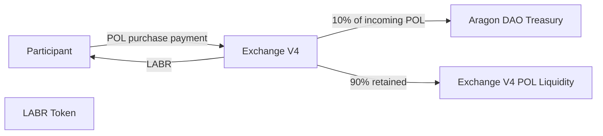

For a purchase of \(Q\) POL:

$$
	ext{DAO POL Contribution}=0.10Q
$$

$$
	ext{Exchange POL Retention}=0.90Q
$$

The treasury contribution is an allocation of incoming POL. It is not a separate LABR tax and does not reduce the already calculated token output after settlement.

Purchase activity may increase both:

* The Aragon DAO's native POL balance
* Exchange V4's POL liquidity available for eligible sale payouts

The two balances remain separately custodied.

---

## H.4 Sell-Side Economic Flow

A participant selling LABR first authorizes Exchange V4 to transfer the submitted LABR amount.

Exchange V4 then:

1. Calculates the current price from the pre-sale `totalSold` state.
2. Transfers LABR from the seller.
3. Measures the LABR actually received after token-level transfer mechanics.
4. Calculates the POL payout from that measured amount.
5. Verifies `minPOL` and available liquidity.
6. Pays the participant in POL.
7. Reduces `totalSold` by the amount of LABR actually received.

Figure 14. Sell-Side Economic Flow.

Illustrates the current LABR sell-side tax routing and the Exchange V4 POL payout.

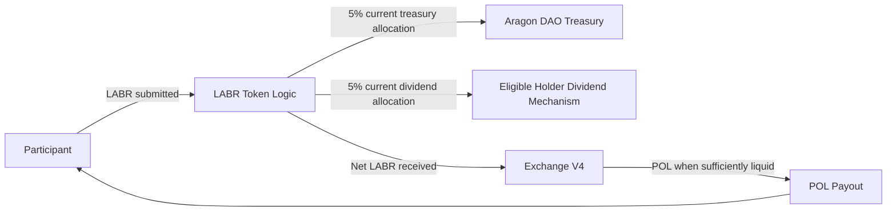

Current sell-side configuration:

| Destination | Current Rate |
|---|---:|
| Aragon DAO treasury allocation | 5% |
| Eligible LABR-holder dividend allocation | 5% |
| Burn | 0% |
| Total | 10% |

Let:

* \(A\) = LABR submitted
* \(A_{	ext{net}}\) = LABR actually received by Exchange V4
* \(P_{	ext{POL}}\) = current POL price per LABR

The exchange payout is based on:

$$
	ext{POL Payout}=A_{	ext{net}}	imes P_{	ext{POL}}
$$

Exchange V4 relies on the measured token balance change rather than assuming a fixed tax percentage. This protects settlement from discrepancies between documentation, frontend estimates, and actual token-transfer behavior.

Eligible sales reduce Exchange V4 POL liquidity and reduce `totalSold`. The live bonding-curve price may therefore move downward after a sale.

---

## H.5 Treasury Accumulation Flow

The Aragon DAO treasury may receive multiple asset types from multiple sources.

Figure 15. Treasury Accumulation Flow.

Illustrates the principal sources of value entering the Aragon DAO treasury.

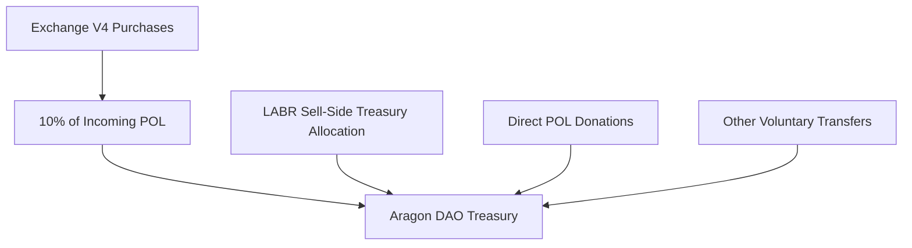

The sources differ in asset denomination:

| Source | Typical Asset |
|---|---|
| Exchange V4 purchase contribution | Native POL |
| Current sell-side treasury tax | LABR or value processed under LABR token logic |
| Direct donation | Native POL |
| Other voluntary transfer | Any supported asset sent to the DAO |

Governance V13 treasury proposals distribute native POL only. The presence of LABR or another token in the DAO does not make that asset transferable through the Governance V13 proposal format.

Treasury growth is not guaranteed. It depends upon participation, transaction activity, donations, asset values, and prior distributions.

---

## H.6 Direct Donation Flow

A participant may send native POL directly to the Aragon DAO.

```mermaid
flowchart LR
    Donor[Donor Wallet]
    Treasury[Aragon DAO Treasury]

    Donor -->|Direct POL transfer| Treasury
```

A direct donation:

* Does not purchase LABR
* Does not increase Exchange V4 `totalSold`
* Does not create Exchange V4 liquidity
* Does not mint LABRV
* Does not create a governance proposal
* Increases the DAO's native POL balance available for future proposals, subject to governance constraints

---

## H.7 Governance Allocation Flow

Treasury resources do not move into Governance V13.

Governance V13 supplies authorization logic. The Aragon DAO supplies custody and execution.

Reproduction of Figure 7. Governance Allocation Flow.

Illustrates the governance process required before native POL may be distributed.

```mermaid
flowchart TD
    Holder[Eligible LABRV Holder]
    Proposal[Create Treasury Proposal]
    Voting[14-Day Voting Period]
    Thresholds{Participation and Approval Met}
    Window[7-Day Execution Window]
    Caller[Any Execution Caller]
    Governance[Governance V13]
    DAO[Aragon DAO Execute]
    Module[Treasury Module V1]
    Recipient[Approved Recipient]

    Holder --> Proposal
    Proposal --> Voting
    Voting --> Thresholds
    Thresholds -->|No| Failed[Proposal Fails]
    Thresholds -->|Yes| Window
    Caller --> Governance
    Window --> Governance
    Governance -->|Stored recipient and amount| DAO
    DAO -->|Approved POL and module call| Module
    Module -->|POL| Recipient
```

Governance V13 does not allow an execution caller to substitute a new recipient, amount, or action.

---

## H.8 Treasury Distribution Execution

A successful distribution follows this sequence:

1. A participant holding LABRV creates a treasury proposal using a valid verifier authorization.
2. The proposal stores its recipient, native POL amount, description, start time, and end time.
3. Eligible LABRV holders vote during the fourteen-day voting period.
4. Governance V13 evaluates participation and approval.
5. During the seven-day execution window, any address may submit the proposal for execution.
6. Governance V13 revalidates all execution conditions.
7. Governance V13 constructs one fixed Aragon DAO action.
8. The Aragon DAO sends the approved POL to Treasury Module V1 as call value.
9. Treasury Module V1 forwards that exact call value to the stored recipient.
10. Treasury Module V1 increases `totalDistributed`.
11. Governance V13 marks the proposal executed.

The execution caller provides transaction submission only. The caller does not receive custody or discretion over the approved funds.

---

## H.9 Treasury Protection Layers

Table 5. Treasury Protection Layers

Summary of the fixed governance and distribution constraints protecting native POL held by the Aragon DAO.

| Control | Value |
|---|---:|
| Minimum Registered Members for Execution | 50 |
| Participation Threshold | 25% |
| Approval Threshold | 67% |
| Proposal Duration | 14 Days |
| Treasury Allocation Cap | 5% of DAO native POL balance at execution |
| Execution Window | 7 Days |
| Prior-Execution Check | Proposal may execute only once |
| Treasury Module Caller | Fixed Aragon DAO only |

Participation is evaluated against the current `Registration V4.totalMembers()` value when proposal status is evaluated.

The five-percent cap is evaluated against the DAO's current native POL balance at execution time. It does not apply to the combined market value of every asset held by the DAO.

---

## H.10 Economic Accounting Boundaries

### Exchange V4 `totalSold`

`totalSold` represents the net LABR distribution state recognized by Exchange V4.

It:

* Increases after purchases
* Decreases after eligible sales
* Determines bonding-curve position
* Is not cumulative lifetime sales volume

### Treasury Module V1 `totalDistributed`

`totalDistributed` represents cumulative native POL forwarded through Treasury Module V1's approved execution function.

It may not include:

* Direct DAO transfers that bypass the module
* Historical transfers through obsolete modules
* Token distributions
* Unexecuted proposal amounts
* Assets still held by the DAO

### Pending Proposal Obligations

A frontend may calculate approved but unexecuted proposal amounts as pending obligations.

That display is informational. Governance V13 does not reserve native POL when a proposal passes.

Every proposal must independently satisfy the execution-time treasury cap and balance conditions.

### Spot-Price Notional Values

The calculation:

$$
	ext{Current Spot Price}	imes	exttt{totalSold}
$$

does not represent:

* DAO treasury value
* Exchange V4 reserves
* Realized protocol proceeds
* Guaranteed redemption value
* Available liquidity
* Future treasury growth

---

## H.11 Complete Economic and Treasury Flow

Reproduction of Figure 9. Economic and Treasury Distribution Flow.

Illustrates the combined value and authorization paths without treating Governance V13 as a treasury custodian.

```mermaid
flowchart TD
    Participants[Participants]
    Exchange[Exchange V4]
    LABR[LABR Token Logic]
    Treasury[Aragon DAO Treasury]
    Holders[Eligible LABR Holders]
    GovernanceParticipants[Eligible LABRV Participants]
    Governance[Governance V13]
    DAOExecute[Aragon DAO Execute]
    Module[Treasury Module V1]
    Recipients[Approved Recipients]
    Impact[Worker Support and Ecosystem Impact]

    Participants -->|POL purchases| Exchange
    Exchange -->|LABR| Participants
    Exchange -->|10% of incoming POL| Treasury
    Exchange -->|90% retained as exchange liquidity| Exchange

    Participants -->|Eligible LABR sales| LABR
    LABR -->|Treasury tax allocation| Treasury
    LABR -->|Dividend allocation| Holders
    LABR -->|Net LABR received| Exchange
    Exchange -->|POL payout when liquid| Participants

    Participants -->|Direct POL donations| Treasury

    GovernanceParticipants -->|Proposals and votes| Governance
    Governance -->|Constrained approved execution request| DAOExecute
    Treasury -->|Approved native POL| DAOExecute
    DAOExecute -->|POL and module call| Module
    Module -->|POL| Recipients
    Recipients --> Impact
```

The complete model connects economic participation to collective resource allocation while preserving distinct custody and authorization boundaries.

---

## H.12 Economic Limitations

The flow architecture does not guarantee:

* LABR price appreciation
* Continuous Exchange V4 liquidity
* Successful future sale execution
* Treasury growth
* Dividend income
* Approval of any proposal
* Execution of every vote-approved proposal
* Recipient performance
* Recovery of transferred assets
* Stable POL value
* Oracle availability

Important limitations include:

* Exchange V4 sales require sufficient POL liquidity.
* DAO treasury POL cannot automatically replenish Exchange V4.
* Vote-approved proposals may fail execution if treasury conditions change.
* Governance V13 transfers native POL only.
* Sell-side taxes reduce the LABR received by Exchange V4.
* Direct transfers to a contract may lack a recovery path.
* Final custom contracts cannot be administratively repaired in place.

---

## H.13 Summary

LaborCoin's economic model contains three distinct paths.

### Market Path

```text
Participants
    → Exchange V4
    → LABR distribution or eligible POL redemption
```

### Treasury Funding Path

```text
Exchange purchase contributions
Direct donations
Current LABR treasury-tax allocation
    → Aragon DAO Treasury
```

### Governance Distribution Path

```text
LABRV participants
    → Governance V13
    → Aragon DAO Execute
    → Treasury Module V1
    → Approved recipient
```

The architecture preserves the following boundaries:

* Exchange V4 holds market liquidity.
* The Aragon DAO holds treasury assets.
* Governance V13 authorizes constrained native POL distributions.
* Treasury Module V1 executes the final approved transfer.
* LABR token logic processes configured sell-side taxes and dividends.
* LABRV provides governance eligibility without representing economic ownership.

The result is a system in which economic participation can fund a collectively governed treasury without making the governance contract itself the custodian of protocol assets.

---
# Appendix I: Economic Scale Analysis

## I.1 Introduction

The bonding curve allows the theoretical economic scale of the protocol to be modeled mathematically.

This appendix is illustrative only.

It is not a prediction.

It is not financial advice.

It is simply the mathematical consequence of the deployed bonding curve.

---

## I.2 Bonding Curve Formula

$$
P(x)=1+14x^2
$$

where:

$$
x=\frac{Distributed}{1,000,000,000}
$$

---

## I.3 Distribution Milestones

| Supply Distributed |  Price |
| ------------------ | -----: |
| 100M               |  $1.14 |
| 250M               |  $1.88 |
| 500M               |  $4.50 |
| 750M               |  $8.88 |
| 1B                 | $15.00 |

Table 6. Distribution Milestones.

---

## I.4 Theoretical Economic Scale

Table 7. Theoretical Economic Scale

Using:

$$
Value = Price \times Distributed
$$

selected milestones produce:

| Distributed |  Price | Implied Value |
| ----------- | -----: | ------------: |
| 100M        |  $1.14 |         $114M |
| 250M        |  $1.88 |         $469M |
| 500M        |  $4.50 |        $2.25B |
| 750M        |  $8.88 |        $6.66B |
| 1B          | $15.00 |        $15.0B |

The figures above are spot-price notional values calculated by multiplying the current curve price by distributed supply. They are not treasury values, exchange reserve values, realized proceeds, available liquidity, or forecasts, and they do not imply that the distributed supply could be sold at the displayed spot price.

---

## I.5 Interpretation

Several observations emerge.

### Early Distribution

Price remains relatively accessible.

### Mid Distribution

Economic scale grows rapidly.

### Late Distribution

Scarcity becomes increasingly significant.

### Full Distribution

The curve reaches its designed terminal value of:

$$
\$15
$$

per LABR.

This behavior reflects the protocol's objective of balancing accessibility with long-term scarcity.

---

## I.6 Treasury Implications

Treasury growth is not directly determined by the bonding curve.

Treasury size depends upon:

* Participation
* Buy volume
* Transfer volume
* Governance spending

Consequently, no deterministic treasury balance projection exists.

The protocol therefore models treasury inflows rather than treasury balances.

No treasury-growth chart is provided because treasury growth is not deterministic and cannot be derived from the bonding curve alone.

---

# Appendix J: State Transition Diagrams

## J.1 Registration Lifecycle

Reproduction of Figure 4. Registration Lifecycle.
Verification and registration process required for governance participation.

```mermaid
flowchart TD

    Start[Start]

    Start --> Unregistered[Unregistered]
    Unregistered --> PassportVerified[Passport Verified]
    PassportVerified --> Authorized[Authorized]
    Authorized --> Registered[Registered]
    Registered --> LABRVIssued[LABRV Issued]
    LABRVIssued --> GovernanceEligible[Governance Eligible]
```

---

## J.2 Proposal Lifecycle

Reproduction of Figure 6. Proposal Lifecycle.
State transition model governing proposals.

```mermaid
flowchart TD

    Start[Proposal Created]
    Start --> ActiveVoting[Active Voting]

    ActiveVoting -->|Thresholds Not Met| Rejected[Rejected]
    ActiveVoting -->|Thresholds Met| VoteApproved[Vote-Approved]

    VoteApproved --> Window[7-Day Execution Window]
    Window -->|All Execution Conditions Met| Executed[Executed]
    Window -->|Execution Deadline Passes| Expired[Expired]
```

---

## J.3 Treasury Execution Lifecycle

Reproduction of Figure 3. Treasury Execution Lifecycle.

State-transition and value-transfer model governing an approved treasury distribution.

```mermaid
flowchart TD
    Holder[Eligible LABRV Holder]
    Proposal[Proposal Created]
    Voting[Active Voting]
    Thresholds{Participation and Approval Met}
    Window[Execution Window Open]
    Caller[Any Address Submits Execution]
    Governance[Governance V13 Revalidates Conditions]
    Treasury[Aragon DAO Treasury]
    DAOExecute[Aragon DAO Execute]
    Module[Treasury Module V1]
    Recipient[Recipient Receives POL]
    Executed[Proposal Marked Executed]

    Holder --> Proposal
    Proposal --> Voting
    Voting --> Thresholds
    Thresholds -->|No| Rejected[Rejected]
    Thresholds -->|Yes| Window
    Window --> Caller
    Caller --> Governance
    Governance --> DAOExecute
    Treasury -->|Approved native POL| DAOExecute
    DAOExecute -->|POL and module call| Module
    Module --> Recipient
    Recipient --> Executed
```

Governance V13 does not custody treasury assets. The Aragon DAO supplies the approved native POL, and Treasury Module V1 forwards that value to the stored recipient.

---

# Appendix K: Glossary

## LABR

LaborCoin utility token used for economic participation.

---

## LABRV

Non-transferable governance token granting voting rights.

---

## Treasury

Protocol-controlled pool of resources accumulated through ecosystem activity.

---

## Treasury Module

Execution contract responsible for carrying out approved treasury transfers.

---

## Governance

The process through which LABRV holders approve or reject treasury allocations.

---

## Passport

Human Passport identity system used to support Sybil resistance.

---

## Verifier

Authorized signing address that confirms registration eligibility.

---

## Proposal

A governance request seeking treasury allocation.

---

## Participation Threshold

Minimum voter turnout required for proposal validity.

Current value:

$$
25%
$$

---

## Approval Threshold

Minimum support required for proposal approval.

Current value:

$$
67%
$$

---

## Execution Window

Period during which approved proposals may be executed.

Current value:

$$
7\ Days
$$

---

# Appendix L: Protocol Constants Reference

## L.1 Purpose

This appendix consolidates the deployed operational parameters of the LaborCoin protocol into a single technical reference and identifies where enforcement occurs.

The purpose is to provide auditors, developers, governance participants, and future researchers with a concise registry of protocol constants.

---

## L.2 LABR Token Constants

Table 8. LABR Token Constants.

Deployed LABR parameters. LABR remains DAO-owned, and owner-only configuration functions remain present in the token contract.

| Parameter                |         Value |
| ------------------------ | ------------: |
| Name                     |     LaborCoin |
| Symbol                   |          LABR |
| Maximum Supply           | 1,000,000,000 |
| Initial Exchange Tranche |   100,000,000 |
| Subsequent Tranche Size  |    50,000,000 |
| Maximum Wallet (Token)   |     1,000,000 |
| Max. Transaction (Token) |       500,000 |

---

## L.3 Exchange Constants

Table 9. Exchange Constants.

Fixed on-chain parameters governing ownerless Exchange V4.

| Parameter                  |      Value |
| -------------------------- | ---------: |
| Minimum Price              |         $1 |
| Maximum Price              |        $15 |
| Curve Type                 |  Quadratic |
| Cooldown                   |   12 Hours |
| Oracle Freshness Window    | 30 Minutes |
| Maximum Oracle-Protected LABR Price | 100 POL per LABR |
| Maximum Exchange Wallet    |     10,000 |
| Max. Exchange Transaction  |      5,000 |

---

## L.4 Treasury Constants

Table 10. Treasury Constants.

Treasury accumulation and allocation constraints enforced by protocol rules.

| Parameter                   | Value |
| --------------------------- | ----: |
| Buy Treasury Contribution   |   10% |
| Treasury Tax                |    5% |
| Dividend Tax                |    5% |
| Burn Tax                    |    0% |
| Maximum Proposal Allocation | 5% of DAO native POL balance at execution |

---

## L.5 Governance Constants

Table 11. Governance Constants.

Voting thresholds and proposal execution requirements.

| Parameter               |   Value |
| ----------------------- | ------: |
| Voting Duration         | 14 Days |
| Participation Threshold |     25% |
| Approval Threshold      |     67% |
| Execution Window        |  7 Days |

---

## L.6 Registration Constants

Table 12. Registration Constants.

Identity verification and LABRV issuance requirements.

| Parameter              |      Value |
| ---------------------- | ---------: |
| Minimum LABR Required  |          1 |
| Published Verifier Policy Threshold | 15 |
| LABRV Issued           |          1 |
| Duplicate Registration | Prohibited |

---

## L.7 Governance Token Constants

Table 13. Governance Token (LABRV) Constants.

Core parameters governing LaborVote V7 after permanent minter lock and ownership renouncement.

| Parameter         |     Value |
| ----------------- | --------: |
| Name              | LaborVote |
| Symbol            |     LABRV |
| Transferability   |  Disabled |
| Governance Weight |    1 Vote |
| Tradable          |        No |
| Soulbound         |       Yes |

---

# Appendix M: Security Controls Matrix

## M.1 Purpose

Table 14. Security Controls Matrix.

This appendix summarizes protocol controls in a format intended for auditors, reviewers, and independent researchers.

A control should be evaluated together with its enforcement layer, available evidence, and residual risk.

| Threat | Security Control | Enforcement Layer | Verification Evidence | Residual Risk |
|---|---|---|---|---|
| Duplicate wallet registration | Permanent registration state | Registration V4 | `registered(address)` and registration transactions | Does not prove one human per wallet |
| Duplicate LABRV mint | Registration check and LaborVote mint balance guard | Registration V4 and LaborVote V7 | `minter`, `minterLocked`, balances, mint events | Multiple eligible wallets may share common control |
| Multi-wallet Sybil participation | Human Passport policy, verifier authorization, one LABRV per wallet | External verifier and on-chain registration | Verifier policy, signatures, registration records | Sybil resistance is probabilistic |
| Unauthorized registration | Fixed-verifier signature, LABR requirement, expiry | Registration V4 | Verified source and failed-call testing | Verifier compromise remains possible |
| Registration replay | Wallet binding, expiry, permanent registered state | Registration V4 | Signed-message schema and registration state | No nonce or explicit domain separation |
| Governance authorization replay | Action code, nonce, expiry, Governance V13 address | Governance V13 | `nonces(address)`, signature schema, transactions | No Chain ID in signed message |
| Governance calldata substitution | Wallet transaction review and on-chain action validation | Interface, wallet, Governance V13 | Transaction calldata and signed-message schema | Authorization does not bind proposal contents or ID |
| Verifier compromise | Limited signer role plus on-chain state and threshold checks | Verifier and contracts | Verifier address, contract checks, governance execution rules | Eligibility gate can be undermined |
| Verifier outage | Existing on-chain state remains valid | Protocol architecture | Contract state and execution requirements | New protected actions may stop |
| Governance-token market accumulation | Non-transferable LABRV | LaborVote V7 | Transfer-revert testing and verified source | Wallet sale, compromise, coercion, and coordination remain |
| Unauthorized minter change | Permanently locked minter and renounced ownership | LaborVote V7 | `minter`, `minterLocked`, `owner`, finalization transactions | Fixed minter cannot be replaced |
| Duplicate voting | Per-proposal voter tracking | Governance V13 | `hasVoted` state and vote transactions | Multiple eligible wallets may still vote |
| Low participation | 25% participation and fourteen-day voting period | Governance V13 | Proposal vote totals and `totalMembers()` | Engagement cannot be guaranteed |
| Minority control | 67% approval | Governance V13 | Proposal vote totals | Coordinated supermajority can control outcomes |
| Premature treasury activation | Minimum 50 registered members at execution | Governance V13 | `totalMembers()` and failed execution testing | Identity quality still depends on verifier policy |
| Changing participation denominator | Current `totalMembers()` evaluation | Governance V13 | Source code and proposal status calculations | Status may change as membership grows |
| Single-proposal treasury drain | 5% of current DAO native POL balance | Governance V13 | DAO balance and execution transaction | Repeated proposals and other assets remain outside cap |
| Stale proposal execution | Seven-day execution window | Governance V13 | Timestamps and failed execution testing | Execution must be actively submitted |
| Double execution | Executed-state tracking and transaction atomicity | Governance V13 | `executed` state and failed second execution | Depends on correct DAO integration |
| Arbitrary DAO action through Governance V13 | Fixed one-action construction | Governance V13 | Verified source and execution calldata | Other DAO executors remain separate risk |
| Unauthorized module call | Fixed DAO-only caller | Treasury Module V1 | `DAO` getter and failed-call testing | DAO permission compromise may still authorize action |
| Invalid recipient or zero transfer | Zero-address and zero-value checks | Treasury Module V1 | Verified source and failed-call testing | Recipient contract may reject payment |
| Direct module deposits | No intended direct custody path | Documentation and module design | Module balance and transaction history | Directly sent assets may be stranded |
| Exchange reentrancy | `nonReentrant` on buy and sell | Exchange V4 | Verified source and tests | Does not eliminate economic errors |
| Governance execution reentrancy | `nonReentrant` on executeProposal | Governance V13 | Verified source and tests | DAO integration and permission risks remain |
| Rapid repeated exchange activity | Twelve-hour address cooldown | Exchange V4 | `lastTxTime` and transaction history | Multi-wallet activity remains possible |
| Oversized exchange transaction | 5,000 LABR limit | Exchange V4 | Constants and failed-call testing | Multiple transactions over time remain possible |
| Exchange wallet concentration | 10,000 LABR exchange wallet limit | Exchange V4 | Constants and balance checks | Off-exchange transfers and multiple wallets remain possible |
| Slippage or state movement | `minTokensOut` and `minPOL` | Exchange V4 and participant | Transaction calldata and outcomes | User may accept weak minimums |
| Fee-on-transfer mismatch | Actual-receipt balance measurement | Exchange V4 | Source and before-after balance evidence | Unexpected token behavior remains possible |
| Stale oracle data | Thirty-minute freshness validation | Exchange V4 | Oracle timestamps and failed-call behavior | Recent incorrect data may pass |
| Invalid oracle value | Positive-price validation | Exchange V4 | Verified source and failed-call behavior | Feed-level failure remains |
| Extreme conversion anomaly | 100 POL per LABR ceiling | Exchange V4 | `MAX_PRICE_POL` and failed-call behavior | May halt trading during legitimate extreme markets |
| Administrative extraction of exchange liquidity | No owner or withdrawal function | Exchange V4 | ABI and verified source | Critical defects cannot be rescued |
| Administrative exchange shutdown | No pause function | Exchange V4 | ABI and verified source | Critical interaction cannot be halted |
| Creator alteration of final custom contracts | Ownerless deployment or locked minter | Final custom contracts | Owner getters, ABI, source, finalization transactions | LABR and DAO permissions remain separate authority |
| LABR administrative abuse | DAO ownership and permission review | Aragon DAO | LABR owner getter and permission registry | Broad executor may exercise token owner functions |
| Obsolete governance path | Permission revocation and provenance evidence | Aragon DAO | Grant and revoke transactions, permission queries | Claim remains incomplete until verified |
| Frontend contract substitution | Published addresses and wallet confirmation | Interface and participant | Repository configuration and transaction calldata | Compromised interface may still deceive users |
| Third-party dependency compromise | Version pinning, local preservation, artifact hashes | Frontend operations | Import URLs, repository assets, release hashes | CDN and package risk remain |
| Stale service-worker cache | Cache versioning and update process | Frontend operations | Service-worker source and release procedure | Users may continue running old code |
| Smart-contract defect | Narrow responsibilities, source verification, testing, public review | Development and deployment | Source, tests, deployment validation | Immutable defects may require migration |
| Unsupported audit claim | Explicit assurance-status disclosure | Documentation | Published whitepaper and security policy | Readers must still evaluate evidence |
| Misleading financial or security claim | Explicit limitations and no-guarantee language | Documentation | Whitepaper, disclaimer, public communications | Communications must remain consistent |

---

## M.2 Defense-in-Depth Interpretation

LaborCoin intentionally uses overlapping controls.

Governance legitimacy depends simultaneously upon:

* Human Passport signals
* Verifier policy
* Registration V4 validation
* Permanent LABRV issuance rules
* Non-transferable LABRV
* One vote per eligible wallet
* Twenty-five-percent participation
* Sixty-seven-percent approval
* Fifty-member execution activation
* Public proposal and vote records

Treasury protection depends simultaneously upon:

* Constrained proposal structure
* Participation and approval thresholds
* Execution-time member requirement
* Five-percent native POL cap
* Seven-day execution window
* Double-execution prevention
* Fixed recipient and amount
* DAO permission correctness
* Treasury Module V1's DAO-only caller
* Public transaction evidence

Exchange protection depends simultaneously upon:

* Deterministic pricing
* Oracle checks
* Transaction and wallet limits
* Cooldown
* Reentrancy protection
* Minimum-output parameters
* Actual-receipt accounting
* Supply-release limits
* No administrative withdrawal
* Participant transaction review

No single control establishes complete security.

---
# Appendix N: Decentralization Status Summary

## N.1 Protocol Information

Protocol:

LaborCoin

Network:

Polygon Mainnet (Chain ID 137)

Final Contract Deployment Period:

April 2, 2025 through June 25, 2026

---

## N.2 Contract Authority Summary

| Component | Final Authority State |
|---|---|
| LABR Token | Owned by Aragon DAO |
| LaborVote (LABRV) V7 | Ownership renounced; Registration V4 minter permanently locked |
| LaborCoin Registration V4 | No owner; fixed verifier and token dependencies |
| LaborCoin Governance V13 | No owner; fixed dependencies and governance constants |
| LaborCoin Treasury Module V1 | No owner; DAO-only caller |
| LaborCoin Exchange V4 | No owner or administrative interface |
| Aragon DAO Treasury | Controlled through Aragon permissions and constrained Governance V13 execution |
| Verifier | External fixed signing address |

---

## N.3 Evidence and Provenance

The separate launch provenance report should contain:

* Deployment transaction hashes
* Source-verification links
* Constructor arguments
* LABRV minter-set transaction
* LABRV minter-lock and ownership-renouncement transaction
* LABR ownership-transfer record
* Final Aragon permission grants and revocations
* Removal of obsolete governance, treasury-module, and executor permissions
* Final artifact hashes

Keeping transaction-level evidence in a dedicated provenance report avoids duplicating an incomplete transaction registry inside the whitepaper.

---

## N.4 Final Authority Diagram

Reproduction of Figure 11. Post-Finalization Authority Structure.

```mermaid
flowchart TD
    Creator[Creator Ownership] --> Removed[Removed from Final Custom Contracts]
    Verifier[Fixed Verifier] --> Registration[Registration V4]
    Verifier --> Governance[Governance V13]
    Registration --> LABRV[LaborVote V7]
    Participants[Registered LABRV Participants] --> Governance
    Governance --> DAO[Aragon DAO Treasury]
    DAO --> Module[Treasury Module V1]
    Module --> Recipients[Approved Recipients]
    DAO --> LABR[LABR Ownership]
    Exchange[Exchange V4] --> Fixed[Ownerless Fixed Contract]
```

---

## N.5 Public Declaration

The final launch declaration should confirm:

* Final contracts deployed and source-verified
* LaborVote V7 minter locked and ownership renounced
* LABR ownership held by the DAO
* Final Aragon permission registry published
* Validation report published
* Whitepaper and deployment artifacts hashed

# Appendix O: Launch Validation Evidence Register

## O.1 Purpose

This appendix identifies the evidence required for the final launch validation report. It does not substitute deployment status or source verification for transaction-level testing.

---

## O.2 Exchange Evidence

| Test | Evidence Status |
|---|---|
| Buy | Cite final-deployment transaction or reproducible test |
| Sell | Cite final-deployment transaction or reproducible test |
| Treasury routing | Cite final-deployment transaction |
| Oracle pricing | Record observed input and calculated output |
| Cooldown | Record success and expected-revert cases |
| Wallet and transaction limits | Record boundary tests |
| Tranche behavior | Record state transition or reproducible test |

---

## O.3 Registration and LaborVote Evidence

| Test | Evidence Status |
|---|---|
| Valid registration authorization | Cite transaction |
| Invalid or expired authorization | Record expected-revert test |
| Minimum LABR requirement | Record boundary test |
| LABRV mint | Cite transaction |
| Duplicate prevention | Record expected-revert test |
| Non-transferability | Record expected-revert test |
| Minter lock and ownership renouncement | Cite final transactions |

---

## O.4 Governance Evidence

| Test | Evidence Status |
|---|---|
| Proposal creation | Cite final-deployment transaction |
| Proposal authorization nonce and expiry | Record success and expected-revert cases |
| Voting | Cite final-deployment transaction |
| Vote authorization nonce and expiry | Record success and expected-revert cases |
| Duplicate-vote prevention | Record expected-revert test |
| Participation and approval calculations | Record proposal state and totals |
| Execution window | Cite full-lifecycle evidence or qualify prior-environment testing |
| Double-execution prevention | Record expected-revert test |

---

## O.5 Treasury and Permission Evidence

| Test | Evidence Status |
|---|---|
| Governance V13 DAO execution permission | Cite Aragon permission record |
| Treasury Module V1 DAO-only restriction | Verify deployed source and expected-revert test |
| Recipient transfer | Cite execution transaction |
| Distribution accounting | Record pre- and post-state |
| Treasury cap | Record boundary test |
| Obsolete executor revocations | Cite revocation transactions |
| Final Aragon permission registry | Publish complete registry |

---

## O.6 Publication Sign-Off

The final launch report should state the validation date, protocol version, evidence references, unresolved limitations, final permission state, and hashes of the frozen publication artifacts.

# References

* Polygon Mainnet
* Chainlink Oracle Documentation
* Human Passport Documentation
* OpenZeppelin Contracts
* OpenZeppelin Ownable
* OpenZeppelin ERC20
* OpenZeppelin ERC20Votes
* Aragon OSx Documentation
* LaborCoin Smart Contracts

---

# End of Document
