[LaborCoin-Technical-Whitepaper-v1.0-final-deployment-candidate.md](https://github.com/user-attachments/files/29426135/LaborCoin-Technical-Whitepaper-v1.0-final-deployment-candidate.md)
Version: 1.0

Network: Polygon Mainnet (Chain ID 137)

Document SHA-256:
[To be inserted after the publication artifact is frozen]

Last Updated: June 27, 2026

Status: Final Deployment Publication Candidate

Protocol Status: Final contracts deployed and source-verified; final DAO permission cleanup, launch provenance, validation evidence, and publication freeze remain outstanding

# LaborCoin Technical Whitepaper v1.0

Decentralized Treasury Governance Infrastructure for Collective Economic Coordination

---

## Disclaimer

This document describes the technical architecture, governance framework, economic mechanisms, and deployment structure of the LaborCoin protocol.

This whitepaper is intended solely for informational and educational purposes.

Nothing in this document constitutes:

* Investment advice
* Legal advice
* Tax advice
* Financial advice
* Solicitation of securities
* Offer to sell any financial product

Participation in blockchain networks involves risk.

Readers should independently evaluate all technical, legal, financial, and operational considerations before interacting with the protocol.

The LaborCoin protocol is designed as governance infrastructure. No guarantees are made regarding adoption, treasury growth, governance outcomes, economic performance, or future utility.

---

# Revision History

Table 1. Revision History

Chronological summary of major development milestones leading to the publication of LaborCoin Technical Whitepaper v1.0.

| Version | Milestone                  | Description           |
| ------- | -------------------------- | --------------------- |
| 0.1     | Initial Draft              | Internal Development  |
| 0.5     | Architecture Revision      | Governance Refinement |
| 0.8     | Pre-Launch Specification   | Deployment Validation |
| 1.0     | Final Technical Whitepaper | Final Deployment Publication Candidate |

---

# Abstract

LaborCoin is a decentralized treasury governance protocol deployed on Polygon and designed to facilitate transparent, community-directed allocation of resources through democratic governance.

The protocol combines:

* LABR utility token distribution
* Deterministic bonding curve exchange
* Gitcoin Passport-assisted Sybil resistance
* LABRV governance participation
* Treasury governance
* Constrained treasury execution through the Aragon DAO and Treasury Module V1

into a unified system intended to operate as public infrastructure rather than a permanently administered organization.

LaborCoin separates economic participation from governance participation while maintaining transparent pathways between the two.

The final protocol contracts have been deployed and source-verified. Exchange V4, Registration V4, Governance V13, and Treasury Module V1 contain no owner administration; LaborVote V7 has a permanently locked minter and renounced ownership; and LABR ownership is held by the DAO. The remaining external trust assumptions are described explicitly in this document.

This document serves as the formal technical specification of the LaborCoin protocol.

---

# Table of Contents

## Core Specification

1. Executive Summary
2. Problem Statement
3. LaborCoin Design
4. System Architecture
5. LABR Token
6. Bonding Curve Exchange
7. Mathematical Specification
8. Tranche Distribution System
9. Registration Protocol
10. Identity Verification and Sybil Resistance
11. LABRV Governance Token
12. Governance Framework
13. Treasury Architecture
14. Security Architecture
15. Threat Model
16. User Journey
17. Decentralization Framework
18. Contract Registry and Deployment Architecture
19. Launch Validation and Operational Readiness
20. Risk Considerations
21. Future Governance and Conclusion

---

## Appendices

A. Contract Registry

B. Tokenomics Specification

C. Governance Constants

D. Complete System Architecture

E. Final Authority and Renouncement Status

F. Threat Model Matrix

G. Mathematical Analysis of the LaborCoin Bonding Curve

H. Economic Flows and Treasury Architecture

I. Economic Scale Analysis

J. State Transition Diagrams

K. Glossary

L. Protocol Constants Reference

M. Security Controls Matrix

N. Decentralization Status Summary

O. Launch Validation Evidence Register

---

# Figures Index

| Figure    | Caption                               |
| --------- | ------------------------------------- |
| Figure 1  | LaborCoin System Architecture         |
| Figure 2  | User Journey                          |
| Figure 3  | Registration Authorization Flow       |
| Figure 4  | Bonding Curve Distribution Model      |
| Figure 5  | Buy-Side Economic Flow                |
| Figure 6  | Treasury Accumulation Flow            |
| Figure 7  | Governance Allocation Flow            |
| Figure 8  | Economic Flow Summary                 |
| Figure 9  | Economic Scale Analysis               |
| Figure 10 | Registration Lifecycle                |
| Figure 11 | Proposal Lifecycle                    |
| Figure 12 | Treasury Execution Lifecycle          |
| Figure 13 | Governance Authorization Flow         |
| Figure 14 | Post-Finalization Authority Structure |

---

# Tables Index

| Table    | Caption                                     |
| -------- | ------------------------------------------- |
| Table 1  | Revision History                            |
| Table 2  | Contract Registry                           |
| Table 3  | Tokenomics Allocation                       |
| Table 4  | Threat Model Matrix                         |
| Table 5  | Treasury Protection Layers                  |
| Table 6  | Distribution Milestones                     |
| Table 7  | Theoretical Economic Scale                  |
| Table 8  | LABR Token Constants                        |
| Table 9  | Exchange Constants                          |
| Table 10 | Treasury Constants                          |
| Table 11 | Governance Constants                        |
| Table 12 | Registration Constants                      |
| Table 13 | Governance Token (LABRV) Constants          |
| Table 14 | Security Controls Matrix                    |

---

# Reading Guide

This document is intended for multiple audiences.

### General Readers

Recommended Sections:

* Executive Summary
* Problem Statement
* LaborCoin Design
* User Journey
* Conclusion

### Governance Participants

Recommended Sections:

* Registration
* Governance Framework
* Treasury Architecture
* User Journey

### Developers

Recommended Sections:

* System Architecture
* Contract Registry
* Security Architecture
* Technical Appendices

### Auditors and Researchers

Recommended Sections:

* Security Architecture
* Threat Model
* Decentralization Framework
* Contract Registry
* Mathematical Appendices

---

# Author's Note

LaborCoin was created in response to a practical observation:

While modern financial infrastructure provides extensive mechanisms for investment, speculation, and capital coordination, equivalent infrastructure for transparent, decentralized collective economic support remains comparatively limited.

The protocol was not created to demonstrate blockchain technology for its own sake.

Rather, it represents an attempt to explore whether transparent treasury governance, Sybil-resistant participation, and durable public infrastructure can provide useful tools for collective economic coordination.

This document describes that system as it exists today.

---

# Chapter 1: Executive Summary

## 1.1 Introduction

LaborCoin is a decentralized treasury governance protocol built on the Polygon blockchain. The protocol combines a transferable utility token (LABR), a non-transferable governance token (LABRV), Sybil-resistant registration, a deterministic bonding curve exchange, and constrained treasury governance into a unified framework for democratic resource allocation.

The protocol was created to address a practical challenge that exists independently of blockchain technology.

Workers who engage in collective action frequently face economic retaliation. Strikes, labor disputes, organizing campaigns, and other forms of workplace action can impose immediate financial costs on participants. Lost wages, reduced income, and uncertainty often create significant barriers to sustained collective action.

While labor unions, strike funds, mutual aid networks, and community organizations have historically provided support in these situations, access to such institutions varies considerably across industries, regions, and workplaces. Many workers lack practical access to durable solidarity infrastructure capable of mobilizing resources across organizational or geographic boundaries.

LaborCoin was developed as an attempt to create transparent, democratic, and globally accessible infrastructure through which participants may collectively build and allocate resources according to shared decisions.

Blockchain technology is used not as an end in itself, but as a tool for creating transparent accounting, verifiable governance, automated execution, and public auditability. The protocol's purpose is not to solve problems internal to cryptocurrency ecosystems. Its purpose is to provide infrastructure that may assist communities seeking to coordinate economic solidarity at scale.

The protocol operates as public infrastructure rather than founder-managed software. Governance V13 is limited to treasury-allocation decisions and does not expose general protocol-administration functions.

The enforcement model is divided between on-chain rules and external eligibility services. Exchange pricing, exchange limits, governance thresholds, treasury limits, Registration V4's minimum-LABR check, signature validation, and LABRV issuance are enforced on-chain. Passport scoring and attestation presentation occur through the verifier and official interface rather than through direct Passport-score evaluation inside Registration V4.

The final contracts have been deployed and source-verified. Exchange V4, Registration V4, Governance V13, and Treasury Module V1 have no owner administration. LaborVote V7 ownership has been renounced after permanently locking Registration V4 as minter. LABR remains owned by the DAO and therefore must not be described as ownerless; the DAO permission state governing any use of LABR owner functions is part of the separate launch provenance record.

---

## 1.2 Protocol Objectives

LaborCoin was designed with two complementary objectives.

The first objective is social.

The protocol seeks to provide infrastructure through which participants may collectively accumulate and democratically allocate resources in support of workers and communities facing economic hardship resulting from collective action, labor disputes, strikes, lockouts, or related circumstances. The protocol itself does not determine how treasury resources should be allocated. Those decisions remain subject to governance participation and community judgment.

The second objective is technical.

To support durable collective coordination, the underlying infrastructure must be transparent, resistant to manipulation, auditable, and capable of operating without dependence upon trusted intermediaries. These requirements motivated the protocol's use of public blockchain infrastructure, deterministic smart contracts, transparent treasury accounting, and constrained governance authority.

The resulting system combines democratic participation with programmable execution. Governance participants determine how treasury resources are allocated, while protocol rules remain fixed and publicly verifiable.

The objective is not to replace existing labor organizations, mutual aid networks, or solidarity institutions. Rather, LaborCoin seeks to provide an additional coordination mechanism that can operate across organizational boundaries while maintaining transparency and democratic accountability.

---

## 1.3 Core Components

LaborCoin consists of six primary protocol components.

### LABR Utility Token

LABR functions as the protocol's transferable utility token. Participants may acquire, hold, transfer, buy, and sell LABR through the protocol exchange.

LABR represents economic participation within the ecosystem but does not independently confer governance rights.

### Bonding Curve Exchange

The LaborCoin Exchange provides deterministic pricing through a quadratic bonding curve.

Rather than relying upon traditional order books, market makers, or external liquidity providers, the exchange calculates token pricing according to protocol-defined mathematical rules based on distribution progress.

### Registration System

The Registration System serves as the gateway to governance participation.

Participants must hold the minimum LABR balance and submit a valid, unexpired authorization from the fixed verifier before Registration V4 can issue LABRV. The verifier and official interface apply the Passport-score and attestation workflow described in Chapter 10.

### LABRV Governance Token

LABRV is a non-transferable governance token issued upon successful registration.

Each successfully registered wallet may possess only one LABRV token. Because LABRV cannot be transferred, governance rights cannot be accumulated through token markets.

### Governance Framework

The governance framework allows registered participants to propose, vote upon, and execute treasury allocation decisions.

Governance authority is intentionally constrained and cannot alter protocol economics, registration requirements, or system parameters.

### Treasury Architecture

The treasury architecture provides transparent collection and allocation of protocol resources.

Under the final intended Aragon permission configuration, protocol treasury distributions follow Governance V13-approved proposals through the DAO and Treasury Module V1.

---

## 1.4 Governance Philosophy

LaborCoin adopts a governance model that separates governance authority from protocol administration.

Many decentralized systems grant governance broad powers over protocol operation. In such systems, governance can frequently alter token economics, change voting rules, modify treasury behavior, pause operation, or replace critical infrastructure.

LaborCoin intentionally rejects this model.

Governance controls treasury allocation decisions but does not control protocol operation.

Protocol economics are defined by smart contracts. Registration V4's on-chain conditions are defined by smart contracts, while Passport scoring remains a verifier policy. Treasury limits and governance thresholds are defined by smart contracts.

As a result, governance participants may decide how treasury resources are allocated without possessing authority to alter the foundational rules under which governance itself operates.

This distinction is central to the protocol's architecture.

---

## 1.5 Final Authority State

LaborCoin was developed through three operational phases.

### Development Phase

Administrative authority existed while contracts, interfaces, and integrations were being designed and tested.

### Deployment and Validation Phase

Final contracts were deployed to Polygon Mainnet, source-verified, connected to the DAO, and exercised through registration, proposal, voting, exchange, and treasury workflows.

### Final Deployed State

The final authority model is contract-specific:

* **LaborCoin Exchange V4:** no owner or administrative interface.
* **LaborCoin Registration V4:** no owner; fixed LABR, LABRV, and verifier addresses.
* **LaborCoin Governance V13:** no owner; fixed DAO, LABRV, verifier, Treasury Module V1, and Registration V4 dependencies.
* **LaborCoin Treasury Module V1:** no owner; only the DAO may call its transfer function.
* **LaborVote V7:** Registration V4 is the permanently locked minter and contract ownership has been renounced.
* **LABR Token:** ownership is held by the DAO rather than an externally owned creator wallet. Owner-only functions remain present in the token contract, so the DAO permission registry is a material part of the final authority record.
* **Verifier:** an externally controlled signing address remains necessary for Passport-based registration and governance-action authorization.

Accordingly, LaborCoin removes creator ownership from the final protocol contracts while retaining explicitly documented external dependencies and DAO-held LABR ownership. It does not claim that every component is ownerless or that every operational dependency is decentralized.

Final Deployment Requirements

✓ Final contract addresses deployed and source-verified

✓ Registration V4 assigned as the permanently locked LABRV minter

✓ LaborVote V7 ownership renounced

✓ Exchange V4, Registration V4, Governance V13, and Treasury Module V1 deployed without owner administration

✓ LABR ownership transferred to the DAO

✓ Governance authority constrained to treasury allocation through Governance V13

△ Final DAO permission cleanup and provenance records remain to be completed and published in the separate launch report

## 1.6 Summary

LaborCoin combines deterministic token economics, verifier-assisted Sybil resistance, constrained governance authority, ownerless final custom contracts, and permanently locked LABRV minting into a unified governance protocol.

By separating governance rights from token ownership and restricting governance authority to treasury allocation decisions, the protocol seeks to establish a durable framework for democratic resource coordination that remains accountable to participants while preserving the integrity of its underlying rules.

LaborCoin should not be understood primarily as a cryptocurrency project. The protocol uses blockchain technology because transparency, auditability, programmable execution, and decentralized governance provide useful properties for collective resource coordination. The protocol's central objective is the creation of durable infrastructure through which communities may organize economic solidarity according to democratically determined priorities.

The chapters that follow describe the protocol architecture, economic systems, governance mechanisms, security model, decentralization framework, and operational procedures that collectively define the LaborCoin ecosystem.

---

# Chapter 2: Problem Statement

## 2.1 Introduction

The development of LaborCoin was motivated by a practical coordination problem rather than a technological one.

Throughout modern economic history, workers have relied upon collective action to improve wages, benefits, workplace conditions, and political representation. Collective action can take many forms, including strikes, work stoppages, organizing campaigns, public demonstrations, mutual aid efforts, and coordinated bargaining initiatives.

While collective action can be effective, participation frequently carries significant economic risks. Individuals who participate in labor disputes often face immediate financial consequences, including lost wages, reduced hours, diminished job security, and uncertainty regarding future income. These pressures can weaken collective efforts even when substantial support exists among affected workers.

The challenge is not simply one of organization. It is also a challenge of sustaining economic solidarity over time.

LaborCoin was conceived as an attempt to address this problem by creating infrastructure through which resources can be accumulated, governed, and distributed collectively according to transparent and democratic procedures.

The protocol does not claim to solve labor relations, economic inequality, or workplace conflict. Rather, it seeks to provide a new coordination mechanism that may assist communities seeking to support collective action.

---

## 2.2 Economic Retaliation as a Structural Constraint

One of the most significant barriers to collective action is economic retaliation.

Workers typically depend upon wages to meet immediate needs such as housing, food, transportation, healthcare, and family expenses. When participation in collective action threatens access to income, individuals may face difficult decisions between supporting long-term collective goals and addressing short-term economic necessities.

Historically, labor organizations have attempted to address this challenge through strike funds, mutual aid systems, community support networks, and cooperative institutions. These mechanisms have often played a critical role in sustaining collective action.

However, access to such support structures remains uneven.

Some workers belong to well-resourced organizations with substantial institutional support. Others operate in industries, regions, or employment arrangements where comparable support systems do not exist.

As a result, the ability to sustain collective action often depends not only on the merits of a dispute but also on the availability of financial support mechanisms.

LaborCoin seeks to create infrastructure through which support resources can be accumulated and governed collectively regardless of geography or organizational affiliation.

## 2.3 Fragmentation of Existing Support Systems

---

Existing solidarity institutions frequently operate within organizational, geographic, or jurisdictional boundaries.

Labor unions typically focus on specific workplaces, industries, or bargaining units. Mutual aid organizations often serve particular communities. Advocacy groups frequently pursue specialized objectives.

These organizations perform important functions and have historically achieved significant successes. However, fragmentation can make it difficult to coordinate support across broader networks of participants.

Workers in one region may possess resources that could assist workers elsewhere, but no practical mechanism may exist for transparent and democratic coordination.

LaborCoin does not seek to replace existing institutions. Instead, it seeks to provide infrastructure that may complement them by enabling broader participation and coordination across organizational boundaries.

## 2.4 Governance Challenges

---

Any collective treasury requires mechanisms for determining how resources should be allocated.

Historically, such decisions have often relied upon centralized leadership structures, administrative committees, or trusted intermediaries. While these approaches can be effective, they may also create concerns regarding transparency, accountability, and representation.

The emergence of blockchain governance systems introduced new possibilities for collective decision-making. However, many governance systems introduced their own challenges.

Most governance tokens are transferable and frequently concentrate among large holders. In such systems, voting power is often proportional to capital ownership.

This creates a tension between democratic participation and financial influence.

LaborCoin was designed to address this tension by separating governance participation from token ownership.

## 2.5 The Need for Transparent Infrastructure

---

Collective resource management depends heavily upon trust.

Participants must trust that resources are accounted for accurately, that governance outcomes are respected, and that treasury distributions occur according to established procedures.

Traditional institutions frequently rely upon centralized accounting systems and trusted administrators to provide these assurances.

Blockchain systems provide an alternative approach.

Through transparent ledgers, deterministic execution, and public verification, blockchain infrastructure can reduce dependence upon trusted intermediaries while increasing visibility into governance and treasury operations.

LaborCoin adopts this approach not because decentralization is inherently desirable in all circumstances, but because transparency and verifiability are particularly valuable when managing collectively governed resources.

## 2.6 Summary

---

The problem LaborCoin seeks to address is fundamentally one of coordination.

Workers and communities often face substantial economic barriers when engaging in collective action. Existing support systems may be fragmented, inaccessible, or limited in scope. At the same time, collective resource management requires transparent and accountable governance mechanisms.

LaborCoin attempts to address these challenges through a combination of democratic governance, transparent treasury management, Sybil-resistant participation controls, and durable protocol infrastructure.

The following chapter describes the principles that guided the design of the protocol.

---

# Chapter 3: LaborCoin Design

## 3.1 Introduction

The architecture of LaborCoin is shaped by a set of design principles derived from the problems outlined in the previous chapter.

These principles informed decisions regarding governance, identity verification, treasury management, protocol administration, and decentralization.

The objective was not to maximize complexity or novelty. Instead, the goal was to create a system that remains understandable, transparent, and resistant to manipulation while supporting long-term collective coordination.

---

## 3.2 Transparency

Transparency is the foundation upon which the protocol operates.

Participants should be able to verify:

Treasury balances
Treasury distributions
Governance outcomes
Voting participation
Token distributions
Exchange activity

Without requiring permission from any administrator.

The protocol therefore relies upon public blockchain infrastructure and deterministic smart contract execution.

Transparency serves both practical and governance purposes. It reduces informational asymmetries and allows participants to independently evaluate protocol behavior.

---

## 3.3 Democratic Participation

LaborCoin was designed around the principle that governance participation should not be determined solely by capital ownership.

Many governance systems allocate voting power according to token balances. While such systems align influence with economic exposure, they can also produce highly concentrated governance structures.

LaborCoin separates economic participation from governance participation.

Ownership of LABR allows participation in the economic layer of the protocol.

Governance participation requires registration and issuance of a LABRV governance token.

This separation allows economic activity and governance authority to exist as distinct systems.

---

## 3.4 Sybil Resistance

Democratic participation requires reasonable protection against duplicate identities.

Without such protections, governance systems become vulnerable to manipulation through large numbers of controlled accounts.

LaborCoin utilizes Gitcoin Passport evaluation, fixed-verifier signatures, and duplicate-registration controls as its primary Sybil-resistance mechanism.

The objective is not to establish absolute proof of identity. Rather, it is to increase confidence that each governance participant represents a distinct individual.

This approach seeks to balance accessibility, privacy, and governance integrity.

---

## 3.5 Constrained Governance

Governance authority within LaborCoin is intentionally limited.

The protocol distinguishes between:

Treasury governance
Protocol administration

Governance controls treasury allocation decisions.

Governance does not control:

Token economics
Exchange parameters
Registration requirements
Governance thresholds
Protocol ownership

This separation reduces opportunities for governance capture and preserves the predictability of protocol behavior.

---

## 3.6 Finalization and Authority Minimization

The protocol was designed to remove creator-controlled administration after deployment and validation.

The final contracts use different authority models according to their function:

* Exchange V4, Registration V4, Governance V13, and Treasury Module V1 contain no owner administration.
* LaborVote V7 has a locked minter and renounced ownership.
* LABR remains DAO-owned because its deployed token contract contains owner-only configuration functions.
* Passport evaluation and signature issuance remain dependent upon the fixed verifier address and its supporting service.

This architecture substantially reduces founder control, but it does not justify describing every component or dependency as immutable. The whitepaper therefore distinguishes ownerless contracts, permanently locked configuration, DAO-controlled token ownership, and externally operated verification infrastructure.

## 3.7 Public Infrastructure

LaborCoin is intended to function as public infrastructure.

The protocol is not designed around exclusive access, privileged participants, or centralized administration.

Its architecture seeks to create a durable framework through which communities can coordinate resources according to collectively determined priorities.

This principle influenced every major design decision within the protocol.

---

## 3.8 Summary

LaborCoin's design principles emphasize transparency, democratic participation, Sybil resistance, constrained governance, authority minimization, predictable rules, and public accessibility.

These principles provide the foundation upon which the protocol architecture is constructed.

The following chapter describes how these principles are implemented through the protocol's technical structure.

---

# Chapter 4: System Architecture

## 4.1 Introduction

LaborCoin consists of multiple independent components that work together to provide economic participation, governance participation, treasury management, and democratic resource allocation.

The protocol deliberately separates responsibilities among specialized contracts.

This separation reduces complexity, limits authority concentration, improves auditability, and supports long-term decentralization.

Rather than relying upon a single contract to manage all functions, LaborCoin distributes responsibilities across multiple interacting components.

This architecture reflects the principle that no single component should possess unrestricted control over the system.

The result is a modular governance infrastructure in which economic participation, identity verification, governance participation, and treasury execution remain distinct but interconnected.

---

## 4.2 Architectural Overview

The LaborCoin protocol consists of six primary components:

1. LABR Utility Token
2. Bonding Curve Exchange
3. Registration System
4. LABRV Governance Token
5. Governance Contract
6. Treasury Infrastructure

Each component performs a specific function within the broader protocol.

Together, they create a complete governance ecosystem.

The architecture can be summarized as follows:

Figure 1. LaborCoin System Architecture.

High-level relationship between all core protocol components.

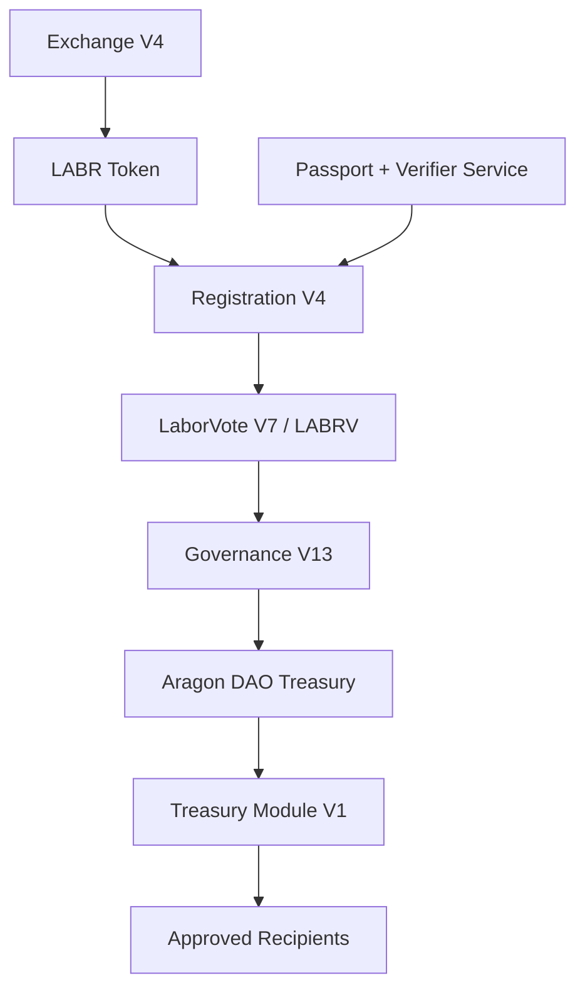

The protocol intentionally separates economic participation from governance participation.

Ownership of LABR alone does not confer governance authority.

Governance rights require successful registration and issuance of LABRV.

---

## 4.3 Economic Layer

The economic layer consists primarily of the LABR utility token and the Bonding Curve Exchange.

Its responsibilities include:

* Token distribution
* Continuous liquidity
* Treasury funding
* Economic participation

The economic layer serves as the entry point for most participants.

Users acquire LABR through the exchange and may subsequently choose to participate in governance.

Importantly, economic participation does not automatically grant governance authority.

This separation reduces the influence of wealth concentration on governance outcomes.

---

## 4.4 Identity Layer

The identity layer is responsible for governance eligibility.

Its purpose is to reduce the influence of duplicate identities and automated account creation.

The identity layer consists of:

* Gitcoin Passport
* Verifier Infrastructure
* Registration Contract

Participants must satisfy predefined eligibility requirements before receiving governance rights.

The protocol does not attempt to establish perfect identity verification.

Instead, it seeks to provide practical Sybil resistance while preserving accessibility and privacy.

This approach reflects the protocol's objective of one verified participant per LABRV without requiring traditional identity systems, while recognizing that uniqueness remains probabilistic.

---

## 4.5 Governance Layer

The governance layer is responsible for collective decision-making.

It consists of:

* LABRV Governance Token
* Governance Contract

Once registered, participants receive LABRV.

LABRV functions exclusively as a governance credential.

It cannot be traded, transferred, or accumulated through market activity.

Each registered participant receives the same governance weight.

This design intentionally separates governance influence from economic ownership.

The governance system therefore operates according to participant registration rather than token accumulation.

---

## 4.6 Treasury Layer

The treasury layer is responsible for custody and distribution of protocol resources.

It consists of:

* DAO Treasury
* Treasury Module

The treasury accumulates resources through protocol activity.

Those resources may only be distributed following successful governance approval.

The treasury layer therefore serves as the execution mechanism through which governance decisions become real-world outcomes.

Importantly, treasury execution is automated and constrained by protocol rules.

Under the final intended Aragon permission configuration, treasury distributions are limited to the Governance V13 execution path. This security claim depends upon removal of obsolete DAO execute permissions and publication of the final permission registry.

---

## 4.7 Information Flow

The protocol operates through a sequence of interactions.

A simplified flow can be represented as follows:

Figure 2. User Journey.

Illustrates the participant pathway from acquiring LABR through governance participation and treasury allocation. Economic participation enables governance onboarding, which in turn enables collective decision-making regarding treasury resources.

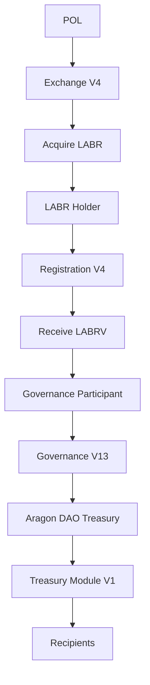

This sequence illustrates how economic participation may ultimately contribute to collective resource allocation.

Not every participant will progress through every stage.

However, each stage remains available to eligible participants.

---

## 4.8 Governance Separation

One of the defining characteristics of the LaborCoin architecture is the separation between economic ownership and governance authority.

Many blockchain systems assign governance influence according to token ownership.

Under such systems, governance power increases as economic ownership increases.

LaborCoin adopts a different approach.

Economic ownership and governance participation are intentionally separated.

This distinction seeks to reduce the influence of concentrated capital within governance processes.

The protocol therefore prioritizes participant equality over ownership-weighted governance.

---

## 4.9 Treasury Decision Lifecycle

Treasury distributions follow a structured process.

Resources move through the following stages:

1. Treasury accumulation
2. Proposal creation
3. Community voting
4. Approval validation
5. Treasury execution
6. Recipient distribution

A simplified representation appears below:

Figure 12. Treasury Execution Lifecycle

Illustrates the governance-controlled process through which treasury resources move from accumulation to approved distribution. No treasury allocation may bypass governance approval, ensuring that treasury resources remain subject to collective decision-making.

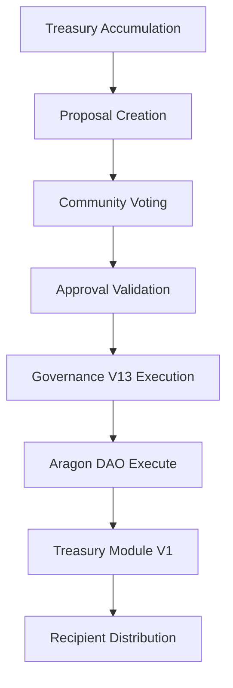

---

## 4.10 Security Architecture

Security within LaborCoin does not rely upon a single defensive mechanism.

Instead, the protocol utilizes multiple independent controls.

Examples include:

* Passport verification
* Signature authorization
* Non-transferable governance rights
* Participation thresholds
* Approval thresholds
* Treasury spending caps
* Execution windows
* Exchange cooldowns
* Oracle validation

These mechanisms operate together to provide layered security.

The objective is not to eliminate all risk, which is impossible, but to reduce opportunities for abuse and governance manipulation.

---

## 4.11 Final Authority Architecture

The deployed authority structure is based on narrow, fixed dependencies rather than a single universal ownership model.

Exchange V4, Registration V4, Governance V13, and Treasury Module V1 expose no owner role. LaborVote V7 retains only the permanently locked Registration V4 minter relationship and has no remaining owner. LABR ownership is held by the Aragon DAO, and the verifier remains an external signing dependency.

The resulting system therefore operates through:

* Ownerless core exchange, registration, governance, and treasury-execution contracts
* Permanently fixed LABRV minting authority
* DAO custody of treasury assets and LABR ownership
* Governance V13's constrained treasury-allocation logic
* A fixed verifier address for eligibility and action authorizations

This structure removes direct creator administration while preserving the dependencies required by the deployed design.

## 4.12 Architectural Principles

Several principles guided the design of the protocol.

### Separation of Responsibilities

Each component performs a narrowly defined role.

### Constrained Governance

Governance controls treasury allocation rather than protocol rules.

### Transparency

Core operations remain publicly auditable.

### Predictability

Protocol behavior remains governed by fixed rules.

### Decentralization

Direct creator administration has been removed from the final custom contracts. Remaining DAO-held LABR authority and verifier dependence are explicit and must be documented through the launch provenance record.

Together, these principles shape the structure of the LaborCoin protocol.

---

## 4.13 Summary

LaborCoin consists of multiple specialized components operating together to provide economic participation, governance participation, treasury management, and collective resource allocation.

The architecture separates economic ownership from governance authority, uses verifier-assisted Sybil resistance, constrains treasury governance through predefined rules, and applies a documented combination of ownerless contracts, locked configuration, DAO-held ownership, and external verification dependencies.

The following chapters describe each component in detail, beginning with the LABR utility token and the economic layer that serves as the foundation of the protocol.

---

# Chapter 5: LABR Token

## 5.1 Introduction

LABR serves as the primary utility token within the LaborCoin protocol.

The token functions as the economic participation layer of the system and provides access to the protocol's exchange, registration, and treasury ecosystem.

LABR is intentionally distinct from governance rights.

Ownership of LABR does not automatically grant authority over treasury decisions, voting processes, or protocol administration. Instead, LABR functions as an economic asset within the protocol while governance participation is provided separately through issuance of the non-transferable LABRV governance token.

This distinction is a foundational characteristic of the LaborCoin architecture and reflects the protocol's broader objective of separating economic participation from governance participation.

---

## 5.2 Purpose

LABR fulfills several functions within the protocol.

Economic Participation

Participants acquire LABR through the LaborCoin Exchange and may hold, transfer, buy, or sell tokens subject to protocol rules.

LABR represents participation in the economic layer of the ecosystem and serves as the asset through which exchange activity occurs.

Registration Eligibility

Ownership of at least one LABR is required for governance registration.

This requirement establishes a minimal economic connection between governance participants and the protocol while avoiding governance systems based entirely upon token ownership.

Treasury Contribution Mechanism

LABR transaction flows contribute resources to the protocol treasury through predefined allocation mechanisms.

These contributions provide the economic foundation upon which governance-directed treasury distributions operate.

Ecosystem Participation

LABR functions as the primary transferable asset of the LaborCoin ecosystem and serves as the bridge between participants and the broader governance framework.

---

## 5.3 Supply Structure

The protocol establishes a fixed maximum token supply.

Maximum Supply

1,000,000,000 LABR

No mechanism exists within the deployed protocol for increasing the maximum supply beyond this limit.

The maximum supply is embedded within protocol logic and forms the basis of the exchange's distribution calculations.

This fixed supply model provides predictable issuance behavior and establishes a known upper bound on total token creation.

---

## 5.4 Distribution Model

Unlike traditional token launches that distribute the entire supply immediately, LaborCoin utilizes a staged distribution model.

Tokens enter circulation progressively through the bonding curve exchange.

This approach serves several objectives:

Predictable issuance
Controlled distribution
Transparent supply growth
Reduced concentration during early stages

The protocol therefore separates total supply from immediately accessible supply.

Only a portion of the maximum supply is available for distribution at any given time.

Additional supply becomes available automatically as distribution milestones are reached.

The detailed mechanics of this process are described in Chapter 8.

Table 3. Tokenomics Allocation

The LaborCoin supply is allocated entirely to protocol-controlled distribution through the exchange mechanism. No founder, team, investor, advisor, or private-sale allocations exist.

| Allocation Category          | Amount (LABR) | Percentage |
| ---------------------------- | ------------- | ---------: |
| Exchange Distribution Pool   | 1,000,000,000 |       100% |
| Founder Allocation           | 0             |         0% |
| Team Allocation              | 0             |         0% |
| Investor Allocation          | 0             |         0% |
| Advisor Allocation           | 0             |         0% |
| Private Sale Allocation      | 0             |         0% |
| Treasury Pre-Mint Allocation | 0             |         0% |

Total Supply: 1,000,000,000 LABR

All LABR enters circulation exclusively through protocol-defined exchange operations. No tokens are reserved for founders, developers, investors, or affiliated organizations.

---

## 5.5 Initial Availability

At deployment, the protocol unlocks:

100,000,000 LABR

for distribution through the exchange.

This initial tranche represents the first phase of protocol distribution.

Subsequent tranches are unlocked automatically according to predefined distribution thresholds.

No administrative action is required for tranche releases.

---

## 5.6 Distribution and Transfer Controls

LaborCoin uses two separate layers of concentration controls.

### LABR Token-Level Limits

The LABR token contract enforces:

Maximum Wallet:

1,000,000 LABR

Maximum Transaction:

500,000 LABR

These limits are part of the deployed LABR token configuration and apply at the token layer, subject to any addresses explicitly excluded through token administration.

### Exchange V4 Limits

Exchange V4 independently enforces stricter limits on transactions conducted through the protocol exchange:

Maximum Exchange Wallet:

10,000 LABR

Maximum Exchange Transaction:

5,000 LABR

These are on-chain Exchange V4 limits, not merely interface warnings.

### Exchange Cooldown

Cooldown Period:

12 Hours

Exchange V4 records the most recent exchange transaction time for each address and applies the cooldown to both purchases and sales. Ordinary wallet-to-wallet transfers are governed by the LABR token contract rather than Exchange V4's cooldown mapping.

## 5.7 Treasury Contributions

The protocol treasury receives contributions through exchange activity.

Purchase Contributions

When participants purchase LABR:

Users receive the full purchased token amount.
10% of incoming POL is allocated to the DAO treasury.
Remaining POL remains within exchange liquidity.

This mechanism allows treasury resources to grow alongside protocol adoption.

Sale Contributions

When LABR is transferred to the exchange for sale:

5% is allocated to the treasury mechanism.
5% is allocated to holder reward distribution.
Total sell-side allocation equals 10%.

These allocations contribute to treasury growth and participant incentives while preserving deterministic exchange pricing.

---

## 5.8 Relationship to Governance

One of the most important aspects of the LaborCoin architecture is the deliberate separation between LABR ownership and governance authority.

Many governance systems allocate voting power directly according to token balances.

LaborCoin intentionally avoids this approach.

Ownership of LABR:

Does Not Provide

Additional voting power
Additional governance rights
Additional proposal authority
Additional treasury control

Governance rights are instead derived from LABRV issuance through the registration process.

This distinction seeks to reduce the influence of capital concentration on governance outcomes.

Participants may accumulate LABR without acquiring additional governance authority.

Likewise, governance participants possess equal voting rights regardless of LABR holdings beyond registration requirements.

---

## 5.9 LABR Ownership and Administrative Surface

LABR differs from the final custom LaborCoin contracts because it was deployed from a configurable token implementation before the final protocol contracts.

The LABR contract includes owner-only functions associated with matters such as fees, limits, exclusions, automated-market-maker designations, trading restrictions, and related token configuration. Ownership has been transferred to the Aragon DAO rather than renounced.

This produces two important consequences:

* No creator-controlled wallet owns LABR.
* LABR is not ownerless and should not be described as immutable in the same sense as Exchange V4, Registration V4, Governance V13, or Treasury Module V1.

Whether an owner-only LABR function can be exercised in practice depends upon the DAO's installed permission structure and the addresses holding DAO execution authority. The launch provenance and permission report must therefore document the final DAO permission state, including removal of obsolete governance or executor permissions.

No function exists to mint LABR beyond the fixed deployed supply. Token ownership does not create additional LABRV or governance voting weight.

## 5.10 Economic Role Within the Protocol

LABR serves as the economic foundation of the LaborCoin ecosystem.

The token provides:

Access to the exchange
Access to registration eligibility
Treasury growth mechanisms
Participation in protocol economics

At the same time, the token intentionally does not function as a governance weighting mechanism.

This separation allows the protocol to pursue democratic governance objectives while maintaining a transferable economic asset capable of supporting treasury growth and ecosystem participation.

---

## 5.11 Summary

LABR functions as the utility and economic participation token of the LaborCoin protocol.

Its fixed supply, staged distribution model, treasury contribution mechanisms, and separation from governance authority reflect the broader design principles established earlier in this document.

The following chapter describes the LaborCoin Exchange, the mechanism through which LABR enters circulation and through which the protocol's deterministic pricing model operates.

# Chapter 6: Bonding Curve Exchange

## 6.1 Introduction

The LaborCoin Exchange serves as the primary mechanism through which LABR enters circulation and through which participants acquire or sell LABR.

Unlike traditional cryptocurrency exchanges that rely upon order books, liquidity pools, or third-party market makers, the LaborCoin Exchange operates according to deterministic rules embedded directly within the protocol.

Pricing is not determined by bids, asks, speculation, or external market participants.

Instead, pricing is calculated mathematically according to the protocol's distribution progress.

This design reflects several objectives:

* Transparent price discovery
* Continuous liquidity
* Predictable issuance
* Treasury growth
* Reduced dependence upon external market infrastructure

The exchange therefore functions not merely as a marketplace, but as a core component of the protocol's distribution and treasury architecture.

---

## 6.2 Exchange Philosophy

The exchange was designed around the principle that token distribution should be transparent, predictable, and publicly verifiable.

Many token launches rely upon mechanisms such as:

* Private sales
* Venture capital allocations
* Insider distributions
* Pre-mines
* Market-maker arrangements

These approaches frequently create substantial asymmetries between early participants and later participants.

LaborCoin instead distributes LABR through a publicly accessible exchange governed by deterministic pricing rules.

Every participant interacts with the same pricing mechanism.

Every participant purchases according to the same mathematical model.

Every participant can independently verify how pricing is calculated.

The exchange therefore functions as a distribution mechanism rather than a speculative marketplace.

---

## 6.3 Core Architecture

The exchange consists of several integrated components:

### Distribution Engine

Responsible for releasing LABR into circulation.

### Pricing Engine

Responsible for calculating deterministic token prices.

### Oracle Interface

Responsible for converting target USD prices into executable POL prices.

### Treasury Allocation System

Responsible for routing treasury contributions.

### Liquidity Reserve

Responsible for maintaining exchange solvency.

### Tranche Release System

Responsible for progressive supply availability.

These components operate together to create a transparent and self-contained distribution system.

---

## 6.4 Deterministic Pricing

Traditional exchanges rely upon participant behavior to determine pricing.

The LaborCoin Exchange takes a different approach.

Price is determined solely by:

* Maximum supply
* Distributed supply
* Bonding curve formula

This means that pricing is independent of:

* Order books
* Liquidity providers
* Market makers
* Exchange listings
* External trading volume

The protocol therefore produces a known and publicly auditable pricing path.

Participants can calculate expected pricing outcomes directly from protocol state.

---

## 6.5 Continuous Liquidity

One challenge faced by many token ecosystems is liquidity availability.

In traditional markets, participants may encounter situations where:

* Buyers cannot find sellers.
* Sellers cannot find buyers.
* Large transactions significantly impact markets.
* Liquidity providers withdraw support.

The LaborCoin Exchange addresses this through continuous protocol-managed liquidity.

Participants may purchase LABR directly from the exchange.

Participants may sell LABR directly back to the exchange.

As long as protocol conditions are satisfied and sufficient reserves exist, transactions can occur without requiring counterparties.

This design simplifies participation and reduces dependence upon external infrastructure.

---

## 6.6 Oracle Integration

Although the protocol determines target pricing internally, transactions occur using POL.

Consequently, the exchange must convert target USD values into POL-denominated execution prices.

To accomplish this, the protocol utilizes the Polygon Chainlink POL/USD oracle.

### Oracle Responsibilities

The oracle provides:

* Current POL/USD pricing
* Market conversion information

The exchange then converts target USD prices into executable POL prices.

### Example

If:

Target LABR Price = $4.50

POL Price = $0.90

Then:

Required POL Price = 5 POL

The exchange performs this conversion automatically.

---

## 6.7 Oracle Security Controls

Oracle systems represent a critical dependency.

The protocol therefore incorporates multiple protections.

### Positive Price Validation

Oracle values must be positive.

Negative or invalid values are rejected.

### Freshness Requirements

Oracle updates must be recent.

Stale data is rejected automatically.

### Price Boundaries

Maximum pricing limits exist to prevent anomalous oracle behavior from producing unreasonable outcomes.

These controls help reduce exposure to oracle failures and abnormal market conditions.

---

## 6.8 Purchase Flow

When a participant purchases LABR, the exchange performs several actions.

### Step 1

Participant submits POL.

### Step 2

Current distribution state is evaluated.

### Step 3

Bonding curve price is calculated.

### Step 4

Oracle conversion determines required POL pricing.

### Step 5

LABR amount is calculated.

### Step 6

Tokens are transferred to the participant.

### Step 7

Treasury contribution is allocated.

### Step 8

Distribution totals are updated.

### Step 9

Tranche unlock conditions are evaluated.

This process occurs atomically within a single transaction.

---

## 6.9 Purchase Treasury Contributions

Each purchase contributes directly to treasury growth.

When POL enters the exchange:

### Treasury Allocation

10%

### Exchange Liquidity

90%

This mechanism aligns treasury growth with protocol participation.

As distribution increases, treasury resources grow alongside ecosystem activity.

---

## 6.10 Sale Flow

Participants may also sell LABR back to the exchange.

The sale process reverses the distribution flow.

### Step 1

Participant transfers LABR.

### Step 2

Transfer taxes are applied by the LABR token.

### Step 3

Exchange receives tokens.

### Step 4

Current curve price is calculated.

### Step 5

POL payout is determined.

### Step 6

POL is transferred to the participant.

### Step 7

Distribution totals are adjusted.

The process remains fully deterministic and publicly auditable.

---

## 6.11 Liquidity Preservation

The exchange includes mechanisms intended to preserve operational liquidity.

A reserve requirement ensures that a minimum portion of exchange assets remains available.

This design reduces the likelihood of complete reserve depletion and helps maintain operational continuity.

The exchange therefore balances treasury growth with liquidity preservation.

---

## 6.12 Cooldown Enforcement

To discourage rapid automated trading activity, the exchange enforces transaction cooldowns.

### Cooldown Duration

12 Hours

Following an exchange transaction, participants must wait twelve hours before conducting another exchange transaction.

The cooldown applies equally to purchases and sales.

This mechanism serves several purposes:

* Reduced speculative churn
* Reduced bot activity
* More orderly distribution
* Reduced manipulation opportunities

The cooldown is intended as a distribution safeguard rather than a trading restriction.

---

## 6.13 Progressive Distribution

A defining feature of the exchange is its integration with the tranche distribution system.

The protocol does not release the entire supply immediately.

Instead:

### Initial Availability

100,000,000 LABR

### Additional Tranches

50,000,000 LABR

Each tranche becomes available automatically as distribution progresses.

This structure allows the protocol to:

* Control distribution pace
* Maintain predictable supply growth
* Align pricing progression with adoption

The detailed mechanics of tranche unlocking are described in Chapter 8.

---

## 6.14 Exchange Governance Independence

An important design decision within LaborCoin is the separation between governance authority and exchange operation.

Governance does not possess authority to:

* Modify the bonding curve
* Alter exchange parameters
* Change oracle sources
* Change tranche sizes
* Pause exchange operation
* Modify pricing behavior

These parameters remain fixed by protocol logic.

As a result, treasury governance cannot alter the underlying economic rules governing token distribution.

This separation helps preserve predictability and limits governance capture risks.

---

## 6.15 Autonomous Deployment

LaborCoin Exchange V4 was deployed without an owner role, pause function, administrative withdrawal function, or upgrade mechanism.

Its constructor permanently sets the LABR token and DAO treasury addresses. The Chainlink POL/USD feed and operational constants are embedded in the deployed contract.

Accordingly, Exchange V4 did not require a later ownership-renouncement transaction. Its behavior is fixed by the deployed bytecode from the moment of deployment.

## 6.16 Economic Significance

The LaborCoin Exchange performs multiple functions simultaneously.

It serves as:

* Distribution mechanism
* Liquidity provider
* Treasury funding source
* Price discovery system
* Supply management system

These functions are unified within a single deterministic framework.

By combining distribution, treasury growth, and liquidity provision into one system, the exchange becomes a central component of the broader LaborCoin architecture.

---

## 6.17 Summary

The LaborCoin Exchange provides continuous protocol-managed liquidity through a deterministic quadratic bonding curve.

The exchange distributes LABR, funds treasury growth, enforces distribution safeguards, and provides transparent pricing without relying upon traditional market-making infrastructure.

Its integration with tranche releases, treasury allocations, oracle pricing, and ownerless deployment reflects the broader protocol goals of transparency, predictability, and post-launch autonomy.

The following chapter formally defines the mathematical model that governs exchange pricing and supply progression.

---

# Chapter 7: Mathematical Specification

## 7.1 Introduction

The LaborCoin Exchange utilizes a deterministic quadratic bonding curve to govern token distribution and pricing.

Unlike conventional financial markets, where prices emerge through interactions between buyers and sellers, the LaborCoin protocol defines pricing through an explicit mathematical function embedded within the exchange contract.

This approach serves several objectives:

* Transparent pricing
* Predictable distribution
* Continuous liquidity
* Public verifiability
* Independence from external market makers

Every participant interacts with the same pricing function and can independently verify protocol behavior directly from on-chain data.

This chapter formally defines the mathematical framework governing LABR distribution.

---

## 7.2 Design Objectives

The bonding curve was designed to satisfy several requirements simultaneously.

First, the protocol should permit broad early participation.

Second, prices should increase as distribution progresses.

Third, the pricing function should remain simple enough to audit and verify independently.

Fourth, the function should avoid abrupt discontinuities that could create unstable market conditions.

Finally, the function should operate entirely through deterministic smart contract logic.

These requirements led to the selection of a quadratic pricing model.

---

## 7.3 Supply Variables

Let:

[
S
]

represent the total amount of LABR distributed through the exchange.

Let:

[
M
]

represent the maximum token supply.

For LaborCoin:

[
M = 1,000,000,000
]

LABR.

Define the normalized distribution variable:

[
x = \frac{S}{M}
]

where:

[
0 \le x \le 1
]

The variable (x) therefore represents the percentage of total protocol distribution completed.

Examples:

| Distributed Supply | x    |
| ------------------ | ---- |
| 0 LABR             | 0.00 |
| 100,000,000 LABR   | 0.10 |
| 500,000,000 LABR   | 0.50 |
| 1,000,000,000 LABR | 1.00 |

This normalized variable forms the basis of the pricing function.

---

## 7.4 Pricing Function

The LaborCoin pricing function is:

P(x)=1+14x^2

Where:

* (P(x)) is the target token price in USD.
* (x) is the fraction of total supply distributed.

The curve begins at approximately:

[
$1.00
]

and reaches:

[
$15.00
]

when the maximum supply has been distributed.

---

## 7.5 Boundary Conditions

The pricing function was designed with explicit lower and upper bounds.

### Initial State

At deployment:

[
x = 0
]

Therefore:

[
P(0)=1
]

Result:

Initial Target Price = $1.00

---

### Maximum Distribution

At complete distribution:

[
x = 1
]

Therefore:

[
P(1)=15
]

Result:

Maximum Target Price = $15.00

---

## 7.6 Sample Price Points

The following table illustrates the behavior of the pricing function across the distribution lifecycle.

| Distribution | x    | Price  |
| ------------ | ---- | ------ |
| 0%           | 0.00 | $1.00  |
| 10%          | 0.10 | $1.14  |
| 20%          | 0.20 | $1.56  |
| 30%          | 0.30 | $2.26  |
| 40%          | 0.40 | $3.24  |
| 50%          | 0.50 | $4.50  |
| 60%          | 0.60 | $6.04  |
| 70%          | 0.70 | $7.86  |
| 80%          | 0.80 | $9.96  |
| 90%          | 0.90 | $12.34 |
| 100%         | 1.00 | $15.00 |

Several characteristics are immediately visible.

Early distribution occurs at relatively modest prices.

As distribution progresses, prices accelerate.

This structure encourages broad early participation while preserving increasing scarcity as supply enters circulation.

---

## 7.7 Curve Characteristics

The pricing curve exhibits positive convexity.

In practical terms, this means that price growth accelerates over time.

The protocol therefore distributes tokens according to three broad phases:

### Early Distribution

0% - 30%

Price Range:

$1.00 - $2.26

Objective:

Encourage participation and distribution.

---

### Growth Phase

30% - 70%

Price Range:

$2.26 - $7.86

Objective:

Balance accessibility with increasing scarcity.

---

### Maturity Phase

70% - 100%

Price Range:

$7.86 - $15.00

Objective:

Reflect increasing scarcity as available supply approaches exhaustion.

---

## 7.8 Oracle Conversion

The pricing function produces a target value denominated in United States dollars.

Transactions, however, occur using POL.

The protocol therefore converts USD target prices into POL prices using the Chainlink POL/USD oracle.

Let:

[
U
]

represent the oracle price of POL in USD.

Then:

[
POLPrice = \frac{P(x)}{U}
]

This conversion allows the protocol to maintain consistent USD-denominated pricing targets while executing transactions entirely in POL.

---

## 7.9 Oracle Example

Suppose:

[
P(x)=4.50
]

and:

[
U=0.90
]

Then:

[
POLPrice=\frac{4.50}{0.90}
]

Result:

[
5.0 , POL
]

per LABR.

This conversion occurs automatically during exchange execution.

---

## 7.10 Tranche Mathematics

The protocol separates maximum supply from currently available supply.

Let:

[
A
]

represent available supply.

Initially:

[
A = 100,000,000
]

LABR.

Each unlock event increases availability by:

[
50,000,000
]

LABR.

Until:

[
A = M
]

---

## 7.11 Tranche Unlock Condition

A new tranche becomes available when:

[
S \ge A
]

where:

* (S) = distributed supply
* (A) = available supply

The exchange automatically evaluates this condition after each purchase.

No administrator, governance vote, or external trigger is required.

---

## 7.12 Treasury Contribution Mathematics

### Purchases

For incoming POL amount:

[
B
]

Treasury allocation:

[
0.10B
]

Liquidity retention:

[
0.90B
]

---

### Sales

LABR transfer taxes apply:

Treasury:

[
5%
]

Holder Rewards:

[
5%
]

Total:

[
10%
]

---

## 7.13 Cooldown Constraint

Let:

[
t
]

represent current timestamp.

Let:

[
l
]

represent the participant's previous exchange transaction timestamp.

A transaction is permitted only when:

[
t \ge l + 12 , hours
]

This creates a deterministic transaction frequency limit enforced by smart contract logic.

---

## 7.14 Deterministic Behavior

A key characteristic of the LaborCoin economic model is determinism.

Given:

* Current supply
* Oracle value
* Transaction amount

all participants can independently calculate:

* Expected token output
* Expected POL requirements
* Treasury allocations
* Tranche unlock status

No discretionary intervention exists within the pricing process.

This property improves transparency and reduces informational asymmetry between participants.

---

## 7.15 Why a Quadratic Curve?

Several alternative pricing models were considered conceptually.

Linear curves produce constant price growth.

Exponential curves can become excessively steep.

Step functions introduce abrupt discontinuities.

The quadratic model was selected because it provides:

* Simplicity
* Predictability
* Continuous behavior
* Increasing scarcity
* Ease of independent verification

The resulting curve remains understandable to participants while providing progressively increasing prices as distribution advances.

---

## 7.16 Summary

The LaborCoin economic model is governed by a deterministic quadratic bonding curve that links token pricing directly to distribution progress.

The model combines:

* Fixed maximum supply
* Progressive tranche releases
* Continuous liquidity
* Treasury funding
* Oracle-based execution pricing

within a single mathematical framework.

Because all variables are publicly observable and all calculations are deterministic, participants can independently verify pricing outcomes and protocol behavior.

The following chapter describes how these mathematical principles govern the tranche distribution system and the controlled release of LABR into circulation.

---

# Chapter 8: Tranche Distribution System

## 8.1 Introduction

The LaborCoin protocol utilizes a staged distribution model rather than releasing the entire token supply at deployment.

Although the protocol defines a maximum supply of one billion LABR, only a fraction of that supply is initially available through the exchange.

Additional supply becomes available automatically as distribution progresses.

This mechanism is known as the tranche distribution system.

The tranche system serves several objectives:

* Controlled distribution
* Transparent issuance
* Reduced concentration risk
* Progressive scarcity
* Predictable supply expansion

Unlike traditional token issuance schedules that may depend upon administrative decisions, governance votes, or discretionary releases, LaborCoin's tranche mechanics are enforced entirely through smart contract logic.

The release schedule operates automatically and cannot be modified through governance.

---

## 8.2 Distribution Philosophy

A common challenge in tokenized systems is balancing accessibility with long-term distribution objectives.

If the entire token supply becomes available immediately, early participants may accumulate disproportionate ownership before broader participation develops.

Conversely, if supply remains excessively restricted, participation may become unnecessarily difficult.

The tranche system seeks a middle path.

Rather than releasing the entire supply at once, the protocol releases supply gradually in response to actual distribution progress.

This approach ties supply expansion directly to ecosystem participation rather than administrative intervention.

The result is a distribution process that remains predictable, transparent, and publicly auditable.

---

## 8.3 Maximum Supply

The protocol defines a fixed maximum supply:

[
1,000,000,000
]

LABR.

This value represents the total number of LABR that may ever enter circulation through the exchange.

No mechanism exists to increase this maximum supply.

The maximum supply therefore functions as a permanent upper bound on protocol issuance.

---

## 8.4 Initial Distribution Availability

At deployment, only a portion of the total supply is available.

Initial unlocked supply:

[
100,000,000
]

LABR.

This amount represents the first distribution tranche.

Participants may purchase LABR only from the currently unlocked supply.

Consequently, although the protocol defines a maximum supply of one billion LABR, only one hundred million LABR are available at launch.

---

## 8.5 Subsequent Tranches

After the initial tranche, additional supply becomes available through fixed-size releases.

Tranche size:

[
50,000,000
]

LABR.

Each release increases the amount of available supply by fifty million LABR.

The process repeats until the maximum supply has been reached.

---

## 8.6 Automatic Unlocking

A defining characteristic of the LaborCoin tranche system is that unlocks occur automatically.

No governance proposal is required.

No administrator action is required.

No external trigger is required.

The exchange evaluates tranche conditions during normal operation.

Whenever distributed supply reaches the currently unlocked supply threshold, the next tranche becomes available automatically.

This design eliminates discretionary control over issuance.

---

## 8.7 Unlock Condition

Let:

[
S
]

represent distributed supply.

Let:

[
A
]

represent currently available supply.

The unlock condition is:

[
S \ge A
]

When this condition becomes true, the exchange increases available supply by one tranche.

This process continues until:

[
A = 1,000,000,000
]

LABR.

---

## 8.8 Distribution Sequence

The following table illustrates the tranche progression.

| Stage       | Available Supply |
| ----------- | ---------------- |
| Launch      | 100,000,000      |
| Tranche 2   | 150,000,000      |
| Tranche 3   | 200,000,000      |
| Tranche 4   | 250,000,000      |
| Tranche 5   | 300,000,000      |
| Tranche 6   | 350,000,000      |
| Tranche 7   | 400,000,000      |
| Tranche 8   | 450,000,000      |
| Tranche 9   | 500,000,000      |
| ...         | ...              |
| Final Stage | 1,000,000,000    |

The process continues until all supply becomes available.

---

## 8.9 Relationship to Pricing

The tranche system and bonding curve operate together but perform different functions.

The bonding curve determines price.

The tranche system determines availability.

Price is based on:

[
P(x)=1+14x^2
]

where (x) represents distributed supply relative to maximum supply.

Availability is determined separately through tranche progression.

This separation allows the protocol to manage supply release without altering pricing mechanics.

---

## 8.10 Early Distribution Effects

The tranche system has several important implications during early protocol growth.

Because only a fraction of total supply is initially available:

* Distribution progresses gradually.
* Treasury growth develops alongside participation.
* Price progression remains tied to actual adoption.
* Token concentration is reduced.

The protocol therefore avoids situations in which the entire supply becomes immediately accessible to a relatively small number of early participants.

---

## 8.11 Late Distribution Effects

As distribution approaches maturity, tranche releases become less significant because an increasingly large portion of the supply is already available.

Eventually:

[
A = M
]

where:

* (A) = available supply
* (M) = maximum supply

At that point, all remaining supply is available and no further tranche releases occur.

The protocol continues operating normally under the bonding curve model.

---

## 8.12 Governance Independence

The tranche system is intentionally isolated from governance.

Governance cannot:

* Change tranche size.
* Accelerate releases.
* Delay releases.
* Create additional tranches.
* Increase maximum supply.
* Decrease maximum supply.

These restrictions help preserve predictability and prevent governance from manipulating issuance schedules.

The supply release process remains governed exclusively by smart contract logic.

---

## 8.13 Administrative Independence

Exchange V4 contains no administrative function capable of modifying tranche behavior.

The creator cannot modify tranche releases.

Governance cannot modify tranche releases.

Treasury participants cannot modify tranche releases.

The exchange evaluates unlock conditions automatically and executes releases according to immutable protocol rules.

---

## 8.14 Economic Rationale

The tranche system exists because distribution itself is part of the protocol's economic design.

LaborCoin was not designed around maximizing short-term liquidity or speculative trading volume.

Instead, the protocol seeks to balance:

* Accessibility
* Transparency
* Predictability
* Progressive scarcity
* Broad participation

The tranche model supports these objectives by aligning supply expansion with actual protocol usage.

Supply growth therefore becomes a consequence of participation rather than administrative discretion.

---

## 8.15 Comparison to Alternative Models

Many token ecosystems employ one of several common distribution approaches:

### Immediate Full Release

Entire supply becomes available at launch.

Advantages:

* Simplicity

Disadvantages:

* Concentration risk
* Rapid accumulation

---

### Administrative Releases

Supply is released through administrator decisions.

Advantages:

* Flexibility

Disadvantages:

* Trust requirements
* Centralization risk

---

### Time-Based Vesting

Supply is released according to predetermined dates.

Advantages:

* Predictability

Disadvantages:

* Independent of actual adoption

---

### LaborCoin Tranche Model

Supply is released according to distribution progress.

Advantages:

* Transparent
* Automatic
* Adoption-linked
* Governance-independent

The protocol therefore ties issuance to ecosystem growth rather than time or administrative decisions.

---

## 8.16 Summary

The tranche distribution system governs how LABR enters circulation over the lifetime of the protocol.

Starting from an initial unlocked supply of one hundred million LABR, additional fifty-million-token tranches become available automatically as distribution milestones are reached.

Because tranche releases occur through deterministic smart contract logic rather than administrative intervention, the issuance process remains transparent, predictable, and resistant to manipulation.

Together with the bonding curve described in Chapter 7, the tranche system forms the foundation of LaborCoin's economic architecture.

---

# Chapter 9: Registration Protocol

## 9.1 Introduction

The LaborCoin Registration Protocol serves as the gateway to governance participation.

While LABR enables economic participation within the protocol, governance participation requires successful completion of a separate registration process.

This distinction reflects one of the central design principles of LaborCoin: governance rights should not be determined solely by token ownership.

The registration protocol establishes eligibility for governance participation, verifies compliance with protocol requirements, and issues a non-transferable LABRV governance token upon successful registration.

By separating registration from token ownership, the protocol seeks to support democratic participation while maintaining resistance to duplicate registrations and governance manipulation.

---

## 9.2 Purpose of Registration

Registration exists to establish a verifiable relationship between a participant and the governance system.

Without registration, governance rights could be distributed solely according to token ownership or unrestricted wallet creation.

Both approaches introduce challenges.

Pure token-weighted governance can concentrate influence among large holders.

Unrestricted wallet participation can expose governance systems to Sybil attacks, in which a single participant controls multiple identities.

The Registration Protocol attempts to balance accessibility, privacy, and governance integrity by requiring participants to satisfy a set of eligibility criteria before governance rights are granted.

---

## 9.3 Governance Eligibility

Governance onboarding combines an off-chain eligibility workflow with on-chain enforcement.

The official workflow requires:

1. Ownership of at least one LABR.
2. Passport evaluation under the verifier's published score policy.
3. Acceptance of the LaborCoin attestation in the official interface.
4. A valid verifier signature bound to the participant address and an expiration timestamp.
5. Successful execution of the Registration V4 transaction.

Registration V4 directly enforces the LABR balance, signature validity, signature expiration, duplicate-registration check, and LABRV mint. It does not independently query Passport or store the attestation text on-chain.

## 9.4 Minimum LABR Requirement

Registration requires ownership of at least:

[
1 \text{ LABR}
]

This requirement serves several purposes.

First, it establishes a minimal economic connection between governance participants and the protocol.

Second, it ensures that governance participation is not entirely disconnected from protocol involvement.

Third, it discourages purely passive registration activity by requiring participants to engage with the protocol before obtaining governance rights.

The threshold is intentionally low to minimize barriers to participation while preserving a meaningful relationship between governance and protocol usage.

---

## 9.5 Passport Verification Policy

A central objective of the registration workflow is reducing the risk of duplicate participation.

The verifier service evaluates Passport data and applies the published LaborCoin eligibility policy. Passport does not function as proof of legal identity. It supplies signals intended to increase confidence that a participant represents a distinct individual.

Passport evaluation occurs outside Registration V4. The on-chain contract accepts only the resulting cryptographic authorization from its fixed verifier address.

---

## 9.6 Passport Threshold

The published LaborCoin verifier policy requires a minimum Passport score of:

[
15
]

This value is an operational verifier policy rather than a numeric constant stored inside Registration V4. Governance V13 cannot change the Registration V4 verifier address or its on-chain checks, but continued enforcement of the score threshold depends upon the verifier service applying the documented policy consistently.

The threshold seeks to balance accessibility and Sybil resistance. It provides probabilistic evidence of uniqueness rather than proof of identity.

## 9.7 Verifier Authorization

Registration requires authorization from the fixed verifier address:

`0x475d519631d2406753aCA29F305f19b83E97513e`

After evaluating the participant under the published Passport policy, the verifier signs an authorization bound to:

* The participant wallet address
* An expiration timestamp
* Registration V4's verification context

Registration V4 recovers the signer from the submitted signature and accepts the registration only when the recovered address matches the fixed verifier and the authorization has not expired.

The verifier cannot call the LABRV mint function directly. It can authorize or withhold registration eligibility, while Registration V4 performs the on-chain checks and mint.

## 9.8 Attestation Workflow

The official onboarding interface presents the LaborCoin Attestation before registration.

Acceptance records the participant's declared understanding and intent within the documented user workflow. Registration V4 does not store a separate attestation flag or text hash, so attestation acceptance is an interface and verifier-process requirement rather than an independent on-chain condition.

This distinction should remain explicit: the attestation supports informed participation, while the enforceable Registration V4 conditions are the LABR balance, unexpired verifier signature, duplicate-registration prevention, and successful LABRV mint.

## 9.9 Registration Workflow

The official registration workflow contains the following prerequisites and actions:

### Step 1

Acquire at least one LABR.

### Step 2

Establish a Passport score meeting the published verifier policy.

### Step 3

Review and accept the LaborCoin attestation in the official interface.

### Step 4

Request and receive an unexpired registration authorization from the fixed verifier.

### Step 5

Submit the Registration V4 transaction.

### Step 6

Receive one LABRV governance token and self-delegate voting power.

The interface may collect the attestation and verifier authorization within the same onboarding sequence. Registration V4 itself enforces the LABR balance, signature, expiry, duplicate-registration rule, and LABRV mint; it does not store a separate attestation record.

## 9.10 Registration Sequence

The registration process can be summarized as follows:

Figure 10. Registration Lifecycle.

Illustrates the sequence required for governance eligibility. Participants must hold LABR, satisfy Passport verification requirements, obtain a valid verifier signature, complete registration, and receive a non-transferable LABRV governance credential.

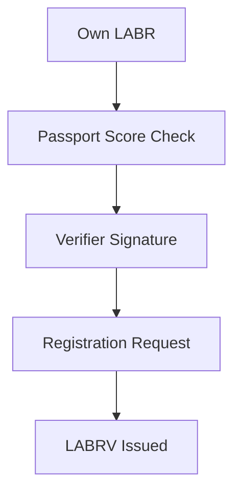

---

## 9.11 LABRV Issuance

Successful registration results in issuance of:

[
1 \text{ LABRV}
]

The governance token is minted directly to the participant's wallet.

Registration V4 permits only one LABRV token per successfully registered wallet address.

This restriction forms the basis of LaborCoin's governance model.

Governance influence is therefore derived from registration status rather than token accumulation.

---

## 9.12 One-Time Registration

Registration is intended to occur only once per participant.

The protocol prevents duplicate governance token issuance.

If a participant already possesses LABRV, additional registration attempts are rejected.

This mechanism preserves the one verified participant per LABRV issuance rule at the wallet-registration layer.

---

## 9.13 Governance Independence

Governance V13 cannot:

* Change Registration V4's contract dependencies.
* Change the fixed verifier address stored in Registration V4.
* Mint LABRV directly.
* Change the one-LABRV-per-registered-wallet rule.
* Change the minimum on-chain LABR balance requirement.

Passport scoring is not performed by governance, but the verifier service remains an external eligibility dependency.

---

## 9.14 Administrative and Operational Dependencies

Registration V4 has no owner role and no administrative setters. Its LABR, LABRV, and verifier addresses are fixed at deployment.

The absence of a contract owner does not remove all operational dependence. The verifier can withhold signatures, become unavailable, or apply its policy incorrectly. A verifier compromise could authorize wallets that do not satisfy the published Passport policy, although Registration V4 would still prevent duplicate registration by the same address and LABRV could still be minted only through the permanently locked Registration V4 minter.

Registration is therefore autonomous at the contract layer but dependent upon an external verifier for new participant authorization.

## 9.15 Security Considerations

The Registration Protocol incorporates multiple layers of protection.

### Economic Requirement

Minimum LABR ownership establishes protocol participation.

### Passport Verification

Provides Sybil-resistance signals.

### Verifier Signatures

Prevent unauthorized registration.

### Duplicate Prevention

Restricts governance token issuance to one per registered wallet address.

### Fixed On-Chain Rules

Protect Registration V4's contract-enforced conditions from governance interference. Passport scoring remains a verifier policy.

Together, these mechanisms support governance integrity while preserving participant accessibility.

---

## 9.16 Role Within the Protocol

The Registration Protocol serves as the bridge between the economic layer and the governance layer.

Without registration:

Participants may own LABR.

With registration:

Participants may own LABR and participate in governance.

This distinction allows LaborCoin to separate economic activity from governance authority while maintaining a transparent pathway between the two.

---

## 9.17 Summary

The Registration Protocol establishes governance eligibility through an on-chain minimum-LABR and duplicate-registration check combined with an unexpired authorization from the fixed verifier. Passport evaluation and attestation acceptance occur in the documented verifier and interface workflow.

Successful registration results in issuance of a single LABRV governance token, implementing the protocol's one verified participant per LABRV model while acknowledging that Passport-based uniqueness remains probabilistic.

By separating registration from token ownership, LaborCoin seeks to reduce governance concentration while maintaining resistance to duplicate participation.

---

# Chapter 10: Identity Verification and Sybil Resistance

## 10.1 Introduction

A central challenge facing any democratic governance system is determining who is eligible to participate.

Traditional political systems frequently rely upon legal identity, citizenship, residency, or institutional membership. Decentralized blockchain systems operate in a fundamentally different environment, where participants interact through cryptographic addresses rather than government-issued identities.

This creates a significant challenge.

If governance participation is unrestricted, a single individual may create large numbers of wallets and obtain disproportionate influence. This problem is commonly referred to as a Sybil attack.

LaborCoin addresses this challenge through integration with Gitcoin Passport.

The purpose of Passport integration is not to establish legal identity or perform traditional Know Your Customer (KYC) verification. Rather, the objective is to increase confidence that governance participants represent distinct individuals while preserving accessibility and privacy.

This chapter explains the rationale behind Passport integration, the design tradeoffs involved, and the role Passport plays within the broader LaborCoin governance architecture.

---

## 10.2 The Sybil Problem

The term "Sybil attack" refers to a situation in which one participant controls multiple identities within a system.

In blockchain environments, creating additional wallet addresses is generally inexpensive and requires little effort.

Without countermeasures, governance systems based solely on wallet ownership may become vulnerable to manipulation.

For example:

* One individual could create hundreds of wallets.
* One organization could control thousands of wallets.
* Governance outcomes could be distorted without acquiring meaningful community support.

This problem becomes particularly important when governance rights are distributed equally among participants.

A one verified participant per LABRV system only functions if there is reasonable confidence that each participant represents a unique individual.

Consequently, some form of Sybil resistance becomes necessary.

---

## 10.3 Why Not Pure Token Voting?

Many blockchain governance systems avoid the Sybil problem by assigning voting power according to token ownership.

Under this model:

One token = One vote.

This approach reduces concerns regarding duplicate identities because influence is tied directly to capital ownership.

However, it introduces a different problem.

Governance power becomes concentrated among participants who possess the largest token balances.

Over time, governance influence often accumulates among:

* Early investors
* Large holders
* Institutional participants
* Exchanges

While this model may be appropriate for some systems, it conflicts with LaborCoin's objective of separating governance participation from wealth accumulation.

Because LaborCoin seeks to maintain a one verified participant per LABRV governance structure, an alternative approach to Sybil resistance is required.

---

## 10.4 Why Not Traditional KYC?

Another possible approach would be traditional identity verification.

Under this model, participants might submit:

* Government identification
* Proof of residence
* Personal information
* Biometric data

While such systems can provide strong identity assurance, they introduce significant drawbacks.

### Privacy Concerns

Participants may be unwilling to disclose sensitive personal information.

### Accessibility Concerns

Identity documentation requirements may exclude otherwise legitimate participants.

### Centralization Concerns

KYC systems frequently require centralized custodians capable of storing and managing personal data.

### Security Concerns

Centralized identity databases create attractive targets for misuse or compromise.

LaborCoin therefore avoids traditional KYC requirements.

The protocol seeks to verify uniqueness rather than identity.

---

## 10.5 Why Gitcoin Passport?

Gitcoin Passport provides a practical middle ground between unrestricted participation and traditional KYC systems.

Passport aggregates a variety of identity signals and produces a score representing confidence that a participant corresponds to a distinct individual.

These signals may include:

* Social accounts
* Blockchain activity
* Reputation systems
* Community participation
* Additional verification mechanisms

Rather than requiring disclosure of legal identity, Passport evaluates the strength and diversity of a participant's identity footprint.

This approach aligns with LaborCoin's objective of balancing:

* Accessibility
* Privacy
* Governance integrity

---

## 10.6 Passport Threshold Selection

LaborCoin currently requires a minimum Passport score of:

[
15
]

This threshold serves as the minimum requirement for governance eligibility.

The selection of any threshold involves tradeoffs.

### Lower Thresholds

Advantages:

* Greater accessibility
* Easier onboarding

Disadvantages:

* Reduced Sybil resistance

### Higher Thresholds

Advantages:

* Stronger Sybil resistance

Disadvantages:

* Increased participation barriers

The selected threshold represents a governance design choice intended to provide meaningful protection against duplicate participation while remaining achievable for legitimate users.

---

## 10.7 Passport as Evidence, Not Identity

It is important to distinguish between identity verification and uniqueness verification.

LaborCoin does not attempt to determine:

* Legal identity
* Nationality
* Citizenship
* Occupation
* Political affiliation

The protocol does not require this information.

Instead, Passport functions as evidence suggesting that a participant represents a distinct individual.

The governance system therefore relies on uniqueness signals rather than personal identity disclosures.

This distinction is fundamental to the protocol's privacy model.

---

## 10.8 Verifier Architecture

Passport data is evaluated through a verifier service associated with the fixed signing address:

`0x475d519631d2406753aCA29F305f19b83E97513e`

The verifier performs two related authorization functions.

### Registration Authorization

For Registration V4, the verifier signs the participant address and an expiration timestamp after the participant satisfies the published Passport policy.

### Governance-Action Authorization

Governance V13 requires verifier authorizations for proposal creation and voting. These authorizations are bound to the caller and action data and include a nonce and expiration timestamp.

The verifier does not directly register users, mint LABRV, record votes, create proposals, or execute treasury transfers. Those state changes remain controlled by the deployed contracts.

---

## 10.9 Cryptographic Authorization

Registration and governance actions use different replay-protection mechanisms.

### Registration V4

A registration authorization is bound to the participant address and expiry. Registration V4 also records whether the address has already registered, so the same address cannot use a signature to mint a second LABRV.

### Governance V13

Proposal and vote authorizations include action-specific data, the participant's current nonce, and an expiry. Governance V13 stores participant nonces and rejects reused or expired authorizations.

The verifier can authorize eligibility, but it cannot bypass the contract's on-chain conditions or perform the protected state change itself.

## 10.10 Privacy Model

Privacy considerations influenced several aspects of the protocol's design.

The protocol intentionally minimizes collection of personal information.

LaborCoin does not require:

* Government-issued identification
* Real names
* Residential addresses
* Employment records
* Financial statements

Governance participation is therefore based on eligibility verification rather than identity disclosure.

Participants retain control over their personal information while still contributing uniqueness signals through Passport.

---

## 10.11 Limitations

No Sybil resistance system is perfect.

Gitcoin Passport provides probabilistic confidence rather than absolute guarantees.

It is possible that some duplicate identities may evade detection.

It is also possible that some legitimate participants may encounter difficulties obtaining sufficient Passport scores.

LaborCoin acknowledges these limitations.

The objective is not perfect identity verification.

The objective is practical resistance to governance manipulation while preserving accessibility and privacy.

---

## 10.12 Tradeoffs

The Passport model reflects a deliberate tradeoff between competing objectives.

### Accessibility

The protocol seeks to remain open to broad participation.

### Privacy

The protocol seeks to avoid unnecessary identity disclosure.

### Security

The protocol seeks to reduce duplicate participation.

### Decentralization

The protocol seeks to minimize dependence on centralized identity providers.

No single system optimizes all four objectives simultaneously.

Passport integration represents LaborCoin's attempt to balance these competing requirements.

---

## 10.13 Relationship to Governance

Passport verification is not intended to determine governance outcomes.

Passport determines eligibility.

LABRV determines governance participation.

Governance decisions remain subject to community voting.

Passport therefore functions as an entry requirement rather than a governance weighting mechanism.

Participants with higher Passport scores do not receive additional voting power.

Once eligibility is established, all registered participants possess equal governance rights.

This principle reinforces the protocol's commitment to democratic participation.

---

## 10.14 Governance Independence and Verifier Dependence

Governance V13 does not control Passport scores, the fixed verifier address, or Registration V4's eligibility checks.

However, the verifier is not merely passive evidence. Because proposal creation, voting, and new registration require valid signatures under the deployed design, verifier availability and correct policy operation remain material dependencies.

A verifier cannot fabricate an on-chain vote or treasury transfer by itself. It can nevertheless authorize ineligible activity, refuse eligible activity, or interrupt onboarding and authenticated governance actions if unavailable. This dependency is included in the threat model rather than being described as fully decentralized identity infrastructure.

---

## 10.15 Future Considerations

The decentralized-identity ecosystem may provide improved methods for establishing uniqueness and participation eligibility. The deployed LaborCoin contracts do not contain a verifier-upgrade mechanism, so replacing the fixed verifier would require a separate migration rather than a Governance V13 parameter change.

The guiding principle remains unchanged:

Governance participation should reflect distinct participants rather than concentrated capital or unrestricted wallet creation.

## 10.16 Summary

Gitcoin Passport serves as the foundation of LaborCoin's Sybil-resistance model.

By focusing on uniqueness rather than legal identity, the protocol seeks to support democratic participation without requiring traditional KYC systems.

Passport verification, combined with verifier authorization and LABRV issuance, forms the identity layer of the LaborCoin governance architecture.

This layer supports the protocol's one verified participant per LABRV model while preserving privacy and accessibility, subject to the limitations and external dependencies described above.

Figure 3. Registration Authorization Flow

Illustrates the separation between off-chain eligibility evaluation and on-chain registration enforcement.

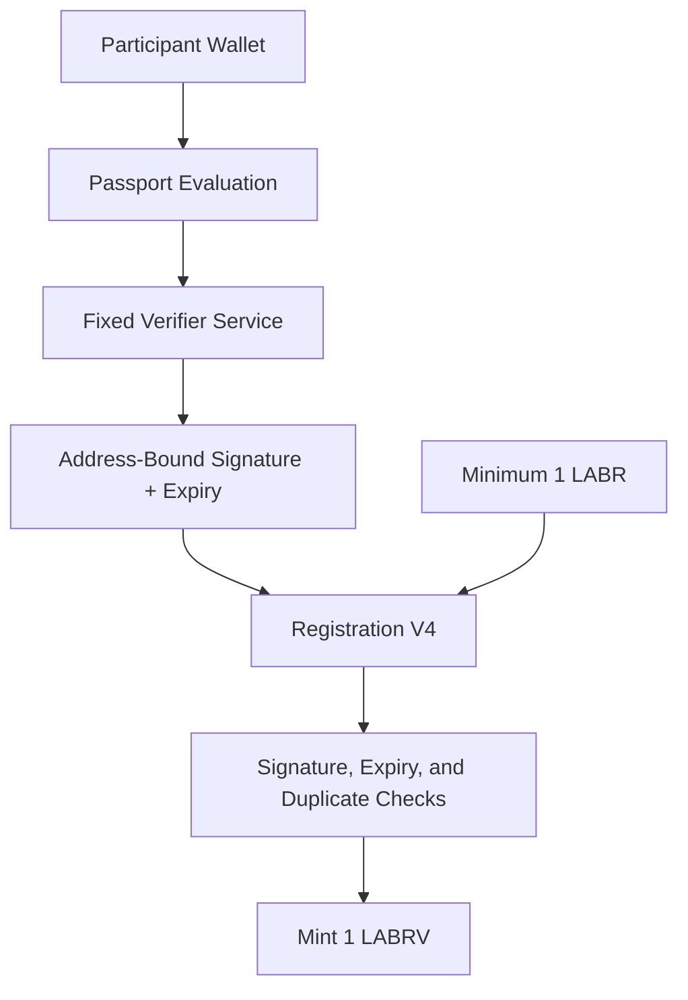
---

# Chapter 11: LABRV Governance Token

## 11.1 Introduction

The LaborCoin Governance Token (LABRV) serves as the governance participation layer of the LaborCoin protocol.

Unlike LABR, which functions as a transferable utility token, LABRV exists exclusively to represent governance rights.

The token is issued through the Registration Protocol and grants eligible participants the ability to propose, vote upon, and execute governance decisions according to protocol rules.

A defining characteristic of LABRV is that it is non-transferable.

Governance rights therefore cannot be purchased, sold, delegated through market transactions, or accumulated through token acquisition. Instead, governance participation is linked directly to successful registration.

This design reflects one of the central objectives of LaborCoin:

To separate governance authority from capital ownership.

---

## 11.2 Purpose

LABRV exists to represent governance participation rather than economic ownership.

The token performs several functions within the protocol.

### Governance Eligibility

LABRV serves as proof that a participant has completed registration and satisfied governance requirements.

### Voting Rights

LABRV enables participation in governance proposals.

### Proposal Creation

LABRV holders may create governance proposals subject to protocol rules.

### Governance Execution

LABRV holders may participate in execution processes associated with approved proposals.

Importantly, LABRV does not function as an economic asset.

It was not designed for speculation, trading, or investment purposes.

Its sole purpose is governance participation.

---

## 11.3 Governance Separation

A foundational design principle of LaborCoin is the separation between:

* Economic participation
* Governance participation

LABR represents economic participation.

LABRV represents governance participation.

This distinction seeks to address a recurring challenge within blockchain governance systems.

When governance rights are tied directly to token ownership, governance influence tends to concentrate among large holders.

LaborCoin attempts to mitigate this effect by establishing an independent governance credential.

Ownership of LABR does not automatically grant governance authority.

Governance authority requires registration and issuance of LABRV.

---

## 11.4 One Verified Participant per LABRV

The governance architecture is built around one non-transferable LABRV for each successfully registered participant wallet.

Each successful registrant receives:

[
1 \text{ LABRV}
]

The protocol does not issue additional governance tokens based on:

* LABR holdings
* Exchange activity
* Treasury contributions
* Proposal history
* Voting frequency

Every registered wallet with one LABRV possesses the same token voting weight after delegation.

This design prioritizes participant equality over wealth-weighted governance while recognizing that Passport-assisted uniqueness is an approximation rather than proof of personhood.

---

## 11.5 Fixed Governance Weight

Because each participant receives exactly one LABRV token, governance influence remains constant across participants.

A participant holding:

1 LABR

and a participant holding:

10,000 LABR

possess identical governance voting weight once registered.

The protocol therefore intentionally separates financial ownership from governance influence.

This distinction represents one of the most significant differences between LaborCoin and traditional token-governance systems.

---

## 11.6 Soulbound Design

LABRV is implemented as a non-transferable token.

Tokens may be:

* Minted
* Held

Tokens may not be:

* Sold
* Purchased
* Traded
* Transferred between participants

This design is commonly described as a soulbound token model.

The objective is to ensure that governance rights remain attached to registered participants rather than becoming commodities within secondary markets.

---

## 11.7 Why Non-Transferability Matters

The non-transferable nature of LABRV serves several important purposes.

### Governance Integrity

Voting rights remain connected to registered participants.

### Reduced Market Influence

Governance power cannot be accumulated through token purchases.

### Reduced Governance Speculation

Governance participation is separated from token trading.

### Consistency

Governance weight remains stable across participants.

Without non-transferability, governance rights could gradually become concentrated among participants willing to purchase governance tokens from others.

The soulbound design prevents this outcome.

---

## 11.8 Registration Integration

LABRV issuance is controlled by the Registration Protocol.

The governance token cannot be acquired directly.

The only method of obtaining LABRV is successful registration.

The registration workflow ensures that governance participation remains tied to:

* Passport verification
* Verifier authorization
* Completion of the documented attestation workflow
* Protocol eligibility requirements

This relationship forms the bridge between the identity layer and the governance layer.

---

## 11.9 Minting Architecture

The LABRV contract includes a designated minter role.

The permanently locked minter is:

Registration V4

Contract Address:

0xd1CD6C0B6f1F709A52908B40C07D3C54649e323C

When registration succeeds, the Registration Contract mints exactly one LABRV token to the participant.

The LABRV contract itself does not evaluate registration requirements.

Those responsibilities remain within the Registration Protocol.

This separation simplifies auditing and reduces contract complexity.

---

## 11.10 Duplicate Prevention

The protocol prevents issuance of multiple governance tokens to the same registered wallet address.

Before minting occurs, the system verifies that the participant does not already possess LABRV.

If a governance token already exists, the registration attempt fails.

This mechanism reinforces the one verified participant per LABRV issuance rule for registered addresses.

---

## 11.11 Completed Minter Lock Procedure

The final LABRV configuration was completed as follows:

### Step 1

Registration V4 was assigned as the LABRV minter.

### Step 2

Registration and minting functionality were validated on Polygon Mainnet.

### Step 3

The minter configuration was permanently locked.

The final minter is:

`0xd1CD6C0B6f1F709A52908B40C07D3C54649e323C`

The minter can no longer be changed.

---

## 11.12 Ownership Renouncement

After the minter was locked, LaborVote V7 ownership was renounced.

Current state:

* No owner remains.
* Registration V4 is the only minter.
* The minter address cannot be changed.
* LABRV transfer restrictions remain governed by deployed bytecode.

## 11.13 Governance Rights

Possession of LABRV grants participation rights within the governance framework.

These rights include:

### Proposal Creation

Eligible participants may create governance proposals.

### Voting

Participants may vote on active proposals.

### Proposal Execution

An approved proposal may be submitted for execution during its seven-day execution window. Governance V13 revalidates the proposal state, thresholds, execution deadline, and treasury constraints before causing the DAO to call Treasury Module V1.

These rights are granted equally to all registered participants.

---

## 11.14 Governance Rights Not Granted

LABRV does not provide unrestricted authority.

Possession of LABRV does not permit participants to:

* Modify token economics
* Change exchange parameters
* Alter registration requirements
* Increase token supply
* Change voting thresholds
* Change treasury limits
* Pause exchange activity

These restrictions reflect the protocol's principle of constrained governance.

LABRV grants treasury governance rights rather than administrative authority.

---

## 11.15 Relationship to Treasury Governance

The purpose of LABRV is not to govern every aspect of the protocol.

Its purpose is to govern treasury allocation.

Participants collectively determine:

* Whether proposals pass
* How treasury resources are allocated
* Which recipients receive approved distributions

The governance token therefore functions as an instrument of collective decision-making rather than protocol administration.

---

## 11.16 Governance Equality

A central philosophical objective of LABRV is governance equality.

Within the governance system:

* Every registered participant receives one governance token.
* Every governance token possesses equal weight.
* Every vote contributes equally to outcomes.

The protocol therefore attempts to approximate democratic participation while maintaining practical Sybil resistance through the registration process.

---

## 11.17 Security Considerations

Several security properties arise from the LABRV design.

### Non-Transferability

Prevents governance markets.

### Single Issuance

Prevents repeated registration.

### Registration Integration

Restricts governance access to verified participants.

### Minter Locking

Prevents future issuance manipulation.

### Ownership Renouncement

Eliminates administrative control.

Together, these mechanisms help preserve governance integrity.

---

## 11.18 Governance Philosophy

LABRV reflects a broader philosophical distinction within LaborCoin.

The protocol does not assume that financial ownership should automatically translate into governance authority.

Instead, LaborCoin attempts to establish governance participation through verified registration and equal voting rights.

Whether this model proves effective will ultimately depend upon participation, community engagement, and governance outcomes.

However, the architecture itself is intentionally designed to prioritize participation equality over capital concentration.

---

## 11.19 Summary

LABRV serves as the governance participation token of the LaborCoin protocol.

Issued through Registration V4, restricted to one token per registered address, and permanently non-transferable, LABRV forms the foundation of LaborCoin's one verified participant per LABRV governance model.

The token separates governance rights from economic ownership while providing participants with equal authority over treasury allocation decisions.

Together with Passport verification and the Registration Protocol, LABRV forms the core of the protocol's democratic governance framework.

---

# Chapter 12: Governance Framework

## 12.1 Introduction

The LaborCoin Governance Framework provides the mechanism through which registered participants collectively determine how treasury resources are allocated.

The governance system is intentionally limited in scope.

Unlike many blockchain governance systems, LaborCoin governance does not control protocol operation, token economics, exchange behavior, registration requirements, or administrative permissions.

Instead, governance exists for a single purpose:

**Collective treasury allocation.**

This distinction is fundamental to the protocol architecture.

Governance determines where resources are directed.

The protocol determines how the system operates.

By separating these responsibilities, LaborCoin seeks to reduce governance capture risks while preserving democratic control over treasury resources.

---

## 12.2 Governance Objectives

The governance system was designed around several objectives.

### Democratic Participation

Every registered participant should possess equal voting authority.

### Transparency

All proposals, votes, and outcomes should be publicly auditable.

### Accountability

Treasury distributions should occur only after explicit approval.

### Predictability

Governance procedures should remain consistent over time.

### Limited Authority

Governance should control treasury allocation without controlling protocol rules.

These objectives guided the design of the governance architecture.

---

## 12.3 Governance Eligibility

Participation in governance requires successful Registration V4 onboarding and LABRV ownership.

The official workflow includes LABR ownership, Passport evaluation, verifier authorization, and successful registration. Governance V13 additionally requires a valid action-specific verifier authorization when a participant creates a proposal or casts a vote.

This structure creates a clear distinction between economic participation and governance participation while preserving an external verifier dependency for authenticated governance actions.

---

## 12.4 Governance-Action Authorization

Governance V13 requires signed authorizations for both proposal creation and voting.

Each authorization includes or binds:

* The participant address
* The relevant proposal or proposed action data
* The participant's expected nonce
* An expiration timestamp

Governance V13 verifies the signature against the fixed verifier address, checks the nonce, rejects expired authorizations, and increments the nonce after successful use. This prevents a signed proposal or vote authorization from being replayed.

---

## 12.5 Proposal Creation

Governance begins with proposal creation.

A proposal represents a request to allocate treasury resources to a specified recipient.

Each proposal contains:

### Title

A concise description of the proposal.

### Description

Detailed explanation of the proposal's purpose.

### Recipient

Destination address for treasury funds.

### Amount

Requested treasury allocation.

### Start Time

Beginning of voting period.

### End Time

End of voting period.

### Execution Status

Records whether the proposal has been executed.

These fields ensure proposals remain transparent and publicly verifiable.

---

## 12.6 Treasury Allocation Focus

LaborCoin governance is intentionally restricted to treasury allocation decisions.

Governance may determine:

* Whether a proposal receives funding.
* How much funding is allocated.
* Which recipient receives approved funds.

Governance may not determine:

* Token supply.
* Token taxes.
* Exchange pricing.
* Registration requirements.
* Governance thresholds.
* Treasury caps.

These restrictions preserve the distinction between governance and protocol administration.

---

## 12.7 Proposal Lifecycle

Every proposal progresses through a defined lifecycle.

Figure 11. Proposal Lifecycle.

Illustrates the progression of governance proposals from creation through community voting and final execution. Each stage is enforced by smart contract logic, and no administrator can bypass governance outcomes.

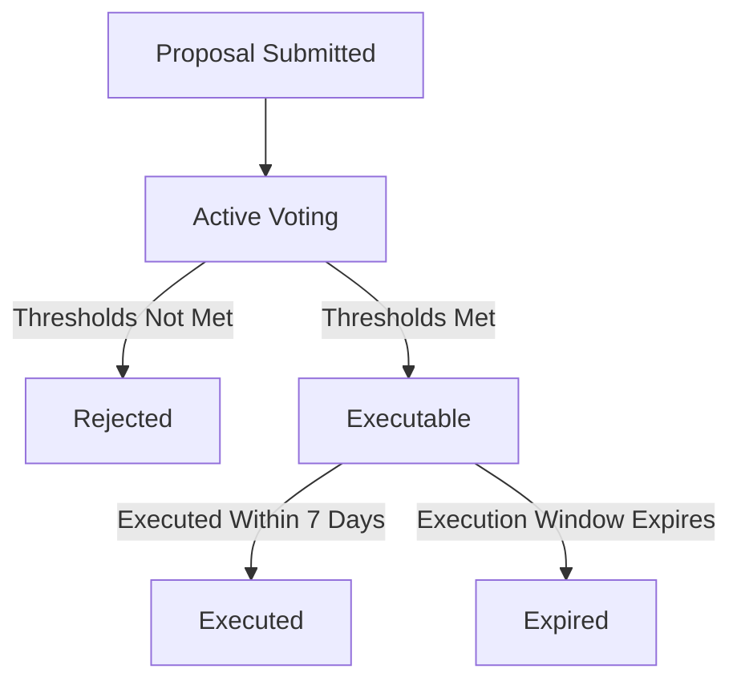
---

## 12.8 Voting Period

LaborCoin proposals remain open for voting for:

[
14 \text{ Days}
]

This period is intended to balance two competing considerations.

### Shorter Voting Periods

Advantages:

* Faster decisions

Disadvantages:

* Reduced participation opportunity

### Longer Voting Periods

Advantages:

* Greater participation opportunity

Disadvantages:

* Slower governance response

The fourteen-day period represents a compromise between responsiveness and inclusiveness.

---

## 12.9 Voting Process

During the voting period, eligible LABRV holders may cast votes by submitting the proposal choice together with a valid verifier signature, nonce, and expiry.

Each LABRV token represents one vote.

Participants may vote:

### For

Support proposal approval.

### Against

Oppose proposal approval.

After Governance V13 validates eligibility and authorization, votes are recorded on-chain and remain publicly auditable.

Because LABRV is non-transferable, voting rights remain attached to registered participants.

---

## 12.10 Participation Threshold

Not every proposal should pass simply because a small number of participants vote.

To address this concern, LaborCoin requires a minimum participation threshold.

Participation Threshold:

[
25%
]

At least twenty-five percent of registered governance participants must vote for a proposal to become eligible for approval.

This requirement helps ensure that treasury decisions reflect meaningful community participation.

---

## 12.11 Why Participation Thresholds Exist

Without participation thresholds, governance systems may become vulnerable to low-turnout decision making.

For example:

* A small group of participants could approve proposals during periods of low activity.
* Treasury allocations could occur without broad community awareness.

The participation threshold seeks to reduce these risks by requiring a minimum level of engagement before proposals can succeed.

---

## 12.12 Approval Threshold

Participation alone is not sufficient.

A proposal must also receive sufficient support.

Approval Threshold:

[
67%
]

A proposal must receive at least sixty-seven percent approval among participating voters.

This threshold exceeds a simple majority.

The objective is to encourage broad agreement before treasury resources are allocated.

---

## 12.13 Why Two-Thirds Approval?

Several voting thresholds were considered conceptually.

### Simple Majority

50% + 1

Advantages:

* Easier proposal passage

Disadvantages:

* Greater polarization

---

### Supermajority

67%

Advantages:

* Stronger consensus
* Greater legitimacy
* Reduced factionalism

Disadvantages:

* Higher approval requirement

LaborCoin adopts the supermajority approach because treasury allocations involve collectively managed resources.

---

## 12.14 Treasury Spending Cap

Governance authority is constrained by treasury limits.

Maximum Proposal Size:

[
5%
]

of treasury assets.

This restriction prevents individual proposals from exhausting treasury resources.

The cap serves as a risk-management mechanism that limits potential governance failures.

---

## 12.15 Why Treasury Limits Exist

Treasury governance always involves risk.

Potential concerns include:

* Poor decision making
* Governance manipulation
* Concentrated voting campaigns
* Community disagreement

The treasury cap reduces the impact of any single proposal.

Even successful proposals remain limited in scope relative to total treasury resources.

---

## 12.16 Minimum Membership Requirement

The governance system includes a minimum membership threshold before treasury execution becomes active.

Minimum Registered Members:

[
50
]

The purpose of this requirement is to ensure governance participation has reached a meaningful level before treasury resources become subject to governance decisions.

This safeguard helps avoid situations where a very small number of participants control treasury allocation during early protocol development.

---

## 12.17 Proposal Approval

A proposal is considered approved only if all requirements are satisfied.

Specifically:

### Requirement 1

Voting period completed.

### Requirement 2

Participation threshold reached.

### Requirement 3

Approval threshold reached.

### Requirement 4

Proposal amount remains within treasury limits.

Only after all requirements have been satisfied may execution occur.

---

## 12.18 Execution Window

Approved proposals do not remain executable indefinitely.

Execution Window:

[
7 \text{ Days}
]

Following approval, participants have seven days to execute the proposal.

If execution does not occur during this period, the proposal expires.

---

## 12.19 Why Execution Windows Exist

Execution windows serve several purposes.

### Predictability

Governance outcomes remain timely.

### Security

Old approvals cannot be executed years later.

### Administrative Clarity

Treasury state remains current.

### Replay Prevention

Execution authority remains bounded in time.

The seven-day period balances flexibility and certainty.

---

## 12.20 Treasury Execution

When an approved proposal is executed:

### Step 1

Governance V13 verifies proposal status, participation, approval, the five-percent cap, the execution window, and non-execution.

### Step 2

Governance V13 submits the constrained execution action to the Aragon DAO.

### Step 3

The DAO calls Treasury Module V1 and supplies the approved POL amount.

### Step 4

Treasury Module V1 verifies that the caller is the DAO and forwards the value to the approved recipient.

### Step 5

Treasury Module V1 updates `totalDistributed`, and Governance V13 records the proposal as executed.

The process occurs on-chain. Its exclusivity depends upon the final Aragon permission registry granting the required execution permission to Governance V13 and removing obsolete executors.

## 12.21 Governance Security Model

Several security mechanisms support governance integrity.

### One Verified Participant per LABRV

Prevents governance concentration through token accumulation.

### Passport Verification

Provides Sybil resistance.

### Non-Transferable LABRV

Prevents governance markets.

### Participation Threshold

Reduces low-turnout decisions.

### Supermajority Approval

Encourages broad consensus.

### Treasury Cap

Limits proposal impact.

### Execution Window

Restricts delayed execution risks.

Together, these mechanisms create multiple layers of governance protection.

---

## 12.22 Governance Independence

Governance possesses authority over treasury allocation.

Governance does not possess authority over protocol operation.

Governance V13 cannot:

* Change Exchange V4 behavior.
* Call LABR token administration functions through its proposal format.
* Change Registration V4 dependencies or its fixed verifier.
* Change governance thresholds.
* Modify Treasury Module V1.
* Modify the five-percent treasury-allocation cap.

The external verifier service, not Governance V13, applies the published Passport-score policy.

This distinction is one of the defining characteristics of the LaborCoin protocol.

---

## 12.23 Governance Philosophy

LaborCoin governance is intentionally narrower than governance systems commonly found within blockchain ecosystems.

The protocol does not attempt to govern every aspect of operation through voting.

Instead, it seeks to combine:

* Fixed protocol rules
* Democratic treasury allocation
* Transparent execution

within a single governance framework.

Participants determine how resources are allocated.

The protocol determines how the system operates.

This separation is intended to provide both democratic participation and long-term stability.

---

## 12.24 Summary

The LaborCoin Governance Framework provides a transparent and constrained mechanism for collective treasury allocation.

Through equal LABRV voting weight, verifier-assisted Sybil resistance, action-specific signatures, supermajority approval requirements, treasury spending caps, and execution windows, the protocol seeks to balance democratic participation with treasury protection.

Governance controls treasury decisions, but governance does not control the protocol itself.

This distinction forms one of the central architectural principles of LaborCoin.

---

# Chapter 13: Treasury Architecture

## 13.1 Introduction

The Treasury Architecture serves as the financial execution layer of the LaborCoin protocol.

Its purpose is to securely receive, hold, account for, and distribute resources according to approved governance decisions.

The treasury system was designed around several principles:

* Transparency
* Limited authority
* Governance accountability
* Security through separation of responsibilities
* Post-launch autonomy

Unlike many blockchain systems in which governance directly controls treasury assets, LaborCoin intentionally separates treasury custody, governance decision-making, and treasury execution into distinct components.

This separation reduces attack surfaces, simplifies auditing, and limits the consequences of governance failures.

---

## 13.2 Treasury Philosophy

The LaborCoin treasury exists to support collective resource allocation.

The protocol itself does not determine which causes, organizations, workers, communities, or initiatives should receive support.

Those decisions remain subject to governance participation.

The treasury therefore functions as neutral infrastructure.

Its role is not to decide.

Its role is to execute decisions that satisfy governance requirements.

This distinction is fundamental.

The treasury is not an administrator.

The treasury is an executor.

---

## 13.3 Treasury Components

The treasury architecture consists of two primary components.

### DAO Treasury

Primary treasury account responsible for holding treasury assets.

Current Address:

`0x0C2e5679153593b82a84eAB5CA90895BB291Cec4`

### Treasury Module

Dedicated execution contract responsible for carrying out approved treasury transfers.

Current Address:

`0x10F2798ef055950B897AF4B3A8ae90dE34f6C56C`

These components operate together but perform different functions.

---

## 13.4 Why Treasury Separation Exists

A common pattern within blockchain governance systems is direct treasury control.

Under this model:

Governance approves a proposal.

Governance directly transfers funds.

While simple, this design creates risks.

For example:

* Larger attack surface
* More complex governance contracts
* Greater auditing complexity
* Increased authority concentration

LaborCoin instead separates:

### Governance Decisions

From

### Treasury Execution

Governance decides.

Treasury executes.

This architecture simplifies responsibilities and reduces protocol complexity.

---

## 13.5 Treasury Growth

Treasury resources accumulate primarily through protocol activity.

The treasury grows through:

### Exchange Purchases

10% of incoming POL from purchases.

### Sell-Side Treasury Allocations

5% allocation generated through LABR transfer taxation.

### Voluntary Contributions

Participants may contribute assets directly.

As protocol participation increases, treasury resources grow alongside ecosystem activity.

This creates a direct relationship between protocol usage and treasury capacity.

---

## 13.6 Treasury Neutrality

The treasury does not evaluate proposals.

The treasury does not determine recipients.

The treasury does not possess discretionary authority.

Instead, treasury behavior is entirely dependent upon governance outcomes.

Once governance approval requirements have been satisfied, Governance V13 can invoke the predefined DAO and Treasury Module V1 execution path, subject to the final DAO permission registry.

This neutrality helps preserve transparency and predictability.

---

## 13.7 Treasury Module V1 Design

Treasury Module V1 is intentionally narrow.

Its deployed constructor permanently sets the Aragon DAO as the only authorized caller. The module exposes one transfer function: the DAO calls `executeTransfer(recipient)` while supplying the approved POL amount as transaction value. The module forwards that value to the recipient and increments `totalDistributed`.

The module does not:

* Hold governance authority
* Create or evaluate proposals
* Store voting logic
* Change governance outcomes
* Change protocol parameters
* Maintain an owner or upgrade role

The module is an execution boundary rather than a general-purpose treasury administrator.

---

## 13.8 Treasury Execution Process

Treasury execution follows this sequence:

### Step 1

Governance V13 validates that the proposal passed, remains within the execution window, has not already executed, and satisfies the treasury cap.

### Step 2

Governance V13 instructs the Aragon DAO to execute the approved action.

### Step 3

The DAO calls Treasury Module V1 with the approved POL value.

### Step 4

Treasury Module V1 verifies that the caller is the DAO, forwards the POL to the approved recipient, updates `totalDistributed`, and emits the transfer event.

This design keeps custody in the DAO Treasury until execution and prevents the module from independently initiating a distribution.

## 13.9 Treasury Flow Architecture

The relationship between treasury accumulation, governance approval, and resource distribution can be represented as follows:

Figure 7. Governance Allocation Flow.

Illustrates the final intended execution path from proposal approval through the DAO and Treasury Module V1 to the recipient.

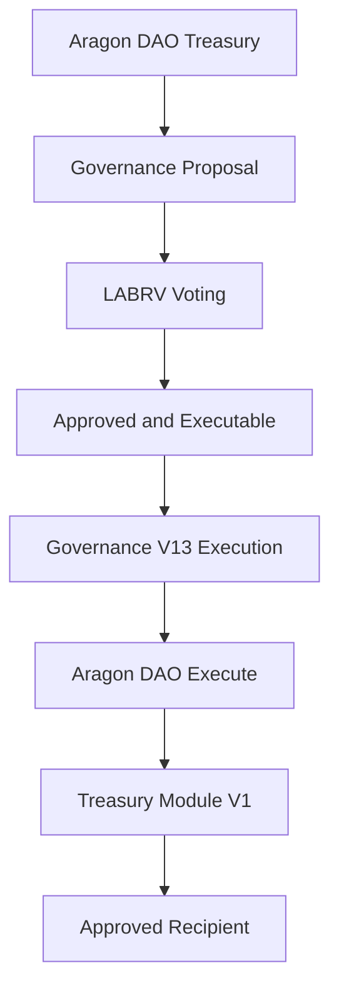

This separation ensures that governance outcomes are translated into treasury actions through a dedicated execution layer.

---

## 13.10 Distribution Accounting

The Treasury Module maintains accounting information regarding treasury distributions.

Current implementation tracks:

### Total Distributed

Cumulative value distributed through governance-approved transfers.

This accounting information provides:

* Transparency
* Historical tracking
* Auditability

Participants can independently verify treasury activity using on-chain records.

---

## 13.11 Governance Constraints

Treasury execution remains subject to governance limitations.

Governance V13 cannot encode arbitrary transfers; its proposal and execution format is limited to the constrained treasury-allocation path.

Every treasury action must satisfy:

### Participation Threshold

25%

### Approval Threshold

67%

### Treasury Cap

5%

### Execution Window

7 Days

These requirements apply before treasury resources may be distributed.

---

## 13.12 Treasury Spending Cap

The treasury spending cap represents one of the protocol's most important safeguards.

Maximum proposal size:

[
5%
]

of treasury assets.

This limitation exists regardless of proposal popularity.

Even unanimous approval cannot bypass treasury caps.

The objective is to reduce systemic risk and preserve treasury longevity.

---

## 13.13 Why Spending Caps Matter

Consider a hypothetical governance failure.

Without treasury caps:

A single proposal could potentially exhaust treasury resources.

With treasury caps:

The maximum exposure remains limited.

This restriction provides several benefits:

* Reduced governance risk
* Improved treasury sustainability
* Greater community oversight
* Lower impact of mistakes

Treasury caps therefore function as a form of risk management.

---

## 13.14 Execution Windows

Treasury transfers remain executable only during the approved execution period.

Execution Window:

[
7 \text{ Days}
]

After expiration:

* Execution authority ends.
* Proposal becomes inactive.
* Treasury resources remain protected.

Execution windows prevent stale approvals from remaining valid indefinitely.

---

## 13.15 Security Boundaries

The treasury architecture intentionally defines clear security boundaries.

### Governance Controls

Proposal approval.

### Treasury Controls

Fund custody.

### Treasury Module Controls

Execution.

Each component performs a narrow function.

No single component possesses unrestricted authority.

This separation reduces systemic risk.

---

## 13.16 Post-Launch Operation

Following protocol finalization:

* Governance continues operating.
* Treasury continues accumulating resources.
* Treasury Module continues executing approved transfers.

No creator intervention is required for the Governance V13 execution path. Treasury security nevertheless depends upon the final Aragon permission configuration and verifier availability for authenticated proposal and voting actions.

This aligns with the protocol's broader objective of creating autonomous public infrastructure.

---

## 13.17 Transparency and Auditing

Every treasury action generates an on-chain record.

Participants may independently verify:

* Treasury balances
* Treasury growth
* Governance approvals
* Distribution history
* Recipient addresses

This transparency reduces dependence upon trust and enables public accountability.

Unlike traditional institutions, treasury activity remains continuously auditable.

---

## 13.18 Treasury Philosophy and Economic Solidarity

The treasury represents the practical purpose of the LaborCoin protocol.

The exchange distributes tokens.

The registration system establishes participation.

The governance framework coordinates decision-making.

The treasury is where collective decisions become tangible outcomes.

Through treasury allocations, participants may direct resources toward causes, communities, organizations, and workers according to collectively determined priorities.

The treasury therefore transforms governance from discussion into action.

---

## 13.19 Limitations

The treasury architecture does not guarantee:

* Effective governance
* Wise allocation decisions
* Community consensus
* Successful outcomes

The protocol provides infrastructure.

Participants remain responsible for governance choices.

The system can facilitate collective decision-making, but it cannot determine what decisions should be made.

---

## 13.20 Summary

The Treasury Architecture provides the financial execution layer of the LaborCoin protocol.

By separating governance decisions from treasury execution, limiting proposal sizes, enforcing execution windows, and maintaining transparent accounting, the protocol seeks to balance democratic participation with treasury protection.

The treasury exists not as a governing authority, but as an execution mechanism through which collectively approved decisions become real-world actions.

---

# Chapter 14: Security Architecture

## 14.1 Introduction

The security architecture of LaborCoin is designed around a fundamental principle:

**No single mechanism should be responsible for protecting the protocol.**

Instead, the protocol employs multiple independent layers of protection across its economic, governance, treasury, registration, and exchange systems.

This layered approach recognizes an important reality of decentralized systems:

No security mechanism is perfect.

Every defense possesses limitations.

Consequently, LaborCoin seeks to reduce risk through overlapping protections rather than dependence upon a single control.

The protocol's security model therefore combines:

* Smart contract controls
* Governance constraints
* Identity verification
* Treasury restrictions
* Signature validation
* Authority removal and constraint
* Public transparency

into a unified security framework.

---

## 14.2 Security Philosophy

LaborCoin was not designed under the assumption that participants will always behave cooperatively.

The protocol assumes that adversarial behavior may occur.

Potential adversaries may include:

* Malicious participants
* Coordinated voting groups
* Automated trading systems
* Governance manipulators
* Sybil attackers
* External observers seeking vulnerabilities

The objective of the security architecture is not to eliminate all risk.

Rather, the objective is to make manipulation more difficult, more visible, and less impactful.

---

## 14.3 Layered Security Model

The protocol's security architecture can be understood as five interacting layers.

### Economic Layer

Protects exchange activity and token distribution.

### Identity Layer

Protects governance participation.

### Governance Layer

Protects collective decision-making.

### Treasury Layer

Protects protocol resources.

### Administrative Layer

Protects against centralized control.

Each layer addresses a different category of risk.

---

## 14.4 Exchange Security

The exchange represents one of the protocol's most exposed components because it directly handles asset transfers.

Several mechanisms exist to reduce exchange-related risks.

### Reentrancy Protection

The exchange utilizes a reentrancy guard.

This prevents recursive contract calls from repeatedly entering critical functions before state updates complete.

Without such protection, malicious contracts may attempt to manipulate exchange logic through repeated execution paths.

The reentrancy guard ensures that only one protected operation may execute at a time.

---

## 14.5 Cooldown Enforcement

Exchange transactions are subject to a twelve-hour cooldown.

[
12 \text{ Hours}
]

This restriction applies to both purchases and sales.

The cooldown serves several purposes:

* Reduces automated trading activity
* Discourages rapid manipulation
* Slows coordinated attacks
* Encourages orderly distribution

Although cooldowns do not eliminate adversarial behavior, they increase the operational cost of rapid transaction strategies.

---

## 14.6 Oracle Security

The exchange relies upon the Chainlink POL/USD oracle.

Oracle systems introduce a potential dependency because exchange pricing incorporates external market data.

To reduce oracle-related risks, the protocol performs multiple validations.

### Positive Value Requirement

Oracle values must be greater than zero.

Invalid values are rejected.

### Freshness Requirement

Oracle updates must remain recent.

Stale oracle data is automatically rejected.

### Maximum Price Validation

Exchange calculations enforce maximum pricing constraints intended to identify anomalous oracle behavior.

Together, these controls reduce exposure to faulty or outdated oracle information.

---

## 14.7 Deterministic Pricing Security

A significant security property of the exchange is determinism.

Given:

* Current supply
* Oracle value
* Transaction amount

every participant can independently calculate expected outcomes.

This transparency provides several benefits:

* Easier auditing
* Reduced informational asymmetry
* Reduced discretionary authority
* Easier anomaly detection

Participants do not need to trust administrators to understand exchange behavior.

---

## 14.8 Registration Security

The Registration Protocol protects access to governance participation.

Without registration controls, governance could become vulnerable to duplicate participation and unauthorized access.

Several mechanisms support registration integrity.

### Minimum LABR Ownership

Requires protocol participation prior to registration.

### Passport Verification

Provides Sybil-resistance signals.

### Verifier Authorization

Restricts governance access to approved participants.

### Duplicate Prevention

Prevents repeated governance token issuance.

These mechanisms work together to support governance legitimacy.

---

## 14.9 Signature Validation

The fixed verifier authorizes registration and governance actions through cryptographic signatures.

Registration V4 and Governance V13 recover the signer from submitted authorization data and require the recovered signer to match the fixed verifier address.

The verifier cannot directly mint LABRV, create a proposal, cast a vote, or execute a treasury transfer. It authorizes eligibility or action data; the contracts perform the state changes only after all on-chain checks pass.

---

## 14.10 Registration Replay Protection

Registration V4 authorizations are bound to the participant address and an expiration timestamp.

Replay protection arises from two controls:

* An expired authorization is rejected.
* A successfully registered address is permanently recorded and cannot register again.

Registration V4 does not maintain the nonce mapping used by Governance V13.

---

## 14.11 Governance Nonce and Expiration Protection

Governance V13 maintains a nonce for each participant and requires action-specific verifier signatures for proposal creation and voting.

A valid governance authorization must contain the expected nonce and an unexpired deadline. After successful use, Governance V13 increments the participant's nonce. A reused signature therefore fails even if its expiration time has not yet passed.

Nonce and expiration checks prevent signed proposal and vote authorizations from being replayed or retained indefinitely.

## 14.12 Governance Security

Governance systems face unique risks because they coordinate treasury decisions.

LaborCoin addresses governance security through multiple mechanisms.

### One Verified Participant per LABRV

Reduces governance concentration through capital accumulation.

### Non-Transferable LABRV

Prevents governance markets.

### Participation Threshold

Requires meaningful voter engagement.

### Supermajority Approval

Requires broad support.

### Treasury Caps

Limits proposal impact.

Each mechanism addresses a different governance risk.

---

## 14.13 Participation Threshold Security

The governance framework requires:

[
25%
]

participation.

This threshold helps prevent governance decisions from being determined by small groups during periods of low activity.

The threshold acts as a legitimacy safeguard by ensuring a minimum level of engagement.

---

## 14.14 Supermajority Security

Proposal approval requires:

[
67%
]

support.

Supermajority requirements make treasury allocation more difficult than simple majority systems.

This approach prioritizes consensus and reduces the likelihood of controversial treasury decisions.

---

## 14.15 Treasury Security

Treasury resources represent one of the protocol's most valuable assets.

Several mechanisms exist to reduce treasury risk.

### Treasury Caps

Maximum proposal size:

[
5%
]

of treasury assets.

### Execution Windows

Approved proposals remain executable for:

[
7 \text{ Days}
]

### Governance Validation

Treasury execution requires successful governance approval.

These protections reduce the potential consequences of governance failures.

---

## 14.16 Treasury Module Security

The Treasury Module was intentionally designed to be simple.

The module:

* Receives funds
* Executes approved transfers
* Records distributions

The module does not:

* Create proposals
* Evaluate votes
* Modify governance outcomes
* Change protocol parameters

Reducing contract complexity generally improves auditability and lowers the probability of implementation errors.

---

## 14.17 Administrative Security

The final custom contracts minimize administrative authority through their deployed structure.

* Exchange V4, Registration V4, Governance V13, and Treasury Module V1 have no owner role.
* LaborVote V7 ownership is renounced and its minter is permanently locked.
* LABR remains DAO-owned and retains owner-only functions in its bytecode.
* The verifier remains an external signing dependency.

Security therefore depends not only upon ownership removal, but also upon the final Aragon DAO permission registry and the operational security of the verifier.

---

## 14.18 Authority Removal and Constraint

Authority minimization provides meaningful protection:

* The creator cannot alter ownerless final contracts.
* LaborVote V7's minter cannot be replaced.
* Governance V13 cannot rewrite its thresholds or proposal scope.
* Treasury Module V1 accepts calls only from the DAO.

These protections do not make LABR ownerless and do not eliminate verifier risk. The launch provenance report must document DAO permissions so that DAO-held token ownership is not mistaken for unrestricted public governance authority.

## 14.19 Transparency as Security

Transparency functions as an important security property throughout the protocol.

Participants can independently verify:

* Treasury balances
* Governance votes
* Exchange activity
* Distribution history
* Proposal outcomes

Public visibility increases the likelihood that anomalies will be detected.

Transparency therefore complements technical security mechanisms.

---

## 14.20 Security Limitations

Despite these protections, LaborCoin does not claim absolute security.

Risks remain.

Examples include:

* Smart contract vulnerabilities
* Oracle failures
* Governance mistakes
* Social engineering
* Unforeseen attack vectors

No decentralized system can eliminate risk entirely.

The objective is risk reduction rather than risk elimination.

---

## 14.21 Security Assumptions

The protocol assumes:

* Polygon continues operating.
* Chainlink oracle infrastructure remains functional.
* Cryptographic primitives remain secure.
* Passport verification remains available.
* Participants act in good faith sufficiently often for governance to function.

These assumptions form part of the protocol's operating environment.

---

## 14.22 Security Philosophy Revisited

The LaborCoin security model is ultimately based upon constrained authority.

No participant possesses unlimited power.

No governance vote possesses unlimited power.

No treasury proposal possesses unlimited power.

No creator-controlled administrator is intended to possess permanent authority over the final custom contracts.

By limiting authority throughout the system, the protocol seeks to reduce both accidental failures and deliberate abuse.

---

## 14.23 Summary

The LaborCoin security architecture combines exchange protections, registration controls, cryptographic authorization, governance safeguards, treasury restrictions, ownerless deployment, locked configuration, and documented DAO permissions into a layered defense model.

Rather than relying on any single protection, the protocol distributes security responsibilities across multiple independent systems.

This approach seeks to provide resilience, transparency, and predictability while preserving the protocol's broader objective of democratic treasury governance.

---

# Chapter 15: Threat Model

## 15.1 Introduction

A threat model describes the risks a system is designed to address, the assumptions under which it operates, and the mechanisms used to reduce potential harm.

No protocol can defend against every conceivable threat.

Instead, effective security architecture requires identifying realistic risks and implementing protections proportional to those risks.

LaborCoin's threat model reflects the protocol's purpose as a democratically governed treasury system.

The protocol must simultaneously protect:

* Governance legitimacy
* Treasury resources
* Participant equality
* Exchange integrity
* Registration integrity
* Protocol autonomy

This chapter examines the principal threats considered during protocol design and describes the mechanisms intended to reduce their impact.

---

## 15.2 Threat Classification

Threats facing LaborCoin can be grouped into seven categories.

### Identity Threats

Attacks targeting governance participation.

### Governance Threats

Attacks targeting collective decision-making.

### Treasury Threats

Attacks targeting protocol assets.

### Economic Threats

Attacks targeting exchange behavior and token distribution.

### Administrative and Permission Threats

Attacks arising from privileged authority or misconfigured DAO permissions.

### Smart Contract Threats

Failures arising from implementation defects or unexpected contract interactions.

### Social Threats

Failures arising from participation, coordination, or collective judgment.

Each category requires different mitigation strategies.

---

# Identity Threats

## 15.3 Sybil Attacks

### Description

A Sybil attack occurs when a single actor controls multiple governance identities.

Because blockchain addresses are inexpensive to create, unrestricted governance systems are vulnerable to artificial participation inflation.

For example:

* One individual controls 100 wallets.
* Each wallet receives governance rights.
* One individual effectively casts 100 votes.

Under a one verified participant per LABRV model, this threat is particularly important.

---

### Mitigations

LaborCoin addresses Sybil attacks through multiple layers:

#### Gitcoin Passport

Minimum Passport score:

[
15
]

#### Verifier Authorization

Registration requires signed approval.

#### LABRV Issuance Controls

Only one governance token may be issued per registered wallet address.

#### Registration Verification

Governance participation requires successful registration.

---

### Residual Risk

Passport verification provides probabilistic rather than absolute identity assurance.

Some duplicate identities may remain possible.

The protocol seeks practical resistance rather than perfect prevention.

---

## 15.4 Registration and Authorization Abuse

### Description

An attacker attempts to obtain governance access or submit authenticated governance actions without satisfying the documented eligibility requirements.

Examples include:

* Forged verifier signatures
* Reused proposal or vote authorizations
* Expired registration authorizations
* Compromise or misuse of verifier infrastructure

### Mitigations

#### Signature Verification

Registration V4 and Governance V13 accept only signatures recovered from the fixed verifier address.

#### Registration Address Binding and Expiry

Registration authorizations are bound to the registering address and expire.

#### Governance Nonce and Expiry

Proposal and vote authorizations use participant nonces and expiration timestamps.

#### Duplicate Registration Prevention

A registered address cannot mint a second LABRV through Registration V4.

### Residual Risk

The verifier can withhold service, become unavailable, or authorize activity contrary to the published Passport policy. Contract-level signature validation cannot determine whether the verifier applied its off-chain policy correctly.

---

# Governance Threats

## 15.5 Governance Capture

### Description

Governance capture occurs when a small group gains disproportionate control over governance outcomes.

Capture may occur through:

* Coordinated voting blocs
* Organizational dominance
* Identity manipulation
* Participation asymmetry

---

### Mitigations

#### One Verified Participant per LABRV

Governance rights are not proportional to LABR ownership.

#### Soulbound Governance Tokens

LABRV cannot be purchased or accumulated through markets.

#### Participation Threshold

25% participation required.

#### Supermajority Requirement

67% approval required.

---

### Residual Risk

Highly coordinated groups may still achieve influence if broader participation remains low.

The protocol cannot force participation.

---

## 15.6 Low Participation Governance

### Description

A small number of participants make decisions on behalf of a much larger community.

This problem is common in decentralized governance systems.

---

### Mitigations

#### Participation Threshold

Proposals require:

[
25%
]

participation.

#### Fourteen-Day Voting Period

Provides sufficient opportunity for participation.

#### Public Transparency

Governance activity remains visible to all participants.

---

### Residual Risk

Thresholds reduce but do not eliminate participation challenges.

Community engagement remains essential.

---

## 15.7 Governance Extremism

### Description

Participants attempt to use governance to radically alter protocol behavior.

This threat is common in governance systems with broad authority.

---

### Mitigations

LaborCoin intentionally limits governance scope.

Governance cannot:

* Change token supply
* Change taxes
* Change exchange parameters
* Change registration requirements
* Change governance thresholds

Governance controls treasury allocation only.

---

### Residual Risk

Governance can still make controversial treasury decisions.

However, governance cannot alter protocol fundamentals.

---

# Treasury Threats

## 15.8 Treasury Drain Attempts

### Description

Participants attempt to extract treasury resources through governance.

---

### Mitigations

#### Treasury Cap

Maximum proposal size:

[
5%
]

of treasury assets.

#### Participation Requirement

25% turnout required.

#### Approval Requirement

67% support required.

#### Execution Window

7-day execution period.

---

### Residual Risk

Repeated successful proposals could still gradually allocate substantial resources over time.

This risk is intentionally left to governance itself.

---

## 15.9 Single-Proposal Treasury Exhaustion

### Description

A proposal attempts to deplete treasury resources in one action.

---

### Mitigations

Treasury spending cap:

[
5%
]

Maximum per proposal.

The treasury cannot be drained through a single governance action.

---

### Residual Risk

The cap depends upon correct contract implementation and the treasury-balance calculation. Multiple separately approved proposals may still allocate substantial resources over time.

---

## 15.10 Treasury Execution Abuse

### Description

A participant attempts to execute treasury transfers without valid approval.

---

### Mitigations

#### Proposal Validation

Execution requires successful proposal approval.

#### Execution Window Verification

Only current approvals may execute.

#### Treasury Module Restrictions

Execution authority remains limited.

---

### Residual Risk

Dependent upon correct smart contract implementation.

---

# Economic Threats

## 15.11 Whale Concentration

### Description

A small number of participants accumulate large quantities of LABR.

---

### Mitigations

#### Governance Separation

LABR ownership does not increase voting power.

#### Registration Requirement

Governance rights derive from LABRV rather than LABR.

#### Wallet Controls

Maximum wallet limits support broader distribution.

#### Transaction Controls

Maximum transaction limits reduce concentration speed.

---

### Residual Risk

Economic concentration remains possible.

However, governance concentration is substantially reduced.

---

## 15.12 Automated Trading Attacks

### Description

Bots attempt to exploit exchange mechanics through rapid trading.

---

### Mitigations

#### Cooldown

12-hour exchange cooldown.

#### Deterministic Pricing

No order books to manipulate.

#### Progressive Distribution

Supply growth remains controlled.

---

### Residual Risk

Automated activity remains possible but becomes less effective.

---

## 15.13 Oracle Manipulation

### Description

Incorrect oracle values influence exchange pricing.

---

### Mitigations

#### Chainlink Infrastructure

Industry-standard decentralized oracle network.

#### Positive Value Validation

Invalid values rejected.

#### Freshness Verification

Stale values rejected.

#### Price Boundaries

Extreme values rejected.

---

### Residual Risk

Oracle dependency cannot be eliminated completely.

The protocol assumes Chainlink operates correctly.

---

## 15.14 Liquidity Stress

### Description

Large sell pressure exceeds exchange reserves.

---

### Mitigations

#### Treasury Contributions

Support ecosystem growth.

#### Reserve Protections

Exchange liquidity preservation mechanisms.

#### Controlled Distribution

Gradual supply release.

---

### Residual Risk

Extreme market conditions could still affect liquidity availability.

---

# Administrative and Permission Threats

## 15.15 Founder and Permission Control

### Description

Creator-held ownership, obsolete DAO executors, or unintended Aragon permissions could preserve authority after final deployment.

### Mitigations

#### Ownerless Final Contracts

Exchange V4, Registration V4, Governance V13, and Treasury Module V1 contain no owner role.

#### Locked and Renounced LABRV

Registration V4 is the permanently locked LaborVote V7 minter and LaborVote V7 ownership is renounced.

#### DAO Ownership Disclosure

LABR ownership is held by the DAO rather than an externally owned creator wallet.

#### Permission Provenance

The final launch record must document DAO execution permissions and removal of obsolete governance, treasury, module, or executor permissions.

### Residual Risk

Any address retaining unintended DAO execute authority could potentially exercise DAO-held powers, including LABR owner functions. The security claim therefore depends upon the final permission registry, not ownership labels alone.

---

## 15.16 Verifier Control and Availability

### Description

The fixed verifier can affect new registrations, proposal creation, and voting by issuing, withholding, or incorrectly issuing signatures.

### Mitigations

The verifier cannot directly mint, vote, create proposals, or transfer treasury funds. All state changes remain subject to contract checks, registered status, LABRV requirements, nonces, expirations, and governance thresholds.

### Residual Risk

Verifier compromise or prolonged unavailability can admit ineligible activity or interrupt authenticated participation. Because the verifier address is fixed in the deployed contracts, replacement would require migration rather than an administrative update.

---

## 15.17 Administrative Abuse

### Description

A holder of DAO execution permission abuses DAO-held authority.

### Mitigations

Governance V13 exposes only constrained treasury-allocation actions. Obsolete executors and modules must have their permissions revoked and the resulting permission state published.

### Residual Risk

DAO permission misconfiguration remains possible until independently verified from on-chain permission records.

---

# Smart Contract Threats

## 15.18 Smart Contract Vulnerabilities

### Description

Undiscovered software defects may exist within deployed contracts.

Examples include:

* Logic errors
* Arithmetic mistakes
* State inconsistencies
* Access-control failures

---

### Mitigations

#### Simplicity

Contracts maintain narrowly defined responsibilities.

#### Separation of Components

Functions distributed across multiple contracts.

#### Public Source Code

Independent review possible.

#### Extensive Testing

Source review and deployment validation conducted before final authority publication.

---

### Residual Risk

Cannot be eliminated completely.

Ownerless and permanently locked contracts retain software risk because defects cannot be corrected in place.

---

## 15.19 Blockchain Dependency

### Description

The protocol depends upon the underlying blockchain.

Failures may include:

* Network outages
* Consensus failures
* Severe congestion

---

### Mitigations

Polygon provides mature infrastructure and broad adoption.

However, this dependency cannot be removed.

---

### Residual Risk

External to the protocol.

---

# Social Threats

## 15.20 Community Coordination Failure

### Description

Participants fail to engage with governance.

Low participation reduces governance effectiveness.

---

### Mitigations

#### Accessible Registration

Low barriers to participation.

#### Equal Voting Rights

Encourages engagement.

#### Transparent Governance

Public visibility of decisions.

---

### Residual Risk

Ultimately depends upon community behavior.

No protocol can guarantee participation.

---

## 15.21 Governance Misjudgment

### Description

Participants make poor decisions despite good intentions.

---

### Mitigations

#### Treasury Caps

Limit consequences.

#### Supermajority Approval

Encourage consensus.

#### Deliberation Periods

Allow discussion before execution.

---

### Residual Risk

Inherent to democratic governance.

The protocol intentionally leaves final decisions to participants.

---

## 15.22 Summary

The LaborCoin threat model recognizes that no decentralized governance system can eliminate all risk.

Instead, the protocol attempts to reduce risk through layered protections, constrained authority, transparent operation, ownerless deployment, locked configuration, and explicit DAO and verifier disclosures.

The most important security principle underlying the protocol is simple:

**No participant, no proposal, no governance vote, and no administrator should possess unlimited power.**

By distributing authority across multiple systems and imposing limits at every layer, LaborCoin seeks to create governance infrastructure that remains resilient, transparent, and accountable over the long term.

---

# Chapter 16: User Journey

## 16.1 Introduction

A protocol may possess sound economics, robust governance, and strong security while still remaining inaccessible to participants.

For this reason, LaborCoin was designed around a relatively straightforward participant experience.

The protocol separates participation into two distinct paths:

### Economic Participation

Participation through LABR ownership and exchange activity.

### Governance Participation

Participation through registration and LABRV ownership.

This distinction reflects the protocol's broader architectural principle that economic participation and governance participation are related but separate activities.

This chapter describes the complete participant journey from initial acquisition of LABR through governance participation and treasury allocation.

---

## 16.2 Participant Lifecycle

A typical governance participant progresses through the following stages.

Figure 2. User Journey.

Illustrates the participant pathway from acquiring POL and LABR through registration, LABRV activation, governance participation, and treasury execution.

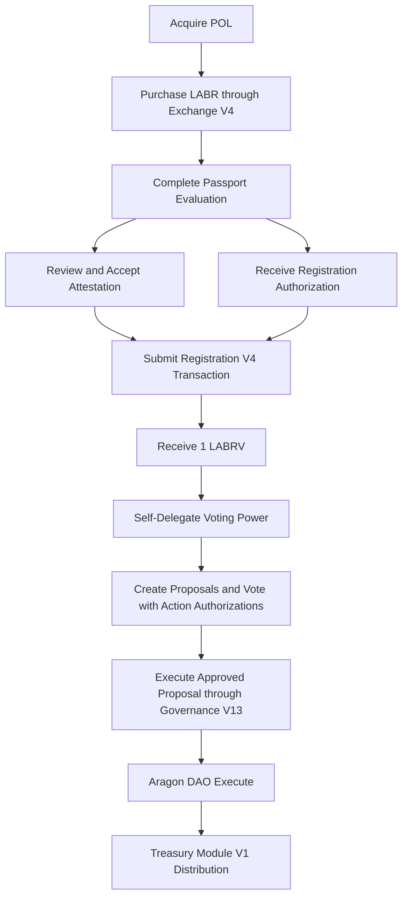

The protocol does not require every participant to complete every stage. Participants may remain exclusively within the economic layer, while registered participants may choose their level of governance activity.

## 16.3 Stage One: Acquiring POL

Because LaborCoin operates on Polygon, participants require POL to interact with the protocol.

POL serves several purposes:

* Transaction fees
* Exchange purchases
* Exchange sales
* Governance interactions

Acquiring POL therefore represents the first step in protocol participation.

---

## 16.4 Stage Two: Purchasing LABR

Participants acquire LABR through the LaborCoin Exchange.

The purchase process consists of:

### Step 1

Connect wallet.

### Step 2

Specify purchase amount.

### Step 3

Review exchange output.

### Step 4

Approve transaction.

### Step 5

Receive LABR.

Upon completion:

* LABR enters participant wallet.
* Treasury receives purchase contribution.
* Exchange liquidity increases.

At this stage, the participant has entered the economic layer of the protocol.

---

## 16.5 Economic Participation Without Governance

Ownership of LABR alone permits participation in the protocol economy.

Participants may:

* Hold LABR
* Transfer LABR
* Buy LABR
* Sell LABR

However, LABR ownership alone does not grant governance authority.

This distinction is intentional.

The protocol allows economic participation without requiring governance participation.

---

## 16.6 Stage Three: Passport Verification

Participants who wish to join governance must satisfy registration requirements.

The first major requirement is Passport verification.

Participants create or connect a Gitcoin Passport profile and accumulate sufficient verification signals to satisfy the protocol threshold.

Current Threshold:

[
15
]

Passport verification serves as the first layer of Sybil resistance.

---

## 16.7 Stage Four: Verifier Authorization

After meeting Passport requirements, participants request verifier authorization.

The verifier evaluates registration eligibility and produces a cryptographic authorization signature.

The authorization confirms that protocol requirements have been satisfied.

This authorization does not itself grant governance rights.

Instead, it permits registration to proceed.

---

## 16.8 Stage Five: Attestation Acceptance

Before registration, the official interface presents the LaborCoin Attestation.

The attestation confirms the participant's declared understanding of the governance process and registration conditions. It is part of the documented interface workflow; Registration V4 does not store a separate on-chain attestation flag.

Passport evaluation, attestation acceptance, and receipt of an address-bound, expiring verifier authorization must all occur before the Registration V4 transaction; the contract does not enforce a required order between the off-chain attestation and authorization steps.

## 16.9 Stage Six: Registration

Participants then submit a registration transaction.

The Registration Contract verifies:

### LABR Ownership

Minimum of one LABR.

### Verifier Authorization

Valid authorization issued under the published Passport policy.

### Authorization Signature

Valid verifier authorization.

### Duplicate Prevention

No existing LABRV ownership.

If all conditions are satisfied:

Registration succeeds.

---

## 16.10 Stage Seven: LABRV Issuance and Delegation

Successful registration results in issuance of:

[
1 \text{ LABRV}
]

The governance token is minted directly to the participant's wallet.

LaborVote V7 uses ERC20Votes checkpointing. The participant should delegate voting power to their own address through the official interface before relying on active voting power. Self-delegation does not transfer LABRV and does not create additional voting weight.

At this point, the participant has entered both the economic and governance layers of the protocol.

## 16.11 Governance Participation

Once registered, holding LABRV, and activating voting power, participants may engage in governance activities. Proposal creation and voting also require current verifier authorizations containing a nonce and expiry.

These include:

### Proposal Creation

Submitting treasury allocation proposals.

### Proposal Review

Evaluating active proposals.

### Voting

Supporting or opposing proposals.

### Execution Participation

Executing approved proposals during valid execution windows.

Governance activity remains entirely transparent and publicly auditable.

---

## 16.12 Proposal Creation Workflow

A governance participant begins by creating a proposal.

The proposal specifies:

* Recipient
* Funding amount
* Description
* Purpose

Upon creation, the proposal enters the voting phase.

No funds move during proposal creation.

Only community review begins.

---

## 16.13 Voting Workflow

During the fourteen-day voting period:

Participants may vote:

### For

Approve proposal.

### Against

Reject proposal.

Votes are recorded on-chain.

Voting remains open until the proposal deadline is reached.

At that point:

* Participation threshold evaluated.
* Approval threshold evaluated.
* Proposal status determined.

---

## 16.14 Approved Proposal Workflow

If governance requirements are satisfied:

The proposal becomes executable.

Execution eligibility remains active for:

[
7 \text{ Days}
]

During this period, the approved proposal may proceed to treasury execution.

---

## 16.15 Treasury Distribution Workflow

Approved treasury distributions follow a simple process.

Figure 8. Economic Flow Summary.

Illustrates the flow of resources through the LaborCoin ecosystem. Economic participation contributes resources to the treasury, governance determines allocation, the Treasury Module executes approved distributions, and resources ultimately return to the broader ecosystem through recipient activities.

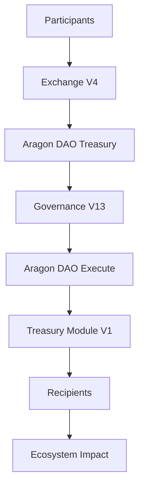

Under the final intended Aragon permission configuration, this path ensures protocol treasury distributions originate from approved Governance V13 decisions.

---

## 16.16 Long-Term Participation

Governance participation does not end after registration.

Participants may continue to:

* Vote
* Create proposals
* Review treasury activity
* Monitor governance outcomes
* Participate in discussions

The protocol therefore supports ongoing involvement rather than one-time participation.

---

## 16.17 Transparency Throughout the Journey

Every major stage of participation produces publicly verifiable records.

Participants can independently verify:

### Exchange Activity

Purchases and sales.

### Registration Activity

Governance onboarding.

### Proposal Activity

Proposal creation and voting.

### Treasury Activity

Approved distributions.

This transparency is intended to reduce informational asymmetry and improve accountability.

---

## 16.18 Optional Participation Levels

LaborCoin does not require identical participation from all users.

Participants may engage at different levels.

### Economic Participants

Hold and utilize LABR.

### Registered Participants

Hold LABRV and vote.

### Governance Participants

Create proposals and engage actively.

### Community Organizers

Coordinate initiatives and treasury proposals.

This flexibility allows participation according to individual interests and capabilities.

---

## 16.19 User Experience Philosophy

The protocol seeks to balance accessibility with governance integrity.

The onboarding process intentionally introduces several requirements before governance rights are granted.

These requirements are not intended as barriers.

Rather, they function as safeguards designed to preserve governance legitimacy and reduce manipulation.

The result is a governance system that remains open while maintaining practical protections against abuse.

---

## 16.20 From Participation to Collective Action

The complete participant journey illustrates the relationship between LaborCoin's major components.

The exchange provides economic participation.

The registration system establishes governance eligibility.

LABRV enables voting.

Governance coordinates decisions.

The treasury executes approved actions.

Each component performs a specialized role, but all contribute to a common objective:

Providing infrastructure through which participants can collectively coordinate resources according to democratically determined priorities.

---

## 16.21 Summary

The LaborCoin user journey begins with acquisition of LABR and may extend through registration, governance participation, proposal creation, and treasury allocation.

By separating economic participation from governance participation while maintaining a transparent path between them, the protocol seeks to support both accessibility and democratic accountability.

The user journey also illustrates how the protocol's individual components work together as an integrated system for collective resource coordination.

---

# Chapter 17: Decentralization Framework

## 17.1 Introduction

Decentralization is frequently discussed within blockchain ecosystems, yet the term often encompasses a wide range of meanings.

Some systems are decentralized in operation but remain centrally administered.

Others are decentralized in governance but retain substantial founder authority.

Still others rely upon trusted organizations for critical functions despite decentralized infrastructure.

LaborCoin adopts a specific interpretation of decentralization.

The objective is not merely distributed operation.

The objective is the elimination of unnecessary administrative authority following protocol validation.

Under this model, decentralization is achieved not by creating new centers of power, but by removing power wherever practical.

This chapter describes the framework through which LaborCoin transitions from a deployed protocol into autonomous public infrastructure.

---

## 17.2 Decentralization Philosophy

The protocol was designed around a simple principle:

**Participants should govern treasury allocation, but no participant should govern the protocol itself.**

Many decentralized systems rely upon governance to modify protocol rules continuously.

Under such systems, governance may:

* Change token economics
* Alter voting requirements
* Modify treasury limits
* Replace infrastructure
* Pause protocol operation

While flexible, these systems often transform governance into a permanent administrative authority.

LaborCoin intentionally rejects this model.

Governance controls treasury allocation.

Core custom-contract behavior remains governed by fixed deployed logic, while DAO permissions, LABR ownership, and verifier operation remain explicit external authority surfaces.

This distinction forms the foundation of the protocol's decentralization strategy.

---

## 17.3 Development Phase

During development, creator-controlled wallets and temporary deployment permissions were used to deploy, configure, test, and connect the protocol components.

---

## 17.4 Deployment and Validation Phase

The final contracts were deployed to Polygon Mainnet and source-verified. Registration, LABRV minting and delegation, governance proposal and voting flows, exchange operations, and treasury execution were validated before the final authority state was documented.

---

## 17.5 Final Deployed Phase

The final deployed phase is characterized by:

* Ownerless Exchange V4, Registration V4, Governance V13, and Treasury Module V1
* Permanently locked Registration V4 minter authority over LaborVote V7
* Renounced LaborVote V7 ownership
* DAO custody of treasury resources
* DAO ownership of LABR
* Fixed verifier addresses in Registration V4 and Governance V13
* DAO permission cleanup and provenance records designated for final launch publication

Autonomy is therefore achieved through narrow contract authority and removal of creator ownership, while external verifier dependence and DAO-held LABR ownership remain explicit.

## 17.6 Ownership and Authority

The relevant decentralization question is not simply whether an `owner()` function exists, but which actors can cause state changes in each component.

---

## 17.7 Exchange V4

Exchange V4 has no owner, pause function, upgrade function, or administrative withdrawal function. Its dependencies and constants were fixed at construction.

---

## 17.8 LaborVote V7

LaborVote V7 originally used ownership to set its minter. Registration V4 was set as minter, the minter was permanently locked, and ownership was renounced.

---

## 17.9 Registration V4

Registration V4 has no owner or administrative setter. Its LABR, LABRV, and verifier addresses are fixed.

Registration remains operationally dependent upon the fixed verifier for new authorization signatures.

---

## 17.10 Governance V13

Governance V13 has no owner or upgrade mechanism. Proposal duration, participation threshold, approval threshold, execution window, minimum-member activation threshold, DAO address, verifier address, Registration V4 address, LABRV address, and Treasury Module V1 address are fixed in the deployed contract.

Governance V13 controls treasury-allocation execution only. It is not a general DAO administration interface.

---

## 17.11 Treasury Module V1 and LABR

Treasury Module V1 has no owner and accepts transfer calls only from the Aragon DAO.

LABR follows a different model. Its ownership is held by the Aragon DAO, and its bytecode retains owner-only token-management functions. Final decentralization therefore depends upon the DAO permission registry preventing unauthorized or obsolete executors from exercising DAO-held authority.

## 17.12 Creator Role

The creator performed deployment, configuration, testing, documentation, and permission-management work required to finalize the protocol.

The creator does not own Exchange V4, Registration V4, Governance V13, Treasury Module V1, or LaborVote V7 in the final state. The creator should not retain DAO execution permissions outside those explicitly documented for the final protocol.

The verifier signing infrastructure remains an operational role and must be distinguished from protocol ownership.

---

## 17.13 Governance Does Not Replace Ownership

LaborCoin does not grant Governance V13 unrestricted DAO administration.

Governance V13 can approve and execute treasury allocations under fixed constraints. It cannot alter its own thresholds, replace dependencies, or issue arbitrary owner calls to LABR through the proposal format.

---

## 17.14 Fixed and Non-Fixed Elements

The final architecture contains several categories.

### Fixed by Ownerless Contract Bytecode

* Exchange V4 pricing and exchange limits
* Registration V4 dependencies and minimum LABR check
* Governance V13 thresholds and proposal rules
* Treasury Module V1's DAO-only execution rule

### Permanently Locked

* LaborVote V7 minter address

### DAO Controlled

* LABR token ownership
* DAO treasury custody
* Aragon permission assignments

### Externally Operated

* Passport evaluation
* Verifier signature service
* Website and interface infrastructure

These categories should not be collapsed into a single claim of universal immutability.

---

## 17.15 Why Predictability Matters

Fixed contract parameters provide predictability, reduce unilateral intervention risk, and make future behavior easier to audit.

The tradeoff is reduced recoverability. Defects in ownerless or locked contracts cannot be corrected in place.

---

## 17.16 Remaining Trust Assumptions

Even after removal of creator ownership, the protocol depends upon:

### Polygon

For transaction execution and consensus.

### Chainlink

For POL/USD price data used by Exchange V4.

### Passport and Verifier Infrastructure

For eligibility evaluation and action authorizations.

### Aragon DAO Permissions

For control of DAO custody and DAO-owned LABR authority.

### Cryptographic Security

For signature validation and account control.

---

## 17.17 Public Infrastructure

LaborCoin is intended to remain publicly accessible, transparent, and durable without routine creator administration.

The system's public-infrastructure claim rests on documented authority boundaries rather than a claim that all supporting services are decentralized.

---

## 17.18 Decentralization as a Process

The process consists of:

### Development

Build and test the system.

### Deployment

Deploy and verify final contracts.

### Authority Finalization

Lock the LABRV minter, renounce LaborVote ownership, transfer LABR ownership, and establish final DAO permissions.

### Documentation

Publish contract, permission, validation, and provenance records.

### Operation

Allow the system to function under the final authority model.

---

## 17.19 Long-Term Vision

The long-term objective is protocol completion rather than permanent founder administration.

Treasury decisions remain democratic through Governance V13. Core custom-contract rules remain fixed. DAO-held LABR ownership and verifier operations remain bounded by public documentation, permissions, and the limitations described in this whitepaper.

## 17.20 Summary

The LaborCoin Decentralization Framework defines the process through which the protocol transitions from founder-managed deployment to autonomous public infrastructure.

Through ownerless final contracts, locked LABRV minting, constrained Governance V13 authority, DAO custody, and explicit disclosure of verifier and LABR-ownership dependencies, the protocol minimizes creator control while preserving democratic treasury allocation.

The final goal is a system in which no creator-controlled wallet can alter the ownerless final contracts, while any remaining DAO-held or verifier authority is narrow, documented, and independently auditable.

---

# Chapter 18: Contract Registry and Deployment Architecture

## 18.1 Introduction

This chapter documents the deployed infrastructure that constitutes the LaborCoin protocol on Polygon Mainnet.

The purpose of this chapter is to provide a permanent technical reference describing:

* Deployed contract addresses
* Component relationships
* Authority boundaries
* Deployment architecture
* Ownership status
* Decentralization procedures

---

## 18.2 Network

LaborCoin is deployed on:

Polygon PoS

The protocol utilizes Polygon for:

* Smart contract execution
* Governance participation
* Treasury operations
* Exchange transactions
* Registration transactions

The selection of Polygon was motivated by:

* Low transaction costs
* Broad ecosystem adoption
* Compatibility with Ethereum tooling
* Mature infrastructure

---

## 18.3 Core Protocol Registry

### LABR Utility Token

Address:

`0x460DD873A1D2a41e77410B125cD3027C5FEd2f78`

Purpose:

* Economic participation token
* Exchange asset
* Registration eligibility requirement
* Treasury contribution source

---

### LaborCoin Exchange V4

Address:

`0x4Cf18cB39203B678f5C26f2338a10a79f9684749`

Purpose:

* Deterministic bonding curve exchange
* Token distribution
* Treasury contribution collection
* Continuous liquidity

---

### LaborCoin Registration V4

Address:

`0xd1CD6C0B6f1F709A52908B40C07D3C54649e323C`

Purpose:

* Governance registration
* Verifier-authorized registration enforcement
* Signature and expiration validation
* LABRV issuance

---

### LaborVote (LABRV) V7

Address:

`0x833242E933c675846D8f8982048FecA95B8e435A`

Purpose:

* Governance participation
* Voting rights
* Proposal eligibility
* One verified participant per LABRV governance model

---

### LaborCoin Governance V13

Address:

`0x8238105d31F6Bb26897d8Ab270a0A521FEF03E8c`

Purpose:

* Proposal management
* Voting
* Approval validation
* Treasury execution authorization

---

### DAO Treasury

Address:

`0x0C2e5679153593b82a84eAB5CA90895BB291Cec4`

Purpose:

* Treasury custody
* Treasury accumulation
* Treasury accounting

---

### LaborCoin Treasury Module V1

Address:

`0x10F2798ef055950B897AF4B3A8ae90dE34f6C56C`

Purpose:

* Execution of approved treasury transfers
* Distribution accounting
* Treasury transfer enforcement

---

## 18.4 Verifier Infrastructure

Current Verifier Address:

`0x475d519631d2406753aCA29F305f19b83E97513e`

The verifier is an externally controlled signing address rather than a smart contract.

Responsibilities include:

* Applying the published Passport-score policy
* Issuing expiring Registration V4 authorizations
* Issuing nonce-bound Governance V13 proposal and vote authorizations
* Maintaining the supporting off-chain verification service

The verifier cannot directly:

* Mint LABRV
* Register a wallet
* Create a proposal
* Cast a vote
* Execute a treasury transfer

Its influence is limited by contract checks, but its availability and policy integrity remain material trust assumptions.

## 18.5 Exchange Oracle Dependency

The Exchange V4 contract utilizes:

### Chainlink POL/USD Price Feed

Contract Address:

`0xAB594600376Ec9fD91F8e885dADF0CE036862dE0`

Purpose:

* POL price discovery
* USD-to-POL conversion
* Exchange pricing calculations

The oracle provides external market data used by the bonding curve exchange.

---

## 18.6 System Architecture

The complete protocol architecture can be summarized as follows:

Figure 1. LaborCoin System Architecture.
High-level relationship between all core protocol components.

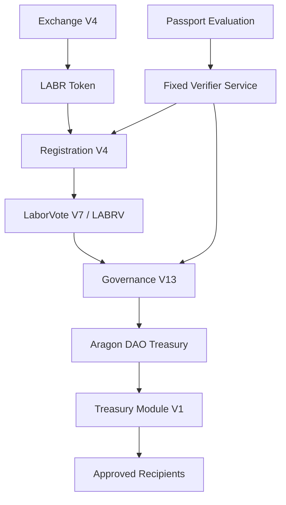

This architecture separates:

* Economic participation
* Registration
* Governance
* Treasury execution

into independent but interconnected systems.

---

## 18.7 Final Authority Relationships

The final authority structure is component-specific.

### LaborCoin Exchange V4

Authority:

None. The contract has no owner or administrative setter.

### LaborVote (LABRV) V7

Authority:

Registration V4 is the permanently locked minter. Ownership is renounced.

### LaborCoin Registration V4

Authority:

No owner. The contract accepts registration authorizations only from its fixed verifier.

### LaborCoin Governance V13

Authority:

No owner. Registered LABRV participants may create proposals and vote only with valid action-specific verifier authorizations. Execution remains limited by fixed governance and treasury rules.

### LaborCoin Treasury Module V1

Authority:

No owner. Only the Aragon DAO may call `executeTransfer`.

### DAO Treasury

Authority:

The Aragon DAO permission registry controls execution authority. Governance V13 is the intended constrained treasury-allocation executor after obsolete permissions are removed.

### LABR Token

Authority:

Owned by the Aragon DAO. Owner-only token functions remain present, making the final Aragon permission registry material to the security model.

### Verifier

Authority:

External signing authority for registration and authenticated governance actions. It cannot directly mint, vote, create proposals, or transfer treasury funds.

## 18.8 Final Deployment Sequence

The final deployment record is:

1. **LABR Token** — deployed April 2, 2025.
2. **LaborVote (LABRV) V7** — deployed June 16, 2026.
3. **LaborCoin Registration V4** — deployed June 22, 2026.
4. **LaborCoin Treasury Module V1** — deployed June 24, 2026.
5. **LaborCoin Governance V13** — deployed June 24, 2026.
6. **LaborCoin Exchange V4** — deployed June 25, 2026.

After deployment, the components were connected through constructor dependencies, LABRV minter configuration, Aragon DAO permissions, LABR ownership and AMM configuration, and interface updates. Full deployment metadata appears in Appendix A and the separate launch provenance report.

## 18.9 Governance Dependency Map

Governance depends upon several components.

Figure 13. Governance Authorization Flow

Illustrates the progression from identity verification through governance participation and treasury execution authority.

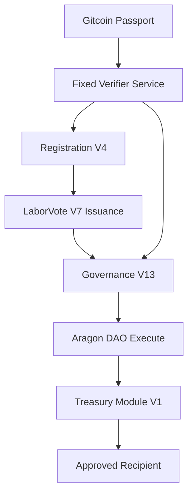

This structure illustrates how governance participation originates from registration rather than token ownership.

---

## 18.10 Economic Dependency Map

The economic layer follows a separate architecture.

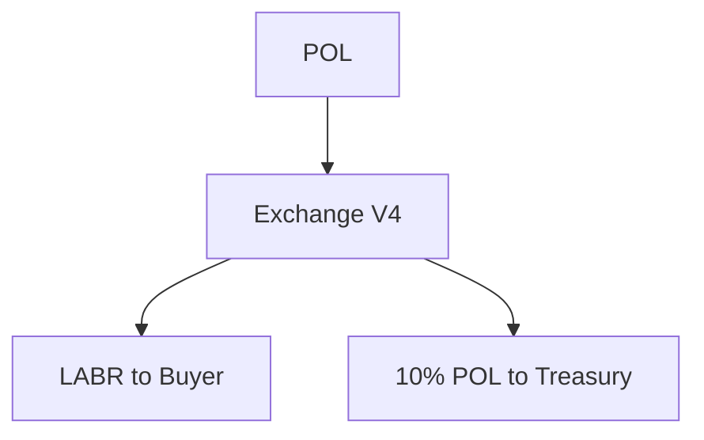

This separation is one of the defining characteristics of the protocol.

Economic participation and governance participation remain distinct.

---

## 18.11 Final Deployment and Authority Status

### LaborVote (LABRV) V7

✓ Registration V4 is the configured minter

✓ Minter permanently locked

✓ Ownership renounced

### LaborCoin Exchange V4

✓ Final address deployed and source-verified

✓ Deployed without owner, pause, administrative withdrawal, or upgrade authority

△ Functional transaction evidence belongs in the launch validation report

### LaborCoin Registration V4

✓ Final address deployed and source-verified

✓ LABR, LABRV, and verifier dependencies fixed at deployment

✓ Deployed without owner administration

△ Registration and mint evidence belongs in the launch validation report

### LaborCoin Governance V13

✓ Final address deployed and source-verified

✓ Governance constants, nonce logic, and constructor dependencies fixed at deployment

✓ Deployed without owner administration

△ Full proposal, vote, threshold, and execution evidence belongs in the launch validation report

### LaborCoin Treasury Module V1

✓ Final address deployed and source-verified

✓ DAO-only caller fixed at deployment

✓ Deployed without owner administration

△ Transfer and accounting evidence belongs in the launch validation report

### LABR and DAO

✓ LABR ownership transferred to the DAO

△ Final DAO permission revocations and executor provenance remain to be completed and published in the separate launch provenance report

### Documentation

✓ Final contract registry incorporated into this whitepaper

△ Document SHA-256 to be inserted after the publication artifact is frozen

## 18.12 Final Authority State

Figure 14. Post-Finalization Authority Structure.

Illustrates the final authority model. Creator ownership is removed from the final custom contracts; Governance V13 retains constrained treasury-allocation authority; the DAO owns LABR and custody assets; and the verifier remains an external authorization dependency.

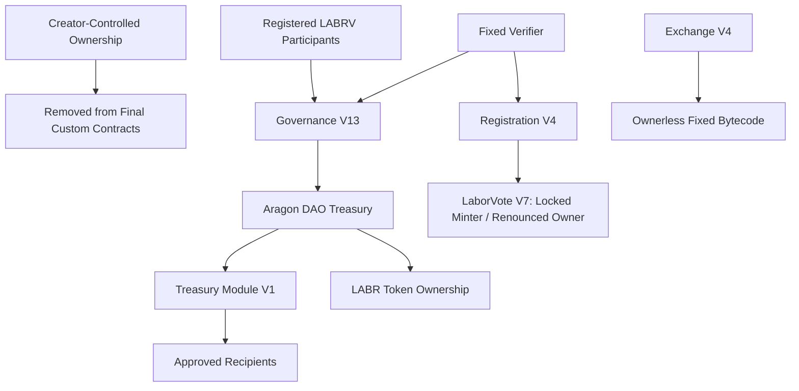

This diagram distinguishes creator-authority removal from complete elimination of all authority. DAO-held LABR ownership and verifier signing remain explicit parts of the deployed system.

## 18.13 Protocol Rules and Enforcement Layers

The principal deployed rules are:

| Rule | Value | Enforcement Layer |
|---|---:|---|
| Maximum LABR supply | 1,000,000,000 LABR | LABR and Exchange V4 supply model |
| Voting participation threshold | 25% | Governance V13 |
| Approval threshold | 67% | Governance V13 |
| Maximum treasury allocation per proposal | 5% | Governance V13 |
| Voting period | 14 days | Governance V13 |
| Execution window | 7 days | Governance V13 |
| Minimum LABR for registration | 1 LABR | Registration V4 |
| Passport-score threshold | 15 | Published verifier policy, not an on-chain Registration V4 constant |

The distinction between contract-enforced constants and verifier policy is material. Governance V13 cannot change its own constants or Registration V4 dependencies, while the off-chain verifier remains responsible for consistently applying the published Passport policy.

## 18.14 Summary

The LaborCoin deployment architecture consists of multiple specialized components operating together to provide economic participation, registration, governance, treasury management, and decentralized resource allocation.

The protocol's structure reflects a deliberate separation of responsibilities, minimizing authority concentration while preserving transparency and auditability.

This registry provides a permanent technical reference describing the deployed state of the LaborCoin protocol and the relationships between its constituent components.

---

# Chapter 19: Launch Validation and Operational Readiness

## 19.1 Introduction

Deployment, source verification, ownership finalization, functional testing, DAO permission cleanup, and publication provenance are separate milestones.

The final contracts have been deployed and source-verified. That fact does not by itself prove that every live, time-dependent protocol path has completed on the final deployment. This chapter therefore distinguishes confirmed deployment facts from validation evidence that must be recorded in the separate launch validation and provenance reports.

---

## 19.2 Confirmed Deployment Facts

The following items are confirmed in the final deployment registry:

* Final contract addresses and deployment blocks
* Public source verification for all listed contracts
* Ownerless deployment of Exchange V4, Registration V4, Governance V13, and Treasury Module V1
* Permanent locking of Registration V4 as the LaborVote V7 minter
* Renouncement of LaborVote V7 ownership
* Transfer of LABR ownership to the Aragon DAO
* Fixed constructor dependencies for the final custom contracts

---

## 19.3 Exchange Validation Evidence

The launch validation report should record transaction-level evidence for:

* Purchase execution
* Sale execution
* Treasury routing
* Chainlink POL/USD conversion
* Twelve-hour cooldown enforcement
* Exchange wallet and transaction limits
* Tranche accounting and unlocking behavior
* Reserve and payout behavior

Source inspection confirms the deployed functions and constants. Live transaction evidence should be cited separately rather than inferred from source verification alone.

---

## 19.4 Registration and LaborVote Validation Evidence

The launch validation report should record evidence for:

* Valid registration authorization acceptance
* Invalid, altered, and expired authorization rejection
* Minimum-LABR enforcement
* Duplicate-registration rejection
* Member-number assignment
* LABRV minting
* LABRV non-transferability
* Self-delegation and voting-power checkpoint behavior
* Permanent minter lock and ownership renouncement

The minter lock and ownership state are final deployment facts. Other functional claims should be supported by recorded transactions or reproducible tests.

---

## 19.5 Governance Validation Evidence

Governance V13's verified source establishes the configured proposal duration, participation threshold, approval threshold, minimum-member activation requirement, treasury cap, execution window, nonce handling, and execution logic.

The launch validation report should separately document:

* Proposal creation
* Proposal-authorization nonce and expiry enforcement
* Vote casting
* Vote-authorization nonce and expiry enforcement
* Duplicate-vote rejection
* Participation and approval calculations
* Minimum-member activation behavior
* Execution-window behavior
* Double-execution rejection
* The final DAO execution path

A source-code or ABI review is not equivalent to observing a complete fourteen-day final-deployment proposal lifecycle. Any full-lifecycle claim must be supported by the corresponding final-deployment evidence or clearly identified as a prior-environment test.

---

## 19.6 Treasury and DAO Permission Evidence

The launch provenance report must document:

* Governance V13's DAO execute permission
* Treasury Module V1's DAO-only restriction
* Recipient-transfer behavior
* `totalDistributed` accounting
* Removal of obsolete governance, module, treasury, or executor permissions
* The final Aragon permission registry
* The practical authority available through DAO-owned LABR functions

Until obsolete permissions are removed and the final registry is published, the whitepaper should not claim that Governance V13 is the only address capable of causing DAO execution.

---

## 19.7 Documentation Readiness

The publication set should include:

* Technical Whitepaper
* Redpaper
* FAQ
* Onboarding Guide
* Contract Registry
* Deployment Manifest
* Constructor Arguments
* Build Environment Record
* Launch Provenance and DAO Permission Report
* Launch Validation Report

The document hash should be calculated only after the final publication artifact is frozen.

---

## 19.8 Operational Readiness Status

| Area | Status |
|---|---|
| Final contracts deployed | Complete |
| Public source verification | Complete |
| LaborVote V7 minter lock and ownership renouncement | Complete |
| LABR ownership transfer to DAO | Complete |
| Final DAO permission cleanup | Outstanding launch task |
| Final Aragon permission registry | Outstanding launch publication |
| Final-deployment functional evidence | Record in launch validation report |
| Full-duration Governance V13 lifecycle evidence | Record or qualify in launch validation report |
| Final whitepaper SHA-256 | Pending publication freeze |

---

## 19.9 Summary

The final deployment is established, but launch readiness must be demonstrated through evidence rather than inferred from deployment labels. The final permission registry, validation records, provenance report, and publication hash complete the transition from a deployed system to a documented autonomous launch.

# Chapter 20: Risk Considerations

## 20.1 Introduction

Every governance system operates within constraints.

No protocol can eliminate uncertainty, guarantee outcomes, or solve complex social problems through technology alone.

LaborCoin is no exception.

This chapter provides a candid assessment of the protocol's limitations, assumptions, and risks.

The purpose of this section is not to undermine confidence in the system.

Rather, it is to establish realistic expectations regarding what the protocol can and cannot accomplish.

The LaborCoin protocol provides infrastructure.

Infrastructure can enable action.

Infrastructure cannot guarantee success.

Participants, communities, organizations, and governance processes ultimately determine whether the protocol fulfills its intended purpose.

---

## 20.2 Technology Is Not a Substitute for Organization

A common misconception within blockchain ecosystems is that technology alone can solve fundamentally social problems.

LaborCoin rejects this assumption.

The protocol does not create solidarity.

The protocol does not create trust.

The protocol does not create participation.

The protocol does not create effective governance.

Those things must come from people.

The system merely provides a framework through which participants may coordinate resources and make collective decisions.

Without active participation, the protocol remains little more than software.

Consequently, the greatest long-term determinant of success is not technology but community engagement.

---

## 20.3 The Protocol Cannot Guarantee Good Decisions

LaborCoin provides governance infrastructure.

It does not provide wisdom.

Governance participants may make:

* Effective decisions
* Ineffective decisions
* Popular decisions
* Controversial decisions
* Well-informed decisions
* Poorly informed decisions

The protocol intentionally places decision-making authority in the hands of participants.

As a result, governance outcomes may not always be optimal.

This is not a flaw unique to LaborCoin.

It is an inherent characteristic of democratic systems.

The protocol can facilitate collective decision-making.

It cannot guarantee the quality of collective decisions.

---

## 20.4 Governance Participation Risk

The governance system assumes ongoing participation.

If participation declines significantly:

* Proposal review may weaken.
* Community oversight may weaken.
* Governance legitimacy may weaken.

Participation thresholds reduce some risks associated with low engagement, but they cannot create participation where none exists.

A governance system is ultimately only as strong as the community willing to use it.

This reality represents one of the largest long-term risks facing the protocol.

---

## 20.5 Sybil Resistance Is Probabilistic

LaborCoin utilizes Gitcoin Passport because it provides a practical balance between accessibility and identity assurance.

However:

Gitcoin Passport does not prove identity.

Passport provides evidence suggesting uniqueness.

This distinction is important.

Determined adversaries may still attempt to create multiple eligible identities.

Likewise, some legitimate participants may struggle to achieve sufficient Passport scores.

The protocol therefore provides practical Sybil resistance rather than absolute Sybil prevention.

Participants should understand this limitation clearly.

---

## 20.6 One Verified Participant per LABRV Is an Approximation

The governance model is designed to approximate one distinct participant per LABRV.

However, no decentralized identity system can currently guarantee perfect uniqueness.

As a result:

LaborCoin should be understood as pursuing participant-equality principles rather than claiming perfect proof that each registered wallet corresponds to one unique person.

The protocol seeks to move governance closer to democratic participation than wealth-weighted alternatives.

It does not claim to have solved decentralized identity.

---

## 20.7 Economic Participation and Governance Participation May Diverge

The protocol intentionally separates economic ownership from governance authority.

This design provides several benefits.

However, it also introduces tradeoffs.

For example:

Participants with substantial economic exposure may possess the same governance influence as participants with minimal economic exposure.

Some observers may view this as a strength.

Others may view it as a weakness.

LaborCoin intentionally prioritizes governance equality over economic weighting.

Reasonable individuals may disagree with this choice.

---

## 20.8 Treasury Governance Risk

The treasury exists to be governed.

Therefore, treasury governance necessarily involves risk.

Participants may approve proposals that:

* Fail to achieve intended goals.
* Produce unintended consequences.
* Generate disagreement.
* Allocate resources inefficiently.

Treasury caps reduce the impact of individual decisions.

However, governance remains responsible for how treasury resources are used.

No protocol can guarantee that collective decisions will always produce desirable outcomes.

---

## 20.9 Treasury Capture Risk

Although LaborCoin incorporates numerous governance protections, treasury capture remains theoretically possible.

Examples include:

* Coordinated voting blocs.
* Long-term organizational influence.
* Strategic participation campaigns.
* Governance coalitions.

The protocol attempts to reduce these risks through:

* Registration requirements.
* Passport verification.
* Participation thresholds.
* Supermajority approval.
* Treasury spending caps.

However, no democratic governance system can entirely eliminate the possibility of organized political influence.

The objective is mitigation rather than elimination.

---

## 20.10 Exchange Liquidity Risk

The LaborCoin Exchange provides continuous protocol-managed liquidity.

Nevertheless, liquidity is not unlimited.

Extreme market conditions could create situations where:

* Sell pressure exceeds available reserves.
* Liquidity becomes constrained.
* Exchange behavior differs from participant expectations.

The protocol incorporates reserve protections and treasury mechanisms to reduce these risks.

However, participants should understand that liquidity remains dependent upon protocol reserves and broader ecosystem activity.

---

## 20.11 Oracle Dependency Risk

The exchange relies upon Chainlink POL/USD price data.

If the oracle experiences:

* Outages
* Incorrect reporting
* Severe delays
* Infrastructure failures

exchange functionality may be affected.

The protocol includes safeguards against stale and invalid data.

However, oracle dependency remains an unavoidable external assumption.

Participants should understand that the exchange is not completely self-contained.

---

## 20.12 Blockchain Dependency Risk

LaborCoin operates on Polygon.

Consequently, the protocol inherits risks associated with the underlying blockchain.

These include:

* Network outages
* Congestion
* Consensus failures
* Infrastructure disruptions
* Future protocol changes

Such risks are not unique to LaborCoin.

They are inherent to any application built upon external blockchain infrastructure.

---

## 20.13 Passport and Verifier Dependency Risk

Governance onboarding and authenticated governance actions depend upon Passport evaluation and the fixed verifier service.

Future changes or failures could affect:

* Registration authorization
* Proposal creation
* Vote authorization
* Participant onboarding
* Governance availability

The verifier can neither mint LABRV directly nor create an on-chain vote by itself. It can nevertheless authorize ineligible actions, refuse eligible actions, or interrupt participation if unavailable.

Because Registration V4 and Governance V13 contain fixed verifier addresses, replacing the verifier would require migration to new contracts rather than a Governance V13 parameter update.

## 20.14 Regulatory Uncertainty

Regulatory treatment of blockchain systems continues to evolve globally.

LaborCoin does not attempt to predict future legal developments.

Participants should understand that:

* Laws may change.
* Regulatory interpretations may change.
* Jurisdictional treatment may vary.

The protocol was designed as governance infrastructure rather than a financial product.

Nevertheless, future legal developments remain uncertain.

No whitepaper can guarantee future regulatory outcomes.

---

## 20.15 LaborCoin Is Not a Strike Guarantee System

One potential misunderstanding should be addressed directly.

LaborCoin does not guarantee financial support for any individual, organization, campaign, or strike.

The protocol merely provides a mechanism through which participants may collectively allocate resources.

Whether support occurs depends entirely upon governance decisions.

The protocol therefore provides infrastructure for solidarity.

It does not guarantee solidarity itself.

---

## 20.16 LaborCoin Does Not Replace Existing Institutions

Another common misconception would be to view LaborCoin as a replacement for labor unions, worker organizations, mutual aid networks, or community institutions.

The protocol was not designed for that purpose.

Existing organizations provide functions that software cannot:

* Organizing
* Representation
* Negotiation
* Education
* Community building

LaborCoin is better understood as complementary infrastructure.

Its purpose is to provide an additional coordination mechanism rather than a replacement for existing institutions.

---

## 20.17 Adoption Risk

A technically sound protocol may still fail to achieve meaningful adoption.

Adoption depends upon:

* Awareness
* Community trust
* Governance participation
* Real-world usefulness

The protocol cannot compel adoption.

Ultimately, LaborCoin succeeds only if participants find value in using it.

This may be the single greatest long-term uncertainty facing the project.

---

## 20.18 Finalization and Recoverability Risk

Ownerless and permanently locked contracts provide predictability, but they also reduce recoverability.

For Exchange V4, Registration V4, Governance V13, Treasury Module V1, and LaborVote V7:

* Bugs may be impossible to correct in place.
* Fixed dependencies cannot be replaced administratively.
* Governance cannot modify contract rules.

LABR presents a different risk. It remains DAO-owned and retains owner-only functions. This creates recoverability and administration possibilities at the token layer, but also creates permission and governance risks that do not apply to the ownerless final contracts.

The protocol therefore contains both immutability risk and DAO-permission risk.

## 20.19 Smart Contract Risk

Despite testing and review efforts, smart contract systems can never be proven completely free of defects.

Potential risks include:

* Logic errors
* Unexpected interactions
* Economic exploits
* Undiscovered vulnerabilities

This risk exists within all smart contract systems and is especially consequential where contracts are ownerless or permanently locked.

The protocol attempts to reduce risk through simplicity, transparency, testing, and separation of responsibilities.

However, smart contract risk can never be reduced to zero.

---

## 20.20 Limits of the Protocol

The most important limitation of LaborCoin is also the simplest.

The protocol cannot solve the underlying social, economic, and political challenges that motivated its creation.

LaborCoin cannot:

* Eliminate economic inequality.
* Eliminate labor conflict.
* Eliminate retaliation against workers.
* Guarantee successful collective action.
* Create political consensus.

Those challenges are larger than any software system.

What the protocol can do is provide infrastructure through which communities may coordinate resources more transparently and democratically than might otherwise be possible.

Whether that infrastructure proves effective remains a question that can only be answered through use.

---

## 20.21 Why These Risks Are Accepted

The existence of risks does not imply the protocol lacks value.

Every governance system operates under constraints.

Traditional institutions possess risks.

Governments possess risks.

Corporations possess risks.

Labor organizations possess risks.

Decentralized systems possess risks.

The relevant question is not whether risks exist.

The relevant question is whether the tradeoffs are acceptable given the objectives being pursued.

LaborCoin represents one particular set of tradeoffs:

* Equality over wealth-weighted governance.
* Transparency over opacity.
* Fixed rules over continual modification.
* Public infrastructure over centralized administration.

Reasonable participants may disagree with these choices.

The protocol simply makes those choices explicit.

---

## 20.22 Summary

LaborCoin provides governance infrastructure, not guarantees.

The protocol can facilitate coordination, treasury management, and democratic resource allocation, but it cannot guarantee participation, wisdom, adoption, or success.

Its effectiveness ultimately depends upon the people who choose to use it.

The purpose of this chapter is not to diminish the protocol's ambitions, but to place them within realistic boundaries.

LaborCoin should be evaluated not as a solution to every challenge facing collective action, but as an attempt to provide durable infrastructure through which collective action may be supported.

---

# Chapter 21: Future Governance and Conclusion

## 21.1 Introduction

Every protocol must ultimately answer a fundamental question:

**What happens after launch?**

Many blockchain projects treat launch as the beginning of an indefinite development process.

New features are proposed.

Parameters are adjusted.

Governance expands.

Complexity grows.

LaborCoin was designed around a different philosophy.

The objective is not perpetual modification.

The objective is completion.

The protocol seeks to provide a durable governance infrastructure that can continue operating without requiring continuous redesign, continuous administration, or continuous intervention.

This chapter describes that philosophy and concludes the technical specification of the LaborCoin protocol.

---

## 21.2 Governance After Finalization

In the final deployed state, Governance V13 continues operating without an owner role.

Participants may:

* Create proposals.
* Vote on proposals.
* Allocate treasury resources.
* Execute approved distributions.

The governance process remains active.

However, governance authority remains intentionally constrained.

Governance V13 cannot rewrite its protocol rules.

Governance V13 cannot alter Exchange V4 or LABR token economics.

Governance V13 cannot replace Registration V4 dependencies or the fixed verifier.

Governance V13 cannot modify its constitutional parameters.

Instead, governance remains focused on its intended purpose:

**Collective treasury allocation.**

---

## 21.3 Community Stewardship

Following decentralization, responsibility shifts from administrators to participants.

The protocol itself continues operating automatically.

The community becomes responsible for:

* Participation
* Proposal review
* Treasury oversight
* Resource allocation
* Governance culture

The distinction is important.

The protocol can execute rules.

Only participants can exercise judgment.

Long-term success therefore depends less on technical infrastructure and more on the quality of community stewardship.

---

## 21.4 The Difference Between Governance and Administration

Many decentralized systems eventually blur the distinction between governance and administration.

Governance becomes capable of changing nearly every aspect of protocol behavior.

In practice, governance often becomes a replacement administrator.

LaborCoin intentionally avoids this outcome.

Creator administration of the final custom contracts is removed.

Constrained governance remains, while DAO-held LABR ownership and verifier operation continue as disclosed dependencies.

The governance system exists to direct resources, not to manage software.

This separation is one of the protocol's defining architectural characteristics.

---

## 21.5 Why LaborCoin Is Designed to Become Finished

A common assumption within software development is that systems should evolve indefinitely.

This assumption is not always appropriate for public infrastructure.

Roads are not redesigned every month.

Bridges are not continuously re-governed.

Constitutions are not intended to change daily.

Infrastructure derives much of its value from predictability.

LaborCoin adopts a similar perspective.

The protocol was designed to become finished.

Not abandoned.

Finished.

The distinction matters.

A finished protocol continues operating.

An abandoned protocol ceases functioning.

LaborCoin seeks the former.

---

## 21.6 Protocol Completion

Protocol completion occurs when several conditions are satisfied.

### Functional Completion

Core systems operate correctly.

### Governance Completion

Treasury governance functions as intended.

### Documentation Completion

System behavior is fully documented.

### Authority Finalization

Creator ownership is removed from the final custom contracts, the LABRV minter is locked, and the final DAO permission state is published.

Once these conditions are met and the final provenance records are published, the protocol does not require ongoing contract development to fulfill its defined purpose.

---

## 21.7 Stability as a Feature

Within blockchain ecosystems, stability is often underestimated.

Participants frequently assume that constant change represents progress.

In practice, constant change can create uncertainty.

Stable systems provide:

* Predictability
* Reliability
* Transparency
* Reduced political conflict

LaborCoin therefore treats stability as a feature rather than a limitation.

Participants can understand the rules because the rules remain fixed.

---

## 21.8 Future Improvements Outside the Protocol

The completion of the protocol does not imply the end of community activity.

Many improvements can occur without modifying core infrastructure.

Examples include:

### Educational Resources

Improved documentation and onboarding.

### Governance Culture

Better proposal review and deliberation.

### Community Growth

Increased participation and awareness.

### Ecosystem Development

Additional tools and integrations.

### Research

Analysis of governance outcomes and treasury effectiveness.

These developments can occur without changing the protocol itself.

---

## 21.9 Future Governance Questions

The protocol intentionally leaves many questions unanswered.

For example:

* Which initiatives should receive support?
* Which proposals deserve approval?
* How should treasury resources be prioritized?
* What forms of solidarity are most effective?

These questions are not technical.

They are political, social, and organizational.

The protocol provides a framework within which participants may address them collectively.

The protocol does not attempt to answer them in advance.

---

## 21.10 LaborCoin as Infrastructure

The most useful way to understand LaborCoin may be as infrastructure.

The protocol does not seek to become:

* A political party
* A labor union
* A charity
* An advocacy organization
* A centralized institution

Instead, it seeks to provide infrastructure that such groups, communities, and individuals may choose to utilize.

Infrastructure is valuable precisely because it remains available regardless of who uses it.

The protocol's objective is therefore not organizational control, but public utility.

---

## 21.11 Economic Solidarity and Infrastructure

The motivation behind LaborCoin is straightforward.

Workers and communities frequently face significant economic pressure when attempting collective action.

This reality predates blockchain technology and exists independently of it.

LaborCoin does not claim that blockchain technology solves this problem.

Rather, the protocol attempts to address a narrower question:

**Can a transparent, decentralized treasury infrastructure make collective economic support easier to coordinate?**

That question remains open.

The protocol represents one attempt to explore it.

The objective is not to use blockchain for its own sake.

The objective is to provide a mechanism for economic solidarity that does not currently exist in a broadly accessible, decentralized form.

The technology serves the purpose.

The purpose does not serve the technology.

---

## 21.12 Why Governance Matters

At its core, LaborCoin is not primarily a token system.

It is a governance system.

The token exists to support participation.

The exchange exists to support distribution.

The registration system exists to support legitimacy.

The treasury exists to support execution.

Governance connects all of these components.

Without governance, the system becomes merely a collection of contracts.

Governance transforms infrastructure into collective action.

---

## 21.13 Why Constraints Matter

One of the recurring themes throughout this whitepaper has been limitation.

Governance is limited.

Treasury spending is limited.

Administrative authority is limited.

Creator ownership is removed from the final custom contracts, and remaining authority is explicitly bounded and disclosed.

These constraints are not accidents.

They are deliberate design decisions.

LaborCoin is based on the belief that durable institutions emerge not from unlimited power, but from clearly defined limits on power.

The protocol therefore seeks to distribute authority while simultaneously constraining it.

---

## 21.14 What Success Would Look Like

Success should not be measured solely through token price, treasury size, or transaction volume.

Those metrics may provide useful information, but they do not capture the protocol's purpose.

A more meaningful measure of success would be whether participants are able to:

* Coordinate resources transparently.
* Make collective decisions democratically.
* Support initiatives they collectively value.
* Maintain governance legitimacy over time.

The protocol exists to enable these outcomes.

Whether it succeeds depends upon the community that adopts it.

---

## 21.15 Final Reflection

The LaborCoin protocol was created in response to a simple observation:

Economic solidarity often requires infrastructure.

Modern financial systems provide extensive infrastructure for investment, speculation, and capital coordination.

Comparable infrastructure for decentralized collective support is far less common.

LaborCoin represents an attempt to contribute to that gap.

The protocol combines:

* Transparent treasury management
* Democratic governance
* Sybil-resistant participation
* Fixed core custom-contract rules
* Constrained operation with explicit DAO and verifier dependencies

into a single system designed to function as public infrastructure.

Whether this approach proves effective remains to be seen.

The protocol itself makes no promises.

It merely provides the framework.

What participants choose to build with that framework is beyond the authority of the protocol and beyond the scope of this document.

---

# Conclusion

LaborCoin is a decentralized treasury governance protocol built on Polygon and designed to support transparent, community-directed allocation of resources.

The system combines:

* The LABR utility token
* A deterministic bonding curve exchange
* Gitcoin Passport-based registration
* The LABRV governance token
* Democratic treasury governance
* Constrained treasury execution through the Aragon DAO and Treasury Module V1

within a unified architecture intended to operate without permanent creator administration of the final custom contracts.

The protocol's central objective is not technological novelty.

Its objective is to provide durable infrastructure through which communities may coordinate economic support according to collectively determined priorities.

LaborCoin's final custom contracts are deployed under fixed or permanently locked authority models, while community participation governs treasury allocation through Governance V13. DAO-held LABR ownership and verifier operation remain explicit dependencies rather than being concealed under a universal claim of immutability.

The protocol cannot guarantee participation, consensus, adoption, or success.

It can only provide a transparent framework within which those outcomes may become possible.

In that sense, LaborCoin should be understood not as a finished answer to collective action, but as an attempt to provide infrastructure upon which collective action may be built.

---

**End of LaborCoin Technical Whitepaper v1.0**

---

# Appendix A: Contract Registry

## A.1 Network and Build Context

**Network:** Polygon Mainnet

**Chain ID:** 137

**Final custom-contract compiler:** Solidity 0.8.30

**Final custom-contract EVM target:** Prague

**LABR compiler:** Solidity 0.8.25

**LABR EVM target:** Paris

---

## A.2 Core Contract Registry

### Table 2. Contract Registry

This table identifies the primary smart contracts comprising the LaborCoin protocol. Contract addresses, deployment metadata, verification status, and ownership status are provided to facilitate independent verification of protocol architecture and decentralization status.

| Contract Name | Contract Address | Deployment Block | Deployment Date (UTC) | Verified Source | Ownership Status |
|--------------|------------------|-----------------:|-----------------------|----------------|------------------|
| LABR Token | [0x460DD873A1D2a41e77410B125cD3027C5FEd2f78](https://polygonscan.com/address/0x460DD873A1D2a41e77410B125cD3027C5FEd2f78) | 69797383 | Apr-02-2025 07:56:25 AM +UTC | Yes | DAO Controlled |
| LaborVote (LABRV) V7 | [0x833242E933c675846D8f8982048FecA95B8e435A](https://polygonscan.com/address/0x833242E933c675846D8f8982048FecA95B8e435A) | 88595455 | Jun-16-2026 08:22:48 AM +UTC | Yes | Ownership Renounced / Minter Permanently Locked |
| LaborCoin Registration V4 | [0xd1CD6C0B6f1F709A52908B40C07D3C54649e323C](https://polygonscan.com/address/0xd1CD6C0B6f1F709A52908B40C07D3C54649e323C) | 88997813 | Jun-22-2026 | Yes | Autonomous |
| LaborCoin Treasury Module V1 | [0x10F2798ef055950B897AF4B3A8ae90dE34f6C56C](https://polygonscan.com/address/0x10F2798ef055950B897AF4B3A8ae90dE34f6C56C) | 89052358 | Jun-24-2026 | Yes | Autonomous (DAO Only) |
| LaborCoin Governance V13 | [0x8238105d31F6Bb26897d8Ab270a0A521FEF03E8c](https://polygonscan.com/address/0x8238105d31F6Bb26897d8Ab270a0A521FEF03E8c) | 89084762 | Jun-24-2026 08:15:38 PM +UTC | Yes | Autonomous |
| LaborCoin Exchange V4 | [0x4Cf18cB39203B678f5C26f2338a10a79f9684749](https://polygonscan.com/address/0x4Cf18cB39203B678f5C26f2338a10a79f9684749) | 89115657 | Jun-25-2026 09:08:01 AM +UTC | Yes | Autonomous |


**Ownership Status Definitions**

| Status | Description |
|---------|-------------|
| Creator Controlled | Administrative authority remains with the original deployer. |
| DAO Controlled | Ownership or custody is held by the Aragon DAO and depends upon its permission registry. |
| Autonomous | Contract contains no owner administration or upgrade authority in its deployed form. |
| Locked and Renounced | A required configuration was permanently locked before ownership was renounced. |

**Verification Status**

| Status | Description |
|---------|-------------|
| Yes | Source code has been publicly verified and can be independently audited. |
| No | Source code has not yet been publicly verified. |

---

## A.3 Verifier Infrastructure

Verifier Address:

`0x475d519631d2406753aCA29F305f19b83E97513e`

The verifier is an externally controlled signing address and not a smart contract.

Responsibilities include:

* Applying the published Passport policy
* Issuing expiring registration authorizations
* Issuing nonce-bound proposal and vote authorizations
* Operating the supporting verification service

The verifier cannot directly mint LABRV, register a wallet, create a proposal, cast a vote, or execute a treasury transfer.

## A.4 Oracle Dependency

POL/USD Chainlink Oracle:

`0xAB594600376Ec9fD91F8e885dADF0CE036862dE0`

Purpose:

* POL/USD price discovery
* Bonding curve pricing calculations
* Oracle freshness validation

---

# Appendix B: Tokenomics Specification

## B.1 LABR Overview

Token Name:

LaborCoin

Ticker:

LABR

Maximum Supply:

[
1,000,000,000
]

No additional supply may be created after deployment.

---

## B.2 Exchange Supply Release

Initial Tranche:

[
100,000,000
]

Additional Tranche Size:

[
50,000,000
]

Supply unlocks automatically as demand increases.

This mechanism prevents immediate distribution of the entire token supply while maintaining deterministic issuance.

---

## B.3 Purchase Mechanics

When LABR is purchased:

| Destination | Allocation             |
| ----------- | ---------------------- |
| Buyer       | 100% of purchased LABR |
| Treasury    | 10% of incoming POL    |

The buyer receives the full calculated LABR amount.

Treasury contributions are sourced from incoming POL rather than token deductions.

---

## B.4 Sell Mechanics

When LABR is sold:

| Component           | Percentage |
| ------------------- | ---------- |
| Treasury Tax        | 5%         |
| Holder Dividend Tax | 5%         |
| Total Tax           | 10%        |

Current burn tax:

[
0%
]

The burn mechanism was removed prior to launch finalization.

---

## B.5 Exchange Cooldown

Exchange cooldown:

[
12\ Hours
]

Applies to:

* Purchases
* Sales

Purpose:

* Reduce rapid trading
* Limit automated abuse
* Encourage long-term participation

---

## B.6 Distribution Controls

LaborCoin utilizes two independent layers of concentration controls.

### Token-Level Limits

The LABR token contract currently applies configured token-level transfer restrictions:

| Parameter | Value |
|------------|--------:|
| Maximum Wallet | 1,000,000 LABR |
| Maximum Transaction | 500,000 LABR |

These limits are enforced directly by the token contract, subject to token-level exclusions and any valid future action taken through DAO-held ownership authority.

### Exchange-Level Limits

Exchange V4 enforces additional on-chain distribution safeguards:

| Parameter | Value |
|------------|--------:|
| Maximum Exchange Wallet | 10,000 LABR |
| Maximum Exchange Transaction | 5,000 LABR |

These Exchange V4 limits are intentionally more restrictive than the LABR token-level limits.

The objective is to encourage broader early-stage distribution and reduce concentration during protocol growth.

Both layers are enforced on-chain. The LABR token applies its configured token-level limits, while Exchange V4 applies stricter limits to protocol exchange transactions.

---

# Appendix C: Governance Constants

## C.1 Registration Requirements

Minimum LABR Required:

[
1\ LABR
]

Published Verifier Policy Threshold:

[
15
]

This score is enforced by the verifier workflow, not stored as a numeric constant in Registration V4.

Governance Token Issued:

[
1\ LABRV
]

---

## C.2 Voting Parameters

Voting Duration:

[
14\ Days
]

Participation Threshold:

[
25%
]

Approval Threshold:

[
67%
]

Execution Window:

[
7\ Days
]

---

## C.3 Treasury Constraints

Maximum Treasury Allocation Per Proposal:

[
5%
]

Minimum Registered Members Required Before Treasury Governance Activates:

[
50
]

---

## C.4 Governance Model

Governance Weight:

[
1\ LABRV = 1\ Vote
]

LABRV is:

* Non-transferable
* Non-tradable
* Governance-only

---

# Appendix D: Complete System Architecture

Figure 1. LaborCoin System Architecture.
High-level relationship between all core protocol components.


## D.1 Architectural Layers

### Economic Layer

* LABR
* Exchange
* Treasury Funding

### Identity Layer

* Gitcoin Passport
* Verifier
* Registration

### Governance Layer

* LABRV
* Governance Contract

### Execution Layer

* Treasury
* Treasury Module

---

# Appendix E: Final Authority and Renouncement Status

## E.1 LaborVote (LABRV) V7

| Item | Status |
|---|---|
| Registration V4 assigned as minter | Complete |
| Minter permanently locked | Complete |
| Ownership renounced | Complete |
| Minting and delegation evidence | Reference launch validation report |

---

## E.2 LaborCoin Exchange V4

| Item | Status |
|---|---|
| Owner administration | None in deployed contract |
| Pause authority | None in deployed contract |
| Administrative withdrawal authority | None in deployed contract |
| Buy, sell, oracle, cooldown, and treasury-routing evidence | Reference launch validation report |

---

## E.3 LaborCoin Registration V4

| Item | Status |
|---|---|
| Owner administration | None in deployed contract |
| LABR, LABRV, and verifier dependencies | Fixed at construction |
| Signature, expiry, duplicate-registration, and mint evidence | Reference launch validation report |

---

## E.4 LaborCoin Governance V13

| Item | Status |
|---|---|
| Owner administration | None in deployed contract |
| Governance constants and dependencies | Fixed at construction |
| Proposal, vote, nonce, threshold, and execution evidence | Reference launch validation report |

---

## E.5 LaborCoin Treasury Module V1

| Item | Status |
|---|---|
| Owner administration | None in deployed contract |
| Authorized caller | Aragon DAO only |
| Transfer and accounting evidence | Reference launch validation report |

---

## E.6 LABR and DAO Permissions

| Item | Status |
|---|---|
| LABR ownership held by DAO | Complete |
| Obsolete DAO executor permissions removed | Outstanding launch task |
| Final Aragon permission registry published | Outstanding launch publication |

---

## E.7 Publication

| Item | Status |
|---|---|
| Final contract registry | Included |
| Whitepaper deployment revision | Complete in this publication candidate |
| Launch provenance and permission report | Outstanding publication item |
| Final document SHA-256 | Add after artifact freeze |
| Public launch announcement | Separate publication action |

# Appendix F: Threat Model Matrix

Table 4. Threat Model Matrix

Identifies key threat vectors relevant to the LaborCoin protocol and documents the architectural, economic, and governance controls intended to mitigate their impact.

| Threat                 | Mitigation                       |
| ---------------------- | -------------------------------- |
| Sybil Attacks          | Passport + Verifier + LABRV      |
| Vote Buying            | Soulbound LABRV                  |
| Governance Capture     | 25% Participation + 67% Approval |
| Treasury Drain         | 5% Treasury Cap                  |
| Registration Replay    | Address Binding + Expiration + Registration State |
| Governance Authorization Replay | Participant Nonce + Expiration |
| Verifier Compromise     | Contract Checks + Limited Verifier Authority |
| Oracle Failure         | Freshness + Validation Checks    |
| Whale Concentration    | Governance Separation            |
| Low Participation      | Participation Threshold          |
| Administrative or Permission Abuse | Ownerless Contracts + Locked Minter + DAO Permission Audit |
| Smart Contract Bugs    | Testing + Transparency           |
| Treasury Abuse         | Execution Windows                |
| Duplicate Registration | One LABRV per Registered Wallet |

---

# Appendix G: Mathematical Analysis of the LaborCoin Bonding Curve

## G.1 Purpose

The LaborCoin Exchange utilizes a deterministic quadratic bonding curve to distribute LABR over time.

The curve serves several objectives simultaneously:

* Transparent pricing
* Predictable token issuance
* Progressive scarcity
* Continuous protocol-managed liquidity
* Treasury growth through participation

Unlike traditional order-book markets, the exchange price is determined entirely by protocol state and publicly verifiable mathematics.

Every participant can independently calculate the expected LABR price at any point during the distribution process.

---

## G.2 Mathematical Definition

The Exchange V4 contract defines a normalized distribution variable:

[
x=\frac{S}{1,000,000,000}
]

Where:

* (S) = Total LABR distributed through the exchange
* (1,000,000,000) = Maximum LABR supply

The normalized variable therefore ranges from:

[
0 \le x \le 1
]

The USD-denominated bonding curve is:

[
P(x)=1+14x^2
]

Where:

* (P(x)) = LABR price in USD
* (x) = Fraction of maximum supply distributed

This formula is derived directly from the Exchange V4 smart contract:

[
P_{min}=1
]

[
P_{max}=15
]

and

[
P(x)=P_{min}+(P_{max}-P_{min})x^2
]

---

## G.3 Boundary Conditions

At launch:

[
x=0
]

Resulting in:

[
P(0)=$1
]

At maximum distribution:

[
x=1
]

Resulting in:

[
P(1)=$15
]

Therefore:

[
$1 \le P(x) \le $15
]

throughout the lifecycle of the protocol.

---

## G.4 Curve Behavior

The first derivative of the bonding curve is:

[
P'(x)=28x
]

Since:

[
P'(x)\ge0
]

for all valid values of (x), the curve is monotonically increasing.

Consequently, protocol price never decreases as distributed supply increases.

### Scarcity Acceleration

The second derivative is:

[
P''(x)=28
]

Because:

[
P''(x)>0
]

the curve is strictly convex.

This means price acceleration increases as additional supply is distributed.

Early distribution therefore remains relatively accessible, while later distribution experiences progressively stronger scarcity effects.

This behavior was intentionally selected to balance accessibility and long-term scarcity within the protocol.

---

## G.5 Curve Visualization

The chart below illustrates the theoretical USD-denominated LABR price progression as supply distribution increases.

The curve begins gradually and accelerates as a larger percentage of supply enters circulation.

---

## G.6 Why a Quadratic Curve?

Many token distribution systems employ exponential or logarithmic pricing models.

These approaches frequently produce:

* Rapid early price escalation
* Strong concentration incentives
* Reduced accessibility
* Increased speculative volatility

LaborCoin instead utilizes a quadratic curve.

A quadratic model provides:

### Early Accessibility

The initial portion of distribution remains relatively affordable.

### Progressive Scarcity

Price increases accelerate as distribution expands.

### Predictability

The pricing model remains transparent and easily auditable.

### Bounded Pricing

Maximum theoretical price remains known.

The objective is not to maximize speculation, but to balance accessibility with long-term scarcity.

---

## G.7 Distribution Tranches

Supply is released progressively.

### Initial Tranche

[
100,000,000
]

LABR

### Subsequent Tranches

[
50,000,000
]

LABR

Additional supply unlocks automatically as demand reaches distribution thresholds.

No administrative intervention is required.

---

## G.8 Example Price Points

| Supply Distributed | Price (USD) |
| ------------------ | ----------: |
| 0%                 |       $1.00 |
| 10%                |       $1.14 |
| 20%                |       $1.56 |
| 30%                |       $2.26 |
| 40%                |       $3.24 |
| 50%                |       $4.50 |
| 60%                |       $6.04 |
| 70%                |       $7.86 |
| 80%                |       $9.96 |
| 90%                |      $12.34 |
| 100%               |      $15.00 |

Figure 4. Bonding Curve Distribution Model.

Illustrates the deterministic LABR pricing curve implemented by the deployed Exchange V4 contract. Prices increase quadratically from $1 to $15 as distribution progresses from 0% to 100% of maximum supply.

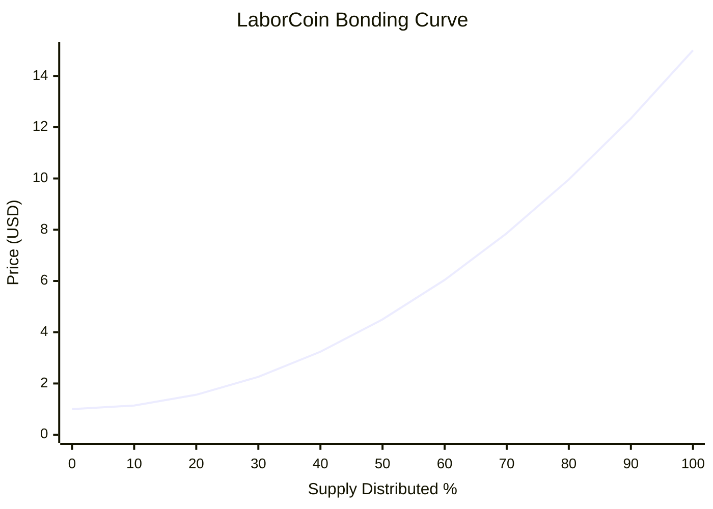

Several observations emerge:

* Early distribution remains relatively accessible.
* Mid-distribution reflects gradual scarcity growth.
* Final distribution stages experience the strongest price acceleration.
* Scarcity emerges progressively rather than abruptly.

---

## G.9 Oracle Conversion Layer

The bonding curve is denominated in USD.

However, transactions occur in POL.

The exchange therefore converts the USD curve price into POL using the Chainlink POL/USD oracle.

Conceptually:

[
Price_{POL}
===========

\frac{Price_{USD}}{POL_{USD}}
]

This approach provides:

* Stable pricing logic
* Automatic adaptation to market conditions
* Consistent economic behavior

without hardcoding POL values directly into the protocol.

---

## G.10 Deterministic Pricing

The bonding curve possesses an important property:

**Determinism.**

Given:

* Current distributed supply
* Current Chainlink oracle value

every participant can independently calculate:

* Current buy price
* Current sell price
* Future theoretical prices

No administrator, governance participant, or external actor determines exchange pricing.

The price is derived entirely from protocol state and publicly available oracle data.

---

## G.11 Economic Design Considerations

The curve was designed to support several objectives simultaneously:

### Broad Distribution

Lower early prices encourage wider participation.

### Treasury Growth

Exchange activity contributes resources to the treasury.

### Governance Expansion

Distribution increases the pool of potential governance participants.

### Long-Term Sustainability

Progressive scarcity discourages immediate concentration.

### Transparency

Future pricing behavior can be modeled and audited.

The curve therefore functions as a distribution mechanism rather than a speculative instrument.

---

## G.12 Relationship to the LaborCoin Protocol

The bonding curve is not an isolated financial mechanism.

It serves as the economic entry layer of the LaborCoin ecosystem.

The exchange:

* Distributes LABR
* Funds treasury growth
* Supports governance onboarding
* Provides continuous liquidity

Without distribution, governance participation cannot expand.

Without treasury growth, governance decisions cannot allocate meaningful resources.

The bonding curve therefore serves as the foundation of the protocol's economic layer.

---

## G.13 Summary

The LaborCoin Exchange implements a deterministic quadratic bonding curve defined by:

[
P(x)=1+14x^2
]

with prices ranging from:

[
$1
]

to

[
$15
]

across the full distribution of one billion LABR.

The curve is denominated in USD, converted to POL through the Chainlink POL/USD oracle, and implemented directly within the Exchange V4 smart contract.

Its purpose is to support transparent distribution, progressive scarcity, treasury growth, and long-term protocol sustainability while remaining simple enough to be independently audited and understood by participants.

---

# Appendix H: Economic Flows and Treasury Architecture

## H.1 Introduction

The LaborCoin protocol consists of four interconnected economic systems:

1. LABR Distribution
2. Treasury Accumulation
3. Governance Allocation
4. Treasury Execution

Together, these systems create a continuous flow from economic participation to collective decision-making and ultimately to resource distribution.

---

## H.2 Buy-Side Economic Flow

When a participant purchases LABR through the exchange, POL is routed according to protocol rules.

Figure 5. Buy-Side Economic Flow.
Illustrates the movement of POL through the exchange and the distribution of purchased LABR.

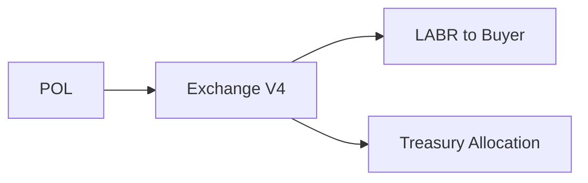

---

## H.3 Transfer Tax Flow

LABR sell transactions through designated automated-market-maker paths contribute to ecosystem sustainability under the configured token tax structure.

Current tax structure:

| Destination      | Tax |
| ---------------- | --: |
| Treasury         |  5% |
| Holder Dividends |  5% |
| Burn             |  0% |

Total Configured Sell Tax:

10%

---

## H.4 Treasury Accumulation Flow

Treasury growth originates from protocol activity.

Figure 6. Treasury Accumulation Flow.
Sources of treasury growth within the LaborCoin ecosystem.

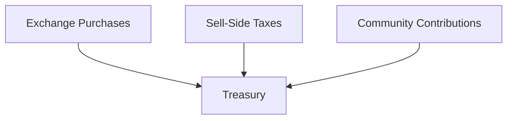
---

## H.5 Governance Allocation Flow

Treasury resources cannot be distributed arbitrarily.

Resources move through governance approval.

Figure 7. Governance Allocation Flow.

Illustrates the governance approval process required before treasury resources may be distributed.

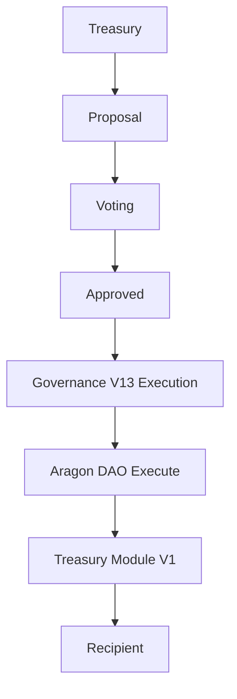
---

## H.6 Treasury Protection Layers

Treasury allocations remain constrained by multiple protocol safeguards.

Table 5. Treasury Protection Layers

Summary of governance safeguards and treasury allocation constraints that protect protocol funds while preserving decentralized decision-making.

| Control                 |  Value |
| ----------------------- | -----: |
| Participation Threshold |    25% |
| Approval Threshold      |    67% |
| Treasury Allocation Cap |     5% |
| Execution Window        | 7 Days |

These protections reduce the risk of treasury misuse while preserving governance flexibility.

---

## H.7 Economic Flow Summary

The complete economic cycle may be summarized as follows:

Figure 8. Economic Flow Summary.
Illustrates the complete circulation of resources through the protocol.

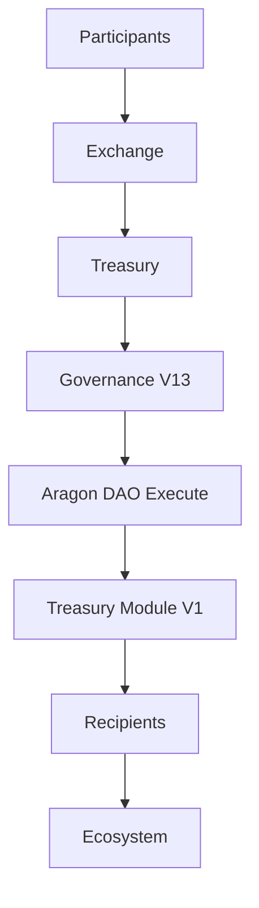
The result is a self-contained cycle connecting economic participation to collective resource allocation.

---

# Appendix I: Economic Scale Analysis

## I.1 Introduction

The bonding curve allows the theoretical economic scale of the protocol to be modeled mathematically.

This appendix is illustrative only.

It is not a prediction.

It is not financial advice.

It is simply the mathematical consequence of the deployed bonding curve.

---

## I.2 Bonding Curve Formula

[
P(x)=1+14x^2
]

where:

[
x=\frac{Distributed}{1,000,000,000}
]

---

## I.3 Distribution Milestones

| Supply Distributed |  Price |
| ------------------ | -----: |
| 100M               |  $1.14 |
| 250M               |  $1.875|
| 500M               |  $4.50 |
| 750M               |  $8.875|
| 1B                 | $15.00 |

Table 6. Distribution Milestones.

---

## I.4 Theoretical Economic Scale

Table 7. Theoretical Economic Scale

Using:

[
Value = Price \times Distributed
]

selected milestones produce:

| Distributed |  Price | Implied Value |
| ----------- | -----: | ------------: |
| 100M        |  $1.14 |         $114M |
| 250M        |  $1.88 |         $469M |
| 500M        |  $4.50 |        $2.25B |
| 750M        |  $8.88 |        $6.66B |
| 1B          | $15.00 |        $15.0B |

### Visualization

---

## I.5 Interpretation

Several observations emerge.

### Early Distribution

Price remains relatively accessible.

### Mid Distribution

Economic scale grows rapidly.

### Late Distribution

Scarcity becomes increasingly significant.

### Full Distribution

The curve reaches its designed terminal value of:

[
$15
]

per LABR.

This behavior reflects the protocol's objective of balancing accessibility with long-term scarcity.

---

## I.6 Treasury Implications

Treasury growth is not directly determined by the bonding curve.

Treasury size depends upon:

* Participation
* Buy volume
* Transfer volume
* Governance spending

Consequently, no deterministic treasury balance projection exists.

The protocol therefore models treasury inflows rather than treasury balances.

Figure 9. Economic Scale Analysis.

Illustrative treasury growth scenarios under increasing ecosystem participation. Not drawn to scale and not a forecast.

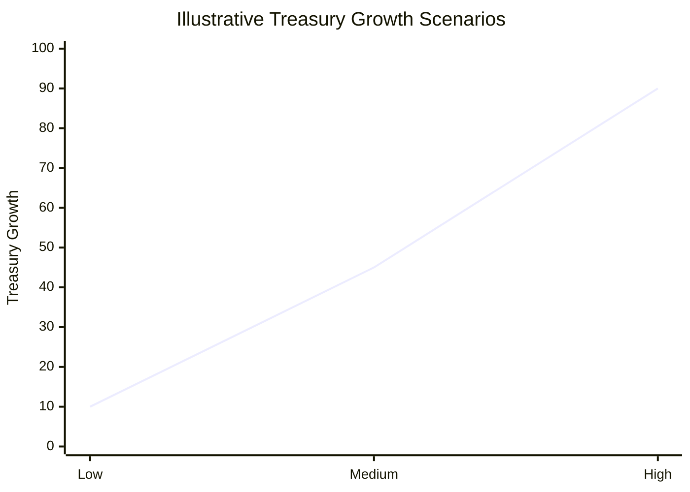

---

# Appendix J: State Transition Diagrams

## J.1 Registration Lifecycle

Figure 10. Registration Lifecycle.
Verification and registration process required for governance participation.

```mermaid
flowchart TD

    Start[Start]

    Start --> Unregistered[Unregistered]
    Unregistered --> PassportVerified[Passport Verified]
    PassportVerified --> Authorized[Authorized]
    Authorized --> Registered[Registered]
    Registered --> LABRVIssued[LABRV Issued]
    LABRVIssued --> GovernanceEligible[Governance Eligible]
```

---

## J.2 Proposal Lifecycle

Figure 11. Proposal Lifecycle.
State transition model governing proposals.

```mermaid
flowchart TD

    Start[Start]

    Start --> Draft[Draft]
    Draft --> ActiveVoting[Active Voting]

    ActiveVoting --> Rejected[Rejected]
    ActiveVoting --> Approved[Approved]

    Approved --> Executable[Executable]

    Executable --> Executed[Executed]
    Executable --> Expired[Expired]
```

---


## J.3 Treasury Execution Lifecycle

Figure 12. Treasury Execution Lifecycle.
Flow of resources from treasury accumulation through governance-approved allocation.

```mermaid
graph TD

Revenue[Exchange Revenue]
--> Treasury[Aragon DAO Treasury]
--> Approval[Governance Approval]
--> Governance[Governance V13 Execution]
--> DAO[Aragon DAO Execute]
--> Module[Treasury Module V1]
--> Distribution[Recipient Distribution]
```
---

# Appendix K: Glossary

## LABR

LaborCoin utility token used for economic participation.

---

## LABRV

Non-transferable governance token granting voting rights.

---

## Treasury

Protocol-controlled pool of resources accumulated through ecosystem activity.

---

## Treasury Module

Execution contract responsible for carrying out approved treasury transfers.

---

## Governance

The process through which LABRV holders approve or reject treasury allocations.

---

## Passport

Gitcoin Passport identity system used to support Sybil resistance.

---

## Verifier

Authorized signing address that confirms registration eligibility.

---

## Proposal

A governance request seeking treasury allocation.

---

## Participation Threshold

Minimum voter turnout required for proposal validity.

Current value:

[
25%
]

---

## Approval Threshold

Minimum support required for proposal approval.

Current value:

[
67%
]

---

## Execution Window

Period during which approved proposals may be executed.

Current value:

[
7\ Days
]

---

# Appendix L: Protocol Constants Reference

## L.1 Purpose

This appendix consolidates the deployed operational parameters of the LaborCoin protocol into a single technical reference and identifies where enforcement occurs.

The purpose is to provide auditors, developers, governance participants, and future researchers with a concise registry of protocol constants.

---

## L.2 LABR Token Constants

Table 8. LABR Token Constants.

Deployed LABR parameters. LABR remains DAO-owned, and owner-only configuration functions remain present in the token contract.

| Parameter                |         Value |
| ------------------------ | ------------: |
| Name                     |     LaborCoin |
| Symbol                   |          LABR |
| Maximum Supply           | 1,000,000,000 |
| Initial Exchange Tranche |   100,000,000 |
| Subsequent Tranche Size  |    50,000,000 |
| Maximum Wallet (Token)   |     1,000,000 |
| Max. Transaction (Token) |       500,000 |

---

## L.3 Exchange Constants

Table 9. Exchange Constants.

Fixed on-chain parameters governing ownerless Exchange V4.

| Parameter                  |      Value |
| -------------------------- | ---------: |
| Minimum Price              |         $1 |
| Maximum Price              |        $15 |
| Curve Type                 |  Quadratic |
| Cooldown                   |   12 Hours |
| Oracle Freshness Window    | 30 Minutes |
| Maximum Oracle Price Check |    100 POL |
| Maximum Exchange Wallet    |     10,000 |
| Max. Exchange Transaction  |      5,000 |

---

## L.4 Treasury Constants

Table 10. Treasury Constants.

Treasury accumulation and allocation constraints enforced by protocol rules.

| Parameter                   | Value |
| --------------------------- | ----: |
| Buy Treasury Contribution   |   10% |
| Treasury Tax                |    5% |
| Dividend Tax                |    5% |
| Burn Tax                    |    0% |
| Maximum Proposal Allocation |    5% |

---

## L.5 Governance Constants

Table 11. Governance Constants.

Voting thresholds and proposal execution requirements.

| Parameter               |   Value |
| ----------------------- | ------: |
| Voting Duration         | 14 Days |
| Participation Threshold |     25% |
| Approval Threshold      |     67% |
| Execution Window        |  7 Days |

---

## L.6 Registration Constants

Table 12. Registration Constants.

Identity verification and LABRV issuance requirements.

| Parameter              |      Value |
| ---------------------- | ---------: |
| Minimum LABR Required  |          1 |
| Published Verifier Policy Threshold | 15 |
| LABRV Issued           |          1 |
| Duplicate Registration | Prohibited |

---

## L.7 Governance Token Constants

Table 13. Governance Token (LABRV) Constants.

Core parameters governing LaborVote V7 after permanent minter lock and ownership renouncement.

| Parameter         |     Value |
| ----------------- | --------: |
| Name              | LaborVote |
| Symbol            |     LABRV |
| Transferability   |  Disabled |
| Governance Weight |    1 Vote |
| Tradable          |        No |
| Soulbound         |       Yes |

---

# Appendix M: Security Controls Matrix

## M.1 Purpose

Table 14. Security Controls Matrix.

This appendix summarizes protocol security controls in a format commonly used by auditors and reviewers.

---

| Threat                    | Security Control                | Layer        |
| ------------------------- | ------------------------------- | ------------ |
| Duplicate Identities      | Passport Threshold              | Registration |
| Duplicate Registration    | LABRV Ownership Check           | Registration |
| Unauthorized Registration | Verifier Signature              | Registration |
| Registration Replay       | Address Binding + Expiry + Registered State | Registration |
| Governance Signature Reuse | Nonce + Expiration Validation | Governance |
| Verifier Compromise       | Limited Signing Role + On-Chain Checks | Identity |
| Governance Capture        | Soulbound LABRV                 | Governance   |
| Low Participation         | 25% Threshold                   | Governance   |
| Minority Control          | 67% Approval Requirement        | Governance   |
| Treasury Extraction       | 5% Cap                          | Treasury     |
| Stale Proposal Execution  | 7-Day Window                    | Treasury     |
| Double Execution          | Execution Tracking              | Governance   |
| Flash Trading             | 12-Hour Cooldown                | Exchange     |
| Reentrancy                | ReentrancyGuard                 | Exchange     |
| Oracle Failure            | Freshness Validation            | Exchange     |
| Oracle Anomaly            | Maximum Price Validation        | Exchange     |
| Creator or Permission Abuse | Ownerless Contracts + Locked Minter + DAO Permission Audit | Protocol |
| Governance Overreach      | Fixed Constitutional Parameters | Protocol     |

---

## M.2 Defense-in-Depth Philosophy

LaborCoin intentionally utilizes overlapping protections.

For example:

Governance legitimacy depends simultaneously upon:

* Passport verification
* Registration
* LABRV issuance
* Participation thresholds
* Approval thresholds

No individual control is expected to provide complete security.

The protocol instead relies upon multiple independent safeguards.

---

# Appendix N: Decentralization Status Summary

## N.1 Protocol Information

Protocol:

LaborCoin

Network:

Polygon Mainnet (Chain ID 137)

Final Contract Deployment Period:

April 2, 2025 through June 25, 2026

---

## N.2 Contract Authority Summary

| Component | Final Authority State |
|---|---|
| LABR Token | Owned by Aragon DAO |
| LaborVote (LABRV) V7 | Ownership renounced; Registration V4 minter permanently locked |
| LaborCoin Registration V4 | No owner; fixed verifier and token dependencies |
| LaborCoin Governance V13 | No owner; fixed dependencies and governance constants |
| LaborCoin Treasury Module V1 | No owner; DAO-only caller |
| LaborCoin Exchange V4 | No owner or administrative interface |
| Aragon DAO Treasury | Controlled through Aragon permissions and constrained Governance V13 execution |
| Verifier | External fixed signing address |

---

## N.3 Evidence and Provenance

The separate launch provenance report should contain:

* Deployment transaction hashes
* Source-verification links
* Constructor arguments
* LABRV minter-set transaction
* LABRV minter-lock and ownership-renouncement transaction
* LABR ownership-transfer record
* Final Aragon permission grants and revocations
* Removal of obsolete governance, treasury-module, and executor permissions
* Final artifact hashes

Keeping transaction-level evidence in a dedicated provenance report avoids duplicating an incomplete transaction registry inside the whitepaper.

---

## N.4 Final Authority Diagram

Figure 14. Post-Finalization Authority Structure.

```mermaid
flowchart TD
    Creator[Creator Ownership] --> Removed[Removed from Final Custom Contracts]
    Verifier[Fixed Verifier] --> Registration[Registration V4]
    Verifier --> Governance[Governance V13]
    Registration --> LABRV[LaborVote V7]
    Participants[Registered LABRV Participants] --> Governance
    Governance --> DAO[Aragon DAO Treasury]
    DAO --> Module[Treasury Module V1]
    Module --> Recipients[Approved Recipients]
    DAO --> LABR[LABR Ownership]
    Exchange[Exchange V4] --> Fixed[Ownerless Fixed Contract]
```

---

## N.5 Public Declaration

The final launch declaration should confirm:

* Final contracts deployed and source-verified
* LaborVote V7 minter locked and ownership renounced
* LABR ownership held by the DAO
* Final Aragon permission registry published
* Validation report published
* Whitepaper and deployment artifacts hashed

# Appendix O: Launch Validation Evidence Register

## O.1 Purpose

This appendix identifies the evidence required for the final launch validation report. It does not substitute deployment status or source verification for transaction-level testing.

---

## O.2 Exchange Evidence

| Test | Evidence Status |
|---|---|
| Buy | Cite final-deployment transaction or reproducible test |
| Sell | Cite final-deployment transaction or reproducible test |
| Treasury routing | Cite final-deployment transaction |
| Oracle pricing | Record observed input and calculated output |
| Cooldown | Record success and expected-revert cases |
| Wallet and transaction limits | Record boundary tests |
| Tranche behavior | Record state transition or reproducible test |

---

## O.3 Registration and LaborVote Evidence

| Test | Evidence Status |
|---|---|
| Valid registration authorization | Cite transaction |
| Invalid or expired authorization | Record expected-revert test |
| Minimum LABR requirement | Record boundary test |
| LABRV mint | Cite transaction |
| Duplicate prevention | Record expected-revert test |
| Non-transferability | Record expected-revert test |
| Self-delegation | Cite transaction or checkpoint result |
| Minter lock and ownership renouncement | Cite final transactions |

---

## O.4 Governance Evidence

| Test | Evidence Status |
|---|---|
| Proposal creation | Cite final-deployment transaction |
| Proposal authorization nonce and expiry | Record success and expected-revert cases |
| Voting | Cite final-deployment transaction |
| Vote authorization nonce and expiry | Record success and expected-revert cases |
| Duplicate-vote prevention | Record expected-revert test |
| Participation and approval calculations | Record proposal state and totals |
| Execution window | Cite full-lifecycle evidence or qualify prior-environment testing |
| Double-execution prevention | Record expected-revert test |

---

## O.5 Treasury and Permission Evidence

| Test | Evidence Status |
|---|---|
| Governance V13 DAO execution permission | Cite Aragon permission record |
| Treasury Module V1 DAO-only restriction | Verify deployed source and expected-revert test |
| Recipient transfer | Cite execution transaction |
| Distribution accounting | Record pre- and post-state |
| Treasury cap | Record boundary test |
| Obsolete executor revocations | Cite revocation transactions |
| Final Aragon permission registry | Publish complete registry |

---

## O.6 Publication Sign-Off

The final launch report should state the validation date, protocol version, evidence references, unresolved limitations, final permission state, and hashes of the frozen publication artifacts.

# References

* Polygon Mainnet
* Chainlink Oracle Documentation
* Gitcoin Passport Documentation
* OpenZeppelin Contracts
* OpenZeppelin Ownable
* OpenZeppelin ERC20
* OpenZeppelin ERC20Votes
* Aragon OSx Documentation
* LaborCoin Smart Contracts

---

# End of Document
