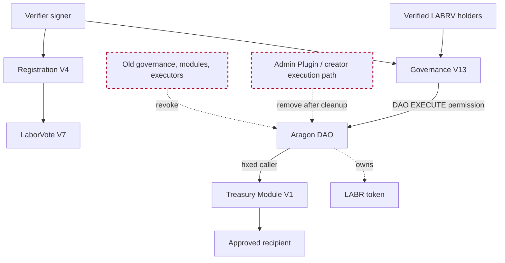

# LaborCoin Launch Provenance and Security Audit

**Version:** 2.0-pre-revocation  
**Review date:** July 2, 2026  
**Network:** Polygon Mainnet, Chain ID 137  
**Status:** **NOT APPROVED FOR IMMUTABLE LAUNCH**  
**Review type:** Internal provenance, authority, configuration, and source review

> This is an internal evidence-based review. It is not a substitute for an independent third-party smart-contract audit. A finding is marked complete only when the relevant transaction and current on-chain post-state are recorded.

---

## 1. Executive conclusion

The supplied records are sufficient to establish the principal deployment history, identify the current core contracts, document the retirement of Exchanges V2 through V4, reconstruct the historical Aragon permission activity, and prepare a controlled permission-cleanup plan.

The system is **not ready for irreversible authority removal** yet. The following stop conditions remain:

1. **Twenty-one permission tuples are candidate-active from the supplied event history and require current `isGranted` checks.**
2. **Only Governance V13 is expected to retain DAO `EXECUTE_PERMISSION_ID` in the final custom authority graph.**
3. **Treasury Module V1 does not require DAO execute permission and should not retain it.**
4. **The Aragon Admin Plugin or any equivalent direct-execution path must remain available until all token configuration and obsolete-permission cleanup is complete, then be removed last.**
5. **LABR ownership by the DAO still needs a self-contained transaction and post-state record.**
6. **All retired exchange token settings must be audited. Reversible obsolete AMM, fee, limit, and trading exemptions must be removed; any irreversible dividend exclusion must be documented as permanent but inert.**
7. **No active successor exchange is identified in the supplied final-launch records. Exchange V4 is retired.**
8. **Seventy-five deployer-created contracts remain unclassified. Eighteen addresses appearing in the candidate-active permission set are present in the deployment inventory and receive priority review.**

Do not revoke the final administrative execution path until the pre-revocation sequence in Section 12 is complete. Removing it too early could permanently prevent correction of LABR owner-controlled settings.

---

## 2. Audit package

| File | Purpose |
|---|---|
| [`provenance-security-audit.md`](provenance-security-audit.md) | Main conclusions, authority model, source review, and launch blockers |
| [`aragon-permission-audit.md`](aragon-permission-audit.md) | Complete supplied permission-event ledger, candidate-active tuples, and corrected disposition plan |
| [`deployment-provenance-inventory.md`](deployment-provenance-inventory.md) | All 85 deployer-created contract candidates and classification status |
| [`exchange-retirement-audit.md`](exchange-retirement-audit.md) | Exchange V2–V4 recovery, residual balances, DAO transfers, and cleanup requirements |
| [`revocation-plan.csv`](revocation-plan.csv) | Machine-readable corrected candidate disposition plan |
| [`deployment-provenance-inventory.csv`](deployment-provenance-inventory.csv) | Machine-readable deployment inventory |
| [`evidence/`](evidence/) | Unmodified supplied source CSV and Markdown evidence |

---

## 3. Scope and limitations

### Included

- Current documented LaborCoin contract identities and deployment provenance
- Solidity authority and mutability review of the repository contracts
- LABRV minter and ownership finalization
- Registration and governance signature design
- Aragon permission history supplied in the audit export
- Exchange V2, V3, and V4 retirement and LABR recovery
- Deployer-created contract inventory
- Required pre-revocation and post-revocation evidence
- Front-end and external-dependency launch checks

### Not independently completed

- Live RPC reads of every permission tuple
- Live balances for every protocol and historical address
- Full bytecode equivalence for all 85 deployment candidates
- Identification of all 75 unclassified deployments
- Full LABR owner-transfer transaction evidence
- Current LABR AMM, fee, limit, trading, and dividend-exclusion state
- Security review of an active successor exchange
- Independent professional audit, formal verification, or economic simulation

---

## 4. Audit status

| Category | Status | Result |
|---|---|---|
| Current contract inventory | Substantially complete | Core addresses identified; no active successor exchange recorded |
| Source and artifact provenance | Substantially complete | Source and artifact hashes exist in deployment records |
| LABRV ownership/minter finalization | Complete in records; getter confirmation recommended | Registration V4 assigned, minter locked, ownership renounced |
| LABR ownership | Evidence pending | Expected owner is DAO; transaction and live owner getter must be archived |
| Aragon permission history | Extracted | 45 events parsed |
| Current Aragon permission state | **Incomplete** | 21 candidate-active tuples require `isGranted` confirmation |
| Required revocations | Planned | 19 revoke candidates, 1 intended retain, 1 investigate |
| Exchange retirement | Documented | V2–V4 retired; dust recorded |
| Token exemption cleanup | **Incomplete** | Current on-chain state not supplied |
| Deployment history | Inventoried | 85 candidates, 75 unclassified |
| Treasury provenance | Partial | Known exchange deposits and salvage transfers recorded |
| Asset balances | **Incomplete** | Current balances must be captured immediately before finalization |
| Front-end audit | Partial | Prior functional tests exist; successor exchange integration not in scope |
| Adversarial review | Internal review completed | Findings remain open |
| Immutable launch approval | **Blocked** | Do not finalize permissions yet |

---

## 5. Authoritative contract and authority inventory

| Component | Address | Documented authority state | Current audit status |
|---|---|---|---|
| LABR token | `0x460DD873A1D2a41e77410B125cD3027C5FEd2f78` | Owner expected to be Aragon DAO; owner retains powerful token-management functions | **Verify live owner and transfer evidence** |
| Aragon DAO / treasury | `0x0C2e5679153593b82a84eAB5CA90895BB291Cec4` | Holds treasury assets and expected LABR ownership | Verify permission registry and balances |
| Aragon Admin Plugin | `0xB51Bf5812Fd8FF0c3F1A1AB1e8F24426d497D5CF` | Direct proposal/execution mechanism used for permission changes | **Authority unresolved; remove last** |
| LaborVote V7 | `0x833242E933c675846D8f8982048FecA95B8e435A` | Registration V4 is permanent minter; ownership renounced; non-transferable | Recorded complete |
| Registration V4 | `0xd1CD6C0B6f1F709A52908B40C07D3C54649e323C` | No owner or setters; fixed LABR, LABRV, verifier | Recorded immutable |
| Governance V13 | `0x8238105d31F6Bb26897d8Ab270a0A521FEF03E8c` | No owner or setters; fixed DAO, LABRV, verifier, registration, treasury module | Intended sole final custom DAO executor |
| Treasury Module V1 | `0x10F2798ef055950B897AF4B3A8ae90dE34f6C56C` | No owner; immutable DAO-only caller | Current module; DAO execute permission unnecessary |
| Superseded Treasury Module | `0x0B018E45E4cB71E222C345a5341BdbaeE519c623` | Historical deployment | Revoke any remaining permission |
| Verifier signer | `0x475d519631d2406753aCA29F305f19b83E97513e` | Signs registration and governance authorizations | Operational security and availability dependency |
| Chainlink POL/USD feed | `0xAB594600376Ec9fD91F8e885dADF0CE036862dE0` | External oracle dependency used by retired exchanges and any compatible successor | Verify successor configuration separately |
| Exchange V2 | `0xD0692ec758bb852421B702B187b6439f74f8Bf3b` | Retired | No authority; token cleanup pending |
| Exchange V3 | `0xE57ba76AED1B7B4142E3DfaBd6cf3E94970b86eA` | Retired | No authority; token cleanup pending |
| Exchange V4 | `0x4Cf18cB39203B678f5C26f2338a10a79f9684749` | Retired | No authority; token cleanup pending |
| Active final exchange | **Not recorded** | None in supplied release package | **Launch blocker** |

---

## 6. Final intended authority graph



### Required final permission principles

- Governance V13 retains DAO `EXECUTE_PERMISSION_ID`.
- Treasury Module V1 does **not** retain DAO `EXECUTE_PERMISSION_ID`.
- No retired governance contract, treasury module, executor, exchange, creator wallet, or test contract retains DAO execution authority.
- The DAO itself retains the permission-manager root authority required by Aragon’s architecture.
- The Admin Plugin and its administrator lose direct-execution authority only after every required cleanup action is complete.
- LABR owner-only functions become practically immutable when the DAO has no arbitrary executor capable of calling them.

---

## 7. Primary findings

### F-01 — Candidate stale DAO permissions

**Severity:** Critical  
**Status:** Open

The supplied permission history contains 45 grant/revoke events and reconstructs 21 candidate-active tuples. This is historical reconstruction, not current-state proof.

Corrected planned disposition:

| Disposition | Count |
|---|---:|
| Retain | 1 |
| Revoke after live confirmation | 19 |
| Investigate before deciding | 1 |

The intended retain is Governance V13 holding DAO `EXECUTE_PERMISSION_ID`. Full details are in [`aragon-permission-audit.md`](aragon-permission-audit.md).

### F-02 — Admin Plugin is both the cleanup tool and a central control path

**Severity:** Critical  
**Status:** Open

An Aragon Admin Plugin can directly execute DAO actions when the plugin holds DAO execute authority and an administrator holds the plugin’s execution permission. This path is necessary to finish cleanup, but leaving it after launch would defeat the intended constrained governance model.

**Required action:** Identify the live Admin Plugin permission chain, use it for all required finalization, verify Governance V13 remains functional, then remove or revoke the Admin path last.

### F-03 — LABR owner authority amplifies every DAO permission error

**Severity:** Critical  
**Status:** Open

The LABR source retains owner-only capabilities including pause/unpause, blacklist management, fee configuration, tax-recipient configuration, AMM configuration, limits, trading restrictions, token recovery, and router-related configuration. The documentation states that the DAO is the final owner, but the ownership transaction and live owner getter remain incomplete in the supplied evidence.

Any address capable of causing arbitrary DAO execution could potentially cause the DAO to exercise those owner powers. Permission cleanup is therefore not cosmetic; it is the mechanism that makes token configuration effectively immutable.

### F-04 — No active successor exchange is in the audited package

**Severity:** High  
**Status:** Open

Exchange V4 has been retired and its residual LABR recorded. No deployed successor is identified in the supplied release records. The active exchange must receive a separate source, configuration, permission, funding, limits, verifier, and adversarial review before launch approval.

### F-05 — Retired exchange token exemptions remain unproven

**Severity:** High  
**Status:** Open

The supplied evidence identifies Exchanges V2, V3, and V4 as cleanup candidates. Their LABR recovery is complete to dust, but current AMM, fee, limit, trading-restriction, and dividend-exclusion status has not been captured.

**Required action:** While the DAO can still exercise LABR owner functions, record every relevant getter for all three addresses. Remove each reversible obsolete setting and record the post-state. If the dividend tracker does not permit re-inclusion, document the exclusion as irreversible and operationally inert rather than claiming it was removed.

### F-06 — Verifier is an immutable liveness dependency

**Severity:** High  
**Status:** Accepted only with explicit operational plan

Registration V4 requires a verifier signature. Governance V13 also requires verifier signatures for proposal creation and voting. If the verifier key or service becomes unavailable, new registration and governance participation can stop. Because the verifier address is fixed and there is no replacement function, this is a permanent liveness dependency.

**Required evidence before launch:**

- Key custody and backup procedure
- Offline recovery signing procedure
- Service rebuild instructions
- Exact message encodings
- Monitoring for signature failures
- Public disclosure that the verifier affects availability

### F-07 — Registration signatures lack contract and chain domain separation

**Severity:** Medium  
**Status:** Architectural limitation

Registration V4 signs `keccak256(abi.encode(user, expiry))`. The message does not include the registration contract address or chain ID. A valid signature can therefore be reused against another compatible contract using the same verifier.

Impact on the final LABRV token is constrained because:

- `msg.sender` is bound into the signed message;
- the final Registration V4 prevents repeat registration;
- LaborVote V7 permanently recognizes only the final Registration V4 as minter.

The limitation cannot be corrected in the deployed immutable Registration V4.

### F-08 — Governance vote authorization is not proposal-bound

**Severity:** Medium  
**Status:** Architectural limitation

Governance V13 signs the user, action type, nonce, expiry, and governance contract address. A vote signature does not include `proposalId`. The signature authorizes a yes or no action for the user and nonce, rather than a vote on one specific proposal.

The transaction still comes from the signed wallet and the nonce prevents replay, but proposal-specific authorization would have provided stronger intent binding. This cannot be corrected in deployed Governance V13.

### F-09 — Governance participation denominator is not snapshotted

**Severity:** Medium  
**Status:** Architectural limitation

`proposalPassed` compares votes with the current `registration.totalMembers()`. Registrations occurring after proposal creation can increase the participation denominator and make an otherwise passing proposal fail. This is a governance-liveness and predictability risk rather than a direct treasury-drain path.

### F-10 — Historical deployment classification is incomplete

**Severity:** Medium  
**Status:** Open

The supplied deployer export contains 85 contract deployments. Ten have been identified as current or known historical components; 75 remain unclassified. Eighteen candidate-active permission holders are also present in this deployment list and require priority identification.

A historical contract that has no ownership, token role, balance, or permission is not itself a launch risk. Classification is required to prove that condition.

### F-11 — Treasury Module V1 was unnecessarily granted DAO execute authority

**Severity:** Low by itself; High as a least-privilege defect  
**Status:** Open

The current Treasury Module accepts transfers only when called by the DAO. Its code contains no path that calls `DAO.execute`. It therefore does not need DAO `EXECUTE_PERMISSION_ID`.

The grant should be revoked after live confirmation. The module will continue to work because Governance V13 causes the DAO to call the module.

### F-12 — Retired exchange dust is documented and not recoverable through administration

**Severity:** Informational  
**Status:** Accepted

| Exchange | Residual LABR |
|---|---:|
| V2 | `0.0002534` |
| V3 | `0.0098180577244` |
| V4 | `0.00184357529635` |

The dust is economically negligible. Recovery was performed through public buys because the retired exchanges do not expose administrative LABR withdrawal functions.

---

## 8. Contract-by-contract source review

### 8.1 LaborVote V7

**Positive controls**

- Only the fixed `minter` can mint.
- Minting rejects the zero address and wallets already holding LABRV.
- Ordinary transfers revert.
- `lockMinter()` permanently locks the minter and renounces ownership.

**Required confirmation**

- `minter() == 0xd1CD6C0B6f1F709A52908B40C07D3C54649e323C`
- `minterLocked() == true`
- `owner() == 0x0000000000000000000000000000000000000000`

### 8.2 Registration V4

**Positive controls**

- Requires at least 1 LABR.
- Requires a verifier signature and unexpired timestamp.
- Binds the authorization to `msg.sender`.
- Sets registration state before calling LABRV mint.
- Has no owner, setters, proxy, or upgrade path.

**Residual risks**

- Fixed verifier availability.
- Signature domain separation limitation described in F-07.
- Passport policy is enforced through the verifier signing service, not read directly from an on-chain Passport contract.

### 8.3 Governance V13

**Positive controls**

- Requires LABRV for proposal creation and voting.
- Uses per-wallet nonces and expiries.
- Prevents duplicate votes.
- Requires 50 registered participants before execution.
- Applies 25% participation and 67% approval requirements.
- Uses a 14-day vote and 7-day execution window.
- Caps each execution at 5% of the DAO’s current POL balance.
- Marks execution before the external DAO call and uses `nonReentrant`.
- Constructs one fixed action to the immutable Treasury Module.

**Residual risks**

- Fixed verifier liveness dependency.
- Vote signatures are not proposal-bound.
- Membership denominator is not snapshotted.
- Governance becomes unusable if the verifier is permanently lost.

### 8.4 Treasury Module V1

**Positive controls**

- Immutable DAO caller.
- No owner, setter, upgrade path, or withdrawal administrator.
- Rejects the zero recipient and zero-value calls.
- Recipient reentry cannot satisfy `onlyDAO`.

**Permission conclusion**

- The module must be callable **by** the DAO.
- The module does not need permission to execute **on** the DAO.

### 8.5 LABR token

**Security significance**

The token retains extensive owner-only configuration. Final immutability depends on:

1. the DAO being the owner;
2. all desired token configuration being finalized;
3. only constrained Governance V13 retaining DAO execution authority;
4. every arbitrary Admin/plugin/creator execution path being removed.

### 8.6 Exchanges V2–V4

All three are retired. Their source or continued existence does not create governance authority, but token exemptions, residual POL, and user confusion remain relevant. The retirement record is in [`exchange-retirement-audit.md`](exchange-retirement-audit.md).

---

## 9. Adversarial review matrix

| Threat | Assessment | Required action |
|---|---|---|
| Reentrancy | Governance is guarded; Treasury Module caller restriction blocks recipient reentry; retired exchanges use guard | Retest successor exchange |
| Oracle manipulation/staleness | V4 checks positive price, 30-minute freshness, and POL price ceiling | Audit successor oracle logic separately |
| Governance capture | One LABRV per registered wallet reduces transferable vote capture | Finish verifier and permission review |
| Replay attacks | Nonces/expiry protect governance; registration blocks repeat registration | Document domain-separation limitations |
| Signature forgery | ECDSA recovery to fixed verifier | Protect verifier key and publish message schema |
| Permission escalation | **Primary open risk** | Complete permission audit and remove Admin last |
| Treasury drain | Governance action target is fixed to Treasury Module and capped | Confirm only Governance V13 can execute DAO actions |
| Flash loans | LABRV is non-transferable; governance eligibility cannot be flash-borrowed | Audit successor exchange economics |
| Sandwich/MEV | Relevant to exchange trades | Require slippage protection and successor review |
| Registration bypass | Direct calls still require verifier signature and LABR | Audit signing service policy |
| Wallet/transaction limit bypass | Must be enforced in successor contract, not only UI | Block launch until successor review |
| DAO proposal abuse | Proposal text is not execution authority; fixed action constrains target | Verify front end displays exact recipient/amount |
| Timestamp manipulation | Limited miner influence relative to 14-day/7-day windows | No special action |
| Integer overflow | Solidity 0.8 checked arithmetic | Test boundary conditions |
| External dependency failure | Verifier and oracle are liveness dependencies | Monitoring and recovery procedures |
| Front-end bypass | Expected in public blockchains | Every mandatory restriction must be on-chain |
| Ownership recovery | LABRV ownerless; other custom contracts ownerless; LABR DAO-owned | Record LABR owner post-state |
| Upgrade abuse | Custom contracts are non-upgradeable | Audit Aragon plugin upgrade authority |
| Forgotten permissions | **Open critical finding** | Follow permission annex |
| Forgotten balances | Dust documented; full asset snapshot pending | Capture final balances |
| Denial of service | Verifier loss and dynamic membership denominator are material | Document and accept explicitly |

---

## 10. Required on-chain evidence before revocation

Record each read with block number, UTC timestamp, RPC or explorer source, and result.

### Ownership and fixed relationships

- LABR `owner()`
- LABRV `owner()`, `minter()`, `minterLocked()`
- Registration `LABR()`, `LABRV()`, `verifier()`
- Governance `DAO()`, `LABRV()`, `verifier()`, `treasuryModule()`, `registration()`
- Treasury Module `DAO()`

### Permissions

For every row in [`revocation-plan.csv`](revocation-plan.csv):

```text
isGranted(where, who, permissionId, 0x)
```

Also query explicitly:

- DAO → Governance V13 → `EXECUTE_PERMISSION_ID`
- DAO → Treasury Module V1 → `EXECUTE_PERMISSION_ID`
- DAO → Admin Plugin → `EXECUTE_PERMISSION_ID`
- Admin Plugin → every administrator address → plugin execution permission
- DAO → every retired governance/module/executor → `EXECUTE_PERMISSION_ID`
- Every non-DAO holder of Aragon root permission
- Any installed-plugin upgrade, uninstall, target-config, or metadata authority relevant to final control

### Token configuration

For Exchanges V2, V3, V4, the active successor, DAO, Governance V13, and Treasury Module V1, record all available LABR getters covering:

- AMM designation
- fee exclusion
- limit exclusion
- trading-restriction exclusion
- dividend exclusion
- blacklist status

### Assets

Capture:

- DAO POL and LABR balances
- Each current contract POL and LABR balance
- Each retired exchange POL and LABR balance
- Deployer and recovery-wallet balances when needed to reconcile launch supply
- LABR total supply and dividend tracker balances

---

## 11. Required token and exchange cleanup before authority removal

1. Confirm the correct active successor exchange address.
2. Confirm the successor enforces every mandatory rule on-chain, including identity authorization and the complete bar on official-exchange use by wallets holding more than 10,000 LABR.
3. Fund the successor only after source and constructor verification.
4. Remove Exchanges V2, V3, and V4 from obsolete AMM and exemption settings.
5. Apply only the intentional settings to the successor.
6. Confirm no retired exchange remains linked in the site, ABI files, service worker cache, documentation, or contract map.
7. Record final dust and POL balances.
8. Freeze the evidence before permission removal.

---

## 12. Safe pre-revocation sequence

### Phase A — Preserve evidence

- Commit the audit package before making on-chain changes.
- Export current permission reads and token getters.
- Record DAO, token, and contract balances.
- Record the Admin Plugin and administrator addresses.
- Create a rollback-independent transaction plan. There is no rollback after the final authority path is removed.

### Phase B — Complete all owner-required LABR configuration

- Verify LABR is owned by the DAO.
- Remove all reversible retired-exchange settings and document any irreversible dividend exclusions.
- Configure and verify the active successor exchange.
- Finalize fees, limits, cooldown, trading, AMM, blacklist, router, tax-recipient, and dividend settings.
- Re-read every setting.

### Phase C — Revoke obsolete custom-contract permissions

- Revoke candidate-active permissions only after each live `isGranted` result is recorded.
- Revoke all obsolete governance, module, executor, and test-contract permissions.
- Revoke Treasury Module V1’s unnecessary DAO execute permission.
- Do not revoke Governance V13’s DAO execute permission.

### Phase D — Validate the constrained final path

- Confirm Governance V13 still holds DAO execute permission.
- Execute a controlled end-to-end governance test, preferably with a minimal amount and a clearly identified test recipient if governance activation conditions permit.
- Confirm the DAO called the current Treasury Module.
- Confirm no direct external call can make the module transfer DAO funds.

### Phase E — Remove direct administration last

- Revoke administrator permission on the Admin Plugin.
- Revoke the Admin Plugin’s DAO execute permission or uninstall it using the documented Aragon procedure.
- Revoke any remaining creator-controlled plugin or root authority.
- Confirm no arbitrary executor remains.

### Phase F — Final post-state proof

- Repeat every ownership, permission, token-setting, and balance read.
- Archive revocation transaction hashes and emitted events.
- Update `aragon-permissions.md`, `ownership-transfer.md`, `deployments.md`, and this audit.
- Mark immutable launch approved only after every blocker is closed.

---

## 13. Documentation and front-end audit

| Item | Required result | Status |
|---|---|---|
| Contract map | Shows current contracts and retired exchanges separately | Update after successor deployment |
| Deployment records | Match current addresses and lifecycle state | Substantially complete |
| Release record | Treats V4 as retired, not active | Updated record supplied previously |
| Aragon permissions | Complete grants, revocations, and final reads | **Open** |
| Ownership transfer | LABR transaction and post-state complete | **Open** |
| Website addresses | No retired address used for writes | Verify |
| ABI versions | Match deployed runtime interfaces | Verify |
| Service worker | No retired exchange pages/scripts cached | Verify |
| Verifier service | Exact message schema and production key documented | Verify |
| Whitepaper | Matches successor exchange and final authority graph | Update after successor |
| README | Links to this audit package | Add link |
| Repository spelling | Replace `Provenanance` with `provenance` | Corrected in this package |

---

## 14. Launch approval checklist

- [x] Current non-exchange core contract addresses identified
- [x] Exchange V2–V4 retirement and dust documented
- [x] Permission-event history extracted
- [x] Deployment candidates inventoried
- [ ] All 21 candidate-active permission tuples checked live
- [ ] Nineteen obsolete/unnecessary tuples revoked as applicable
- [ ] Plugin helper tuple classified
- [ ] Governance V13 confirmed as intended final custom DAO executor
- [ ] Treasury Module execute permission removed
- [ ] Admin Plugin authority removed last
- [ ] LABR owner transaction and post-state archived
- [ ] Retired exchange token settings removed
- [ ] Active successor exchange deployed and separately audited
- [ ] Verifier key custody and recovery procedure archived
- [ ] All current balances captured
- [ ] Front end and service worker reference only current contracts
- [ ] Post-revocation functional validation completed
- [ ] Independent external review completed or explicitly waived with public disclosure
- [ ] Immutable launch approved

---

## 15. Final statement

The supplied evidence supports a disciplined finalization process, but it does **not** yet support a claim that LaborCoin is fully decentralized, permission-clean, or ready for irreversible launch.

The controlling priority is:

> Complete every LABR configuration and successor-exchange task first, verify the current permission graph second, revoke obsolete permissions third, prove Governance V13 is the only required custom executor fourth, and remove the Admin Plugin or equivalent creator-controlled execution path last.

Until the post-state evidence is committed, immutable launch approval remains withheld.
