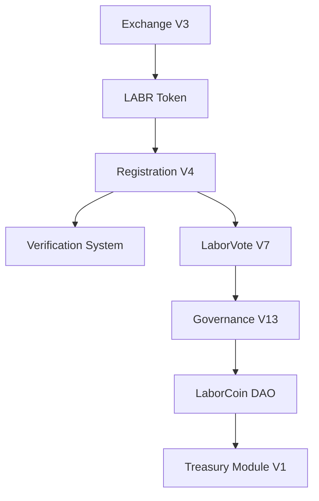

# LaborCoin Contract Map

## Overview

This document describes how the deployed LaborCoin contracts interact and how responsibilities are distributed throughout the protocol.

The LaborCoin architecture separates economic participation, governance participation, registration, treasury custody, treasury execution, and governance decision-making into distinct components.

This separation reduces concentration of authority, improves transparency, and allows each contract to perform a narrowly defined role within the ecosystem.

---

# High-Level Architecture



---

# Contract Relationships

## Exchange V3

Address:

```text
DEPLOYMENT_PENDING
```

Responsibilities:

* Sells LABR through the protocol bonding curve
* Buys LABR through the protocol bonding curve
* Maintains protocol liquidity
* Enforces cooldown periods
* Performs automatic treasury funding
* Manages tranche-based token release

Interacts With:

```text
Exchange V3
    ├── LABR Token
    └── Treasury Funding
```

Notes:

* Uses Chainlink POL/USD pricing data
* Contains no owner controls
* Contains no pause functionality
* Contains no administrative withdrawal mechanisms
* Designed as immutable infrastructure

---

## LABR Token

Address:

```text
DEPLOYMENT_PENDING
```

Responsibilities:

* Economic participation
* Exchange settlement
* Treasury funding
* Protocol utility
* Registration eligibility

Interacts With:

```text
LABR
    ├── Exchange V3
    └── Registration V4
```

Notes:

Registration requires ownership of at least 1 LABR.

LABR provides economic participation but does not provide governance rights by itself.

---

## Registration V4

Address:

```text
DEPLOYMENT_PENDING
```

Responsibilities:

* Governance onboarding
* Membership registration
* Eligibility verification
* Member tracking
* Sequential member numbering
* LABRV issuance

Interacts With:

```text
Registration V4
    ├── LABR Token
    ├── Verification System
    └── LaborVote V7
```

Notes:

Registration verifies eligibility requirements and issues governance rights through LABRV.

Each successful registration receives a permanent member number and registration timestamp.

---

## LaborVote (LABRV) V7

Address:

```text
DEPLOYMENT_PENDING
```

Responsibilities:

* Governance participation
* Voting power representation
* Vote delegation
* Historical vote snapshots

Interacts With:

```text
LaborVote V7
    ├── Registration V4
    └── Governance V13
```

Notes:

* Non-transferable
* One token per registered member
* ERC20Votes compatible
* Cannot be purchased or traded

LABRV exists solely to represent governance participation.

---

## Governance V13

Address:

```text
DEPLOYMENT_PENDING
```

Responsibilities:

* Proposal management
* Voting administration
* Quorum enforcement
* Approval threshold enforcement
* Proposal execution authorization

Interacts With:

```text
Governance V13
    ├── LaborVote V7
    └── LaborCoin DAO
```

Notes:

Governance determines whether treasury proposals succeed or fail according to predefined rules.

Governance cannot modify protocol logic, alter token supply, or control the Exchange.

---

## LaborCoin DAO

Address:

```text
DEPLOYMENT_PENDING
```

Responsibilities:

* Governance authority
* Proposal execution
* Treasury oversight
* Treasury authorization

Interacts With:

```text
LaborCoin DAO
    ├── Governance V13
    └── Treasury Module V1
```

Notes:

The DAO serves as the governance execution layer connecting approved proposals to treasury distributions.

The DAO does not control the Exchange, Registration system, or LABRV token.

---

## Treasury Module V1

Address:

```text
DEPLOYMENT_PENDING
```

Responsibilities:

* Treasury custody
* Treasury accounting
* Governance-approved distributions
* Treasury execution

Interacts With:

```text
Treasury Module V1
    └── Approved Recipients
```

Notes:

The Treasury Module cannot independently initiate transfers.

Funds may only be distributed through governance-approved actions.

All treasury distributions are permanently recorded on-chain.

---

# Governance Flow

```text
Participant
    │
    ▼
Acquire LABR
    │
    ▼
Complete Verification
    │
    ▼
Register Through V4
    │
    ▼
Receive LABRV V7
    │
    ▼
Create / Vote on Proposal
    │
    ▼
Governance V13
    │
    ▼
LaborCoin DAO
    │
    ▼
Treasury Module V1
    │
    ▼
Approved Distribution
```

---

# Treasury Flow

```text
LABR Purchase
        │
        ▼
10% Treasury Allocation
        │
        ▼
Protocol Treasury
        │
        ▼
Governance Proposal
        │
        ▼
Governance Vote
        │
        ▼
DAO Authorization
        │
        ▼
Treasury Module V1
        │
        ▼
Approved Recipient
```

---

# Voting Flow

```text
Eligible Participant
        │
        ▼
Registration V4
        │
        ▼
Receive LABRV V7
        │
        ▼
Delegate Votes (Optional)
        │
        ▼
Vote On Proposal
        │
        ▼
Governance V13
        │
        ▼
Proposal Outcome
```

---

# Design Principles

The LaborCoin architecture is designed around several core principles:

* Separation of governance and economic participation
* One governance token per registered member
* Transparent treasury management
* Publicly auditable operations
* Deterministic protocol behavior
* Immutable core infrastructure
* Limited administrative authority
* On-chain accountability

Each contract has a narrowly defined role within the broader ecosystem.

Economic participation, membership registration, governance participation, treasury custody, and treasury execution are intentionally separated into distinct components to improve transparency, reduce complexity, and minimize concentration of authority.

---

# Trust Assumptions

The final deployed system relies on a limited set of trust assumptions:

* Chainlink oracle infrastructure for POL/USD pricing
* Verification infrastructure used during registration
* Correct deployment and verification of immutable contract code

Beyond these external dependencies, protocol behavior is governed by publicly verifiable smart contracts and transparent on-chain rules.

---

# Final Architecture Summary

```text
Exchange V3
      │
      ▼
LABR Token
      │
      ▼
Registration V4
      │
      ▼
LaborVote V7
      │
      ▼
Governance V13
      │
      ▼
LaborCoin DAO
      │
      ▼
Treasury Module V1
      │
      ▼
Approved Treasury Distribution
```
