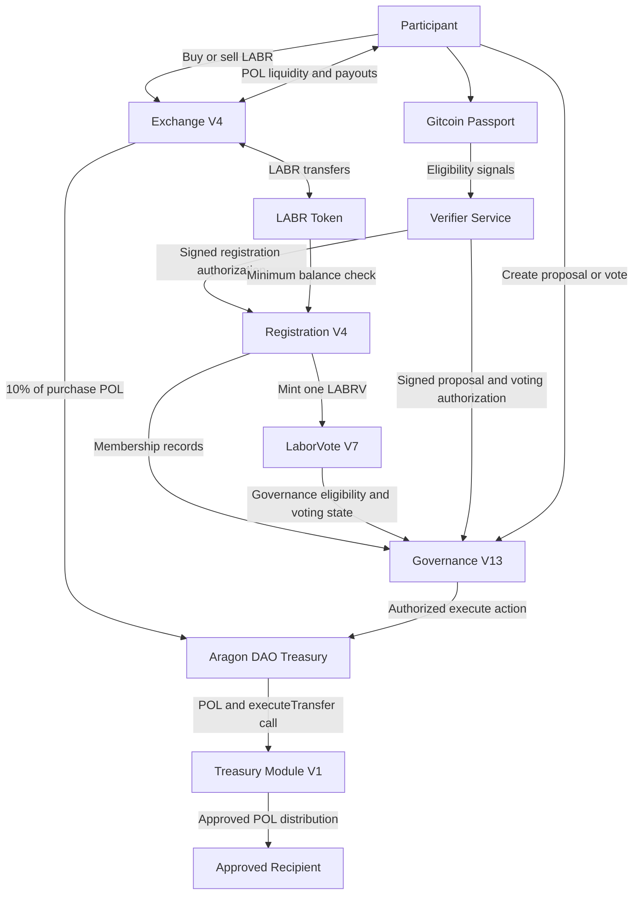
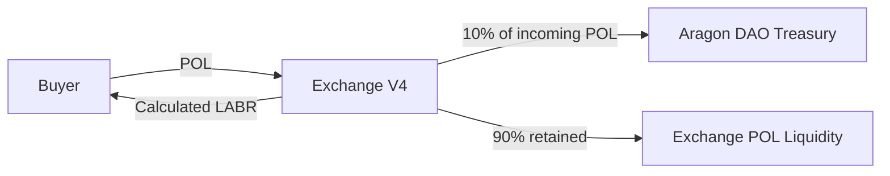
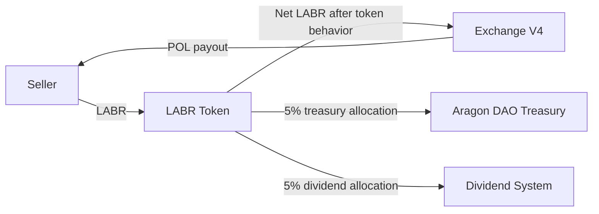
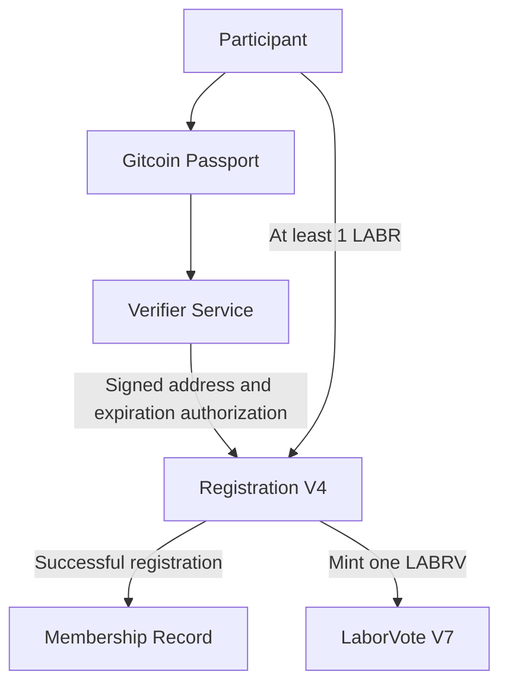
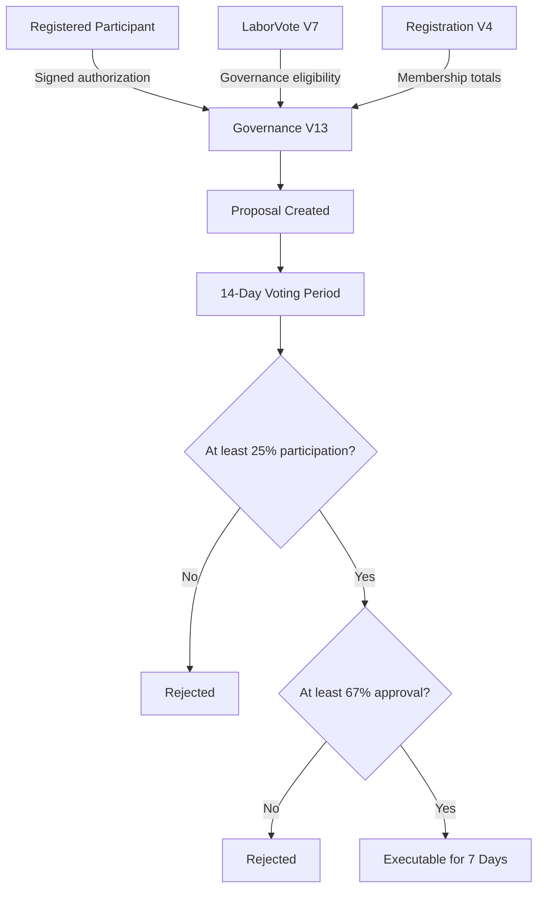
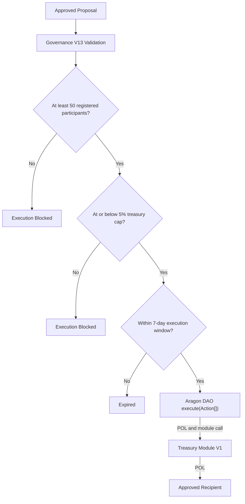
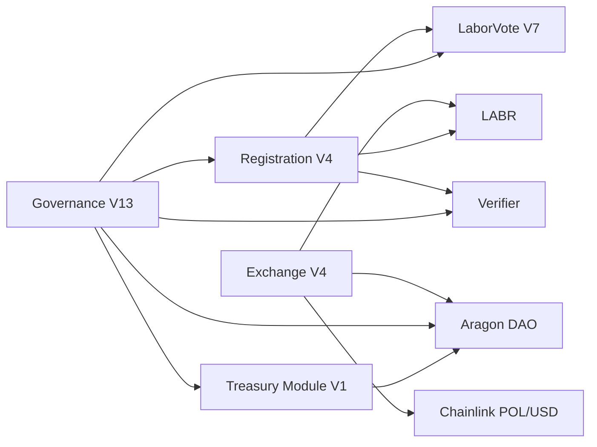

# LaborCoin Contract Map

**Network:** Polygon Mainnet
**Chain ID:** 137
**Release:** Final Launch
**Status:** Production Deployment Complete

This document maps the deployed LaborCoin contracts, external dependencies, asset flows, authorization flows, and authority boundaries.

LaborCoin separates economic participation, governance eligibility, voting, treasury custody, and treasury execution into distinct components. Each contract has a narrowly defined role, and no single custom contract possesses unrestricted authority over the protocol.

The production architecture consists of:

* LABR Token
* LaborCoin Exchange V4
* LaborCoin Registration V4
* LaborVote V7
* LaborCoin Governance V13
* Aragon DAO Treasury
* LaborCoin Treasury Module V1
* External verifier infrastructure
* Chainlink POL/USD oracle infrastructure
* Gitcoin Passport eligibility signals

---

## Production Registry

### Core Contracts

| Component           | Address                                                                                                                    | Role                                                       |
| ------------------- | -------------------------------------------------------------------------------------------------------------------------- | ---------------------------------------------------------- |
| LABR Token          | [`0x460DD873A1D2a41e77410B125cD3027C5FEd2f78`](https://polygonscan.com/address/0x460DD873A1D2a41e77410B125cD3027C5FEd2f78) | Transferable economic token                                |
| Exchange V4         | [`0x4Cf18cB39203B678f5C26f2338a10a79f9684749`](https://polygonscan.com/address/0x4Cf18cB39203B678f5C26f2338a10a79f9684749) | Bonding curve distribution and liquidity                   |
| Registration V4     | [`0xd1CD6C0B6f1F709A52908B40C07D3C54649e323C`](https://polygonscan.com/address/0xd1CD6C0B6f1F709A52908B40C07D3C54649e323C) | Governance eligibility and LABRV issuance                  |
| LaborVote V7        | [`0x833242E933c675846D8f8982048FecA95B8e435A`](https://polygonscan.com/address/0x833242E933c675846D8f8982048FecA95B8e435A) | Non-transferable LABRV governance token                    |
| Governance V13      | [`0x8238105d31F6Bb26897d8Ab270a0A521FEF03E8c`](https://polygonscan.com/address/0x8238105d31F6Bb26897d8Ab270a0A521FEF03E8c) | Proposals, voting, validation, and execution authorization |
| Aragon DAO Treasury | [`0x0C2e5679153593b82a84eAB5CA90895BB291Cec4`](https://polygonscan.com/address/0x0C2e5679153593b82a84eAB5CA90895BB291Cec4) | Treasury custody and DAO action execution                  |
| Treasury Module V1  | [`0x10F2798ef055950B897AF4B3A8ae90dE34f6C56C`](https://polygonscan.com/address/0x10F2798ef055950B897AF4B3A8ae90dE34f6C56C) | DAO-authorized POL distribution                            |

### External References

| Reference              | Address                                                                                                                    | Role                                                      |
| ---------------------- | -------------------------------------------------------------------------------------------------------------------------- | --------------------------------------------------------- |
| Verifier               | [`0x475d519631d2406753aCA29F305f19b83E97513e`](https://polygonscan.com/address/0x475d519631d2406753aCA29F305f19b83E97513e) | Signs eligible registration and governance authorizations |
| Chainlink POL/USD Feed | [`0xAB594600376Ec9fD91F8e885dADF0CE036862dE0`](https://polygonscan.com/address/0xAB594600376Ec9fD91F8e885dADF0CE036862dE0) | Converts USD-denominated curve prices into POL            |

The verifier is an externally controlled signing address rather than a smart contract.

Gitcoin Passport is external identity infrastructure and does not directly call the LaborCoin contracts.

---

## High-Level Architecture



---

## Architectural Layers

### Economic Layer

```text
Participant
    │
    ├── POL ─────────────► Exchange V4
    │                         │
    │                         ├── LABR ─────────► Participant
    │                         ├── 10% POL ──────► Aragon DAO Treasury
    │                         └── 90% POL ──────► Exchange Liquidity
    │
    └── LABR ─────────────► Exchange V4
                              │
                              └── POL Payout ───► Participant
```

The economic layer distributes LABR, calculates deterministic prices, retains exchange liquidity, and routes purchase contributions to the DAO treasury.

---

### Eligibility Layer

```text
Participant
    │
    ├── Gitcoin Passport Signals
    │              │
    │              ▼
    │        Verifier Service
    │              │
    │              ▼
    │    Signed Authorization
    │              │
    └──────────────► Registration V4
                         │
                         ├── Checks LABR Balance
                         ├── Checks Signature
                         ├── Checks Expiration
                         ├── Prevents Duplicate Registration
                         └── Mints One LABRV
```

Passport scoring occurs outside the blockchain contracts.

Registration V4 validates the resulting signed authorization and the on-chain registration requirements.

---

### Governance Layer

```text
Registered Participant
          │
          ├── LABRV Governance Eligibility
          ├── Verifier Authorization
          └── Proposal or Vote
                       │
                       ▼
                Governance V13
                       │
                       ├── Vote Accounting
                       ├── Participation Check
                       ├── Approval Check
                       ├── Treasury Cap Check
                       ├── Execution Window Check
                       └── DAO Execution Authorization
```

Governance V13 determines whether a treasury proposal satisfies the fixed protocol requirements.

It does not hold the treasury and does not directly modify protocol parameters.

---

### Treasury Layer

```text
Governance V13
      │
      ▼
Aragon DAO execute(Action[])
      │
      ├── Holds Treasury Assets
      ├── Enforces DAO Permissions
      └── Supplies POL to Approved Action
                     │
                     ▼
          Treasury Module V1
                     │
                     ├── Verifies DAO Caller
                     ├── Transfers Supplied POL
                     ├── Updates totalDistributed
                     └── Emits TransferExecuted
                                 │
                                 ▼
                         Approved Recipient
```

The Aragon DAO holds the treasury.

Treasury Module V1 does not provide long-term treasury custody. It executes a narrowly scoped POL transfer using the value supplied by the DAO during the approved call.

---

## Contract Relationship Matrix

| Component          | Reads From or Calls                                    | Receives                             | Sends or Changes                                        |
| ------------------ | ------------------------------------------------------ | ------------------------------------ | ------------------------------------------------------- |
| Exchange V4        | LABR, Chainlink POL/USD feed                           | POL from buyers, LABR from sellers   | LABR to buyers, POL to sellers, 10% purchase POL to DAO |
| LABR               | Participant balances and token configuration           | Transfer amounts                     | Treasury tax, dividend allocation, token transfers      |
| Registration V4    | LABR, LABRV, verifier signature                        | Registration request                 | Member record and one LABRV mint                        |
| LaborVote V7       | Registration V4 minter call                            | Mint instruction                     | LABRV balance and voting state                          |
| Governance V13     | LABRV, Registration V4, verifier, DAO, Treasury Module | Proposal, vote, or execution request | Proposal state, vote state, authorized DAO execution    |
| Aragon DAO         | Governance V13-authorized action                       | Protocol treasury assets             | Approved POL value and Treasury Module call             |
| Treasury Module V1 | Fixed DAO caller                                       | POL supplied by DAO                  | POL to recipient and distribution accounting            |
| Verifier           | Passport and eligibility workflow                      | Eligibility request                  | Signed registration or governance authorization         |
| Chainlink Feed     | Oracle network                                         | Market price updates                 | POL/USD price data                                      |

---

# Contract Relationships

## LaborCoin Exchange V4

### Address

```text
0x4Cf18cB39203B678f5C26f2338a10a79f9684749
```

### Role

Exchange V4 is the protocol-native LABR distribution and liquidity contract.

It is the final production exchange and was deployed after the other custom final-launch contracts because a final exchange redeployment was required.

### Responsibilities

* Sell LABR to participants through the bonding curve
* Buy eligible LABR from participants
* Calculate deterministic LABR pricing
* Convert USD-denominated prices into POL
* Retain POL liquidity for seller payouts
* Route 10% of purchase POL to the DAO treasury
* Enforce exchange wallet and transaction limits
* Enforce the 12-hour exchange cooldown
* Enforce unlocked-supply limits
* Unlock new supply tranches automatically
* Enforce buy and sell slippage requirements
* Reject stale or anomalous oracle data

### Direct Dependencies

```text
Exchange V4
    ├── LABR Token
    ├── Chainlink POL/USD Feed
    ├── Aragon DAO Treasury
    └── Participant Wallets
```

### Fixed References

| Reference      | Configuration                                         |
| -------------- | ----------------------------------------------------- |
| LABR           | Constructor-set immutable contract reference          |
| Chainlink Feed | Immutable contract reference                          |
| DAO Treasury   | Constructor-set address with no modification function |

### Authority State

Exchange V4 contains:

* No owner
* No administrator
* No upgrade mechanism
* No pause function
* No administrative withdrawal function
* No ownership transfer function
* No post-deployment parameter setters

POL held by the exchange is permanently dedicated to exchange operations and eligible seller payouts.

---

## LABR Token

### Address

```text
0x460DD873A1D2a41e77410B125cD3027C5FEd2f78
```

### Role

LABR is the transferable economic token of the LaborCoin ecosystem.

### Responsibilities

* Economic participation
* Exchange settlement
* Governance registration eligibility
* Treasury funding through token-level taxation
* POL dividend funding
* Token-level wallet and transaction controls

### Direct Relationships

```text
LABR Token
    ├── Exchange V4
    ├── Registration V4
    ├── Aragon DAO Treasury
    ├── Dividend Distribution System
    └── Participant Wallets
```

### Key Rules

| Parameter                 |              Value |
| ------------------------- | -----------------: |
| Total Supply              | 1,000,000,000 LABR |
| Maximum Token Wallet      |     1,000,000 LABR |
| Maximum Token Transaction |       500,000 LABR |
| Treasury Sell Tax         |                 5% |
| Dividend Sell Tax         |                 5% |
| Burn Tax                  |                 0% |

Registration V4 requires the participant to hold at least 1 LABR.

LABR ownership alone does not provide governance rights or additional governance weight.

---

## LaborCoin Registration V4

### Address

```text
0xd1CD6C0B6f1F709A52908B40C07D3C54649e323C
```

### Role

Registration V4 is the on-chain gateway to governance participation.

### Responsibilities

* Check minimum LABR ownership
* Validate verifier-signed registration authorization
* Enforce authorization expiration
* Prevent duplicate registration
* Prevent additional LABRV issuance to an existing holder
* Record registration timestamps
* Assign sequential member numbers
* Track total registered membership
* Mint one LABRV upon successful registration

### Direct Dependencies

```text
Registration V4
    ├── LABR Token
    ├── LaborVote V7
    └── Verifier Address
```

### Eligibility Flow

```text
Passport Signals
      │
      ▼
Verifier Evaluation
      │
      ▼
Signed Authorization
      │
      ▼
Registration V4
      │
      ├── LABR Balance Check
      ├── Signature Check
      ├── Expiration Check
      ├── Duplicate Check
      └── LABRV Mint
```

### Registration Requirements

| Requirement                    | Value      |
| ------------------------------ | ---------- |
| Minimum LABR Balance           | 1 LABR     |
| Operational Passport Threshold | 15         |
| Verifier Signature             | Required   |
| Valid Expiration               | Required   |
| Existing Registration          | Prohibited |
| Existing LABRV                 | Prohibited |
| LABRV Issued                   | 1          |

The Passport score itself is not calculated by Registration V4.

The external verifier evaluates eligibility and signs an authorization that Registration V4 validates on-chain.

---

## LaborVote V7

### Address

```text
0x833242E933c675846D8f8982048FecA95B8e435A
```

### Role

LaborVote V7 provides the non-transferable LABRV governance credential.

### Responsibilities

* Represent governance eligibility
* Provide equal governance weight
* Maintain ERC20Votes-compatible governance state
* Restrict minting to Registration V4
* Prevent token transfers between participants

### Direct Relationships

```text
LaborVote V7
    ├── Registration V4
    ├── Governance V13
    └── Registered Participant Wallets
```

### Final Authority State

* Registration V4 is the designated minter.
* The minter configuration is permanently locked.
* Contract ownership is renounced.
* No replacement minter may be appointed.
* LABRV cannot be purchased or traded.
* Each eligible participant may receive one LABRV.

LABRV exists exclusively to represent governance participation.

---

## LaborCoin Governance V13

### Address

```text
0x8238105d31F6Bb26897d8Ab270a0A521FEF03E8c
```

### Role

Governance V13 manages treasury proposals, voting, result validation, and execution authorization.

### Responsibilities

* Create treasury proposals
* Record participant votes
* Prevent duplicate votes
* Track proposal status
* Calculate participation
* Calculate approval support
* Enforce the minimum membership requirement
* Enforce the maximum proposal allocation
* Enforce the voting period
* Enforce the execution window
* Prevent duplicate execution
* Validate verifier-signed actions
* Track authorization nonces
* Reject expired authorizations
* Call the Aragon DAO execution framework

### Direct Dependencies

```text
Governance V13
    ├── LaborVote V7
    ├── Registration V4
    ├── Verifier Address
    ├── Aragon DAO
    └── Treasury Module V1
```

### Governance Constants

| Parameter                       |                      Value |
| ------------------------------- | -------------------------: |
| Minimum Registered Participants |                         50 |
| Voting Period                   |                    14 Days |
| Participation Requirement       |                        25% |
| Approval Requirement            |                        67% |
| Execution Window                |                     7 Days |
| Maximum Proposal Distribution   | 5% of DAO treasury balance |

### Authority Boundary

Governance V13 may authorize approved treasury distributions.

It cannot modify:

* LABR supply
* LABR token limits
* Exchange pricing
* Exchange limits
* Exchange cooldown
* Exchange oracle
* Supply tranche sizes
* Registration minimum
* LABRV transferability
* Voting duration
* Participation requirement
* Approval requirement
* Execution window
* Treasury distribution cap

Governance V13 contains no owner, upgrade mechanism, emergency override, administrative bypass, or parameter modification functions.

---

## Aragon DAO Treasury

### Address

```text
0x0C2e5679153593b82a84eAB5CA90895BB291Cec4
```

### Role

The Aragon DAO is the treasury custody and action-execution layer.

### Responsibilities

* Hold protocol treasury assets
* Receive the Exchange V4 purchase allocation
* Receive applicable LABR treasury taxation
* Receive voluntary contributions
* Enforce DAO permissions
* Execute properly authorized actions
* Supply POL to Treasury Module V1 during approved execution

### Direct Relationships

```text
Aragon DAO
    ├── Exchange V4
    ├── LABR Token
    ├── Governance V13
    ├── Treasury Module V1
    └── Voluntary Contributors
```

### Authority Boundary

The DAO does not independently decide whether a LaborCoin proposal has passed.

Governance V13 applies the LaborCoin voting and proposal rules. The DAO executes an authorized action through its permission system.

The DAO does not control Exchange V4, Registration V4, LaborVote V7, or the fixed Governance V13 parameters.

---

## LaborCoin Treasury Module V1

### Address

```text
0x10F2798ef055950B897AF4B3A8ae90dE34f6C56C
```

### Role

Treasury Module V1 is a DAO-only POL transfer module.

### Responsibilities

* Accept an execution call only from the configured DAO
* Receive POL supplied with the approved DAO action
* Transfer the supplied POL to the approved recipient
* Track cumulative POL distributed
* Emit public transfer records

### Direct Relationships

```text
Treasury Module V1
    ├── Aragon DAO
    └── Approved Recipient
```

### Important Custody Distinction

Treasury Module V1 does not provide long-term treasury custody.

The Aragon DAO holds treasury assets.

The module receives POL only as part of the approved execution call and forwards the supplied value to the recipient.

### Authority State

Treasury Module V1 contains:

* No owner
* No administrator
* No upgrade mechanism
* No administrative withdrawal mechanism
* No arbitrary external execution capability
* No mechanism to replace the DAO address

Only the fixed Aragon DAO may call its transfer function.

---

# Economic Flow

## LABR Purchase



### Result

* The buyer receives the calculated LABR amount.
* The DAO receives 10% of the incoming POL.
* The exchange retains the remaining POL for liquidity.
* Distributed-supply accounting is updated.
* Tranche availability is evaluated.

---

## LABR Sale



### Result

* Token-level sell allocations are applied.
* Exchange V4 measures the LABR amount it actually receives.
* The POL payout is calculated from that received amount.
* Exchange liquidity must be sufficient to complete the sale.
* Distributed-supply accounting is reduced.

---

# Registration Flow



Registration does not grant additional governance weight based on LABR ownership.

Every successful participant receives one LABRV.

---

# Voting and Proposal Flow



A proposal does not move treasury assets merely because voting has ended.

All execution requirements must still be satisfied.

---

# Treasury Execution Flow



---

# Authority Boundaries

| Component          | Can Do                                                              | Cannot Do                                                             |
| ------------------ | ------------------------------------------------------------------- | --------------------------------------------------------------------- |
| Exchange V4        | Buy and sell LABR, calculate pricing, route purchase treasury share | Withdraw reserves administratively, pause, upgrade, change parameters |
| LABR               | Transfer tokens and apply configured token rules                    | Grant LABRV or directly determine governance outcomes                 |
| Registration V4    | Validate registration and mint one LABRV                            | Transfer treasury funds or modify governance rules                    |
| LaborVote V7       | Represent governance eligibility                                    | Transfer between users, appoint a new minter, control treasury        |
| Governance V13     | Manage proposals, votes, and approved execution                     | Change protocol economics or fixed governance constants               |
| Aragon DAO         | Hold assets and execute authorized actions                          | Rewrite immutable custom contracts                                    |
| Treasury Module V1 | Forward DAO-supplied POL to an approved recipient                   | Independently access the DAO treasury or initiate transfers           |
| Verifier           | Sign eligible authorizations                                        | Mint LABRV, cast user votes, transfer treasury assets                 |
| Chainlink Feed     | Supply POL/USD data                                                 | Control Exchange V4 parameters or treasury actions                    |

---

# Fixed Dependency Map



The deployed custom contracts do not contain an upgrade mechanism for replacing these dependencies.

---

# Trust Assumptions and External Dependencies

LaborCoin minimizes internal administrative authority, but the production system still relies on several external systems.

## Polygon Mainnet

Polygon provides:

* Transaction execution
* Consensus
* Contract storage
* Account balances
* Network availability

A major Polygon disruption may affect every LaborCoin component.

## Chainlink

Exchange V4 relies on Chainlink for POL/USD pricing.

The exchange rejects non-positive or stale values and applies an anomaly ceiling, but it still depends on the availability and correctness of the external feed.

## Gitcoin Passport

Passport provides off-chain uniqueness signals used by the eligibility workflow.

Passport does not prove legal identity and does not guarantee perfect Sybil resistance.

## Verifier Infrastructure

The verifier evaluates eligibility and signs authorization messages.

The contracts validate those signatures, but availability or compromise of the verifier may affect new registrations and verifier-authorized governance actions.

## Aragon DAO Permissions

Treasury execution depends on the correct final DAO permission configuration.

Governance V13 must possess the required DAO execution authority for approved LaborCoin proposals to execute.

## Smart Contract Correctness

The custom contracts are immutable or autonomous.

Undiscovered implementation defects may be difficult or impossible to correct after deployment.

## Frontend Availability

The LaborCoin website is an interface to the protocol, not the protocol itself.

The contracts remain on Polygon even if the official interface becomes unavailable.

---

# Security and Design Principles

## Separation of Economic and Governance Participation

LABR represents economic participation.

LABRV represents governance participation.

Accumulating LABR does not create additional governance weight.

## One Verified Participant per LABRV

Registration V4 mints one non-transferable LABRV to each eligible participant.

## Constrained Governance

Governance controls treasury allocation rather than protocol administration.

## Separated Treasury Custody and Execution

The Aragon DAO holds treasury assets.

Treasury Module V1 performs a narrowly scoped execution function.

## Deterministic Economic Rules

Bonding curve pricing, tranche progression, limits, and cooldown behavior are defined by deployed contract logic.

## Layered Security

Registration, voting, treasury execution, exchange activity, and oracle use each apply independent safeguards.

## Public Auditability

Contract code, addresses, transactions, proposal state, votes, treasury balances, and distributions are publicly inspectable.

## Removal of Privileged Control

The custom final-launch contracts contain no upgrade framework, and privileged owner control has been removed or excluded according to each component's design.

---

# Historical Exchange Note

The final production exchange is:

```text
LaborCoinExchangeV4
0x4Cf18cB39203B678f5C26f2338a10a79f9684749
```

Exchange V4 was deployed on June 25, 2026, after a required exchange redeployment.

It replaces the retired Exchange V2 deployment:

```text
0xD0692ec758bb852421B702B187b6439f74f8Bf3b
```

Historical exchange addresses are retained for transparency only and must not be used by the current frontend, documentation, or integrations.

---

# Final Architecture Summary

```text
Economic Participation
────────────────────────────────────────────────────────

Participant
    │
    ▼
Exchange V4 ◄────────────► LABR Token
    │
    ├── 10% Purchase POL ─────────► Aragon DAO Treasury
    └── Retained POL ─────────────► Exchange Liquidity


Governance Eligibility
────────────────────────────────────────────────────────

Gitcoin Passport
    │
    ▼
Verifier Authorization
    │
    ▼
Registration V4 ◄──────── LABR Minimum Balance
    │
    ▼
One LaborVote V7 Token


Governance
────────────────────────────────────────────────────────

Registered Participant
    │
    ▼
Governance V13
    │
    ├── Proposal Management
    ├── Vote Accounting
    ├── 25% Participation
    ├── 67% Approval
    ├── 5% Treasury Cap
    └── 7-Day Execution Window


Treasury Execution
────────────────────────────────────────────────────────

Governance V13
    │
    ▼
Aragon DAO Treasury
    │
    ▼
Treasury Module V1
    │
    ▼
Approved Recipient
```

The final architecture intentionally separates:

* Economic activity
* Governance eligibility
* Governance credentials
* Proposal and voting logic
* Treasury custody
* Treasury execution
* External identity signals
* External oracle pricing

This separation reduces authority concentration, limits the consequences of component failure, and makes the protocol easier to inspect and understand.
